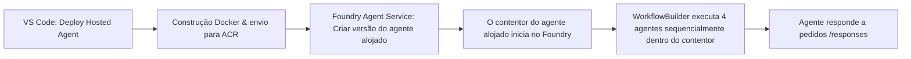
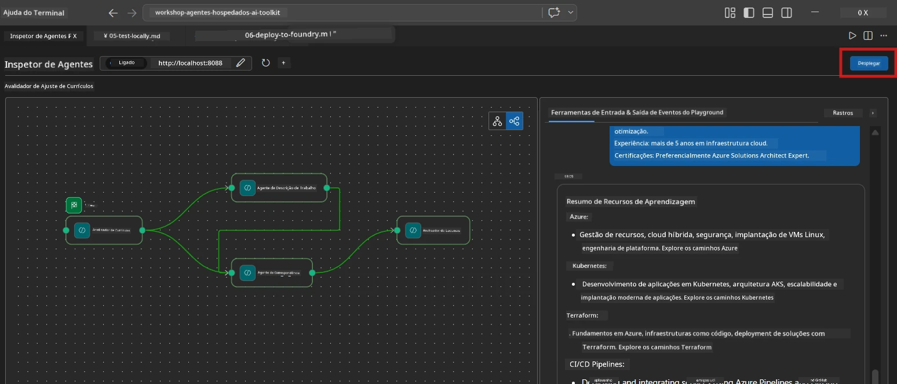
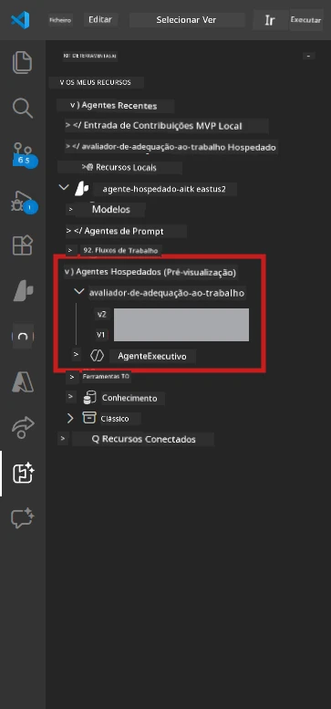

# Módulo 6 - Implantar no Serviço Foundry Agent

⏱️ ~10 min

Neste módulo, implanta o seu fluxo de trabalho multi-agente testado localmente no [Microsoft Foundry](https://learn.microsoft.com/azure/foundry/agents/concepts/hosted-agents) como um **Agente Hospedado**. O processo de implantação constrói uma imagem de contentor Docker, envia-a para o [Azure Container Registry (ACR)](https://learn.microsoft.com/azure/container-registry/container-registry-intro) e cria uma versão de agente hospedado no [Foundry Agent Service](https://learn.microsoft.com/azure/foundry/agents/how-to/publish-agent).

> **Diferença chave em relação ao Laboratório 01:** O processo de implantação é idêntico. O Foundry trata o seu fluxo de trabalho multi-agente como um único agente hospedado - a complexidade está dentro do contentor, mas a superfície de implantação é o mesmo endpoint `/responses`.

### Pipeline de implantação


```mermaid
flowchart LR
    A[VS Code: Deploy Hosted Agent] --> B[Construção Docker & envio para ACR]
    B --> C[Foundry Agent Service: Criar versão do agente alojado]
    C --> D[O contentor do agente alojado inicia no Foundry]
    D --> E[WorkflowBuilder executa 4 agentes sequencialmente dentro do contentor]
    E --> F[Agente responde a pedidos /responses]
```

---

## Verificação de pré-requisitos

Antes de implantar, verifique cada item abaixo:

1. **O agente passou nos testes locais base:**
   - Completou os 3 testes em [Módulo 5](05-test-locally.md) e o fluxo de trabalho produziu saída completa com cartões de lacunas e URLs do Microsoft Learn.

2. **Tem a função [Foundry User](https://learn.microsoft.com/azure/foundry/concepts/rbac-foundry)** (para implantar, necessita no mínimo da função **Foundry Project Manager** ao nível do projeto):

   > **Nota:** As funções RBAC do Foundry foram recentemente renomeadas - **Foundry User**, **Foundry Owner**, e **Foundry Project Manager** eram anteriormente denominadas Azure AI User, Azure AI Owner, e Azure AI Project Manager. Os IDs e permissões das funções permanecem os mesmos.

   - Verifique no [Portal Azure](https://portal.azure.com) → seu recurso de **projeto** Foundry → **Controlo de acesso (IAM)** → **Atribuições de função** → confirme que a função **Foundry User** (ou superior) está atribuída à sua conta.

3. **Está autenticado na Azure no VS Code:**
   - Verifique o ícone de Contas no canto inferior esquerdo do VS Code. O nome da sua conta deverá estar visível.

4. **`agent.yaml` tem os valores corretos:**
   - Abra `PersonalCareerCopilot/agent.yaml` e verifique:
     ```yaml
     environment_variables:
       - name: AZURE_AI_MODEL_DEPLOYMENT_NAME
         value: ${AZURE_AI_MODEL_DEPLOYMENT_NAME}
     ```
   - `FOUNDRY_PROJECT_ENDPOINT` **não** está listado aqui - o Foundry injeta-o em tempo de execução. Apenas `AZURE_AI_MODEL_DEPLOYMENT_NAME` precisa ser declarado.

5. **`requirements.txt` tem as versões corretas:**
   ```
   agent-framework-foundry
   agent-framework-foundry-hosting
   mcp<2,>=1.24.0
   debugpy
   ```

---

## Passo 1: Iniciar a implantação

### Opção A: Implantar a partir do Inspector de Agentes (recomendado)

Se o agente estiver a correr via F5 com o Inspector de Agentes aberto:

1. Olhe para o **canto superior direito** do painel do Inspector de Agentes.
2. Clique no botão **Deploy** (ícone de nuvem com uma seta para cima ↑).
3. O assistente de implantação abre-se.



### Opção B: Implantar a partir do Command Palette

1. Pressione `Ctrl+Shift+P` para abrir o **Command Palette**.
2. Digite: **Foundry Toolkit: Deploy Hosted Agent** e selecione.
3. O assistente de implantação abre-se.

---

## Passo 2: Configurar a implantação

### 2.1 Selecionar o projeto alvo

1. Um menu suspenso mostra os seus projetos Foundry.
2. Selecione o projeto usado durante todo o workshop (por exemplo, `workshop-agents`).

### 2.2 Selecionar o ficheiro do agente do contentor

1. Será solicitado que selecione o ponto de entrada do agente.
2. Navegue para `workshop/lab02-multi-agent/PersonalCareerCopilot/` e escolha **`main.py`**.

### 2.3 Configurar recursos

| Configuração | Valor recomendado | Notas |
|---------|------------------|-------|
| **Método de Implantação** | **Contentor** (recomendado) ou **Código** | Contentor constrói uma imagem Docker; Código carrega o código fonte em ZIP (pré-visualização) |
| **Registo do Contentor** | **ACR padrão** | Foundry cria e gere um por si |
| **CPU** | `0.25` | Padrão. Fluxos multi-agente não precisam de mais CPU porque as chamadas ao modelo são bound a I/O |
| **Memória** | `0.5Gi` | Padrão. Aumente para `1Gi` se adicionar ferramentas de processamento de dados grandes |

---

## Passo 3: Confirmar e implantar

1. O assistente mostra um resumo da implantação.
2. Reveja e clique em **Confirm and Deploy**.
3. Acompanhe o progresso no VS Code.

### O que acontece durante a implantação

Observe o painel **Output** do VS Code (seleccione o menu pendente "Microsoft Foundry"):

1. **Construção Docker** - Constrói o contentor a partir do seu `Dockerfile`
   ```
   Step 1/6 : FROM python:3.12-slim
   Step 2/6 : WORKDIR /app
   ...
   Successfully built abc123def456
   ```

2. **Push Docker** - Envia a imagem para o ACR (1-3 minutos na primeira implantação).

3. **Registo do agente** - O Foundry cria um agente hospedado usando a metadata de `agent.yaml`. O nome do agente é `resume-job-fit-evaluator`.

4. **Arranque do contentor** - O contentor é iniciado na infraestrutura gerida do Foundry com uma identidade gerida pelo sistema.

> **A primeira implantação é mais lenta** (o Docker envia todas as camadas). Implantações subsequentes reutilizam camadas em cache e são mais rápidas.

### Notas específicas para multi-agentes

- **Todos os quatro agentes estão dentro de um contentor.** O Foundry vê um único agente hospedado. O grafo WorkflowBuilder é executado internamente.
- **As chamadas MCP são feitas para fora.** O contentor precisa de acesso à internet para aceder a `https://learn.microsoft.com/api/mcp`. A infraestrutura gerida do Foundry fornece este acesso por defeito.
- **[Identidade Gerida](https://learn.microsoft.com/azure/foundry/agents/concepts/agent-identity).** O Foundry cria automaticamente uma **identidade Entra dedicada por agente** para cada agente hospedado no momento da implantação. No ambiente hospedado, `DefaultAzureCredential` resolve automaticamente para esta identidade do agente - não é necessária configuração manual de identidade gerida.

---

## Passo 4: Verificar o estado da implantação

1. Abra a barra lateral **Microsoft Foundry** (clique no ícone Foundry na Barra de Atividades).
2. Expanda **Hosted Agents (Preview)** sob o seu projeto.
3. Procure **resume-job-fit-evaluator** (ou o nome do seu agente).
4. Clique no nome do agente → expanda as versões (por exemplo, `v1`).
5. Clique na versão → verifique **Container Details** → **Status**:



| Estado | Significado |
|--------|------------|
| **active** | O agente está a correr e pronto para aceitar pedidos |
| **creating** | O contentor está a iniciar (aguarde 30–60 segundos) |
| **failed** | O contentor falhou ao iniciar (verifique os logs - ver abaixo) |

> **Nota:** A barra lateral do VS Code pode mostrar rótulos como "Running" ou "Started" enquanto o status da API subjacente usa `active`/`creating`. Qualquer uma destas designações indica o mesmo estado.

> **A inicialização multi-agente demora mais** do que o agente único porque o contentor cria 4 instâncias de agente no arranque. `creating` até 2 minutos é normal.

---

## Erros comuns na implantação e soluções

### Erro 1: Permissão negada - `agents/write`

```
Error: lacks the required data action 
Microsoft.CognitiveServices/accounts/AIServices/agents/write
```

**Solução:** Atribua a função **[Foundry User](https://learn.microsoft.com/azure/foundry/concepts/rbac-foundry)** (anteriormente **Azure AI User**) ao nível do **projeto**. Consulte [Módulo 8 - Resolução de Problemas](08-troubleshooting.md) para instruções detalhadas.

### Erro 2: Docker não está a correr

```
Error: Docker build failed / Cannot connect to Docker daemon
```

**Solução:**
1. Inicie o Docker Desktop.
2. Aguarde que apareça "Docker Desktop is running".
3. Verifique com: `docker info`
4. **Windows:** Certifique-se que o backend WSL 2 está ativado nas configurações do Docker Desktop.
5. Tente novamente.

### Erro 3: falha no pip install durante a construção do Docker

```
Error: Could not find a version that satisfies the requirement agent-framework-foundry
```

**Solução:** Verifique se `requirements.txt` corresponde a:
```
agent-framework-foundry
agent-framework-foundry-hosting
mcp<2,>=1.24.0
debugpy
```

Se a construção continuar a falhar, a sua rede Docker pode estar a bloquear o PyPI. Verifique as configurações proxy em `docker info`.

### Erro 4: ferramenta MCP falha no agente hospedado

Se o Gap Analyzer deixar de produzir URLs do Microsoft Learn após a implantação:

**Causa:** A política de rede pode estar a bloquear HTTPS de saída do contentor.

**Solução:**
1. Normalmente, isto não é um problema com a configuração padrão do Foundry.
2. Se acontecer, verifique se a rede virtual do projeto Foundry tem um NSG a bloquear HTTPS de saída.
3. A ferramenta MCP tem URLs de fallback incorporadas, por isso o agente continuará a produzir saída (sem URLs em direto).

---

### Checkpoint

- [ ] O comando de implantação terminou sem erros no VS Code
- [ ] O agente aparece em **Hosted Agents (Preview)** na barra lateral do Foundry
- [ ] O nome do agente é `resume-job-fit-evaluator` (ou o nome escolhido)
- [ ] O estado do contentor mostra **Started** ou **Running**
- [ ] (Se houver erros) Identificou o erro, aplicou a solução e implantou com sucesso novamente

---

**Anterior:** [05 - Testar Localmente](05-test-locally.md) · **Próximo:** [07 - Verificar no Playground →](07-verify-in-playground.md)

---

<!-- CO-OP TRANSLATOR DISCLAIMER START -->
**Aviso Legal**:
Este documento foi traduzido utilizando o serviço de tradução automática [Co-op Translator](https://github.com/Azure/co-op-translator). Embora nos esforcemos pela precisão, esteja ciente de que traduções automáticas podem conter erros ou imprecisões. O documento original na sua língua nativa deve ser considerado a fonte autorizada. Para informações críticas, recomenda-se tradução profissional humana. Não nos responsabilizamos por quaisquer mal-entendidos ou interpretações incorretas resultantes da utilização desta tradução.
<!-- CO-OP TRANSLATOR DISCLAIMER END -->