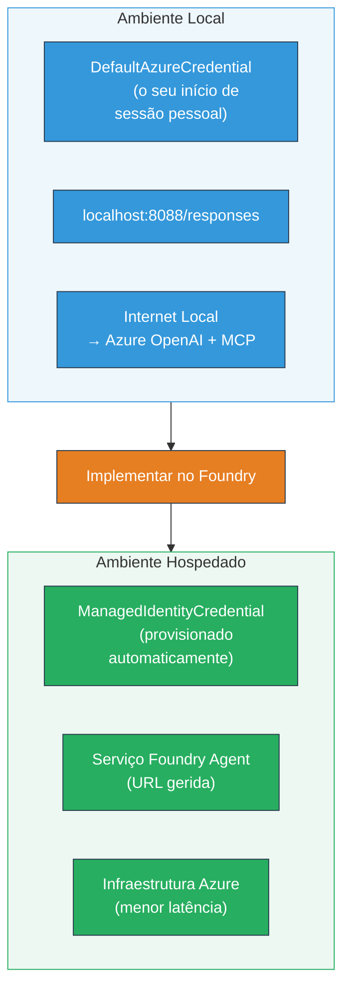

# Módulo 7 - Verificar no Playground

Neste módulo, testa o seu fluxo de trabalho multi-agente implantado tanto no **VS Code** como no **[Foundry Portal](https://ai.azure.com)**, confirmando que o agente se comporta de forma idêntica ao teste local.

---

## Porquê verificar após a implantação?

O seu fluxo de trabalho multi-agente correu perfeitamente localmente, então por que testar novamente? O ambiente hospedado difere de várias maneiras:


| Diferença | Local | Hospedado |
|-----------|-------|--------|
| **Identidade** | [`DefaultAzureCredential`](https://learn.microsoft.com/azure/developer/python/sdk/authentication/credential-chains#defaultazurecredential-overview) (o seu login pessoal) | [`ManagedIdentityCredential`](https://learn.microsoft.com/python/api/overview/azure/identity-readme#managed-identity-support) (provisionado automaticamente) |
| **Endpoint** | `http://localhost:8088/responses` | Endpoint do [Foundry Agent Service](https://learn.microsoft.com/azure/foundry/agents/concepts/hosted-agents) (URL gerida) |
| **Rede** | Máquina local → Azure OpenAI + MCP outbound | Backbone Azure (latência mais baixa entre serviços) |
| **Conectividade MCP** | Internet local → `learn.microsoft.com/api/mcp` | Container outbound → `learn.microsoft.com/api/mcp` |

Se alguma variável de ambiente estiver mal configurada, o RBAC diferir, ou o outbound MCP estiver bloqueado, irá detetar aqui.

---

## Opção A: Testar no VS Code Playground (recomendado primeiro)

A [extensão Foundry](https://marketplace.visualstudio.com/items?itemName=TeamsDevApp.vscode-ai-foundry) inclui um Playground integrado que permite conversar com o seu agente implantado sem sair do VS Code.

### Passo 1: Navegar para o seu agente hospedado

1. Clique no ícone **Microsoft Foundry** na **Activity Bar** do VS Code (barra lateral esquerda) para abrir o painel Foundry.
2. Expanda o seu projeto ligado (por exemplo, `workshop-agents`).
3. Expanda **Hosted Agents (Preview)**.
4. Deve ver o nome do seu agente (por exemplo, `resume-job-fit-evaluator`).

### Passo 2: Selecionar uma versão

1. Clique no nome do agente para expandir as suas versões.
2. Clique na versão que implantou (por exemplo, `v1`).
3. Abre-se um **painel de detalhes** mostrando os Detalhes do Container.
4. Verifique se o estado é **Started** ou **Running**.

### Passo 3: Abrir o Playground

1. No painel de detalhes, clique no botão **Playground** (ou clique com o botão direito na versão → **Open in Playground**).
2. Abre-se uma interface de chat numa aba do VS Code.

### Passo 4: Executar os seus testes rápidos

Use os mesmos 3 testes do [Módulo 5](05-test-locally.md). Escreva cada mensagem na caixa de entrada do Playground e pressione **Send** (ou **Enter**).

#### Teste 1 - CV completo + JD (fluxo padrão)

Cole o prompt do CV completo + JD do Módulo 5, Teste 1 (Jane Doe + Senior Cloud Engineer na Contoso Ltd).

**Esperado:**
- Pontuação de adequação com cálculo detalhado (escala de 100 pontos)
- Secção de Competências Correspondentes
- Secção de Competências em Falta
- **Um cartão de lacuna por competência em falta** com URLs Microsoft Learn
- Roteiro de aprendizagem com cronograma

#### Teste 2 - Teste rápido curto (entrada mínima)

```
RESUME: 3 years Python developer, knows Django and PostgreSQL, no cloud experience.

JOB: Cloud DevOps Engineer requiring AWS, Kubernetes, Terraform, CI/CD. 5 years needed.
```

**Esperado:**
- Pontuação de adequação baixa (< 40)
- Avaliação honesta com percurso de aprendizagem progressivo
- Vários cartões de lacunas (AWS, Kubernetes, Terraform, CI/CD, lacuna de experiência)

#### Teste 3 - Candidato de alta adequação

```
RESUME:
10 years Azure Cloud Architect. AZ-305 certified. Expert in AKS, Terraform, Azure DevOps, 
Azure Functions, Helm, Prometheus, Grafana, Python, Go. Led platform team of 8.

JOB:
Senior Cloud Engineer. Required: AKS, Terraform, Azure DevOps, Python. Preferred: Helm, Go.
5+ years experience. AZ-305 preferred.
```

**Esperado:**
- Pontuação de adequação alta (≥ 80)
- Foco em preparação para entrevista e refinamento
- Poucos ou nenhuns cartões de lacunas
- Cronograma curto focado na preparação

### Passo 5: Comparar com os resultados locais

Abra as suas notas ou aba do navegador do Módulo 5 onde guardou as respostas locais. Para cada teste:

- A resposta tem a **mesma estrutura** (pontuação de adequação, cartões de lacunas, roteiro)?
- Segue o **mesmo critério de pontuação** (detalhe do cálculo em 100 pontos)?
- Os **URLs Microsoft Learn** ainda estão presentes nos cartões de lacunas?
- Existe **um cartão de lacuna por competência em falta** (não truncado)?

> **Diferenças menores na formulação são normais** — o modelo não é determinístico. Concentre-se na estrutura, consistência da pontuação e uso da ferramenta MCP.

---

## Opção B: Testar no Foundry Portal

O [Foundry Portal](https://ai.azure.com) oferece um playground baseado na web útil para partilhar com colegas ou partes interessadas.

### Passo 1: Abrir o Foundry Portal

1. Abra o seu navegador e navegue para [https://ai.azure.com](https://ai.azure.com).
2. Inicie sessão com a mesma conta Azure que tem usado durante o workshop.

### Passo 2: Navegar para o seu projeto

1. Na página principal, procure por **Recent projects** na barra lateral esquerda.
2. Clique no nome do seu projeto (por exemplo, `workshop-agents`).
3. Se não o vir, clique em **All projects** e procure-o.

### Passo 3: Encontrar o seu agente implantado

1. Na navegação à esquerda do projeto, clique em **Build** → **Agents** (ou procure a secção **Agents**).
2. Deve ver uma lista de agentes. Encontre o seu agente implantado (por exemplo, `resume-job-fit-evaluator`).
3. Clique no nome do agente para abrir a página de detalhes.

### Passo 4: Abrir o Playground

1. Na página de detalhes do agente, olhe para a barra de ferramentas superior.
2. Clique em **Open in playground** (ou **Try in playground**).
3. Abre-se uma interface de chat.

### Passo 5: Executar os mesmos testes rápidos

Repita os 3 testes da secção VS Code Playground acima. Compare cada resposta com os resultados locais (Módulo 5) e do VS Code Playground (Opção A acima).

---

## Verificação específica para multi-agentes

Além da correção básica, verifique esses comportamentos específicos multi-agente:

### Execução da ferramenta MCP

| Verificação | Como verificar | Condição de aprovação |
|-------------|----------------|-----------------------|
| Chamadas MCP bem-sucedidas | Cartões de lacunas contêm URLs `learn.microsoft.com` | URLs reais, não mensagens de fallback |
| Múltiplas chamadas MCP | Cada lacuna de prioridade Alta/Média tem recursos | Não apenas o primeiro cartão de lacuna |
| Fallback MCP funciona | Se faltarem URLs, verifique texto de fallback | Agente ainda produz cartões de lacunas (com ou sem URLs) |

### Coordenação do agente

| Verificação | Como verificar | Condição de aprovação |
|-------------|----------------|-----------------------|
| Os 4 agentes correram | Saída contém pontuação de adequação E cartões de lacunas | Pontuação vem do MatchingAgent, cartões do GapAnalyzer |
| Execução paralela | Tempo de resposta é razoável (< 2 min) | Se > 3 min, a execução paralela pode não estar a funcionar |
| Integridade do fluxo de dados | Cartões de lacunas referenciam competências do relatório de correspondência | Sem competências alucinadas que não estão na JD |

---

## Rubrica de validação

Use esta rubrica para avaliar o comportamento hospedado do seu fluxo de trabalho multi-agente:

| # | Critério | Condição de aprovação | Passou? |
|---|----------|-----------------------|---------|
| 1 | **Correcção funcional** | O agente responde ao CV + JD com pontuação de adequação e análise de lacunas | |
| 2 | **Consistência na pontuação** | Pontuação de adequação usa escala de 100 pontos com cálculo detalhado | |
| 3 | **Completude dos cartões de lacunas** | Um cartão por competência em falta (não truncado ou combinado) | |
| 4 | **Integração da ferramenta MCP** | Cartões de lacunas incluem URLs reais Microsoft Learn | |
| 5 | **Consistência estrutural** | Estrutura da saída corresponde entre execuções local e hospedada | |
| 6 | **Tempo de resposta** | Agente hospedado responde em menos de 2 minutos na avaliação completa | |
| 7 | **Sem erros** | Sem erros HTTP 500, timeouts, ou respostas vazias | |

> Um "pass" significa que todos os 7 critérios são cumpridos para os 3 testes rápidos em pelo menos um playground (VS Code ou Portal).

---

## Resolução de problemas no playground

| Sintoma | Causa provável | Solução |
|---------|----------------|---------|
| Playground não carrega | Estado do container não é "Started" | Volte ao [Módulo 6](06-deploy-to-foundry.md), verifique o estado da implantação. Espere se estiver "Pending" |
| Agente retorna resposta vazia | Nome da implantação do modelo incorreto | Verifique `agent.yaml` → `environment_variables` → `MODEL_DEPLOYMENT_NAME` corresponde ao seu modelo implantado |
| Agente retorna mensagem de erro | Permissão [RBAC](https://learn.microsoft.com/azure/foundry/concepts/rbac-foundry) em falta | Atribua **[Azure AI User](https://aka.ms/foundry-ext-project-role)** ao âmbito do projeto |
| Sem URLs Microsoft Learn nos cartões de lacunas | MCP outbound bloqueado ou servidor MCP indisponível | Verifique se o container pode aceder `learn.microsoft.com`. Veja [Módulo 8](08-troubleshooting.md) |
| Apenas 1 cartão de lacuna (truncado) | Instruções do GapAnalyzer faltam o bloco "CRITICAL" | Reveja [Módulo 3, Passo 2.4](03-configure-agents.md) |
| Pontuação de adequação muito diferente do local | Modelo ou instruções implantadas diferentes | Compare variáveis de ambiente em `agent.yaml` com local `.env`. Reimplante se necessário |
| "Agent not found" no Portal | Implantação ainda a propagar ou falhou | Espere 2 minutos, atualize. Se ainda faltar, reimplante pelo [Módulo 6](06-deploy-to-foundry.md) |

---

### Checkpoint

- [ ] Testou o agente no VS Code Playground - os 3 testes rápidos passaram todos
- [ ] Testou o agente no Playground do [Foundry Portal](https://ai.azure.com) - os 3 testes rápidos passaram todos
- [ ] Respostas são estruturalmente consistentes com o teste local (pontuação, cartões, roteiro)
- [ ] URLs Microsoft Learn estão presentes nos cartões de lacunas (ferramenta MCP a funcionar no ambiente hospedado)
- [ ] Um cartão de lacuna por competência em falta (sem truncamento)
- [ ] Sem erros ou timeouts durante os testes
- [ ] Rubrica de validação preenchida (todos os 7 critérios passados)

---

**Anterior:** [06 - Deploy to Foundry](06-deploy-to-foundry.md) · **Seguinte:** [08 - Troubleshooting →](08-troubleshooting.md)

---

<!-- CO-OP TRANSLATOR DISCLAIMER START -->
**Aviso Legal**:  
Este documento foi traduzido utilizando o serviço de tradução automática [Co-op Translator](https://github.com/Azure/co-op-translator). Embora nos esforcemos para garantir a precisão, por favor tenha em conta que traduções automáticas podem conter erros ou imprecisões. O documento original na sua língua nativa deve ser considerado a fonte autoritativa. Para informações críticas, é recomendada a tradução profissional humana. Não nos responsabilizamos por quaisquer mal-entendidos ou interpretações erradas resultantes da utilização desta tradução.
<!-- CO-OP TRANSLATOR DISCLAIMER END -->