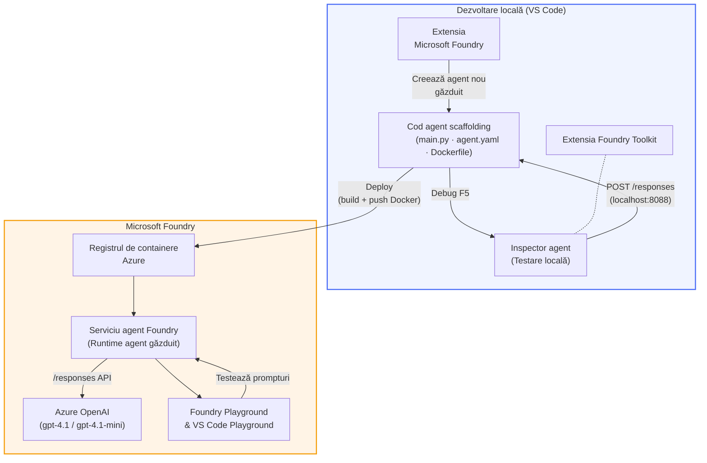

# Foundry Toolkit + Atelier pentru Agenți Găzduiți Foundry

[](https://www.python.org/)
[](https://github.com/microsoft/agents)
[](https://learn.microsoft.com/azure/ai-foundry/agents/concepts/hosted-agents/)
[](https://ai.azure.com/)
[](https://learn.microsoft.com/azure/ai-services/openai/)
[](https://learn.microsoft.com/cli/azure/install-azure-cli)
[](https://learn.microsoft.com/azure/developer/azure-developer-cli/install-azd)
[](https://www.docker.com/)
[](https://marketplace.visualstudio.com/items?itemName=ms-windows-ai-studio.windows-ai-studio)
[](LICENSE)

Construiți, testați și implementați agenți AI către **Microsoft Foundry Agent Service** ca **Agenți Găzduiți** - în întregime din VS Code folosind **extensia Microsoft Foundry** și **Foundry Toolkit**.

> **Agenții găzduiți sunt în prezent în previzualizare.** Regiunile suportate sunt limitate - vedeți [disponibilitatea regională](https://learn.microsoft.com/azure/foundry/agents/concepts/hosted-agents#region-availability).

> Folderul `agent/` din fiecare laborator este **generat automat** de extensia Foundry - apoi personalizați codul, testați local și implementați.

<!-- CO-OP TRANSLATOR LANGUAGES TABLE START -->
[Arabic](../ar/README.md) | [Bengali](../bn/README.md) | [Bulgarian](../bg/README.md) | [Burmese (Myanmar)](../my/README.md) | [Chinese (Simplified)](../zh-CN/README.md) | [Chinese (Traditional, Hong Kong)](../zh-HK/README.md) | [Chinese (Traditional, Macau)](../zh-MO/README.md) | [Chinese (Traditional, Taiwan)](../zh-TW/README.md) | [Croatian](../hr/README.md) | [Czech](../cs/README.md) | [Danish](../da/README.md) | [Dutch](../nl/README.md) | [Estonian](../et/README.md) | [Finnish](../fi/README.md) | [French](../fr/README.md) | [German](../de/README.md) | [Greek](../el/README.md) | [Hebrew](../he/README.md) | [Hindi](../hi/README.md) | [Hungarian](../hu/README.md) | [Indonesian](../id/README.md) | [Italian](../it/README.md) | [Japanese](../ja/README.md) | [Kannada](../kn/README.md) | [Khmer](../km/README.md) | [Korean](../ko/README.md) | [Lithuanian](../lt/README.md) | [Malay](../ms/README.md) | [Malayalam](../ml/README.md) | [Marathi](../mr/README.md) | [Nepali](../ne/README.md) | [Nigerian Pidgin](../pcm/README.md) | [Norwegian](../no/README.md) | [Persian (Farsi)](../fa/README.md) | [Polish](../pl/README.md) | [Portuguese (Brazil)](../pt-BR/README.md) | [Portuguese (Portugal)](../pt-PT/README.md) | [Punjabi (Gurmukhi)](../pa/README.md) | [Romanian](./README.md) | [Russian](../ru/README.md) | [Serbian (Cyrillic)](../sr/README.md) | [Slovak](../sk/README.md) | [Slovenian](../sl/README.md) | [Spanish](../es/README.md) | [Swahili](../sw/README.md) | [Swedish](../sv/README.md) | [Tagalog (Filipino)](../tl/README.md) | [Tamil](../ta/README.md) | [Telugu](../te/README.md) | [Thai](../th/README.md) | [Turkish](../tr/README.md) | [Ukrainian](../uk/README.md) | [Urdu](../ur/README.md) | [Vietnamese](../vi/README.md)

> **Preferi să clonezi local?**
>
> Acest depozit include peste 50 de traduceri, ceea ce mărește semnificativ dimensiunea descărcării. Pentru a clona fără traduceri, folosește sparse checkout:
>
> **Bash / macOS / Linux:**
> ```bash
> git clone --filter=blob:none --sparse https://github.com/microsoft-foundry/Foundry_Toolkit_for_VSCode_Lab.git
> cd Foundry_Toolkit_for_VSCode_Lab
> git sparse-checkout set --no-cone '/*' '!translations' '!translated_images'
> ```
>
> **CMD (Windows):**
> ```cmd
> git clone --filter=blob:none --sparse https://github.com/microsoft-foundry/Foundry_Toolkit_for_VSCode_Lab.git
> cd Foundry_Toolkit_for_VSCode_Lab
> git sparse-checkout set --no-cone "/*" "!translations" "!translated_images"
> ```
>
> Astfel obții tot ce ai nevoie pentru a finaliza cursul cu o descărcare mult mai rapidă.
<!-- CO-OP TRANSLATOR LANGUAGES TABLE END -->

---

## Arhitectura


**Flux:** Extensia Foundry generează agentul → personalizați codul și instrucțiunile → testați local cu Agent Inspector → implementați în Foundry (imagine Docker împinsă în ACR) → verificați în Playground.

---

## Ce vei construi

| Laborator | Descriere | Stare |
|-----------|-----------|-------|
| **Laborator 01 - Agent Unic** | Construiește **Agentul "Explică ca pentru un Executiv"**, testează-l local și implementează-l în Foundry | ✅ Disponibil |
| **Laborator 02 - Flux Multi-Agent** | Construiește **"Evaluarea Jobului → Potrivire CV"** - 4 agenți colaborează pentru a puncta potrivirea CV-ului și a genera un plan de învățare | ✅ Disponibil |

---

## Cunoaște agentul Executiv

În acest atelier vei construi **Agentul "Explică ca pentru un Executiv"** - un agent AI care ia jargon tehnic dificil și îl traduce în rezumate liniștite, gata pentru ședințe în sala de consiliu. Pentru că, să fim serioși, nimeni din echipa executivă nu vrea să audă despre „exhaustarea pool-ului de fire cauzată de apeluri sincrone introduse în v3.2.”

Am construit acest agent după prea multe incidente în care raportul meu post-mortem perfect a primit răspunsul: *„Deci... site-ul este jos sau nu?”*

### Cum funcționează

Îi oferi o actualizare tehnică. El returnează un rezumat executiv - trei puncte principale, fără jargon, fără trasee de stivă, fără teamă existențială. Doar **ce s-a întâmplat**, **impactul asupra business-ului**, și **pasul următor**.

### Vezi-l în acțiune

**Spui tu:**
> „Latenta API a crescut din cauza extenuării pool-ului de fire cauzat de apeluri sincrone introduse în v3.2.”

**Agentul răspunde:**

> **Rezumat executiv:**
> - **Ce s-a întâmplat:** După ultima versiune, sistemul a încetinit.
> - **Impactul asupra business-ului:** Unii utilizatori au experimentat întârzieri folosind serviciul.
> - **Pasul următor:** Modificarea a fost reînnoită și se pregătește o remediere înainte de noua implementare.

### De ce acest agent?

Este un agent extrem de simplu, cu un singur scop - perfect pentru a învăța fluxul de lucru cu agenți găzduiți de la început până la sfârșit fără a te complica cu lanțuri complexe de unelte. Și sincer? Fiecare echipă de inginerie ar putea folosi unul ca acesta.

---

## Structura atelierului

```
📂 Foundry_Toolkit_for_VSCode_Lab/
├── 📄 README.md                      ← You are here
├── 📂 ExecutiveAgent/                ← Standalone hosted agent project
│   ├── agent.yaml
│   ├── Dockerfile
│   ├── main.py
│   └── requirements.txt
└── 📂 workshop/
    ├── 📂 lab01-single-agent/        ← Full lab: docs + agent code
    │   ├── README.md                 ← Hands-on lab instructions
    │   ├── 📂 docs/                  ← Step-by-step tutorial modules
    │   │   ├── 00-prerequisites.md
    │   │   ├── 01-install-foundry-toolkit.md
    │   │   ├── 02-create-foundry-project.md
    │   │   ├── 03-create-hosted-agent.md
    │   │   ├── 04-configure-and-code.md
    │   │   ├── 05-test-locally.md
    │   │   ├── 06-deploy-to-foundry.md
    │   │   ├── 07-verify-in-playground.md
    │   │   └── 08-troubleshooting.md
    │   └── 📂 agent/                 ← Reference solution (auto-scaffolded by Foundry extension)
    │       ├── agent.yaml
    │       ├── Dockerfile
    │       ├── main.py
    │       └── requirements.txt
    └── 📂 lab02-multi-agent/         ← Resume → Job Fit Evaluator
        ├── README.md                 ← Hands-on lab instructions (end-to-end)
        ├── 📂 docs/                  ← Step-by-step tutorial modules
        │   ├── 00-prerequisites.md
        │   ├── 01-understand-multi-agent.md
        │   ├── 02-scaffold-multi-agent.md
        │   ├── 03-configure-agents.md
        │   ├── 04-orchestration-patterns.md
        │   ├── 05-test-locally.md
        │   ├── 06-deploy-to-foundry.md
        │   ├── 07-verify-in-playground.md
        │   └── 08-troubleshooting.md
        └── 📂 PersonalCareerCopilot/ ← Reference solution (multi-agent workflow)
            ├── agent.yaml
            ├── Dockerfile
            ├── main.py
            └── requirements.txt
```

> **Notă:** Folderul `agent/` din fiecare laborator este ceea ce generează **extensia Microsoft Foundry** când rulezi comanda `Microsoft Foundry: Create a New Hosted Agent` din Paleta de Comenzi. Fișierele sunt apoi personalizate cu instrucțiunile, uneltele și configurația agentului tău. Laboratorul 01 te conduce pas cu pas să recreezi acest lucru de la zero.

---

## Începe

### 1. Clonează depozitul

```bash
git clone https://github.com/microsoft-foundry/Foundry_Toolkit_for_VSCode_Lab.git
cd Foundry_Toolkit_for_VSCode_Lab
```

### 2. Configurează un mediu virtual Python

```bash
python -m venv venv
```

Activează-l:

- **Windows (PowerShell):**
  ```powershell
  .\venv\Scripts\Activate.ps1
  ```
- **macOS / Linux:**
  ```bash
  source venv/bin/activate
  ```

### 3. Instalează dependențele

```bash
pip install -r workshop/lab01-single-agent/agent/requirements.txt
```

### 4. Configurează variabilele de mediu

Copiază fișierul `.env` exemplu din folderul agent și completează valorile tale:

```bash
cp workshop/lab01-single-agent/agent/.env.example workshop/lab01-single-agent/agent/.env
```

Editează `workshop/lab01-single-agent/agent/.env`:

```env
AZURE_AI_PROJECT_ENDPOINT=https://<your-account>.services.ai.azure.com/api/projects/<your-project>
MODEL_DEPLOYMENT_NAME=<your-model-deployment-name>
```

### 5. Urmează laboratoarele atelierului

Fiecare laborator este autonom cu propriile module. Începe cu **Laboratorul 01** pentru a învăța elementele de bază, apoi continuă cu **Laboratorul 02** pentru fluxuri multi-agent.

#### Laborator 01 - Agent Unic ([instrucțiuni complete](workshop/lab01-single-agent/README.md))

| # | Modul | Link |
|---|--------|------|
| 1 | Citește cerințele preliminare | [00-prerequisites.md](workshop/lab01-single-agent/docs/00-prerequisites.md) |
| 2 | Instalează Foundry Toolkit & extensia Foundry | [01-install-foundry-toolkit.md](workshop/lab01-single-agent/docs/01-install-foundry-toolkit.md) |
| 3 | Creează un proiect Foundry | [02-create-foundry-project.md](workshop/lab01-single-agent/docs/02-create-foundry-project.md) |
| 4 | Creează un agent găzduit | [03-create-hosted-agent.md](workshop/lab01-single-agent/docs/03-create-hosted-agent.md) |
| 5 | Configurează instrucțiunile & mediul | [04-configure-and-code.md](workshop/lab01-single-agent/docs/04-configure-and-code.md) |
| 6 | Testează local | [05-test-locally.md](workshop/lab01-single-agent/docs/05-test-locally.md) |
| 7 | Implementează în Foundry | [06-deploy-to-foundry.md](workshop/lab01-single-agent/docs/06-deploy-to-foundry.md) |
| 8 | Verifică în playground | [07-verify-in-playground.md](workshop/lab01-single-agent/docs/07-verify-in-playground.md) |
| 9 | Depanare | [08-troubleshooting.md](workshop/lab01-single-agent/docs/08-troubleshooting.md) |

#### Laborator 02 - Flux Multi-Agent ([instrucțiuni complete](workshop/lab02-multi-agent/README.md))

| # | Modul | Link |
|---|--------|------|
| 1 | Cerințe preliminare (Laborator 02) | [00-prerequisites.md](workshop/lab02-multi-agent/docs/00-prerequisites.md) |
| 2 | Înțelege arhitectura multi-agent | [01-understand-multi-agent.md](workshop/lab02-multi-agent/docs/01-understand-multi-agent.md) |
| 3 | Generează proiectul multi-agent | [02-scaffold-multi-agent.md](workshop/lab02-multi-agent/docs/02-scaffold-multi-agent.md) |
| 4 | Configurează agenții & mediul | [03-configure-agents.md](workshop/lab02-multi-agent/docs/03-configure-agents.md) |
| 5 | Modele de orchestrare | [04-orchestration-patterns.md](workshop/lab02-multi-agent/docs/04-orchestration-patterns.md) |
| 6 | Testează local (multi-agent) | [05-test-locally.md](workshop/lab02-multi-agent/docs/05-test-locally.md) |
| 7 | Implementare pe Foundry | [06-deploy-to-foundry.md](workshop/lab02-multi-agent/docs/06-deploy-to-foundry.md) |
| 8 | Verificare în playground | [07-verify-in-playground.md](workshop/lab02-multi-agent/docs/07-verify-in-playground.md) |
| 9 | Depanare (multi-agent) | [08-troubleshooting.md](workshop/lab02-multi-agent/docs/08-troubleshooting.md) |

---

## Administrator

<table>
<tr>
    <td align="center"><a href="https://github.com/ShivamGoyal03">
        <br />
        <sub><b>Shivam Goyal</b></sub>
    </a><br />
    </td>
</tr>
</table>

---

## Permisiuni necesare (referință rapidă)

| Scenariu | Roluri necesare |
|----------|-----------------|
| Creare proiect nou Foundry | **Azure AI Owner** pe resursa Foundry |
| Implementare în proiect existent (resurse noi) | **Azure AI Owner** + **Contributor** pe abonament |
| Implementare în proiect complet configurat | **Reader** pe cont + **Azure AI User** pe proiect |

> **Important:** rolurile Azure `Owner` și `Contributor` includ doar permisiuni de *gestionare*, nu și permisiuni de *dezvoltare* (acțiuni pe date). Aveți nevoie de **Azure AI User** sau **Azure AI Owner** pentru a construi și implementa agenți.

---

## Referințe

- [Început rapid: Implementați primul agent găzduit (VS Code)](https://learn.microsoft.com/azure/foundry/agents/quickstarts/quickstart-hosted-agent)
- [Ce sunt agenții găzduiți?](https://learn.microsoft.com/azure/foundry/agents/concepts/hosted-agents)
- [Creați fluxuri de lucru pentru agenți găzduiți în VS Code](https://learn.microsoft.com/azure/foundry/agents/how-to/vs-code-agents-workflow-pro-code)
- [Implementați un agent găzduit](https://learn.microsoft.com/azure/foundry/agents/how-to/deploy-hosted-agent)
- [RBAC pentru Microsoft Foundry](https://learn.microsoft.com/azure/foundry/concepts/rbac-foundry)
- [Exemplu Agent Revizuire Arhitectură](https://github.com/Azure-Samples/agent-architecture-review-sample) - Agent găzduit din lumea reală cu instrumente MCP, diagrame Excalidraw și implementare dublă

---


## Licență

[MIT](../../LICENSE)

---

<!-- CO-OP TRANSLATOR DISCLAIMER START -->
**Declinare a responsabilității**:  
Acest document a fost tradus folosind serviciul de traducere AI [Co-op Translator](https://github.com/Azure/co-op-translator). Deși ne străduim pentru acuratețe, vă rugăm să rețineți că traducerile automate pot conține erori sau inexactități. Documentul original în limba sa nativă ar trebui considerat sursa autoritară. Pentru informații critice, se recomandă traducerea profesională realizată de un om. Nu ne asumăm responsabilitatea pentru eventualele neînțelegeri sau interpretări greșite rezultate din utilizarea acestei traduceri.
<!-- CO-OP TRANSLATOR DISCLAIMER END -->