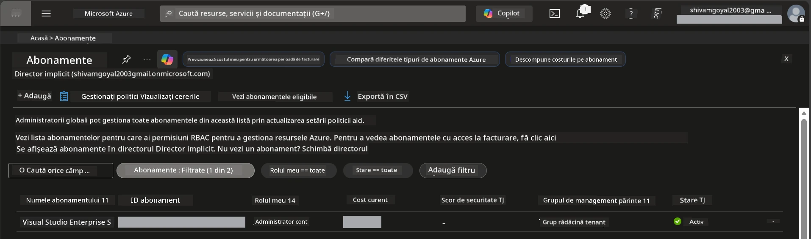

# Module 0 - Cerințe preliminare

Înainte de a începe atelierul, confirmă că ai următoarele unelte, acces și mediu pregătit. Urmează fiecare pas de mai jos - nu sări înainte.

---

## 1. Cont Azure & abonament

### 1.1 Creează sau verifică abonamentul tău Azure

1. Deschide un browser și navighează la [https://azure.microsoft.com/free/](https://azure.microsoft.com/free/).
2. Dacă nu ai un cont Azure, apasă **Start free** și urmează pașii de înscriere. Vei avea nevoie de un cont Microsoft (sau să îți creezi unul) și un card de credit pentru verificarea identității.
3. Dacă ai deja un cont, autentifică-te la [https://portal.azure.com](https://portal.azure.com).
4. În Portal, apasă pe panoul **Subscriptions** din navigarea din stânga (sau caută „Subscriptions” în bara de căutare de sus).
5. Verifică că vezi cel puțin un abonament **Active**. Notează **Subscription ID** — îl vei folosi mai târziu.



### 1.2 Înțelege rolurile RBAC necesare

Implementarea [Hosted Agent](https://learn.microsoft.com/azure/foundry/agents/concepts/hosted-agents) necesită permisiuni pentru **acțiuni pe date** pe care rolurile standard Azure `Owner` și `Contributor` **nu** le includ. Vei avea nevoie de una dintre aceste [combinații de roluri](https://learn.microsoft.com/azure/foundry/concepts/rbac-foundry#built-in-roles):

| Scenariu | Roluri necesare | Unde să le atribui |
|----------|-----------------|--------------------|
| Creează un proiect nou Foundry | **Azure AI Owner** pe resursa Foundry | Resursa Foundry în Portalul Azure |
| Implementare într-un proiect existent (resurse noi) | **Azure AI Owner** + **Contributor** pe abonament | Abonament + resursa Foundry |
| Implementare într-un proiect complet configurat | **Reader** pe cont + **Azure AI User** pe proiect | Cont + Proiect în Portalul Azure |

> **Punct cheie:** rolurile Azure `Owner` și `Contributor` acoperă doar permisiuni de *management* (operațiuni ARM). Ai nevoie de [**Azure AI User**](https://learn.microsoft.com/azure/foundry/concepts/rbac-foundry#built-in-roles) (sau mai mult) pentru *acțiuni pe date* precum `agents/write` care sunt necesare pentru a crea și implementa agenți. Aceste roluri le vei atribui în [Modulul 2](02-create-foundry-project.md).

---

## 2. Instalarea uneltelor locale

Instalează fiecare unealtă de mai jos. După instalare, verifică funcționarea rulând comanda de test.

### 2.1 Visual Studio Code

1. Mergi la [https://code.visualstudio.com/](https://code.visualstudio.com/).
2. Descarcă instalatorul pentru sistemul tău de operare (Windows/macOS/Linux).
3. Rulează instalatorul cu setările implicite.
4. Deschide VS Code pentru a confirma că pornește.

### 2.2 Python 3.10+

1. Mergi la [https://www.python.org/downloads/](https://www.python.org/downloads/).
2. Descarcă Python 3.10 sau versiune ulterioară (recomandat 3.12+).
3. **Windows:** În timpul instalării, bifează **"Add Python to PATH"** pe primul ecran.
4. Deschide un terminal și verifică:

   ```powershell
   python --version
   ```

   Rezultat așteptat: `Python 3.10.x` sau mai mare.

### 2.3 Azure CLI

1. Mergi la [https://learn.microsoft.com/cli/azure/install-azure-cli](https://learn.microsoft.com/cli/azure/install-azure-cli).
2. Urmează instrucțiunile de instalare pentru sistemul tău de operare.
3. Verifică:

   ```powershell
   az --version
   ```

   Așteptat: `azure-cli 2.80.0` sau mai mare.

4. Autentifică-te:

   ```powershell
   az login
   ```

### 2.4 Azure Developer CLI (azd)

1. Mergi la [https://learn.microsoft.com/azure/developer/azure-developer-cli/install-azd](https://learn.microsoft.com/azure/developer/azure-developer-cli/install-azd).
2. Urmează instrucțiunile de instalare pentru sistemul tău de operare. Pe Windows:

   ```powershell
   winget install microsoft.azd
   ```

3. Verifică:

   ```powershell
   azd version
   ```

   Așteptat: `azd version 1.x.x` sau mai mare.

4. Autentifică-te:

   ```powershell
   azd auth login
   ```

### 2.5 Docker Desktop (opțional)

Docker este necesar doar dacă dorești să construiești și să testezi imaginea container local înainte de implementare. Extensia Foundry gestionează automat construirea containerelor în timpul implementării.

1. Mergi la [https://docs.docker.com/get-docker/](https://docs.docker.com/get-docker/).
2. Descarcă și instalează Docker Desktop pentru sistemul tău de operare.
3. **Windows:** Asigură-te că backend-ul WSL 2 este selectat în timpul instalării.
4. Pornește Docker Desktop și așteaptă ca pictograma din tray să afișeze **"Docker Desktop is running"**.
5. Deschide un terminal și verifică:

   ```powershell
   docker info
   ```

   Ar trebui să afișeze informațiile sistemului Docker fără erori. Dacă vezi `Cannot connect to the Docker daemon`, așteaptă câteva secunde până când Docker pornește complet.

---

## 3. Instalează extensiile VS Code

Ai nevoie de trei extensii. Instalează-le **înainte** să înceapă atelierul.

### 3.1 Microsoft Foundry pentru VS Code

1. Deschide VS Code.
2. Apasă `Ctrl+Shift+X` pentru a deschide panoul Extensions.
3. În caseta de căutare, tastează **"Microsoft Foundry"**.
4. Găsește **Microsoft Foundry for Visual Studio Code** (publisher: Microsoft, ID: `TeamsDevApp.vscode-ai-foundry`).
5. Apasă **Install**.
6. După instalare, ar trebui să vezi pictograma **Microsoft Foundry** în Bara de Activități (bara laterală stângă).

### 3.2 Foundry Toolkit

1. În panoul Extensions (`Ctrl+Shift+X`), caută **"Foundry Toolkit"**.
2. Găsește **Foundry Toolkit** (publisher: Microsoft, ID: `ms-windows-ai-studio.windows-ai-studio`).
3. Apasă **Install**.
4. Pictograma **Foundry Toolkit** ar trebui să apară în Bara de Activități.

### 3.3 Python

1. În panoul Extensions, caută **"Python"**.
2. Găsește **Python** (publisher: Microsoft, ID: `ms-python.python`).
3. Apasă **Install**.

---

## 4. Autentifică-te în Azure din VS Code

[Microsoft Agent Framework](https://learn.microsoft.com/agent-framework/overview/) folosește [`DefaultAzureCredential`](https://learn.microsoft.com/azure/developer/python/sdk/authentication/credential-chains#defaultazurecredential-overview) pentru autentificare. Trebuie să fii autentificat în Azure în VS Code.

### 4.1 Autentificare prin VS Code

1. Privește în colțul din stânga jos al VS Code și apasă pe pictograma **Accounts** (siluetă persoană).
2. Apasă **Sign in to use Microsoft Foundry** (sau **Sign in with Azure**).
3. Se deschide o fereastră de browser - autentifică-te cu contul Azure care are acces la abonamentul tău.
4. Revino la VS Code. Ar trebui să vezi numele contului tău în colțul din stânga jos.

### 4.2 (Opțional) Autentificare prin Azure CLI

Dacă ai instalat Azure CLI și preferi autentificarea din linia de comandă:

```powershell
az login
```

Aceasta deschide un browser pentru autentificare. După logare, setează abonamentul corect:

```powershell
az account set --subscription "<your-subscription-id>"
```

Verifică:

```powershell
az account show --query "{name:name, id:id, state:state}" --output table
```

Ar trebui să vezi numele abonamentului, ID-ul și starea = `Enabled`.

### 4.3 (Alternativ) Autentificare cu principal de serviciu

Pentru CI/CD sau medii partajate, setează următoarele variabile de mediu:

```powershell
$env:AZURE_TENANT_ID = "<your-tenant-id>"
$env:AZURE_CLIENT_ID = "<your-client-id>"
$env:AZURE_CLIENT_SECRET = "<your-client-secret>"
```

---

## 5. Limitări în previzualizare

Înainte de a continua, fii conștient de limitările actuale:

- [**Hosted Agents**](https://learn.microsoft.com/azure/foundry/agents/concepts/hosted-agents) sunt în **previzualizare publică** în prezent - nu sunt recomandate pentru sarcini de producție.
- **Regiunile suportate sunt limitate** - verifică [disponibilitatea regiunilor](https://learn.microsoft.com/azure/foundry/agents/concepts/hosted-agents#region-availability) înainte să creezi resurse. Dacă alegi o regiune nesuportată, implementarea va eșua.
- Pachetul `azure-ai-agentserver-agentframework` este pre-release (`1.0.0b16`) - API-urile se pot schimba.
- Limitări de scalare: agenții găzduiți suportă 0-5 replici (inclusiv scalare la zero).

---

## 6. Lista de verificare înainte de start

Parcurge fiecare element de mai jos. Dacă vreun pas eșuează, întoarce-te și corectează-l înainte să continui.

- [ ] VS Code se deschide fără erori
- [ ] Python 3.10+ este în PATH (`python --version` afișează `3.10.x` sau mai mare)
- [ ] Azure CLI este instalat (`az --version` afișează `2.80.0` sau mai mare)
- [ ] Azure Developer CLI este instalat (`azd version` afișează informații despre versiune)
- [ ] Extensia Microsoft Foundry este instalată (pictogramă vizibilă în Bara de Activități)
- [ ] Extensia Foundry Toolkit este instalată (pictogramă vizibilă în Bara de Activități)
- [ ] Extensia Python este instalată
- [ ] Ești autentificat în Azure în VS Code (verifică pictograma Accounts, jos-stânga)
- [ ] `az account show` returnează abonamentul tău
- [ ] (Opțional) Docker Desktop rulează (`docker info` afișează informații sistem fără erori)

### Punct de control

Deschide Bara de Activități în VS Code și confirmă că vezi atât panourile **Foundry Toolkit**, cât și **Microsoft Foundry** în bara laterală. Apasă pe fiecare pentru a verifica dacă se încarcă fără erori.

---

**Următorul:** [01 - Instalarea Foundry Toolkit & Foundry Extension →](01-install-foundry-toolkit.md)

---

<!-- CO-OP TRANSLATOR DISCLAIMER START -->
**Declinare a responsabilității**:  
Acest document a fost tradus folosind serviciul de traducere AI [Co-op Translator](https://github.com/Azure/co-op-translator). Deși ne străduim pentru acuratețe, vă rugăm să rețineți că traducerile automate pot conține erori sau inexactități. Documentul original în limba sa nativă trebuie considerat sursa autoritară. Pentru informații critice, se recomandă o traducere profesională realizată de un traducător uman. Nu ne asumăm responsabilitatea pentru eventualele neînțelegeri sau interpretări greșite rezultate din utilizarea acestei traduceri.
<!-- CO-OP TRANSLATOR DISCLAIMER END -->