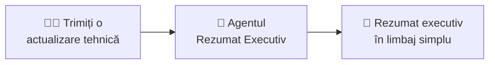

# Modul 0 - Introducere

⏱️ ~10 min

> [!WARNING]
> **Previzualizare și limitări:** [Agenții găzduiți](https://learn.microsoft.com/azure/foundry/agents/concepts/hosted-agents) sunt în prezent în **previzualizare publică** - nu sunt recomandați pentru sarcini de producție. Fiți conștienți de următoarele:
> - **Regiunile suportate sunt limitate** - verificați [disponibilitatea regiunii](https://learn.microsoft.com/azure/foundry/agents/concepts/hosted-agents#region-availability) înainte de a crea resurse. Dacă alegeți o regiune nesuportată, implementarea va eșua.
> - Pachetul `azure-ai-agentserver-agentframework` este în stadiu pre-lansare - API-urile pot suferi modificări între versiuni.
> - Limite de scalare: agenții găzduiți suportă 0–5 replici (inclusiv scalarea la zero).
> - Unele funcționalități prezentate în acest atelier pot suferi modificări pe măsură ce serviciul se apropie de GA.

## Ce vei construi

În acest atelier, vei construi un agent **„Explică-mi ca și cum aș fi un executiv”** - un agent AI găzduit care preia actualizări tehnice complexe și le rescrie sub formă de rezumate executive în limba engleză simplă.

```mermaid
flowchart LR
    A["🧑‍💻 Trimiți o\nactualizare tehnică"] --> B["🤖 Agentul\nRezumat Executiv"]
    B --> C["📝 Rezumat executiv\nîn limbaj simplu"]
```

**Agentul folosește:**
- **Microsoft Agent Framework** - pentru logica și structura agentului
- **Foundry Toolkit pentru VS Code** - pentru a crea scheletul, a testa local și a implementa
- **Un model AI** (de exemplu, `gpt-4.1-mini/gpt-5-mini`) - pentru a genera rezumatele

La finalul acestui laborator, vei avea un agent funcțional pe care îl poți testa local prin Agent Inspector și, opțional, implementa în cloud.

---

## Ce sunt agenții găzduiți?

Un **agent găzduit** este un agent AI care rulează ca un serviciu gestionat în Microsoft Foundry. În loc să gestionezi propria infrastructură, îți împachetezi codul agentului într-un container, iar Foundry se ocupă de scalare, găzduire și expunere printr-un punct final HTTP standard.

| Concept | Ce înseamnă |
|---------|--------------|
| **Agent** | Codul tău Python care primește un mesaj de la utilizator, apelează un model AI și returnează un răspuns structurat |
| **Găzduit** | Foundry rulează containerul pentru tine - fără VM-uri, fără Kubernetes, fără infrastructură de gestionat |
| **Protocolul răspunsurilor** | Un API HTTP standard (`POST /responses`) pe care orice client îl poate apela pentru a interacționa cu agentul tău |
| **Agent Inspector** | O interfață de testare locală (integrată în Foundry Toolkit) care îți permite să conversezi cu agentul înainte de implementare |

În acest atelier, vei trece de la zero la un agent complet găzduit - sau te poți opri la testarea locală dacă preferi.

---

## Alege-ți calea

> ⚠️ **Alege o cale înainte de a continua.** Alegerea ta determină ce unelte trebuie instalate și ce module se aplică. Poți schimba de la Calea B → Calea A mai târziu dacă obții un abonament.

<strong>🅰️ Calea A - Cloud Azure (necesită abonament Azure)</strong>

| | Detalii |
|---|---|
| **Pentru cine este?** | Ai un abonament activ Azure și poți crea resurse Foundry |
| **Model** | Azure OpenAI prin Foundry (de exemplu, `gpt-4.1-mini/gpt-5-mini`) |
| **Module acoperite** | Toate modulele (00–07) |
| **Implementare în cloud?** | ✅ Da - implementare completă end-to-end |

<strong>🅱️ Calea B - Local / gratuit (nu necesită abonament Azure)</strong>

| | Detalii |
|---|---|
| **Pentru cine este?** | MVP-uri, studenți sau oricine fără acces Azure |
| **Model** | **Foundry Local** (gratuit, rulează pe calculatorul tău) |
| **Module acoperite** | Modulele 00–04 (sări peste implementare & verificare cloud) |
| **Implementare în cloud?** | ❌ Nu - doar testare locală prin Agent Inspector |

---

## Toate căile: Unelte necesare

Instalează fiecare unealtă de mai jos. După instalare, verifică dacă funcționează rulând comanda de verificare.

| # | Unealtă | Versiune | Instalare | Verificare (Rezultat așteptat) |
|---|---------|----------|-----------|-------------------------------|
| 1 | **Visual Studio Code** | Ultima versiune | [code.visualstudio.com](https://code.visualstudio.com/) | Se deschide fără erori |
| 2 | **Python** | 3.12 sau mai nou | [python.org/downloads](https://www.python.org/downloads/) | `python --version` $\rightarrow$ `Python 3.12.x` |
| 3 | **Foundry Toolkit pentru VS Code** | Ultima versiune | ID extensie: `ms-windows-ai-studio.windows-ai-studio` | Iconița Foundry în Bara de activități |
| 4 | **Extensia Python pentru VS Code** | Ultima versiune | ID extensie: `ms-python.python` | Instalată în panoul de extensii |

> [!TIP]
> **Sfaturi pro pentru instalare:**
> - **Python PATH (Windows):** Verifică întotdeauna **„Add Python to PATH”** pe primul ecran al instalatorului Python. Fără această opțiune, `python` nu va fi recunoscut în terminal.
> - **Mai multe versiuni de Python:** Dacă ai instalate versiuni Python 3.10 și 3.12, folosește `python3.12 -m venv .venv` pentru a te asigura că versiunea corectă este folosită pentru mediul virtual.
> - **Docker WSL 2 (Windows):** În timpul instalării Docker Desktop, asigură-te că este selectat **backend-ul WSL 2**. Docker cu Hyper-V este mai lent și poate cauza probleme la construirea containerelor Foundry.
> - **Docker nu pornește?** Așteaptă 30–60 secunde după lansarea Docker Desktop. Rulează `docker info` - dacă vezi mesajul „Cannot connect to the Docker daemon”, Docker încă se inițializează.
> - **Extensiile VS Code nu se încarcă?** După instalarea extensiilor, reîncarcă fereastra: `Ctrl+Shift+P` → `Developer: Reload Window`.

> **Utilizatori Windows:** Verifică **„Add Python to PATH”** în timpul instalării Python.

**Următorul:** [01 - Setup →](01-setup.md)

---

<!-- CO-OP TRANSLATOR DISCLAIMER START -->
**Declinare a responsabilității**:
Acest document a fost tradus folosind serviciul de traducere AI [Co-op Translator](https://github.com/Azure/co-op-translator). În timp ce ne străduim pentru acuratețe, vă rugăm să rețineți că traducerile automate pot conține erori sau inexactități. Documentul original în limba sa nativă trebuie considerat sursa autorizată. Pentru informații critice, se recomandă traducerea profesională realizată de un om. Nu ne asumăm responsabilitatea pentru eventualele neînțelegeri sau interpretări greșite care decurg din utilizarea acestei traduceri.
<!-- CO-OP TRANSLATOR DISCLAIMER END -->