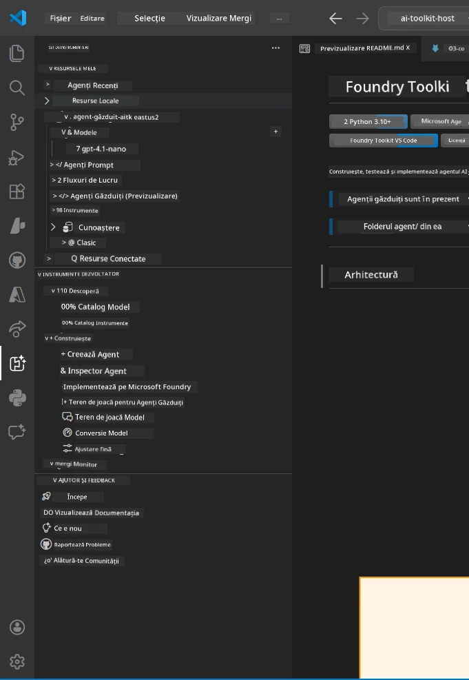
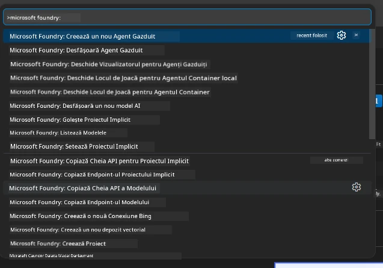

# Modulul 1 - Instalarea Foundry Toolkit & Extensia Foundry

Acest modul te ghidează prin instalarea și verificarea celor două extensii cheie pentru VS Code folosite în acest atelier. Dacă le-ai instalat deja în timpul [Modulului 0](00-prerequisites.md), folosește acest modul pentru a verifica dacă funcționează corect.

---

## Pasul 1: Instalează Extensia Microsoft Foundry

Extensia **Microsoft Foundry for VS Code** este instrumentul tău principal pentru crearea proiectelor Foundry, implementarea modelelor, generarea de agenți găzduiți și implementarea direct din VS Code.

1. Deschide VS Code.
2. Apasă `Ctrl+Shift+X` pentru a deschide panoul **Extensii**.
3. În caseta de căutare din partea de sus, tastează: **Microsoft Foundry**
4. Caută rezultatul intitulat **Microsoft Foundry for Visual Studio Code**.
   - Editor: **Microsoft**
   - ID-ul extensiei: `TeamsDevApp.vscode-ai-foundry`
5. Apasă butonul **Install**.
6. Așteaptă finalizarea instalării (vei vedea un mic indicator de progres).
7. După instalare, uită-te la **Bara de Activități** (bara verticală cu pictograme din partea stângă a VS Code). Ar trebui să vezi o nouă pictogramă **Microsoft Foundry** (arată ca un diamant/pictogramă AI).
8. Apasă pictograma **Microsoft Foundry** pentru a deschide vizualizarea sa laterală. Ar trebui să vezi secțiuni pentru:
   - **Resources** (sau Proiecte)
   - **Agents**
   - **Models**

> **Dacă pictograma nu apare:** Încearcă să reîncarci VS Code (`Ctrl+Shift+P` → `Developer: Reload Window`).

---

## Pasul 2: Instalează Extensia Foundry Toolkit

Extensia **Foundry Toolkit** oferă [**Agent Inspector**](https://learn.microsoft.com/azure/foundry/agents/how-to/vs-code-agents-workflow-pro-code) - o interfață vizuală pentru testarea și depanarea agenților local - plus instrumente pentru playground, gestionarea modelelor și evaluare.

1. În panoul Extensii (`Ctrl+Shift+X`), golește caseta de căutare și tastează: **Foundry Toolkit**
2. Găsește **Foundry Toolkit** în rezultate.
   - Editor: **Microsoft**
   - ID-ul extensiei: `ms-windows-ai-studio.windows-ai-studio`
3. Apasă **Install**.
4. După instalare, pictograma **Foundry Toolkit** apare în Bara de Activități (arată ca un robot/sclipici).
5. Apasă pictograma **Foundry Toolkit** pentru a deschide vizualizarea laterală. Ar trebui să vezi ecranul de bun venit al Foundry Toolkit cu opțiuni pentru:
   - **Models**
   - **Playground**
   - **Agents**

---

## Pasul 3: Verifică dacă ambele extensii funcționează

### 3.1 Verifică Extensia Microsoft Foundry

1. Apasă pictograma **Microsoft Foundry** din Bara de Activități.
2. Dacă ești autentificat în Azure (din Modulul 0), ar trebui să vezi proiectele tale listate sub **Resources**.
3. Dacă ți se cere să te autentifici, apasă **Sign in** și urmează procedura de autentificare.
4. Confirmă că poți vedea bara laterală fără erori.

### 3.2 Verifică Extensia Foundry Toolkit

1. Apasă pictograma **Foundry Toolkit** din Bara de Activități.
2. Confirmă că ecranul de bun venit sau panoul principal se încarcă fără erori.
3. Nu trebuie să configurezi nimic încă - vom folosi Agent Inspector în [Modulul 5](05-test-locally.md).

### 3.3 Verifică prin Command Palette

1. Apasă `Ctrl+Shift+P` pentru a deschide Command Palette.
2. Tastează **"Microsoft Foundry"** - ar trebui să vezi comenzi precum:
   - `Microsoft Foundry: Create a New Hosted Agent`
   - `Microsoft Foundry: Deploy Hosted Agent`
   - `Microsoft Foundry: Open Model Catalog`
3. Apasă `Escape` pentru a închide Command Palette.
4. Deschide din nou Command Palette și tastează **"Foundry Toolkit"** - ar trebui să vezi comenzi precum:
   - `Foundry Toolkit: Open Agent Inspector`

> Dacă nu vezi aceste comenzi, extensiile nu sunt instalate corect. Încearcă să le dezinstalezi și să le reinstalezi.

---

## Ce fac aceste extensii în acest atelier

| Extensie | Ce face | Când îl vei folosi |
|-----------|-------------|-------------------|
| **Microsoft Foundry for VS Code** | Creează proiecte Foundry, implementează modele, **generează [agenți găzduiți](https://learn.microsoft.com/azure/foundry/agents/concepts/hosted-agents)** (generează automat `agent.yaml`, `main.py`, `Dockerfile`, `requirements.txt`), implementează în [Foundry Agent Service](https://learn.microsoft.com/azure/foundry/agents/overview) | Modulele 2, 3, 6, 7 |
| **Foundry Toolkit** | Agent Inspector pentru testare/depanare locală, UI playground, gestionarea modelelor | Modulele 5, 7 |

> **Extensia Foundry este cel mai important instrument din acest atelier.** Ea gestionează întreaga viață a proiectului: generare → configurare → implementare → verificare. Foundry Toolkit o completează prin oferirea Agent Inspector vizual pentru testare locală.

---

### Checkpoint

- [ ] Pictograma Microsoft Foundry este vizibilă în Bara de Activități
- [ ] Apăsarea ei deschide bara laterală fără erori
- [ ] Pictograma Foundry Toolkit este vizibilă în Bara de Activități
- [ ] Apăsarea ei deschide bara laterală fără erori
- [ ] `Ctrl+Shift+P` → tastarea "Microsoft Foundry" afișează comenzile disponibile
- [ ] `Ctrl+Shift+P` → tastarea "Foundry Toolkit" afișează comenzile disponibile

---

**Anterior:** [00 - Prerequisites](00-prerequisites.md) · **Următor:** [02 - Create Foundry Project →](02-create-foundry-project.md)

---

<!-- CO-OP TRANSLATOR DISCLAIMER START -->
**Declinare a responsabilității**:  
Acest document a fost tradus folosind serviciul de traducere AI [Co-op Translator](https://github.com/Azure/co-op-translator). Deși ne străduim pentru acuratețe, vă rugăm să fiți conștienți că traducerile automate pot conține erori sau inexactități. Documentul original în limba sa nativă trebuie considerat sursa autoritară. Pentru informații critice, se recomandă traducerea profesională realizată de un specialist. Nu ne asumăm responsabilitatea pentru eventualele neînțelegeri sau interpretări greșite ce pot rezulta din utilizarea acestei traduceri.
<!-- CO-OP TRANSLATOR DISCLAIMER END -->