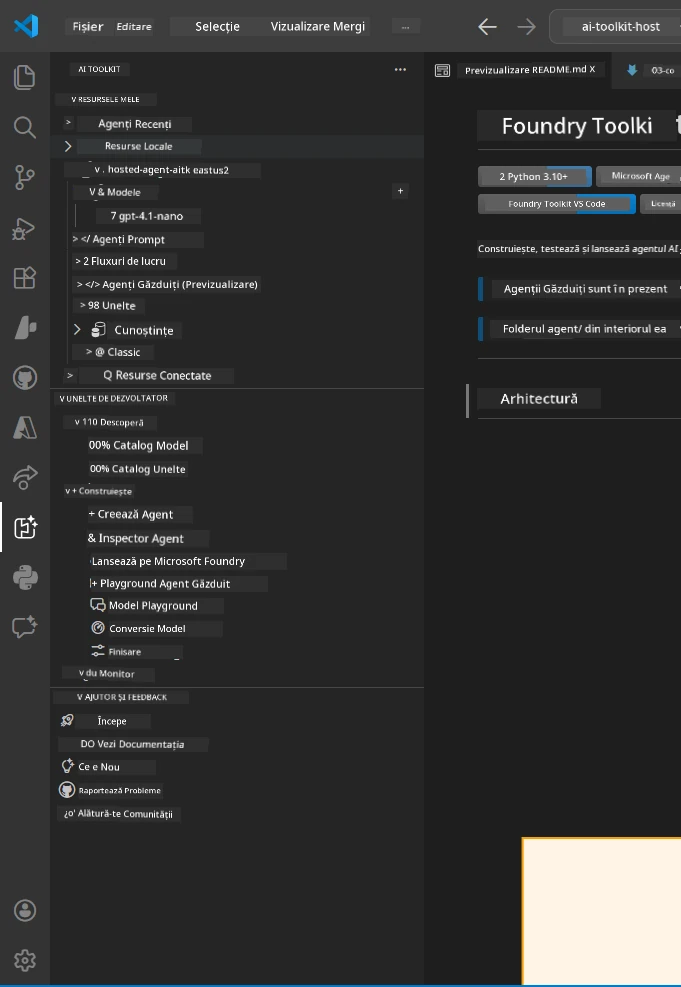
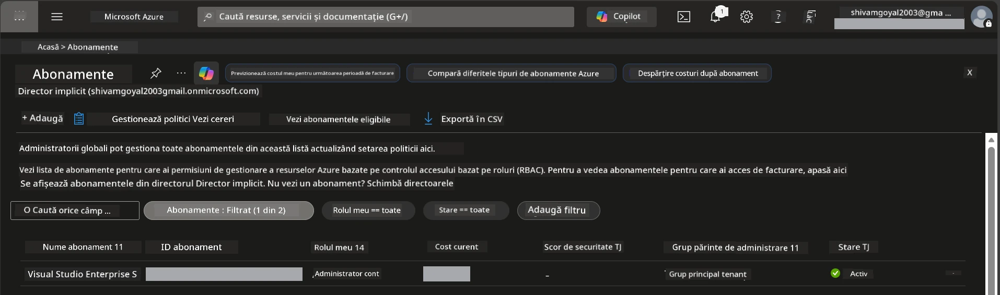
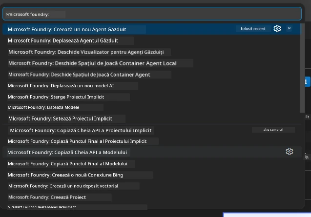
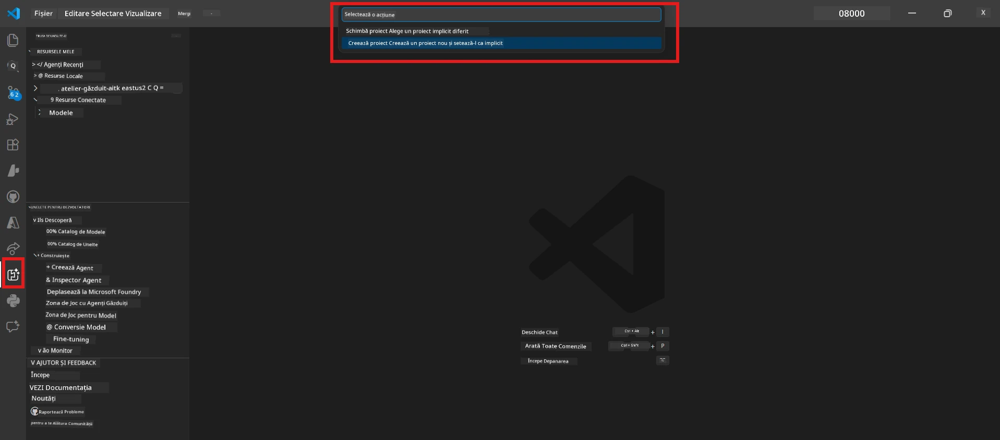
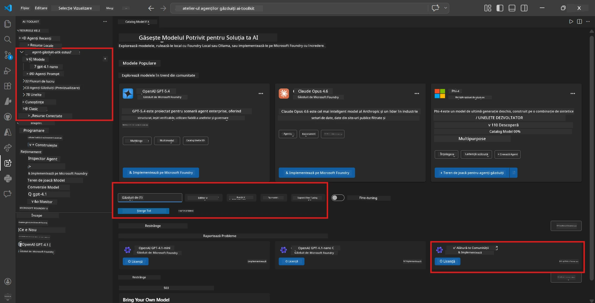
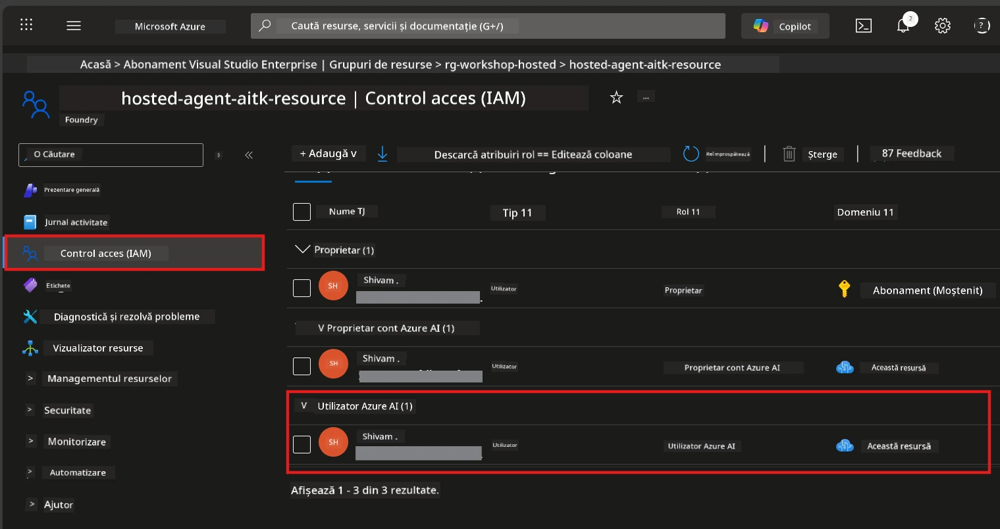

# Configurare: Extensie, Proiect & Model

⏱️ ~15 min

În acest modul, instalezi și verifici extensia Foundry Toolkit, creezi (sau te conectezi la) un proiect Foundry și implementezi un model pe care agentul tău îl va folosi.

## Pasul 1: Instalează Foundry Toolkit

**Foundry Toolkit pentru VS Code** este extensia principală pentru acest atelier. Oferă crearea proiectelor, implementarea modelelor, generarea agentului, testarea locală (Agent Inspector) și implementarea în cloud - toate din VS Code.

1. Deschide VS Code apoi apasă `Ctrl+Shift+X` pentru a deschide panoul **Extensions**.
2. Caută **Foundry Toolkit**.
3. Instalează **Foundry Toolkit pentru VS Code** (Editor: Microsoft, ID: `ms-windows-ai-studio.windows-ai-studio`).
4. După instalare, iconița **Foundry Toolkit** apare în Bara de Activitate (bara laterală din stânga).

> *Notă: Bara de Activitate poate afișa „AI TOOLKIT” în versiunile mai vechi ale extensiei. Funcționalitatea este identică.*



## Pasul 2: Configurare bazată pe accesul tău

> **Alege-ți calea:** Extinde secțiunea de mai jos care corespunde configurării tale. Trebuie să completezi doar **una** dintre căi.

<details>
<summary><strong>🅰️ Calea A - cloud Azure (necesită abonament Azure)</strong></summary>

### Azure CLI

1. Instalează de la [learn.microsoft.com/cli/azure/install-azure-cli](https://learn.microsoft.com/cli/azure/install-azure-cli).
2. Verifică: `az --version` (așteaptă versiunea 2.80.0+).
3. Autentifică-te: `az login`

### Opțiuni de autentificare

[Microsoft Agent Framework](https://learn.microsoft.com/agent-framework/overview/) folosește [`DefaultAzureCredential`](https://learn.microsoft.com/azure/developer/python/sdk/authentication/credential-chains#defaultazurecredential-overview) care încearcă mai multe metode de autentificare în ordine. Alege pe cea care se potrivește mediului tău:

#### Opțiunea 1: Conturi VS Code (recomandat pentru ateliere)
1. Dă clic pe iconița **Accounts** (siluetă persoană) din colțul stânga-jos al VS Code.
2. Selectează **Sign in to use Microsoft Foundry** (sau **Sign in with Azure**).
3. Se deschide un browser - autentifică-te cu contul Azure ce are acces la abonamentul tău.
4. Revino în VS Code. Ar trebui să vezi numele contului tău în colțul stânga-jos.

#### Opțiunea 2: Azure CLI
```bash
az login
az account set --subscription "<your-subscription-id>"
```

#### Opțiunea 3: Service Principal (Enterprise/CI)
Pentru medii restricționate sau pipeline-uri CI/CD, setează aceste variabile de mediu în fișierul tău `.env`:
```env
AZURE_TENANT_ID=<your-tenant-id>
AZURE_CLIENT_ID=<your-client-id>
AZURE_CLIENT_SECRET=<your-client-secret>
```

> **Cum funcționează `DefaultAzureCredential`:** Încearcă mai întâi variabilele de mediu, apoi identitatea gestionată, apoi autentificarea VS Code, apoi Azure CLI - și folosește prima care reușește. Vezi [documentația chain-ului de credențiale](https://learn.microsoft.com/azure/developer/python/sdk/authentication/credential-chains#defaultazurecredential-overview).

### Azure Developer CLI (azd)

1. Instalează: `winget install microsoft.azd` (Windows) sau vezi [docs de instalare](https://learn.microsoft.com/azure/developer/azure-developer-cli/install-azd).
2. Verifică: `azd version`
3. Autentifică-te: `azd auth login`

### Docker Desktop (opțional)

Docker este necesar doar dacă vrei să construiești containere local. Extensia Foundry se ocupă automat de build-uri la implementare.

1. Instalează de la [docs.docker.com/get-docker](https://docs.docker.com/get-docker/).
2. Verifică: `docker info`

### Abonament Azure & RBAC

1. Autentifică-te la [portal.azure.com](https://portal.azure.com).
2. Navighează la **Subscriptions** și confirmă că cel puțin unul este **Activ**.
3. Notează-ți **Subscription ID** - îl vei folosi în Modulul 01.



#### Tabel scenarii RBAC

Implementarea [Hosted Agent](https://learn.microsoft.com/azure/foundry/agents/concepts/hosted-agents) necesită permisiuni pentru **acțiuni asupra datelor**, pe care rolurile standard Azure `Owner` și `Contributor` nu le includ. Folosește tabelul de mai jos pentru a determina ce roluri ai nevoie:

| Scenariu | Roluri necesare | Unde se atribuie |
|----------|---------------|------------------|
| Creare proiect Foundry nou | **Azure AI Owner** pe resursa Foundry | Resursa Foundry în Azure Portal |
| Implementare pe proiect existent (resurse noi) | **Azure AI Owner** + **Contributor** pe abonament | Abonament + resursa Foundry |
| Implementare pe proiect complet configurat | **Reader** pe cont + **Azure AI User** pe proiect | Cont + Proiect în Azure Portal |
| Doar testare locală (fără implementare) | **Azure AI User** pe proiect | Proiect în Azure Portal |

> **Punct cheie:** Rolurile Azure `Owner` și `Contributor` acoperă doar permisiuni de *management* (operațiuni ARM). Ai nevoie de [**Azure AI User**](https://learn.microsoft.com/azure/foundry/concepts/rbac-foundry#built-in-roles) (sau mai sus) pentru *acțiuni asupra datelor* precum `agents/write`, necesar pentru a crea și implementa agenți.

## Conectează-te sau creează un proiect Foundry



1. Apasă `Ctrl+Shift+P` → scrie **Foundry Toolkit: Create Project** → selectează.
2. Selectează **abonnementul Azure** din meniul dropdown.
3. Selectează sau creează un **grup de resurse** (exemplu: `rg-hosted-agents-workshop`).
4. Selectează o **regiune** care suportă agenți găzduiți: `East US`, `West US 2` sau `Sweden Central`. Vezi [disponibilitatea regiunilor](https://learn.microsoft.com/azure/foundry/agents/concepts/hosted-agents#region-availability).
5. Introdu un nume pentru proiect (exemplu: `workshop-agents`).
6. Așteaptă 2–5 minute pentru provisioning. Va apărea o notificare de progres în VS Code.
7. Când e gata, proiectul tău apare în bara laterală **Foundry Toolkit** sub **MY RESOURCES**.



## Implementează un model & atribuie rol RBAC

Agentul tău găzduit are nevoie de un model AI pentru a genera răspunsuri.

#### Matricea selecției modelului
În funcție de nevoile tale, poți alege dintre diferite tipuri de modele:

| Model | Cel mai potrivit pentru | Cost | Note |
|-------|----------------------|-------|-------|
| `gpt-4.1` | Răspunsuri de înaltă calitate, nuanțate | Mai mare | Cele mai bune rezultate, recomandat pentru testarea finală |
| `gpt-4.1-mini/gpt-5-mini` | Iterații rapide, cost mai mic | Mai mic | Potrivit pentru dezvoltarea în atelier și testare rapidă |
| `gpt-4.1-nano` | Sarcini ușoare | Cel mai mic | Cel mai economic, dar răspunsuri mai simple |

1. Apasă `Ctrl+Shift+P` → **Foundry Toolkit: Open Model Catalog** (sau dă clic pe **Model Catalog** în bara laterală, sub DEVELOPER TOOLS → Discover).
2. Caută **gpt-4.1** în catalog.
3. Găsește **OpenAI GPT-4.1-mini** (sau `gpt-5-mini` pentru calitate mai bună) și apasă **Deploy**.



4. În configurația de implementare:
   - **Numele implementării:** Lasă cel implicit sau introdu un nume personalizat. **Ține minte acest nume.**
   - **Ținta:** Selectează **Deploy to Foundry Toolkit** → alege proiectul tău.
5. Apasă **Deploy** și așteaptă 1–3 minute.

> **Recomandare:** Folosește `gpt-4.1-mini/gpt-5-mini` pentru atelier - rapid, accesibil și cu rezultate bune.

### Notează-ți valorile

După implementare, notează aceste două valori (le vei folosi în Modulul 03):

| Valoare | Unde o găsești |
|-------|-----------------|
| **Punctul final al proiectului** | Apasă pe proiect în bara laterală → în vederea detaliată vezi URL-ul (exemplu: `https://<account>.services.ai.azure.com/api/projects/<project>`) |
| **Numele implementării modelului** | Extinde proiectul → **Models** → numele de lângă modelul implementat (ex: `gpt-4.1-mini/gpt-5-mini`) |

### Atribuie rol RBAC

> ⚠️ **Acesta este pasul cel mai frecvent omis.** Fără rolul corect, implementarea în Modulul 05 va eșua.

#### Ce rol am nevoie?
În funcție de scenariul tău, ai nevoie de următoarele combinații de roluri:

| Scenariu | Roluri necesare | Unde se atribuie |
|----------|---------------|------------------|
| Creare proiect Foundry nou | **Azure AI Owner** pe resursa Foundry | Resursa Foundry în Azure Portal |
| Implementare pe proiect existent (resurse noi) | **Azure AI Owner** + **Contributor** pe abonament | Abonament + resursa Foundry |
| Implementare pe proiect complet configurat | **Reader** pe cont + **Azure AI User** pe proiect | Cont + Proiect în Azure Portal |

**Punct cheie:** Rolurile Azure `Owner` și `Contributor` acoperă doar permisiuni *de management*. Ai nevoie de **Azure AI User** (sau mai sus) pentru acțiuni *asupra datelor* cum este `agents/write`, necesare pentru a crea și implementa agenți.

1. Deschide [portal.azure.com](https://portal.azure.com).
2. Caută numele proiectului tău **Foundry** → apasă pe rezultatul de tip **„Foundry Toolkit project”** (NU contul părinte).
3. Click pe **Access control (IAM)** în navigarea din stânga.
4. Click pe **+ Add** → **Add role assignment**.
5. **Tab-ul Role:** Caută **Azure AI User**, selectează-l și apasă **Next**.
6. **Tab-ul Members:** Selectează **User, group, or service principal** → apasă **+ Select members** → găsește-te și selectează-te → apasă **Select**.
7. Apasă **Review + assign** → iarăși **Review + assign**.
8. **Așteaptă 1–2 minute** pentru propagare.

> **De ce acest rol?** Azure `Owner`/`Contributor` dau doar permisiuni de management. Rolul **Azure AI User** oferă acțiunea asupra datelor `agents/write` necesară pentru a crea și implementa agenți. Vezi [documentația RBAC Foundry](https://learn.microsoft.com/azure/foundry/concepts/rbac-foundry#built-in-roles).



</details>

<details>
<summary><strong>🅱️ Calea B - Local / nivel gratuit (fără abonament Azure necesar)</strong></summary>

### Foundry Local

Foundry Local îți permite să rulezi modelele AI pe propriul calculator - nu este nevoie de un cont în cloud. Poți accesa modelele Foundry Local folosind Foundry Toolkit prin catalogul de modele astfel:

1. Mergi la extensia Foundry Toolkit.
2. În navigarea Foundry Toolkit, mergi la **Developer Tools** > și selectează **Model Catalog**
3. În fereastra nouă, selectează **local** din bara de navigare.
4. Derulează în jos până la **Phi 4 Mini,** și apasă butonul **add**; va apărea un popup indicând că modelul este descărcat.
5. Odată ce modelul este descărcat, poți continua la pasul următor.

</details>

### ✅ Punct de control


- [ ] `Ctrl+Shift+P` → "Foundry Toolkit" arată comenzile disponibile
- [ ] Extensia Foundry Toolkit instalată și bara laterală se încarcă fără erori
- [ ] VS Code se deschide și rulează corect
- [ ] `python --version` arată versiunea 3.10+
- [ ] Iconița Foundry Toolkit vizibilă în Bara de Activitate VS Code
- [ ] **Calea A:** `az login` reușește, abonamentul este Activ
- [ ] **Calea B:** Foundry Local rulează (`foundry local status`)
- [ ] **Calea A:** Proiectul Foundry vizibil în bara laterală, model implementat, rol Azure AI User atribuit
- [ ] **Calea B:** Foundry Local rulează cu un model
- [ ] Ți-ai notat **endpoint-ul** și **numele implementării modelului**


**Anterior:** [00 - Prerequisites](00-prerequisites.md) · **Următor:** [02 - Create Hosted Agent →](02-create-hosted-agent.md)

---

<!-- CO-OP TRANSLATOR DISCLAIMER START -->
**Declinare a responsabilității**:
Acest document a fost tradus folosind serviciul de traducere AI [Co-op Translator](https://github.com/Azure/co-op-translator). În timp ce ne străduim pentru acuratețe, vă rugăm să rețineți că traducerile automate pot conține erori sau inexactități. Documentul original în limba sa nativă trebuie considerat sursa autorizată. Pentru informații critice, se recomandă traducerea profesională realizată de un om. Nu ne asumăm responsabilitatea pentru eventualele neînțelegeri sau interpretări greșite care decurg din utilizarea acestei traduceri.
<!-- CO-OP TRANSLATOR DISCLAIMER END -->