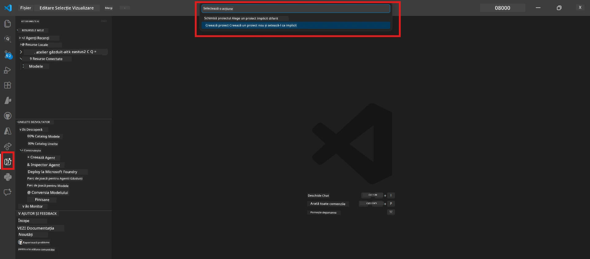
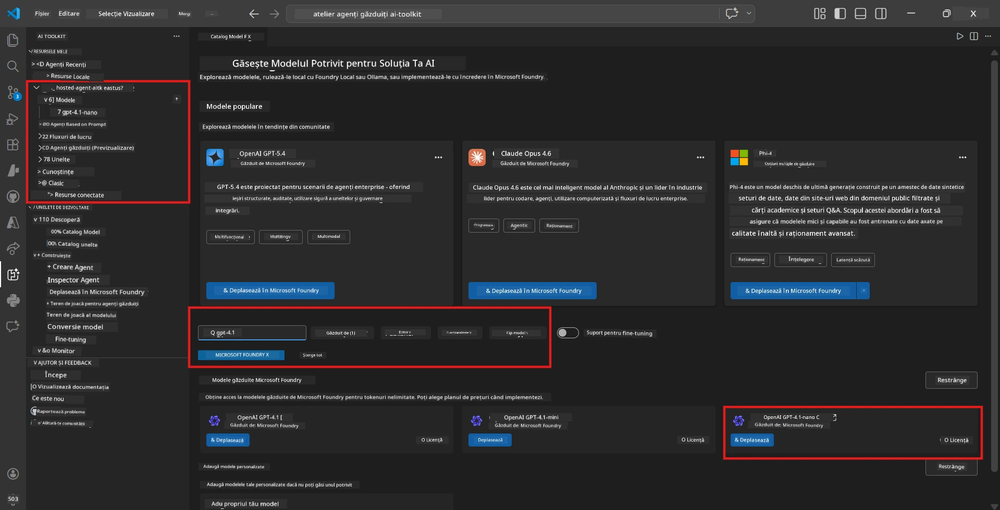
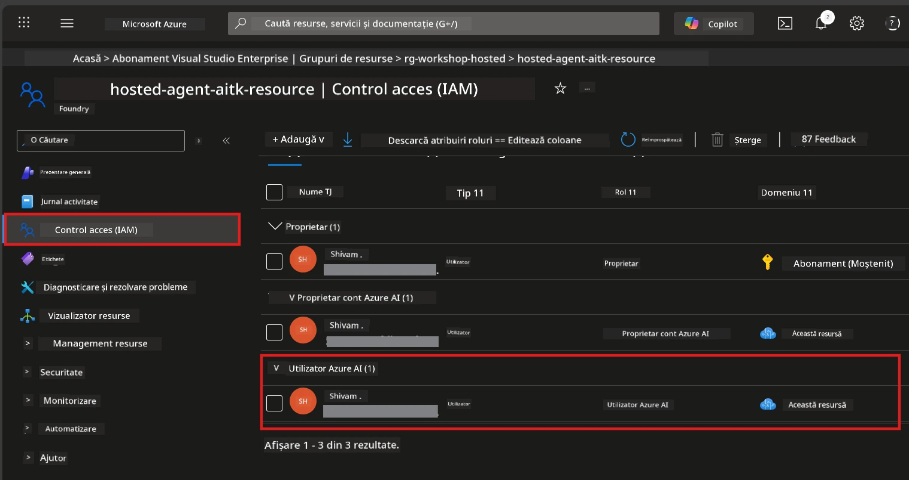

# Modulul 2 - Crearea unui Proiect Foundry și Implementarea unui Model

În acest modul, creezi (sau selectezi) un proiect Microsoft Foundry și implementezi un model pe care agentul tău îl va folosi. Fiecare pas este scris explicit - urmează-le în ordine.

> Dacă ai deja un proiect Foundry cu un model implementat, sari la [Modulul 3](03-create-hosted-agent.md).

---

## Pasul 1: Creează un proiect Foundry din VS Code

Vei folosi extensia Microsoft Foundry pentru a crea un proiect fără să părăsești VS Code.

1. Apasă `Ctrl+Shift+P` pentru a deschide **Command Palette**.
2. Tastează: **Microsoft Foundry: Create Project** și selectează-l.
3. Apare un dropdown - selectează-ți **abonamentul Azure** din listă.
4. Ți se va cere să selectezi sau să creezi un **grup de resurse**:
   - Pentru a crea unul nou: tastează un nume (exemplu: `rg-hosted-agents-workshop`) și apasă Enter.
   - Pentru a folosi unul existent: selectează-l din dropdown.
5. Selectează o **regiune**. **Important:** Alege o regiune care suportă agenți găzduiți. Verifică [disponibilitatea regiunilor](https://learn.microsoft.com/azure/foundry/agents/concepts/hosted-agents#region-availability) - alegerile comune sunt `East US`, `West US 2` sau `Sweden Central`.
6. Introdu un **nume** pentru proiectul Foundry (exemplu: `workshop-agents`).
7. Apasă Enter și așteaptă finalizarea procesului de aprovizionare.

> **Aprovizionarea durează 2-5 minute.** Vei vedea o notificare de progres în colțul din dreapta jos al VS Code. Nu închide VS Code în timpul aprovizionării.

8. Când este gata, bara laterală **Microsoft Foundry** va afișa noul tău proiect sub **Resources**.
9. Dă clic pe numele proiectului pentru a-l extinde și confirmă că afișează secțiuni precum **Models + endpoints** și **Agents**.



### Alternativă: Creare prin Portalul Foundry

Dacă preferi să folosești browser-ul:

1. Deschide [https://ai.azure.com](https://ai.azure.com) și autentifică-te.
2. Apasă **Create project** pe pagina principală.
3. Introdu un nume pentru proiect, selectează abonamentul, grupul de resurse și regiunea.
4. Apasă **Create** și așteaptă aprovizionarea.
5. Odată creat, revino la VS Code - proiectul ar trebui să apară în bara laterală Foundry după o reîmprospătare (dă clic pe iconița de reîmprospătare).

---

## Pasul 2: Implementează un model

Agentul tău [hosted agent](https://learn.microsoft.com/azure/foundry/agents/concepts/hosted-agents) are nevoie de un model Azure OpenAI pentru a genera răspunsuri. Vei [implementa unul acum](https://learn.microsoft.com/azure/ai-foundry/openai/how-to/create-resource#deploy-a-model).

1. Apasă `Ctrl+Shift+P` pentru a deschide **Command Palette**.
2. Tastează: **Microsoft Foundry: Open [Model Catalog](https://learn.microsoft.com/azure/ai-foundry/openai/concepts/models)** și selectează-l.
3. Vederea Catalogului de Modele se deschide în VS Code. Răsfoiește sau folosește bara de căutare pentru a găsi **gpt-4.1**.
4. Dă clic pe cardul modelului **gpt-4.1** (sau `gpt-4.1-mini` dacă preferi costuri mai reduse).
5. Apasă **Deploy**.


6. În configurația pentru implementare:
   - **Nume implementare**: Lasă implicitul (exemplu: `gpt-4.1`) sau introduce un nume personalizat. **Reține acest nume** - vei avea nevoie de el în Modulul 4.
   - **Target**: Selectează **Deploy to Microsoft Foundry** și alege proiectul creat anterior.
7. Apasă **Deploy** și așteaptă finalizarea implementării (1-3 minute).

### Alegerea unui model

| Model | Potrivit pentru | Cost | Note |
|-------|-----------------|------|-------|
| `gpt-4.1` | Răspunsuri calitative, nuanțate | Mai mare | Cele mai bune rezultate, recomandat pentru testarea finală |
| `gpt-4.1-mini` | Iterații rapide, cost redus | Mai mic | Bun pentru dezvoltare și testare rapidă în cadrul atelierului |
| `gpt-4.1-nano` | Sarcini ușoare | Cel mai mic | Cel mai economic, dar produce răspunsuri mai simple |

> **Recomandare pentru acest atelier:** Folosește `gpt-4.1-mini` pentru dezvoltare și testare. Este rapid, ieftin și produce rezultate bune pentru exerciții.

### Verifică implementarea modelului

1. În bara laterală **Microsoft Foundry**, extinde proiectul tău.
2. Uită-te sub **Models + endpoints** (sau o secțiune similară).
3. Ar trebui să vezi modelul tău implementat (exemplu: `gpt-4.1-mini`) cu statusul **Succeeded** sau **Active**.
4. Dă clic pe implementarea modelului pentru a-i vedea detaliile.
5. **Notează** aceste două valori - vei avea nevoie de ele în Modulul 4:

   | Setare | Unde să o găsești | Exemplu valoare |
   |---------|-------------------|-----------------|
   | **Endpoint proiect** | Dă clic pe numele proiectului în bara laterală Foundry. URL-ul endpoint este afișat în vederea cu detalii. | `https://<account>.services.ai.azure.com/api/projects/<project>` |
   | **Nume implementare model** | Numele afișat lângă modelul implementat. | `gpt-4.1-mini` |

---

## Pasul 3: Atribuie rolurile RBAC necesare

Acesta este pasul care se ratează cel mai frecvent. Fără rolurile corecte, implementarea din Modulul 6 va eșua din cauza lipsei permisiunilor.

### 3.1 Atribuie ție rolul Azure AI User

1. Deschide un browser și accesează [https://portal.azure.com](https://portal.azure.com).
2. În bara de căutare de sus, tastează numele **proiectului Foundry** și fă clic pe rezultat.
   - **Important:** Navighează la resursa **proiectului** (tip: "Microsoft Foundry project"), **nu** la contul/hub-ul părinte.
3. În meniul din stânga al proiectului, dă clic pe **Access control (IAM)**.
4. Apasă butonul **+ Add** din partea de sus → selectează **Add role assignment**.
5. În fila **Role**, caută [**Azure AI User**](https://learn.microsoft.com/azure/foundry/concepts/rbac-foundry#built-in-roles) și selectează-l. Dă clic pe **Next**.
6. În fila **Members**:
   - Selectează **User, group, or service principal**.
   - Apasă **+ Select members**.
   - Caută-ți numele sau adresa de email, selectează-te și apasă **Select**.
7. Apasă **Review + assign** → apoi iar **Review + assign** pentru confirmare.



### 3.2 (Opțional) Atribuie rolul Azure AI Developer

Dacă trebuie să creezi resurse suplimentare în proiect sau să gestionezi implementările programatic:

1. Repetă pașii de mai sus, dar în pasul 5 selectează **Azure AI Developer**.
2. Atribuie acest rol la nivelul resursei **Foundry (cont)**, nu doar la nivelul proiectului.

### 3.3 Verifică atribuirea rolurilor

1. Pe pagina **Access control (IAM)** a proiectului, dă clic pe fila **Role assignments**.
2. Caută-ți numele.
3. Ar trebui să vezi cel puțin rolul **Azure AI User** listat pentru domeniul proiectului.

> **De ce este important:** Rolul [`Azure AI User`](https://learn.microsoft.com/azure/foundry/concepts/rbac-foundry#built-in-roles) acordă acțiunea de date `Microsoft.CognitiveServices/accounts/AIServices/agents/write`. Fără acesta, vei vedea această eroare în timpul implementării:
>
> ```
> Error: lacks the required data action 
> Microsoft.CognitiveServices/accounts/AIServices/agents/write 
> to perform POST /api/projects/{projectName}/assistants operation.
> ```
>
> Vezi [Modulul 8 - Depanare](08-troubleshooting.md) pentru mai multe detalii.

---

### Punct de verificare

- [ ] Proiectul Foundry există și este vizibil în bara laterală Microsoft Foundry din VS Code
- [ ] Cel puțin un model este implementat (exemplu: `gpt-4.1-mini`) cu status **Succeeded**
- [ ] Ai notat URL-ul **endpoint-ului proiectului** și **numele implementării modelului**
- [ ] Ai rolul **Azure AI User** atribuit la nivelul **proiectului** (verifică în Azure Portal → IAM → Role assignments)
- [ ] Proiectul este într-o [regiune suportată](https://learn.microsoft.com/azure/foundry/agents/concepts/hosted-agents#region-availability) pentru agenți găzduiți

---

**Anterior:** [01 - Install Foundry Toolkit](01-install-foundry-toolkit.md) · **Următor:** [03 - Create a Hosted Agent →](03-create-hosted-agent.md)

---

<!-- CO-OP TRANSLATOR DISCLAIMER START -->
**Declinare a responsabilității**:
Acest document a fost tradus folosind serviciul de traducere AI [Co-op Translator](https://github.com/Azure/co-op-translator). Deși ne străduim pentru acuratețe, vă rugăm să rețineți că traducerile automate pot conține erori sau inexactități. Documentul original în limba sa natală trebuie considerat sursa autorizată. Pentru informații critice, se recomandă traducerea profesională realizată de un traducător uman. Nu ne asumăm răspunderea pentru orice neînțelegeri sau interpretări greșite rezultate din utilizarea acestei traduceri.
<!-- CO-OP TRANSLATOR DISCLAIMER END -->