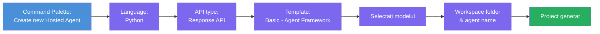
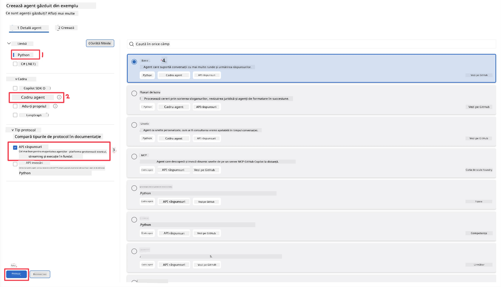
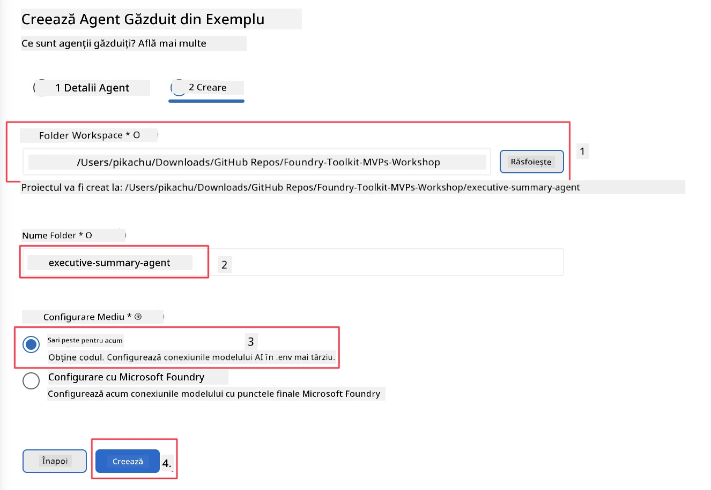

# Modulul 2 - Creează un Agent Găzduit Nou

⏱️ ~5 min

În acest modul, folosești Foundry Toolkit pentru a **configura un proiect agent găzduit**. Scheletul generează structura completă a proiectului - `agent.yaml`, `main.py`, `Dockerfile`, `requirements.txt` și configurația de depanare VS Code - astfel încât să te poți concentra pe personalizarea comportamentului agentului.

> **Concept cheie:** Folderul `agent/` din acest laborator este un exemplu de ceea ce generează Foundry Toolkit. Nu scrii aceste fișiere de la zero.

### Fluxul expertului pentru configurare



---

## Pasul 1: Deschide expertul pentru Crearea Agentului Găzduit

1. Apasă `Ctrl+Shift+P` pentru a deschide **Paleta de Comenzi**.
2. Tastează: **Foundry Toolkit: Create new Hosted Agent** și selectează-l.

> **Alternativ: Creare via Foundry Portal**
> Dacă preferi browserul, poți crea proiectul tău la [https://ai.azure.com](https://ai.azure.com). După ce proiectul este provisionat, revino în VS Code și folosește bara laterală **Foundry Toolkit** pentru a te conecta la el.

> **Alternativ:** Fă clic pe pictograma **+** de lângă **Hosted Agents (Preview)** din bara laterală Foundry Toolkit.

## Pasul 2: Alege setările



1. În secțiunea de navigare/opțiuni din stânga selectează următoarele:

| Meniu | Selecție | Note |
|--------|-----------|-------|
| **Language** | Python | De asemenea, este suportat C# |
| **Framework** | Agent Framework | Punct de plecare simplu folosind Agent Framework SDK |
| **API type** | Response API | `POST /responses` - conversațional, cu istoric gestionat de platformă |
| **Template** | Basic | Punct de plecare simplu folosind Agent Framework SDK |

2. După ce selecția este făcută, apasă pe **Next**



3. În fereastra următoare, selectează următoarele:

| Meniu | Selecție | Note |
|--------|-----------|-------|
| **Workspace folder** | Alege un folder țintă | de ex., `/workspace/Foundry_Toolkit_for_VSCode_Lab/` sau un subfolder din acest repo |
| **Agent name** | Introdu un nume | de ex., `executive-summary-agent` |
| **Environment Setup** | sărim peste configurare deocamdată |  |

Apasă **create** pentru a crea agentul nostru. Se va crea un folder nou cu numele agentului găzduit.

## Pasul 3: Inspectează proiectul generat

După ce scheletul este complet, verifică să vezi aceste fișiere în Explorer (`Ctrl+Shift+E`):

```
📂 my-agent/
├── .env                ← Environment variables (placeholders)
├── .vscode/
│   ├── launch.json     ← Debug config (F5 → run + Agent Inspector)
│   └── tasks.json      ← VS Code task definitions
├── agent.yaml          ← Agent definition (kind: hosted)
├── Dockerfile          ← Container config for deployment
├── main.py             ← Agent entry point (your main code)
└── requirements.txt    ← Python dependencies
```

### Explicația fișierelor cheie

| Fișier | Scop |
|------|---------|
| `agent.yaml` | Declară agentul ca `kind: hosted`, mapează variabilele de mediu, definește protocolul `/responses` |
| `main.py` | Creează un `FoundryChatClient` → îl înfășoară într-un `Agent` cu instrucțiuni → servește prin `ResponsesHostServer` pe portul 8088 |
| `Dockerfile` | Folosește `python:3.12-slim`, instalează dependențe, expune portul 8088, rulează `main.py` |
| `requirements.txt` | `agent-framework-foundry`, `agent-framework-foundry-hosting`, `mcp`, `debugpy` |

> **Important:** Deschide direct în VS Code folderul agentului scheletat (folderul `agent/` în sine) astfel încât `.vscode/launch.json` și `tasks.json` să funcționeze corect pentru depanarea cu F5.

---

### ✅ Punct de verificare

- [ ] Proiectul scheletat creat cu toate fișierele așteptate
- [ ] `agent.yaml` arată `kind: hosted` și `protocol: responses`
- [ ] `main.py` importă `Agent`, `FoundryChatClient`, `ResponsesHostServer`
- [ ] Folderul agent este deschis în VS Code ca rădăcină a spațiului de lucru

---

**Anterior:** [01 - Setup](01-setup.md) · **Următor:** [03 - Configure & Code →](03-configure-and-code.md)

---

<!-- CO-OP TRANSLATOR DISCLAIMER START -->
**Declinare a responsabilității**:
Acest document a fost tradus folosind serviciul de traducere AI [Co-op Translator](https://github.com/Azure/co-op-translator). În timp ce ne străduim pentru acuratețe, vă rugăm să rețineți că traducerile automate pot conține erori sau inexactități. Documentul original în limba sa nativă trebuie considerat sursa autorizată. Pentru informații critice, se recomandă traducerea profesională realizată de un om. Nu ne asumăm responsabilitatea pentru eventualele neînțelegeri sau interpretări greșite care decurg din utilizarea acestei traduceri.
<!-- CO-OP TRANSLATOR DISCLAIMER END -->