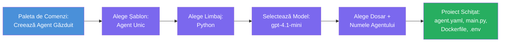

# Modului 3 - Crearea unui nou Agent Găzduit (Scaffold automat generat de extensia Foundry)

În acest modul, utilizați extensia Microsoft Foundry pentru a **scaffold un nou proiect [agent găzduit](https://learn.microsoft.com/azure/foundry/agents/concepts/hosted-agents)**. Extensia generează întreaga structură a proiectului pentru dvs. - inclusiv `agent.yaml`, `main.py`, `Dockerfile`, `requirements.txt`, un fișier `.env` și o configurație de depanare VS Code. După scaffold, personalizați aceste fișiere cu instrucțiunile, uneltele și configurația agentului dvs.

> **Concept cheie:** Folderul `agent/` din acest laborator este un exemplu de ce generează extensia Foundry când rulați această comandă de scaffold. Nu scrieți aceste fișiere de la zero - extensia le creează, iar apoi le modificați.

### Fluxul expertului Scaffold


---

## Pasul 1: Deschideți expertul Create Hosted Agent

1. Apăsați `Ctrl+Shift+P` pentru a deschide **Command Palette**.
2. Tastați: **Microsoft Foundry: Create a New Hosted Agent** și selectați-l.
3. Se deschide expertul pentru crearea agentului găzduit.

> **Cale alternativă:** Puteți ajunge și prin bara laterală Microsoft Foundry → faceți clic pe pictograma **+** de lângă **Agents** sau faceți clic dreapta și selectați **Create New Hosted Agent**.

---

## Pasul 2: Alegeți șablonul

Expertul vă cere să selectați un șablon. Veți vedea opțiuni ca:

| Șablon | Descriere | Când se folosește |
|----------|-------------|-------------|
| **Single Agent** | Un singur agent cu propriul model, instrucțiuni și unelte opționale | Acest workshop (Lab 01) |
| **Multi-Agent Workflow** | Mai mulți agenți care colaborează în secvență | Lab 02 |

1. Selectați **Single Agent**.
2. Faceți clic pe **Next** (sau selecția continuă automat).

---

## Pasul 3: Alegeți limbajul de programare

1. Selectați **Python** (recomandat pentru acest workshop).
2. Apăsați **Next**.

> **C# este de asemenea suportat** dacă preferați .NET. Structura scaffold este similară (folosește `Program.cs` în loc de `main.py`).

---

## Pasul 4: Selectați modelul

1. Expertul afișează modelele implementate în proiectul dvs. Foundry (din Modulul 2).
2. Selectați modelul pe care l-ați implementat - ex., **gpt-4.1-mini**.
3. Apăsați **Next**.

> Dacă nu vedeți niciun model, întoarceți-vă la [Modulul 2](02-create-foundry-project.md) și implementați unul mai întâi.

---

## Pasul 5: Alegeți locația folderului și numele agentului

1. Se deschide un dialog de fișiere - alegeți un **folder țintă** unde va fi creat proiectul. Pentru acest workshop:
   - Dacă începeți de la zero: alegeți orice folder (ex., `C:\Projects\my-agent`)
   - Dacă lucrați în repo-ul workshopului: creați un subfolder nou sub `workshop/lab01-single-agent/agent/`
2. Introduceți un **nume** pentru agentul găzduit (ex., `executive-summary-agent` sau `my-first-agent`).
3. Apăsați **Create** (sau Enter).

---

## Pasul 6: Așteptați finalizarea scaffold-ului

1. VS Code deschide o **fereastră nouă** cu proiectul scaffoldat.
2. Așteptați câteva secunde pentru încărcarea completă a proiectului.
3. Ar trebui să vedeți următoarele fișiere în panoul Explorer (`Ctrl+Shift+E`):

```
📂 my-first-agent/
├── .env                ← Environment variables (auto-generated with placeholders)
├── .vscode/
│   └── launch.json     ← Debug configuration (F5 to run + Agent Inspector)
├── agent.yaml          ← Agent definition (kind: hosted)
├── Dockerfile          ← Container configuration for deployment
├── main.py             ← Agent entry point (your main code file)
└── requirements.txt    ← Python dependencies
```

> **Aceasta este aceeași structură ca folderul `agent/`** din acest laborator. Extensia Foundry generează automat aceste fișiere - nu trebuie să le creați manual.

> **Notă workshop:** În acest repository de workshop, folderul `.vscode/` este la **rădăcina spațiului de lucru** (nu în fiecare proiect). Conține `launch.json` și `tasks.json` partajate cu două configurații de depanare - **"Lab01 - Single Agent"** și **"Lab02 - Multi-Agent"** - fiecare indicând către `cwd`-ul laboratorului corespunzător. Când apăsați F5, selectați configurația care corespunde laboratorului pe care lucrați din meniul derulant.

---

## Pasul 7: Înțelegeți fiecare fișier generat

Luați un moment să inspectați fiecare fișier creat de expert. Înțelegerea lor este importantă pentru Modulul 4 (personalizare).

### 7.1 `agent.yaml` - Definiția agentului

Deschideți `agent.yaml`. Arată astfel:

```yaml
# yaml-language-server: $schema=https://raw.githubusercontent.com/microsoft/AgentSchema/refs/heads/main/schemas/v1.0/ContainerAgent.yaml

kind: hosted
name: my-first-agent
description: >
  A hosted agent deployed to Microsoft Foundry Agent Service.
metadata:
  authors:
    - Microsoft
  tags:
    - Azure AI AgentServer
    - Microsoft Agent Framework
    - Hosted Agent
protocols:
  - protocol: responses
    version: v1
environment_variables:
  - name: AZURE_AI_PROJECT_ENDPOINT
    value: ${PROJECT_ENDPOINT}
  - name: AZURE_AI_MODEL_DEPLOYMENT_NAME
    value: ${MODEL_DEPLOYMENT_NAME}
dockerfile_path: Dockerfile
resources:
  cpu: '0.25'
  memory: 0.5Gi
```

**Câmpuri cheie:**

| Câmp | Scop |
|-------|---------|
| `kind: hosted` | Declară că este un agent găzduit (bazat pe container, implementat în [Foundry Agent Service](https://learn.microsoft.com/azure/foundry/agents/overview)) |
| `protocols: responses v1` | Agentul expune endpoint-ul HTTP `/responses` compatibil cu OpenAI |
| `environment_variables` | Maparea valorilor din `.env` către variabilele de mediu ale containerului la rulare |
| `dockerfile_path` | Indică Dockerfile-ul folosit pentru construirea imaginii containerului |
| `resources` | Alocarea de CPU și memorie pentru container (0.25 CPU, 0.5Gi memorie) |

### 7.2 `main.py` - Punctul de intrare al agentului

Deschideți `main.py`. Acesta este fișierul principal Python unde se află logica agentului. Scaffold-ul include:

```python
from agent_framework.azure import AzureAIAgentClient
from azure.ai.agentserver.agentframework import from_agent_framework
from azure.identity.aio import DefaultAzureCredential
```

**Importuri cheie:**

| Import | Scop |
|--------|--------|
| `AzureAIAgentClient` | Conectează la proiectul Foundry și creează agenți prin `.as_agent()` |
| [`DefaultAzureCredential`](https://learn.microsoft.com/azure/developer/python/sdk/authentication/credential-chains#defaultazurecredential-overview) | Gestionează autentificarea (Azure CLI, autentificare VS Code, identitate gestionată sau principal de serviciu) |
| `from_agent_framework` | Împachetează agentul ca server HTTP care expune endpoint-ul `/responses` |

Fluxul principal este:
1. Creare credential → creare client → apel `.as_agent()` pentru a obține un agent (context manager asincron) → înfășurați-l ca server → rulați

### 7.3 `Dockerfile` - Imaginea containerului

```dockerfile
FROM python:3.14-slim

WORKDIR /app

COPY ./ .

RUN pip install --upgrade pip && \
    if [ -f requirements.txt ]; then \
        pip install -r requirements.txt; \
    else \
        echo "No requirements.txt found" >&2; exit 1; \
    fi

EXPOSE 8088

CMD ["python", "main.py"]
```

**Detalii cheie:**
- Folosește imaginea de bază `python:3.14-slim`.
- Copiază toate fișierele proiectului în `/app`.
- Actualizează `pip`, instalează dependențele din `requirements.txt` și eșuează rapid dacă fișierul lipsește.
- **Expune portul 8088** - acesta este portul obligatoriu pentru agenții găzduiți. Nu-l schimbați.
- Pornește agentul cu `python main.py`.

### 7.4 `requirements.txt` - Dependențe

```
agent-framework-azure-ai==1.0.0rc3
agent-framework-core==1.0.0rc3
azure-ai-agentserver-agentframework==1.0.0b16
azure-ai-agentserver-core==1.0.0b16
debugpy
agent-dev-cli
```

| Pachet | Scop |
|---------|---------|
| `agent-framework-azure-ai` | Integrare Azure AI pentru Microsoft Agent Framework |
| `agent-framework-core` | Runtime de bază pentru construirea agenților (include `python-dotenv`) |
| `azure-ai-agentserver-agentframework` | Runtime server agent găzduit pentru Foundry Agent Service |
| `azure-ai-agentserver-core` | Abstracții de bază pentru server agent |
| `debugpy` | Suport depanare Python (permite depanare cu F5 în VS Code) |
| `agent-dev-cli` | CLI local pentru dezvoltare și testare agenți (folosit de configurația debug/run) |

---

## Înțelegerea protocolului agentului

Agenții găzduiți comunică prin protocolul **OpenAI Responses API**. Când rulează (local sau în cloud), agentul expune un singur endpoint HTTP:

```
POST http://localhost:8088/responses
Content-Type: application/json

{
  "input": "Your prompt here",
  "stream": false
}
```

Foundry Agent Service apelează acest endpoint pentru a trimite prompturi de la utilizator și a primi răspunsuri de la agent. Acesta este același protocol utilizat de API-ul OpenAI, deci agentul dvs. este compatibil cu orice client care folosește formatul OpenAI Responses.

---

### Punct de verificare

- [ ] Expertul scaffold s-a terminat cu succes și s-a deschis o **fereastră nouă VS Code**
- [ ] Puteți vedea toate cele 5 fișiere: `agent.yaml`, `main.py`, `Dockerfile`, `requirements.txt`, `.env`
- [ ] Fișierul `.vscode/launch.json` există (activează depanarea cu F5 - în acest workshop este la rădăcina spațiului de lucru cu configurații specifice laboratoarelor)
- [ ] Ați citit fiecare fișier și îi înțelegeți scopul
- [ ] Înțelegeți că portul `8088` este necesar și endpoint-ul `/responses` este protocolul

---

**Anterior:** [02 - Create Foundry Project](02-create-foundry-project.md) · **Următor:** [04 - Configurează & Codează →](04-configure-and-code.md)

---

<!-- CO-OP TRANSLATOR DISCLAIMER START -->
**Avertisment**:  
Acest document a fost tradus folosind serviciul de traducere AI [Co-op Translator](https://github.com/Azure/co-op-translator). Deși ne străduim pentru acuratețe, vă rugăm să fiți conștienți că traducerile automate pot conține erori sau inexactități. Documentul original în limba sa nativă trebuie considerat sursa autoritară. Pentru informații critice, este recomandată traducerea profesională realizată de un specialist uman. Nu suntem responsabili pentru eventuale neînțelegeri sau interpretări greșite rezultate din utilizarea acestei traduceri.
<!-- CO-OP TRANSLATOR DISCLAIMER END -->