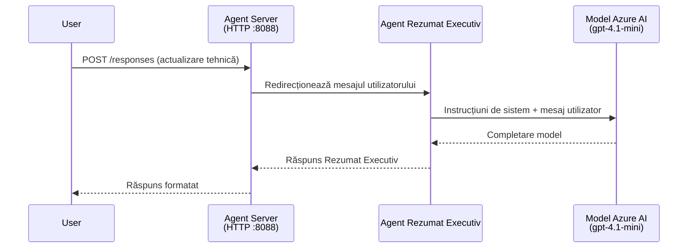
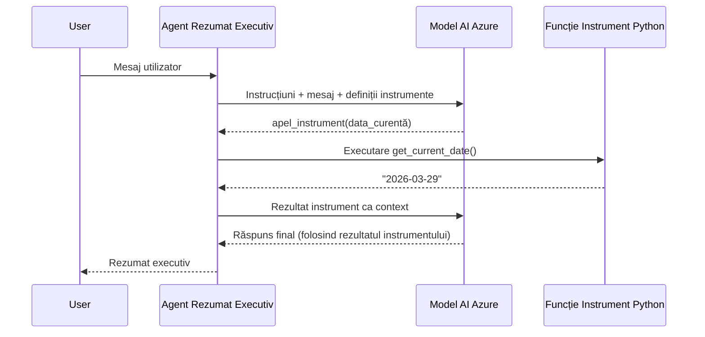

# Modulul 4 - Configurare Instrucțiuni, Mediu & Instalare Dependențe

În acest modul, personalizați fișierele agent auto-generat din Modulul 3. Aici transformați scheletul generic în **agentul dumneavoastră** - scriind instrucțiuni, setând variabile de mediu, adăugând opțional unelte și instalând dependențe.

> **Reamintire:** Extensia Foundry a generat automat fișierele proiectului dumneavoastră. Acum le modificați. Consultați folderul [`agent/`](../../../../../workshop/lab01-single-agent/agent) pentru un exemplu complet de agent personalizat care funcționează.

---

## Cum se potrivesc componentele între ele

### Ciclu de viață al cererii (agent unic)


> **Cu unelte:** Dacă agentul are unelte înregistrate, modelul poate returna o solicitare de apelare a unei unelte în loc de un răspuns direct. Framework-ul execută unealta local, transmite rezultatul înapoi modelului, iar modelul generează apoi răspunsul final.


---

## Pasul 1: Configurează variabilele de mediu

Scheletul a creat un fișier `.env` cu valori de tip placeholder. Trebuie să completați valorile reale din Modulul 2.

1. În proiectul auto-generat, deschideți fișierul **`.env`** (se află în rădăcina proiectului).
2. Înlocuiți valorile placeholder cu detaliile reale ale proiectului Foundry:

   ```env
   PROJECT_ENDPOINT=https://<your-account>.services.ai.azure.com/api/projects/<your-project>
   MODEL_DEPLOYMENT_NAME=gpt-4.1-mini
   ```

3. Salvați fișierul.

### Unde găsiți aceste valori

| Valoare | Cum să o găsiți |
|---------|-----------------|
| **Endpoint-ul proiectului** | Deschideți bara laterală **Microsoft Foundry** în VS Code → dați click pe proiectul dumneavoastră → URL-ul endpoint apare în vizualizarea de detalii. Arată cam așa `https://<account-name>.services.ai.azure.com/api/projects/<project-name>` |
| **Numele implementării modelului** | În bara laterală Foundry, extindeți proiectul → uitați-vă sub **Models + endpoints** → numele este afișat lângă modelul implementat (de exemplu, `gpt-4.1-mini`) |

> **Securitate:** Nu comiteți niciodată fișierul `.env` în controlul versiunilor. Este deja inclus în `.gitignore` implicit. Dacă nu este, adăugați-l:
> ```
> .env
> ```

### Cum circulă variabilele de mediu

Lanțul de mapare este: `.env` → `main.py` (citește prin `os.getenv`) → `agent.yaml` (mapează variabilele de mediu ale containerului la timpul de implementare).

În `main.py`, scheletul citește aceste valori astfel:

```python
PROJECT_ENDPOINT = os.getenv("AZURE_AI_PROJECT_ENDPOINT") or os.getenv("PROJECT_ENDPOINT")
MODEL_DEPLOYMENT_NAME = os.getenv("AZURE_AI_MODEL_DEPLOYMENT_NAME", os.getenv("MODEL_DEPLOYMENT_NAME", "gpt-4.1-mini"))
```

Atât `AZURE_AI_PROJECT_ENDPOINT`, cât și `PROJECT_ENDPOINT` sunt acceptate (în `agent.yaml` se folosește prefixul `AZURE_AI_*`).

---

## Pasul 2: Scrie instrucțiunile agentului

Acesta este cel mai important pas de personalizare. Instrucțiunile definesc personalitatea agentului, comportamentul, formatul de ieșire și restricțiile de siguranță.

1. Deschideți `main.py` în proiectul dumneavoastră.
2. Găsiți șirul de instrucțiuni (scheletul include unul implicit/generic).
3. Înlocuiți-l cu instrucțiuni detaliate și structurate.

### Ce includ instrucțiuni bune

| Componentă | Scop | Exemplu |
|------------|------|---------|
| **Rol** | Ce este și ce face agentul | „Sunteți un agent de rezumat executiv” |
| **Audiență** | Pentru cine sunt răspunsurile | „Lideri seniori cu cunoștințe tehnice limitate” |
| **Definiția inputului** | Ce fel de prompturi gestionează | „Rapoarte tehnice de incidente, actualizări operaționale” |
| **Formatul output-ului** | Structura exactă a răspunsurilor | „Rezumat executiv: - Ce s-a întâmplat: ... - Impactul asupra afacerii: ... - Pasul următor: ...” |
| **Reguli** | Constrângeri și condiții de refuz | „NU adăugați informații dincolo de cele furnizate” |
| **Siguranță** | Previne abuzul și halucinațiile | „Dacă inputul este neclar, cereți clarificări” |
| **Exemple** | Perechi input/output pentru a ghida comportamentul | Include 2-3 exemple cu inputuri diferite |

### Exemplu: Instrucțiuni agent rezumat executiv

Aceasta sunt instrucțiunile folosite în workshop în [`agent/main.py`](../../../../../workshop/lab01-single-agent/agent/main.py):

```python
AGENT_INSTRUCTIONS = """You are an "Explain Like I'm an Executive" agent.

Purpose:
Your job is to translate complex technical or operational information into
clear, concise, and outcome-focused summaries that can be easily understood
by non-technical executives.

Audience:
Senior leaders with limited technical background who care about impact,
risk, and what happens next.

What you must do:
- Rephrase the input so it is understandable to a non-technical audience
- Prioritize clarity, brevity, and outcomes over technical accuracy
- Remove technical jargon, logs, metrics, stack traces, and deep root-cause details
- Translate technical causes into simple cause-and-effect statements
- Explicitly call out business impact
- Always include a clear next step or action
- Maintain a neutral, factual, and calm executive tone
- Do NOT add new facts or speculate beyond the input

Standard Output Structure (always use this wording):

Executive Summary:
- What happened: <plain-language description>
- Business impact: <clear, non-technical impact>
- Next step: <clear action or mitigation>

Rules:
- Keep responses under 100 words
- Do NOT add facts beyond the input
- If input is unclear, ask for clarification
"""
```

4. Înlocuiți șirul de instrucțiuni existent în `main.py` cu instrucțiunile personalizate.
5. Salvați fișierul.

---

## Pasul 3: (Opțional) Adăugați unelte personalizate

Agenții găzduiți pot executa **funcții Python locale** ca [unelte](https://learn.microsoft.com/azure/foundry/agents/concepts/tool-catalog). Aceasta este o avantaj-cheie al agenților găzduiți bazat pe cod față de agenții doar pe prompt - agentul dumneavoastră poate rula logică arbitrară pe server.

### 3.1 Definiți o funcție pentru unealtă

Adăugați o funcție unealtă în `main.py`:

```python
from agent_framework import tool

@tool
def get_current_date() -> str:
    """Returns the current date in YYYY-MM-DD format."""
    from datetime import date
    return str(date.today())
```

Decoratorul `@tool` transformă o funcție Python standard într-o unealtă a agentului. Docstring-ul devine descrierea uneltei pe care modelul o vede.

### 3.2 Înregistrați unealta cu agentul

Când creați agentul prin context manager-ul `.as_agent()`, transmiteți unealta în parametrul `tools`:

```python
async with AzureAIAgentClient(
    project_endpoint=PROJECT_ENDPOINT,
    model_deployment_name=MODEL_DEPLOYMENT_NAME,
    credential=credential,
).as_agent(
    name="my-agent",
    instructions=AGENT_INSTRUCTIONS,
    tools=[get_current_date],
) as agent:
    server = from_agent_framework(agent)
    await server.run_async()
```

### 3.3 Cum funcționează apelurile uneltelor

1. Utilizatorul trimite un prompt.
2. Modelul decide dacă este nevoie de o unealtă (bazat pe prompt, instrucțiuni și descrierile uneltelor).
3. Dacă este necesară o unealtă, framework-ul apelează funcția dumneavoastră Python local (în container).
4. Valoarea returnată de unealtă este trimisă înapoi modelului ca context.
5. Modelul generează răspunsul final.

> **Uneltele rulează pe server** - se execută în interiorul containerului, nu în browser-ul utilizatorului sau în model. Aceasta înseamnă că puteți accesa baze de date, API-uri, sisteme de fișiere sau orice bibliotecă Python.

---

## Pasul 4: Creați și activați un mediu virtual

Înainte de a instala dependențele, creați un mediu Python izolat.

### 4.1 Creați mediul virtual

Deschideți un terminal în VS Code (`` Ctrl+` ``) și rulați:

```powershell
python -m venv .venv
```

Aceasta creează un folder `.venv` în directorul proiectului.

### 4.2 Activați mediul virtual

**PowerShell (Windows):**

```powershell
.\.venv\Scripts\Activate.ps1
```

**Command Prompt (Windows):**

```cmd
.venv\Scripts\activate.bat
```

**macOS/Linux (Bash):**

```bash
source .venv/bin/activate
```

Ar trebui să vedeți `(.venv)` la începutul promptului terminalului, indicând că mediul virtual este activ.

### 4.3 Instalați dependențele

Cu mediul virtual activ, instalați pachetele necesare:

```powershell
pip install -r requirements.txt
```

Acestea instalează:

| Pachet | Scop |
|---------|-------|
| `agent-framework-azure-ai==1.0.0rc3` | Integrare Azure AI pentru [Microsoft Agent Framework](https://learn.microsoft.com/agent-framework/overview/) |
| `agent-framework-core==1.0.0rc3` | Runtime de bază pentru construirea agenților (include `python-dotenv`) |
| `azure-ai-agentserver-agentframework==1.0.0b16` | Runtime server pentru agenți găzduiți în [Foundry Agent Service](https://learn.microsoft.com/azure/foundry/agents/overview) |
| `azure-ai-agentserver-core==1.0.0b16` | Abstracții core pentru serverul agenților |
| `debugpy` | Debugging Python (activează debugging F5 în VS Code) |
| `agent-dev-cli` | CLI local pentru dezvoltare și testare agenți |

### 4.4 Verificați instalarea

```powershell
pip list | Select-String "agent-framework|agentserver"
```

Output așteptat:
```
agent-framework-azure-ai   1.0.0rc3
agent-framework-core       1.0.0rc3
azure-ai-agentserver-agentframework 1.0.0b16
azure-ai-agentserver-core  1.0.0b16
```

---

## Pasul 5: Verificați autentificarea

Agentul folosește [`DefaultAzureCredential`](https://learn.microsoft.com/azure/developer/python/sdk/authentication/credential-chains#defaultazurecredential-overview) care încearcă mai multe metode de autentificare în această ordine:

1. **Variabile de mediu** - `AZURE_CLIENT_ID`, `AZURE_TENANT_ID`, `AZURE_CLIENT_SECRET` (principal de serviciu)
2. **Azure CLI** - preia sesiunea `az login`
3. **VS Code** - folosește contul cu care v-ați autentificat în VS Code
4. **Identitate gestionată** - utilizată când rulați în Azure (la timpul implementării)

### 5.1 Verificare pentru dezvoltare locală

Cel puțin una dintre aceste opțiuni ar trebui să funcționeze:

**Opțiunea A: Azure CLI (recomandat)**

```powershell
az account show --query "{name:name, id:id}" --output table
```

Așteptat: Afișează numele și ID-ul abonamentului.

**Opțiunea B: Autentificare VS Code**

1. Uitați-vă în stânga-jos în VS Code la pictograma **Conturi**.
2. Dacă vedeți numele contului dumneavoastră, sunteți autentificat.
3. Dacă nu, faceți click pe pictogramă → **Sign in to use Microsoft Foundry**.

**Opțiunea C: Principal de serviciu (pentru CI/CD)**

```powershell
$env:AZURE_TENANT_ID = "<your-tenant-id>"
$env:AZURE_CLIENT_ID = "<your-client-id>"
$env:AZURE_CLIENT_SECRET = "<your-client-secret>"
```

### 5.2 Problemă comună de autentificare

Dacă sunteți autentificat în mai multe conturi Azure, asigurați-vă că este selectat abonamentul corect:

```powershell
az account set --subscription "<your-subscription-id>"
```

---

### Punct de control

- [ ] Fișierul `.env` are valori valide pentru `PROJECT_ENDPOINT` și `MODEL_DEPLOYMENT_NAME` (nu valori placeholder)
- [ ] Instrucțiunile agentului sunt personalizate în `main.py` - definesc rolul, audiența, formatul ieșirii, regulile și constrângerile de siguranță
- [ ] (Opțional) Uneltele personalizate sunt definite și înregistrate
- [ ] Mediul virtual este creat și activat (`(.venv)` vizibil în promptul terminalului)
- [ ] Comanda `pip install -r requirements.txt` se finalizează cu succes fără erori
- [ ] Comanda `pip list | Select-String "azure-ai-agentserver"` arată că pachetul este instalat
- [ ] Autentificarea este validă - `az account show` returnează abonamentul dumneavoastră SAU sunteți autentificat în VS Code

---

**Anterior:** [03 - Crearea Agentului Găzduit](03-create-hosted-agent.md) · **Următorul:** [05 - Testare Locală →](05-test-locally.md)

---

<!-- CO-OP TRANSLATOR DISCLAIMER START -->
**Declinare a responsabilității**:  
Acest document a fost tradus folosind serviciul de traducere AI [Co-op Translator](https://github.com/Azure/co-op-translator). În timp ce ne străduim pentru acuratețe, vă rugăm să rețineți că traducerile automate pot conține erori sau inexactități. Documentul original în limba sa nativă trebuie considerat sursa autoritară. Pentru informații critice, se recomandă traducerea profesională realizată de un traducător uman. Nu ne asumăm responsabilitatea pentru orice neînțelegeri sau interpretări greșite rezultate din utilizarea acestei traduceri.
<!-- CO-OP TRANSLATOR DISCLAIMER END -->