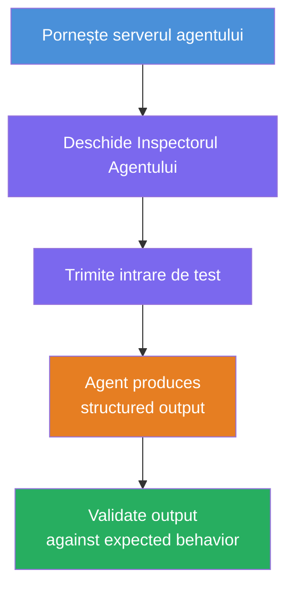
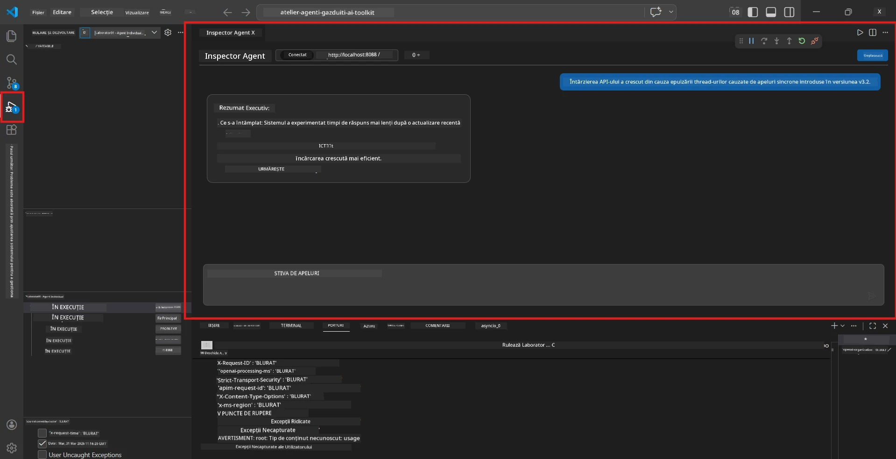
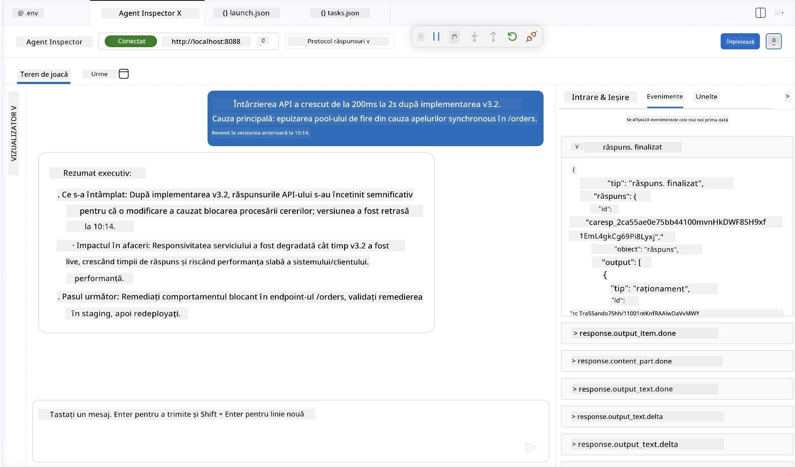

# Modulul 4 - Testare Locală

⏱️ ~10 min

În acest modul, îți rulezi agentul local și validezi că funcționează corect folosind **teste funcționale în flux normal**. Vei folosi Agent Inspector (interfață vizuală) sau apeluri HTTP directe pentru a confirma că agentul produce răspunsuri structurate și precise.

### Fluxul testării locale



---

## Opțiunea 1: Apasă F5 - Debug cu Agent Inspector (recomandat)

### Pornește debugger-ul

1. Deschide folderul **executive-summary-agent/** direct în VS Code (`File → Open Folder`).
2. Deschide panoul **Run and Debug** (`Ctrl+Shift+D`).
3. Selectează **Debug Local Agent Server** din meniul derulant.
4. Apasă **F5** (sau click pe ▶ Start Debugging).

> ⚠️ **Critic: Selectează interpretul Python**
> Dacă primești "ModuleNotFoundError" sau debugger-ul nu pornește, trebuie să spui VS Code să folosească mediul tău virtual:
  > 1. Apasă `Ctrl+Shift+P` $\rightarrow$ tastează **Python: Select Interpreter**.
  > 2. Selectează interpretul aflat în folderul `.venv` al proiectului (ex., `.\.venv\Scripts\python.exe` pe Windows).
  > 3. Reporneste sesiunea de debug.
> Dacă încă ai erori, actualizează manual fișierul `tasks.json` astfel:
  > 1. Navighează la fișierul `.vscode/tasks.json`
  > 2. Găsește comanda etichetată: `Run Agent/Workflow HTTP Server`
  > 3. Actualizează valoarea comenzii astfel: `"value": "${workspaceFolder}/.venv/bin/python",`

### Ce se întâmplă

1. Serverul HTTP pornește pe `http://localhost:8088/responses`.
2. Panoul **Agent Inspector** se deschide automat - o interfață vizuală de chat pentru testare.
3. Breakpoint-urile sunt activate în `main.py`.

Urmărește Terminalul pentru:
```
Starting executive summary hosted agent
Executive agent server running on http://localhost:8088
```

> **Dacă Agent Inspector nu se deschide:** Apasă `Ctrl+Shift+P` → **Foundry Toolkit: Open Agent Inspector**.



> *Captura de ecran poate afișa branding mai vechi 'AI TOOLKIT' dintr-o versiune anterioară a extensiei.*

---

## Opțiunea 2: Testare prin Terminal (alternativ)

Pornește agentul într-un terminal, trimite cereri din altul:

```bash
# Terminal 1: Porniți agentul
cd executive-summary-agent/
source .venv/bin/activate
python main.py
```

```bash
# Terminal 2: Trimite test (curl)
curl -sS -X POST http://localhost:8088/responses \
  -H "Content-Type: application/json" \
  -d '{"input": "The API latency increased due to thread pool exhaustion caused by sync calls in v3.2.", "stream": false}'
```

---

## Teste de scenariu: Validare funcțională în flux normal

Rulează **toate cele trei** scenarii de mai jos. Acestea validează că agentul tău produce un output corect, structurat pentru intrări realiste.



### Scenariul 1: Incident IT - creștere a latenței API

**Intrare:**
```
The API latency increased from 200ms to 2s after deploying v3.2.
Root cause: thread pool starvation from synchronous calls in /orders.
Rolled back at 10:14.
```

**Comportament așteptat:**
- ✅ Urmează structura "Executive Summary" (Ce s-a întâmplat / Impact asupra afacerii / Pasul următor)
- ✅ Fără jargon tehnic (fără "thread pool", fără "/orders", fără "v3.2")
- ✅ Menționează clar impactul asupra afacerii (ex., utilizatorii au experimentat întârzieri)
- ✅ Include un pas următor (ex., remediere implementată, monitorizare activă)

---

### Scenariul 2: Pipeline de date - eșec ETL

**Intrare:**
```
The nightly ETL job failed because the upstream schema changed. APAC dashboards show missing data.
```

**Comportament așteptat:**
- ✅ Rezumă eșecul la reîmprospătarea datelor în limbaj clar
- ✅ Menționează impactul asupra dashboard-ului din APAC
- ✅ Include un pas de remediere
- ✅ NU menționează termeni de tip "ETL", "schema" sau alți termeni tehnici

---

### Scenariul 3: Securitate - Credential expus

**Intrare:**
```
Static analysis flagged a hardcoded secret in the repository.
The secret may have been exposed in commit history.
```

**Comportament așteptat:**
- ✅ Descrie o problemă de credential/securitate într-un limbaj accesibil pentru executivi
- ✅ Evidențiază riscul potențial (acces neautorizat)
- ✅ Indică acțiunea de remediere (rotirea credentialului, audit)
- ✅ NU include termeni ca "static analysis", "commit history" sau "hardcoded"

---

## Criterii de validare

Pentru fiecare scenariu, verifică:

| # | Criteriu | Condiție de trecere |
|---|----------|---------------------|
| 1 | **Structura** | Răspunsul folosește formatul "Executive Summary" cu toate cele trei puncte |
| 2 | **Limbaj clar** | Fără jargon tehnic pe care un executiv nu l-ar înțelege |
| 3 | **Acuratețe** | Rezumatul reflectă inputul - fără detalii inventate |
| 4 | **Concizie** | Răspunsul are sub 100 de cuvinte |
| 5 | **Pasul următor** | Este indicată o acțiune clară sau o măsură de atenuare |

---

## Sfaturi pentru depanare

| Problemă | Soluție |
|---------|---------|
| Agentul nu pornește | Verifică valorile din `.env`, asigură-te că mediul virtual este activat, rulează `pip install -r requirements.txt` |
| Răspuns gol sau generic | Revizuiește instrucțiunile din `main.py` - asigură-te că formatul de output este specificat |
| Răspunsul conține jargon | Întărește regulile de "eliminare a termenilor tehnici" în instrucțiuni |
| Agent Inspector nu se deschide | `Ctrl+Shift+P` → **Foundry Toolkit: Open Agent Inspector** |
| Erori de model în Terminal | Verifică că `AZURE_AI_MODEL_DEPLOYMENT_NAME` se potrivește exact (sensitive la majuscule) |

---

### ✅ Punct de control

- [ ] Agentul pornește local fără erori
- [ ] Agent Inspector se deschide și afișează o interfață de chat (dacă folosești F5)
- [ ] **Scenariul 1** (incident IT) - Executive Summary structurat, fără jargon
- [ ] **Scenariul 2** (pipeline date) - rezumat relevant cu impact asupra afacerii
- [ ] **Scenariul 3** (alertă de securitate) - comunicare adecvată a riscului
- [ ] Toate răspunsurile urmează structura de output definită

> **Salvează răspunsurile tale** (copie sau captură de ecran) - le vei compara cu rezultatele din cloud în Modulul 06.

---

**Anterior:** [03 - Configurează & Codează](03-configure-and-code.md) · **Următor:** [05 - Deploy în Foundry →](05-deploy-to-foundry.md)

---

<!-- CO-OP TRANSLATOR DISCLAIMER START -->
**Declinare a responsabilității**:
Acest document a fost tradus folosind serviciul de traducere AI [Co-op Translator](https://github.com/Azure/co-op-translator). În timp ce ne străduim pentru acuratețe, vă rugăm să rețineți că traducerile automate pot conține erori sau inexactități. Documentul original în limba sa nativă trebuie considerat sursa autorizată. Pentru informații critice, se recomandă traducerea profesională realizată de un om. Nu ne asumăm responsabilitatea pentru eventualele neînțelegeri sau interpretări greșite care decurg din utilizarea acestei traduceri.
<!-- CO-OP TRANSLATOR DISCLAIMER END -->