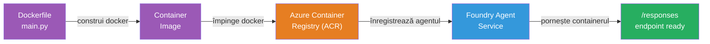
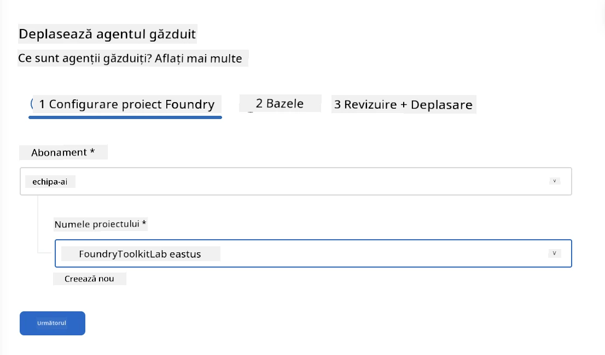
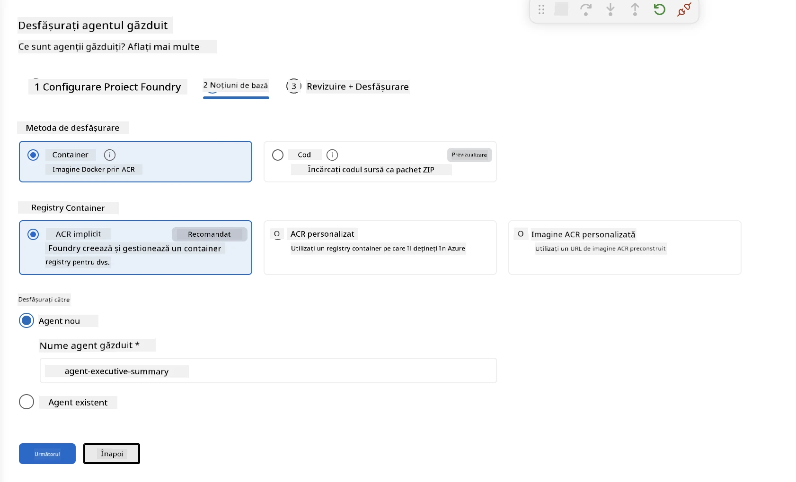
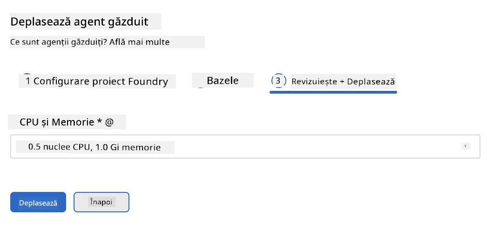
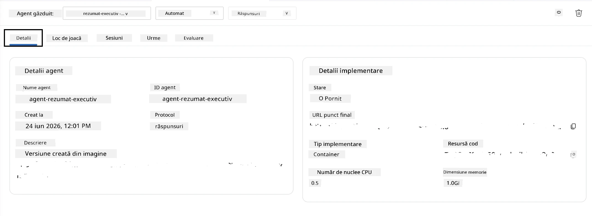

# Modulul 5 - Implementare în serviciul Foundry Agent

⏱️ ~10 minute

> ⚠️ **Utilizatorii traseului B:** Acest modul necesită un abonament Foundry. Dacă folosiți Foundry Local, săriți la [Modulul 07 - Rezumat](07-summary.md). Ați finalizat cu succes fluxul de dezvoltare locală!

În acest modul, implementați agentul testat local pe Microsoft Foundry ca **Agent găzduit**. Implementarea construiește o imagine de container, o împinge în Azure Container Registry și pornește agentul în infrastructura gestionată de Foundry.

### Fluxul de implementare

---

## Verificarea prerechizitelor

Înainte de implementare, verificați:

- [ ] Agentul trece toate cele 3 scenarii locale din [Modulul 04](04-test-locally.md)
- [ ] Aveți rolul **Azure AI User** la nivel de proiect ([Modulul 01, Atribuire RBAC](01-setup.md#deploy-a-model--assign-rbac))
- [ ] Sunteți autentificat în Azure în VS Code (pictograma conturilor afișează numele dvs.)

---

## Pasul 1: Porniți implementarea

### Opțiunea A: Implementați din Agent Inspector (recomandat)

Dacă Agent Inspector este deschis (din testare):
1. Faceți clic pe butonul **Deploy** din colțul dreapta sus (pictograma nor ↑).

### Opțiunea B: Implementați din Command Palette

1. Apăsați `Ctrl+Shift+P` → **Foundry Toolkit: Deploy Hosted Agent**.

---

## Pasul 2: Configurați implementarea

Magicianul vă solicită:

| Solicitare | Selecție |
|--------|-----------|
| **Abonament** | Abonamentul dvs. Azure |
| **Proiect țintă** | Proiectul dvs. Foundry (de ex., `workshop-agents`) |

Faceți clic pe **următorul** pentru a vă configura agentul.

| Solicitare | Selecție |
|--------|-----------|
| **Metodă de implementare** | Container |
| **Registru container** | **ACR implicit** (Microsoft Foundry creează și gestionează unul pentru dvs.) |
| **Implementați la** | Agent nou (nume, `executive-summary-agent`) |

Faceți clic pe **următorul** pentru a revizui și implementa agentul.

| Solicitare | Selecție |
|--------|-----------|
| **CPU și memorie** | **0.25 nuclee CPU, 0.5 Gi memorie** (suficient pentru workshop) |

---

## Pasul 3: Implementare și monitorizare

1. Faceți clic pe **Deploy**.
2. Urmăriți panoul **Output** (selectați **Microsoft Foundry** din lista derulantă).
3. Implementarea parcurge aceste etape:
   - **Docker build** - construiește containerul din Dockerfile-ul dvs.
   - **Docker push** - împinge imaginea în ACR (1–3 minute la prima implementare)
   - **Înregistrare agent** - creează agentul găzduit în Foundry
   - **Pornire container** - pornește cu identitate gestionată a sistemului

4. La finalizare, apare o notificare:
   > **my-agent a fost implementat cu succes.** `Vezi jurnale` `Rulează agentul`

5. Faceți clic pe **Run agent** pentru a deschide Agent Playground.

### Valori ale stării implementării

| Stare | Însemnătate |
|--------|---------|
| **Running** | Container gata, agentul răspunde |
| **Pending** | Container în pornire - așteptați 30–60 secunde |
| **Failed** | Verificați jurnalele (vedeți depanarea mai jos) |

---

## Erori comune la implementare

| Eroare | Cauză principală | Soluție |
|-------|-----------|-----|
| Permisiunea `agents/write` refuzată | Lipsă rolul **Azure AI User** la nivel de proiect | [Modulul 01, Atribuire RBAC](01-setup.md#deploy-a-model--assign-rbac) |
| Docker nu funcționează | Docker Desktop nu este pornit | Porniți Docker Desktop → verificați `docker info` |
| Autorizare ACR | Identitatea gestionată nu poate extrage imaginea | Vedeți [Modulul 08 - Depanare](08-troubleshooting.md) |

---

### ✅ Punct de control

- [ ] Implementarea finalizată fără erori
- [ ] Agentul apare sub **Hosted Agents (Preview)** în bara laterală Foundry
- [ ] Starea containerului afișează **Running**
- [ ] Tab-ul Agent Playground deschis afișând detalii agent și URL endpoint

---

**Anterior:** [04 - Testați local](04-test-locally.md) · **Următor:** [06 - Verificați în Playground →](06-verify-in-playground.md)

---

<!-- CO-OP TRANSLATOR DISCLAIMER START -->
**Declinare a responsabilității**:
Acest document a fost tradus folosind serviciul de traducere AI [Co-op Translator](https://github.com/Azure/co-op-translator). În timp ce ne străduim pentru acuratețe, vă rugăm să rețineți că traducerile automate pot conține erori sau inexactități. Documentul original în limba sa nativă trebuie considerat sursa autorizată. Pentru informații critice, se recomandă traducerea profesională realizată de un om. Nu ne asumăm responsabilitatea pentru eventualele neînțelegeri sau interpretări greșite care decurg din utilizarea acestei traduceri.
<!-- CO-OP TRANSLATOR DISCLAIMER END -->