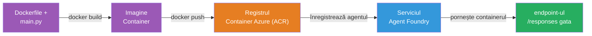
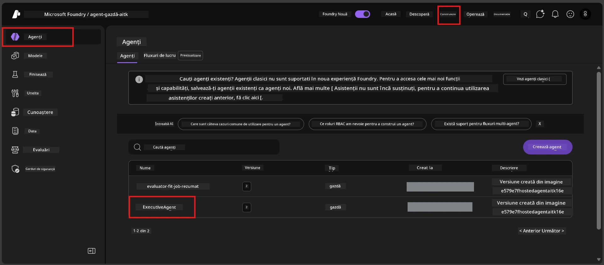

# Modulul 6 - Implementare în serviciul Foundry Agent

În acest modul, implementați agentul testat local în Microsoft Foundry ca un [**Agent găzduit**](https://learn.microsoft.com/azure/foundry/agents/concepts/hosted-agents). Procesul de implementare construiește o imagine Docker a containerului din proiectul dvs., o împinge către [Azure Container Registry (ACR)](https://learn.microsoft.com/azure/container-registry/container-registry-intro) și creează o versiune de agent găzduit în [Foundry Agent Service](https://learn.microsoft.com/azure/foundry/agents/overview).

### Pipeline-ul de implementare


---

## Verificarea condițiilor preliminare

Înainte de a implementa, verificați fiecare element de mai jos. Sări peste acestea este cea mai frecventă cauză a eșecurilor de implementare.

1. **Agentul trece testele rapide locale:**
   - Ați finalizat toate cele 4 teste din [Modulul 5](05-test-locally.md) și agentul a răspuns corect.

2. **Aveți rolul [Azure AI User](https://learn.microsoft.com/azure/foundry/concepts/rbac-foundry#built-in-roles):**
   - Acesta a fost atribuit în [Modulul 2, Pasul 3](02-create-foundry-project.md). Dacă nu sunteți sigur, verificați acum:
   - Portalul Azure → resursa **proiectului** Foundry → **Control acces (IAM)** → fila **Atribuiri roluri** → căutați numele dvs. → confirmați că este listat **Azure AI User**.

3. **Sunteți conectat la Azure în VS Code:**
   - Verificați icoana Conturi în colțul din stânga jos al VS Code. Numele contului dvs. ar trebui să fie vizibil.

4. **(Opțional) Docker Desktop este pornit:**
   - Docker este necesar doar dacă extensia Foundry vă solicită o compilare locală. În majoritatea cazurilor, extensia gestionează automat construirea containerului în timpul implementării.
   - Dacă aveți Docker instalat, verificați că rulează: `docker info`

---

## Pasul 1: Începeți implementarea

Aveți două moduri de a implementa - ambele conduc la același rezultat.

### Opțiunea A: Implementați din Agent Inspector (recomandat)

Dacă rulați agentul cu debugger-ul (F5) și Agent Inspector este deschis:

1. Uită-te în **colțul din dreapta sus** al panoului Agent Inspector.
2. Faceți clic pe butonul **Deploy** (pictogramă de nor cu o săgeată în sus ↑).
3. Se deschide expertul de implementare.

### Opțiunea B: Implementați din Command Palette

1. Apăsați `Ctrl+Shift+P` pentru a deschide **Command Palette**.
2. Tastați: **Microsoft Foundry: Deploy Hosted Agent** și selectați-l.
3. Se deschide expertul de implementare.

---

## Pasul 2: Configurați implementarea

Expertul de implementare vă ghidează prin configurare. Completați fiecare solicitare:

### 2.1 Selectați proiectul țintă

1. Un meniu derulant afișează proiectele Foundry.
2. Selectați proiectul creat în Modulul 2 (de ex., `workshop-agents`).

### 2.2 Selectați fișierul agentului container

1. Vi se va cere să selectați punctul de intrare al agentului.
2. Alegeți **`main.py`** (Python) - acesta este fișierul pe care expertul îl folosește pentru a identifica proiectul agentului.

### 2.3 Configurați resursele

| Setare | Valoare recomandată | Note |
|---------|--------------------|-------|
| **CPU** | `0.25` | Implicit, suficient pentru atelier. Creșteți pentru sarcini de producție |
| **Memorie** | `0.5Gi` | Implicit, suficient pentru atelier |

Aceste valori corespund celor din `agent.yaml`. Puteți accepta valorile implicite.

---

## Pasul 3: Confirmați și implementați

1. Expertul afișează un sumar al implementării cu:
   - Numele proiectului țintă
   - Numele agentului (din `agent.yaml`)
   - Fișierul container și resursele
2. Revizuiți sumarul și faceți clic pe **Confirm and Deploy** (sau **Deploy**).
3. Urmăriți progresul în VS Code.

### Ce se întâmplă în timpul implementării (pas cu pas)

Implementarea este un proces în mai mulți pași. Urmăriți panoul **Output** din VS Code (selectați „Microsoft Foundry” din meniul derulant) pentru a vedea detaliile:

1. **Construirea Docker** - VS Code construiește o imagine Docker a containerului din `Dockerfile`. Veți vedea mesaje despre straturile Docker:
   ```
   Step 1/6 : FROM python:<version>-slim
   Step 2/6 : WORKDIR /app
   ...
   Successfully built abc123def456
   ```

2. **Împingerea Docker** - Imaginea este împinsă către **Azure Container Registry (ACR)** asociat proiectului dvs. Foundry. Aceasta poate dura 1-3 minute la prima implementare (imaginea de bază este >100MB).

3. **Înregistrarea agentului** - Foundry Agent Service creează un agent găzduit nou (sau o versiune nouă dacă agentul există deja). Metadatele agentului din `agent.yaml` sunt utilizate.

4. **Pornirea containerului** - Containerul pornește în infrastructura gestionată de Foundry. Platforma atribuie o [identitate gestionată de sistem](https://learn.microsoft.com/azure/foundry/agents/concepts/agent-identity) și expune endpoint-ul `/responses`.

> **Prima implementare este mai lentă** (Docker trebuie să împingă toate straturile). Implementările ulterioare sunt mai rapide deoarece Docker păstrează în cache straturile neschimbate.

---

## Pasul 4: Verificați statusul implementării

După finalizarea comenzii de implementare:

1. Deschideți bara laterală **Microsoft Foundry** făcând clic pe pictograma Foundry din Activity Bar.
2. Extindeți secțiunea **Hosted Agents (Preview)** din cadrul proiectului dvs.
3. Ar trebui să vedeți numele agentului dvs. (de ex., `ExecutiveAgent` sau numele din `agent.yaml`).
4. **Faceți clic pe numele agentului** pentru a-l extinde.
5. Veți vedea una sau mai multe **versiuni** (de ex., `v1`).
6. Faceți clic pe versiune pentru a vedea **Detalii Container**.
7. Verificați câmpul **Status**:

   | Status | Semnificație |
   |--------|--------------|
   | **Started** sau **Running** | Container-ul rulează și agentul este gata |
   | **Pending** | Container-ul este în proces de pornire (așteptați 30-60 secunde) |
   | **Failed** | Container-ul nu a pornit (verificați jurnalul - vedeți depanarea de mai jos) |



> **Dacă vedeți "Pending" mai mult de 2 minute:** Container-ul poate fi în proces de descărcare a imaginii de bază. Așteptați puțin mai mult. Dacă rămâne în pending, verificați jurnalele containerului.

---

## Erori comune de implementare și remedieri

### Eroare 1: Permisiune refuzată - `agents/write`

```
Error: lacks the required data action 
Microsoft.CognitiveServices/accounts/AIServices/agents/write 
to perform POST /api/projects/{projectName}/assistants operation.
```

**Cauza principală:** Nu aveți rolul `Azure AI User` la nivel de **proiect**.

**Remediere pas cu pas:**

1. Deschideți [https://portal.azure.com](https://portal.azure.com).
2. În bara de căutare, tastați numele **proiectului** Foundry și faceți clic pe el.
   - **Important:** Asigurați-vă că navigați la resursa **proiectului** (tip: "Microsoft Foundry project"), NU la contul/punctul central părinte.
3. În meniul din stânga, faceți clic pe **Control acces (IAM)**.
4. Faceți clic pe **+ Add** → **Add role assignment**.
5. În fila **Role**, căutați [**Azure AI User**](https://learn.microsoft.com/azure/foundry/concepts/rbac-foundry#built-in-roles) și selectați-l. Faceți clic pe **Next**.
6. În fila **Members**, selectați **User, group, or service principal**.
7. Faceți clic pe **+ Select members**, căutați numele/emailul dvs., selectați-vă, faceți clic pe **Select**.
8. Faceți clic pe **Review + assign** → **Review + assign** din nou.
9. Așteptați 1-2 minute pentru propagarea atribuției rolului.
10. **Reîncercați implementarea** din Pasul 1.

> Rolul trebuie să fie la nivelul **proiectului**, nu doar la nivelul contului. Aceasta este cauza #1 cea mai frecventă a eșecurilor de implementare.

### Eroare 2: Docker nu rulează

```
Error: Docker build failed / Cannot connect to Docker daemon
```

**Remediere:**
1. Porniți Docker Desktop (găsiți-l în meniul Start sau în bara de sistem).
2. Așteptați să afișeze „Docker Desktop is running” (30-60 secunde).
3. Verificați: `docker info` într-un terminal.
4. **Specific Windows:** Asigurați-vă că backend-ul WSL 2 este activat în setările Docker Desktop → **General** → **Use the WSL 2 based engine**.
5. Reîncercați implementarea.

### Eroare 3: Autorizare ACR - `AcrPullUnauthorized`

```
Error: AcrPullUnauthorized
```

**Cauza principală:** Identitatea gestionată a proiectului Foundry nu are acces de tip pull la registry-ul de containere.

**Remediere:**
1. În Azure Portal, navigați la **[Container Registry](https://learn.microsoft.com/azure/container-registry/container-registry-intro)** (este în același grup de resurse cu proiectul dvs. Foundry).
2. Accesați **Control acces (IAM)** → **Add** → **Add role assignment**.
3. Selectați rolul **[AcrPull](https://learn.microsoft.com/azure/container-registry/container-registry-roles)**.
4. La Membri, selectați **Managed identity** → găsiți identitatea gestionată a proiectului Foundry.
5. **Review + assign**.

> Acest lucru este de obicei configurat automat de extensia Foundry. Dacă primiți această eroare, poate însemna că setarea automată a eșuat.

### Eroare 4: Necorespundere platformă container (Apple Silicon)

Dacă implementați de pe un Mac Apple Silicon (M1/M2/M3), containerul trebuie construit pentru `linux/amd64`:

```bash
docker build --platform linux/amd64 -t myagent:v1 .
```

> Extensia Foundry gestionează acest lucru automat pentru majoritatea utilizatorilor.

---

### Checkpoint

- [ ] Comanda de implementare s-a finalizat fără erori în VS Code
- [ ] Agentul apare sub **Hosted Agents (Preview)** în bara laterală Foundry
- [ ] Ați făcut clic pe agent → ați selectat o versiune → ați văzut **Detalii Container**
- [ ] Starea containerului arată **Started** sau **Running**
- [ ] (Dacă au apărut erori) Ați identificat eroarea, ați aplicat remedierea și ați reimplementat cu succes

---

**Anterior:** [05 - Testare locală](05-test-locally.md) · **Următor:** [07 - Verificare în Playground →](07-verify-in-playground.md)

---

<!-- CO-OP TRANSLATOR DISCLAIMER START -->
**Declinare a responsabilității**:  
Acest document a fost tradus folosind serviciul de traducere AI [Co-op Translator](https://github.com/Azure/co-op-translator). Deși ne străduim pentru acuratețe, vă rugăm să rețineți că traducerile automate pot conține erori sau inexactități. Documentul original în limba sa nativă trebuie considerat sursa autoritară. Pentru informații critice, se recomandă traducerea profesionistă realizată de un traducător uman. Nu ne asumăm răspunderea pentru eventualele neînțelegeri sau interpretări greșite rezultând din utilizarea acestei traduceri.
<!-- CO-OP TRANSLATOR DISCLAIMER END -->