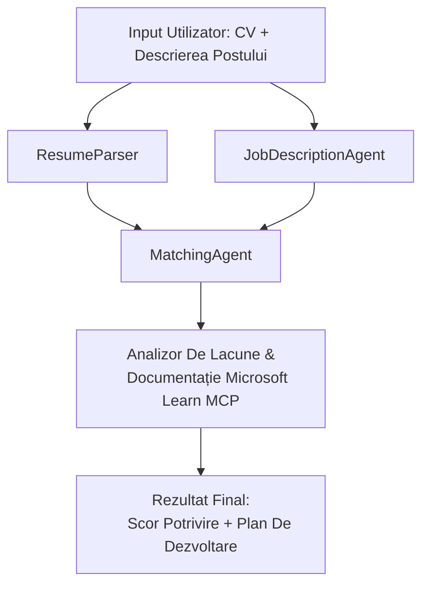

# PersonalCareerCopilot - Evaluator potrivire CV → job

Un flux de lucru multi-agent care evaluează cât de bine se potrivește un CV cu o descriere de job, apoi generează o foaie de parcurs personalizată de învățare pentru a acoperi lacunele.

---

## Agenți

| Agent | Rol | Unelte |
|-------|------|-------|
| **ResumeParser** | Extrage competențe structurate, experiență, certificări din textul CV-ului | - |
| **JobDescriptionAgent** | Extrage competențe necesare/preferate, experiență, certificări dintr-un JD | - |
| **MatchingAgent** | Compară profilul vs cerințe → scor de potrivire (0-100) + competențe potrivite/lipsite | - |
| **GapAnalyzer** | Construiește o foaie de parcurs personalizată de învățare cu resurse Microsoft Learn | `search_microsoft_learn_for_plan` (MCP) |

## Flux de lucru


---

## Pornire rapidă

### 1. Configurați mediul

```powershell
cd workshop\lab02-multi-agent\PersonalCareerCopilot
python -m venv .venv
.\.venv\Scripts\Activate.ps1          # Windows PowerShell
# source .venv/bin/activate            # macOS / Linux
pip install -r requirements.txt
```

### 2. Configurați credențialele

Copiați fișierul exemplu env și completați detaliile proiectului Foundry:

```powershell
cp .env.example .env
```

Editați `.env`:

```env
PROJECT_ENDPOINT=https://<your-account>.services.ai.azure.com/api/projects/<your-project>
MODEL_DEPLOYMENT_NAME=gpt-4.1-mini
```

| Valoare | Unde o găsiți |
|-------|-----------------|
| `PROJECT_ENDPOINT` | Bara laterală Microsoft Foundry în VS Code → click dreapta pe proiect → **Copy Project Endpoint** |
| `MODEL_DEPLOYMENT_NAME` | Bara laterală Foundry → extinde proiectul → **Models + endpoints** → numele implementării |

### 3. Rulați local

```powershell
python -m debugpy --listen 127.0.0.1:5679 -m agentdev run main.py --verbose --port 8088
```

Sau folosiți task-ul VS Code: `Ctrl+Shift+P` → **Tasks: Run Task** → **Run Lab02 HTTP Server**.

### 4. Testați cu Agent Inspector

Deschideți Agent Inspector: `Ctrl+Shift+P` → **Foundry Toolkit: Open Agent Inspector**.

Lipiți acest prompt de test:

```
Resume:
Jane Doe
Senior Software Engineer with 5 years of experience in Python, Django, and AWS.
Built microservices handling 10K+ requests/second. Led a team of 4 developers.
Certifications: AWS Solutions Architect Associate.
Education: B.S. Computer Science, State University.

Job Description:
Senior Cloud Engineer at Contoso Ltd.
Required: Python, Azure, Kubernetes, Terraform, CI/CD pipelines.
Preferred: Go, monitoring (Prometheus/Grafana), cost optimization.
Experience: 5+ years in cloud infrastructure.
Certifications: Azure Solutions Architect Expert preferred.
```

**Așteptat:** Un scor de potrivire (0-100), competențe potrivite/lipsite și o foaie de parcurs personalizată cu URL-uri Microsoft Learn.

### 5. Implementați în Foundry

`Ctrl+Shift+P` → **Microsoft Foundry: Deploy Hosted Agent** → selectați proiectul → confirmați.

---

## Structura proiectului

```
PersonalCareerCopilot/
├── .env.example        ← Template for environment variables
├── .env                ← Your credentials (git-ignored)
├── agent.yaml          ← Hosted agent definition (name, resources, env vars)
├── Dockerfile          ← Container image for Foundry deployment
├── main.py             ← 4-agent workflow (instructions, MCP tool, WorkflowBuilder)
└── requirements.txt    ← Python dependencies
```

## Fișiere cheie

### `agent.yaml`

Definește agentul găzduit pentru Foundry Agent Service:
- `kind: hosted` - rulează ca un container gestionat
- `protocols: [responses v1]` - expune endpoint-ul HTTP `/responses`
- `environment_variables` - `PROJECT_ENDPOINT` și `MODEL_DEPLOYMENT_NAME` sunt injectate la momentul implementării

### `main.py`

Conține:
- **Instrucțiuni Agent** - patru constante `*_INSTRUCTIONS`, câte una pentru fiecare agent
- **Unealtă MCP** - `search_microsoft_learn_for_plan()` apelează `https://learn.microsoft.com/api/mcp` prin HTTP Streamable
- **Crearea agentului** - manager de context `create_agents()` folosind `AzureAIAgentClient.as_agent()`
- **Graficul fluxului de lucru** - `create_workflow()` folosește `WorkflowBuilder` pentru a conecta agenții cu modele fan-out/fan-in/sequential
- **Pornirea serverului** - `from_agent_framework(agent).run_async()` pe portul 8088

### `requirements.txt`

| Pachet | Versiune | Scop |
|---------|---------|---------|
| `agent-framework-azure-ai` | `1.0.0rc3` | Integrare Azure AI pentru Microsoft Agent Framework |
| `agent-framework-core` | `1.0.0rc3` | Runtime core (include WorkflowBuilder) |
| `azure-ai-agentserver-agentframework` | `1.0.0b16` | Runtime server pentru agenți găzduiți |
| `azure-ai-agentserver-core` | `1.0.0b16` | Abstracții core server agenți |
| `debugpy` | latest | Debugging Python (F5 în VS Code) |
| `agent-dev-cli` | `--pre` | CLI dev local + backend Agent Inspector |

---

## Depanare

| Problemă | Soluție |
|-------|-----|
| `RuntimeError: Missing required environment variable(s)` | Creați `.env` cu `PROJECT_ENDPOINT` și `MODEL_DEPLOYMENT_NAME` |
| `ModuleNotFoundError: No module named 'agent_framework'` | Activați venv și rulați `pip install -r requirements.txt` |
| Lipsesc URL-uri Microsoft Learn în output | Verificați conexiunea la internet către `https://learn.microsoft.com/api/mcp` |
| Doar 1 card gap (trunchiat) | Verificați că `GAP_ANALYZER_INSTRUCTIONS` conține blocul `CRITICAL:` |
| Port 8088 ocupat | Opriți alte servere: `netstat -ano \| findstr :8088` |

Pentru depanare detaliată, consultați [Modulul 8 - Depanare](../docs/08-troubleshooting.md).

---

**Parcurs complet:** [Lab 02 Docs](../docs/README.md) · **Înapoi la:** [Lab 02 README](../README.md) · [Pagina principală workshop](../../../README.md)

---

<!-- CO-OP TRANSLATOR DISCLAIMER START -->
**Declinare de responsabilitate**:
Acest document a fost tradus folosind serviciul de traducere AI [Co-op Translator](https://github.com/Azure/co-op-translator). Deși ne străduim pentru acuratețe, vă rugăm să rețineți că traducerile automate pot conține erori sau inexactități. Documentul original în limba sa nativă trebuie considerat sursa autoritară. Pentru informații critice, se recomandă traducerea profesională realizată de un traducător uman. Nu ne asumăm responsabilitatea pentru orice neînțelegeri sau interpretări greșite care rezultă din utilizarea acestei traduceri.
<!-- CO-OP TRANSLATOR DISCLAIMER END -->