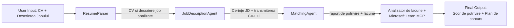

# PersonalCareerCopilot - Evaluator Compatibilitate CV → Job

O aplicație multi-agent orientată pe workflow care evaluează cât de bine se potrivește un CV cu o descriere a postului, apoi generează un plan de învățare personalizat pentru a acoperi golurile.

---

## Agenți

| Agent | Rol | Unelte |
|-------|------|-------|
| **ResumeParser** | Extrage competențe structurate, experiență, certificări din textul CV-ului | - |
| **JobDescriptionAgent** | Extrage competențe, experiență, certificări necesare/preferate dintr-o descriere a postului (JD) | - |
| **MatchingAgent** | Compară profilul cu cerințele → scor compatibilitate (0-100) + competențe potrivite/lipsă | - |
| **GapAnalyzer** | Construiește un plan personalizat de învățare cu resurse Microsoft Learn | `search_microsoft_learn_for_plan` (MCP) |

## Workflow


```mermaid
flowchart LR
    UserInput["User Input: CV + Descrierea Jobului"] --> ResumeParser
    ResumeParser -- "CV și descriere job analizate" --> JobDescriptionAgent
    JobDescriptionAgent -- "Cerințe JD + transmiterea CV-ului" --> MatchingAgent
    MatchingAgent -- "raport de potrivire + lacune" --> GapAnalyzerMCP["Analizator de lacune +\nMicrosoft Learn MCP"]
    GapAnalyzerMCP --> FinalOutput["Final Output:\nScor de potrivire + Plan de parcurs"]
```

---

## Pornire rapidă

### 1. Configurează mediul

Acest folder este implementarea de referință pentru scheletul bazat pe workflow al Laboratorului 02. `main.py` folosește blocurile de prompt existente plus `WorkflowBuilder` pentru a conecta cei patru agenți.

```powershell
cd workshop\lab02-multi-agent\PersonalCareerCopilot
python -m venv .venv
.\.venv\Scripts\Activate.ps1          # Windows PowerShell
# source .venv/bin/activate            # macOS / Linux
pip install -r requirements.txt
```

### 2. Configurează credențialele

Creează un fișier `.env` în acest folder:

```powershell
copy .env .env.bak 2>$null; echo $null > .env
```

Editează `.env`:

```env
FOUNDRY_PROJECT_ENDPOINT=https://<your-account>.services.ai.azure.com/api/projects/<your-project>
AZURE_AI_MODEL_DEPLOYMENT_NAME=gpt-4.1-mini
```

| Valoare | Unde o găsești |
|-------|------------------|
| `FOUNDRY_PROJECT_ENDPOINT` | Bara laterală Foundry Toolkit → click dreapta pe proiect → **Copy Project Endpoint** |
| `AZURE_AI_MODEL_DEPLOYMENT_NAME` | Bara laterală Foundry → extinde proiectul → **Models + endpoints** → numele implementării |

### 3. Rulează local

```powershell
python -m debugpy --listen 127.0.0.1:5679 main.py --port 8088
```

Sau folosește task-ul VS Code: `Ctrl+Shift+P` → **Tasks: Run Task** → **Run Agent HTTP Server**.

Pentru depanare cu F5, folosește **Debug Local Agent HTTP Server**.

### 4. Testează cu Agent Inspector

Deschide Agent Inspector: `Ctrl+Shift+P` → **Foundry Toolkit: Open Agent Inspector**.

Lipește acest prompt de test:

```
Resume:
Jane Doe
Senior Software Engineer with 5 years of experience in Python, Django, and AWS.
Built microservices handling 10K+ requests/second. Led a team of 4 developers.
Certifications: AWS Solutions Architect Associate.
Education: B.S. Computer Science, State University.

Job Description:
Senior Cloud Engineer at Contoso Ltd.
Required: Python, Azure, Kubernetes, Terraform, CI/CD pipelines.
Preferred: Go, monitoring (Prometheus/Grafana), cost optimization.
Experience: 5+ years in cloud infrastructure.
Certifications: Azure Solutions Architect Expert preferred.
```

**Așteptat:** Un scor de potrivire (0-100), competențe potrivite/lipsă, și un plan de învățare personalizat cu URL-uri Microsoft Learn.

### 5. Desfășoară pe Foundry

`Ctrl+Shift+P` → **Foundry Toolkit: Deploy Hosted Agent** → selectează proiectul → confirmă.

---

## Structura proiectului

```
PersonalCareerCopilot/
├── .env                ← Your credentials (git-ignored)
├── agent.yaml          ← Hosted agent definition (name, resources, env vars)
├── Dockerfile          ← Container image for Foundry deployment
├── main.py             ← 4-agent workflow (instructions, MCP tool, WorkflowBuilder)
└── requirements.txt    ← Python dependencies
```

## Fișiere cheie

### `agent.yaml`

Definește agentul găzduit pentru Foundry Agent Service:
- `kind: hosted` - rulează ca un container gestionat
- `protocols` - protocol `responses` cu `version: 1.0.0`, expune endpoint HTTP `/responses`
- `environment_variables` - `AZURE_AI_MODEL_DEPLOYMENT_NAME` este declarat aici; `FOUNDRY_PROJECT_ENDPOINT` este injectat automat la momentul desfășurării

### `main.py`

Conține:
- **Instrucțiuni pentru agenți** - patru constante `*_INSTRUCTIONS`, câte una per agent
- **Unealtă MCP** - `search_microsoft_learn_for_plan()` apelează `https://learn.microsoft.com/api/mcp` prin Streamable HTTP
- **Crearea agenților** - patru instanțe `Agent()` + `AgentExecutor()` care folosesc un singur `FoundryChatClient`
- **Grafic workflow** - `WorkflowBuilder` leagă agenții într-un pipeline secvențial: ResumeParser → JD Agent → MatchingAgent → GapAnalyzer
- **Pornire server** - `ResponsesHostServer` rulează pe portul 8088

### `requirements.txt`

| Pachet | Scop |
|---------|----------|
| `agent-framework-foundry` | Runtime de bază: `Agent`, `AgentExecutor`, `WorkflowBuilder`, `@tool`, `FoundryChatClient` |
| `agent-framework-foundry-hosting` | `ResponsesHostServer` + integrare hosting Foundry |
| `mcp<2,>=1.24.0` | Client MCP pentru GapAnalyzer (`streamable_http_client`) |
| `debugpy` | Depanare Python (F5 în VS Code) |

---

## Depanare

| Problemă | Soluție |
|-------|-----|
| `KeyError: 'FOUNDRY_PROJECT_ENDPOINT'` sau `KeyError: 'AZURE_AI_MODEL_DEPLOYMENT_NAME'` | Creează `.env` cu ambele variabile `FOUNDRY_PROJECT_ENDPOINT` și `AZURE_AI_MODEL_DEPLOYMENT_NAME` setate |
| `ModuleNotFoundError: No module named 'agent_framework'` | Activează mediul virtual și rulează `pip install -r requirements.txt` |
| Fără URL-uri Microsoft Learn în output | Verifică conexiunea la internet către `https://learn.microsoft.com/api/mcp` |
| Doar un card de gap (trunchiat) | Verifică că `GAP_ANALYZER_INSTRUCTIONS` include blocul `CRITICAL:` |
| Portul 8088 este ocupat | Oprește alte servere: `netstat -ano \| findstr :8088` |

Pentru depanare detaliată, vezi [Module 8 - Troubleshooting](../docs/08-troubleshooting.md).

---

**Parcurgere completă:** [Lab 02 Docs](../docs/README.md) · **Înapoi la:** [Lab 02 README](../README.md) · [Acasă Workshop](../../../README.md)

---

<!-- CO-OP TRANSLATOR DISCLAIMER START -->
**Declinare a responsabilității**:
Acest document a fost tradus folosind serviciul de traducere AI [Co-op Translator](https://github.com/Azure/co-op-translator). În timp ce ne străduim pentru acuratețe, vă rugăm să rețineți că traducerile automate pot conține erori sau inexactități. Documentul original în limba sa nativă trebuie considerat sursa autorizată. Pentru informații critice, se recomandă traducerea profesională realizată de un om. Nu ne asumăm responsabilitatea pentru eventualele neînțelegeri sau interpretări greșite care decurg din utilizarea acestei traduceri.
<!-- CO-OP TRANSLATOR DISCLAIMER END -->