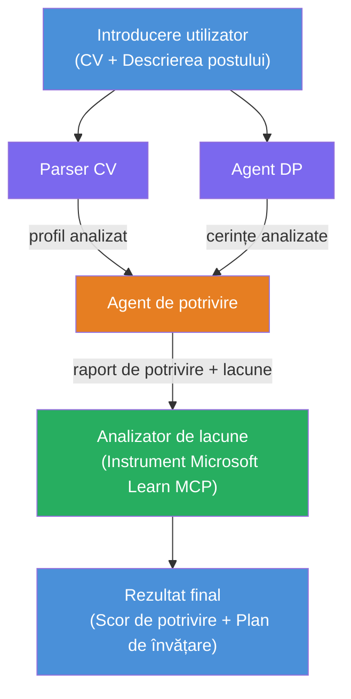

# Lab 02 - Flux de lucru multi-agent: Evaluator CV → Potrivire Job

---

## Ce vei construi

Un **Evaluator CV → Potrivire Job** - un flux de lucru multi-agent în care patru agenți specializați colaborează pentru a evalua cât de bine se potrivește CV-ul unui candidat cu o descriere a jobului, apoi generează o foaie de parcurs personalizată de învățare pentru a acoperi lacunele.

### Agenții

| Agent | Rol |
|-------|------|
| **Resume Parser** | Extrage abilități structurate, experiență, certificări din textul CV-ului |
| **Job Description Agent** | Extrage abilități necesare/preferate, experiență, certificări dintr-o descriere de job |
| **Matching Agent** | Compară profilul vs cerințe → scor potrivire (0-100) + abilități potrivite/lipsă |
| **Gap Analyzer** | Construiește o foaie de parcurs personalizată de învățare cu resurse, termene și proiecte rapide |

### Flux demonstrație

Încarcă un **CV + descriere job** → obține un **scor de potrivire + abilități lipsă** → primește o **foaie de parcurs personalizată de învățare**.

### Arhitectura fluxului de lucru

> Mov = agenți paraleli | Portocaliu = punct de agregare | Verde = agent final cu unelte. Vezi [Modul 1 - Înțelegerea Arhitecturii](docs/01-understand-multi-agent.md) și [Modul 4 - Modele de Orchestrare](docs/04-orchestration-patterns.md) pentru diagrame detaliate și fluxul de date.

### Subiecte acoperite

- Crearea unui flux de lucru multi-agent folosind **WorkflowBuilder**
- Definirea rolurilor agenților și a fluxului de orchestrare (paralel + secvențial)
- Modele de comunicare între agenți
- Testare locală cu Agent Inspector
- Implementarea fluxurilor multi-agent în Foundry Agent Service

---

## Precondiții

Completează mai întâi Lab 01:

- [Lab 01 - Agent Unic](../lab01-single-agent/README.md)

---

## Începe acum

Vezi instrucțiunile complete de configurare, parcurgerea codului și comenzile de test în:

- [Lab 2 Docs - Precondiții](docs/00-prerequisites.md)
- [Lab 2 Docs - Parcurs complet de învățare](docs/README.md)
- [Ghid de rulare PersonalCareerCopilot](PersonalCareerCopilot/README.md)

## Modele de orchestrare (alternative agentice)

Lab 2 include fluxul implicit **paralel → agregator → planificator**, iar documentația
descrie și modele alternative pentru a demonstra un comportament agentic mai puternic:

- **Fan-out/Fan-in cu consens ponderat**
- **Trecere de revizuire/critic înainte de foaia de parcurs finală**
- **Router condițional** (selectarea traseului bazată pe scorul de potrivire și abilitățile lipsă)

Vezi [docs/04-orchestration-patterns.md](docs/04-orchestration-patterns.md).

---

**Anterior:** [Lab 01 - Agent Unic](../lab01-single-agent/README.md) · **Înapoi la:** [Pagina Principală Workshop](../../README.md)

---

<!-- CO-OP TRANSLATOR DISCLAIMER START -->
**Declinare a responsabilității**:
Acest document a fost tradus folosind serviciul de traducere AI [Co-op Translator](https://github.com/Azure/co-op-translator). Deși ne străduim pentru acuratețe, vă rugăm să rețineți că traducerile automate pot conține erori sau inexactități. Documentul original în limba sa nativă trebuie considerat sursa autorizată. Pentru informații critice, se recomandă traducerea profesională umană. Nu ne asumăm responsabilitatea pentru eventualele neînțelegeri sau interpretări greșite rezultate din utilizarea acestei traduceri.
<!-- CO-OP TRANSLATOR DISCLAIMER END -->