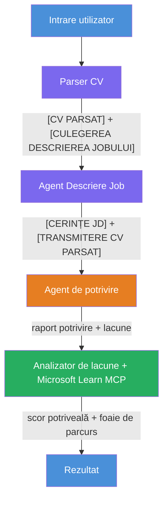

# Laborator 02 - Flux de lucru multi-agent: Evaluator de potrivire CV → job

## Prezentare generală

În acest laborator practic, vei construi o **aplicație multi-agent bazată pe flux de lucru** folosind Foundry Toolkit în VS Code și o vei implementa în Microsoft Foundry Agent Service.

**Ce vei construi:** un Evaluator CV → potrivire job care analizează un CV și o descriere a jobului, evaluează potrivirea și generează o foaie de parcurs personalizată de învățare folosind resurse Microsoft Learn.

---

## Arhitectură

```mermaid
flowchart TD
    A["Intrare utilizator"] --> B["Parser CV"]
    B -->|"[CV PARSAT] + [CULEGEREA DESCRIEREA JOBULUI]"| C["Agent Descriere Job"]
    C -->|"[CERINȚE JD] + [TRANSMITERE CV PARSAT]"| D["Agent de potrivire"]
    D -->|raport potrivire + lacune| E["Analizator de lacune + Microsoft Learn MCP"]
    E -->|scor potriveală + foaie de parcurs| F["Rezultat"]

    style A fill:#4A90D9,color:#fff
    style B fill:#7B68EE,color:#fff
    style C fill:#7B68EE,color:#fff
    style D fill:#E67E22,color:#fff
    style E fill:#27AE60,color:#fff
    style F fill:#4A90D9,color:#fff
```

**Cum funcționează:**
1. Utilizatorul lipește un CV și o descriere a jobului.
2. **ResumeParser** analizează CV-ul și copiază verbatim descrierea jobului într-o secțiune `[JOB DESCRIPTION PASS-THROUGH]`.
3. **JD Agent** extrage cerințe structurate din pas-through, apoi transmite mai departe `[PARSED RESUME]` ca `[PARSED RESUME PASS-THROUGH]`.
4. **MatchingAgent** compară `[PARSED RESUME PASS-THROUGH]` cu `[JD REQUIREMENTS]` și produce un scor de potrivire.
5. **GapAnalyzer** transformă lacunele într-o foaie de parcurs practică și preia linkuri reale Microsoft Learn prin MCP.

---

## Cerințe preliminare

Finalizează mai întâi Laboratorul 01:

- [Laborator 01 - Agent unic](../lab01-single-agent/README.md)

---

## Partea 1: Citește modulele în ordine

Vezi calea completă de învățare în:

- [Documentația Laboratorului 2 - Cerințe preliminare](docs/00-prerequisites.md)
- [Documentația Laboratorului 2 - Calea completă de învățare](docs/README.md)
- [Ghidul de rulare PersonalCareerCopilot](PersonalCareerCopilot/README.md)

---

## Partea 2: Construiește și testează fluxul de lucru

1. Folosește wizard-ul Foundry Toolkit pentru a crea structura proiectului bazat pe flux de lucru.
2. Copiază blocurile de prompt și graficul fluxului de lucru din `PersonalCareerCopilot/main.py` în spațiul tău de lucru.
3. Rulează local cu Agent Inspector și verifică toți cei patru agenți plus instrumentul MCP.
4. Realizează deploy agentului găzduit pe Foundry după ce testarea locală este reușită.

---

## Modele de orchestrare

Laboratorul 02 include fluxul implicit **fan-out → fan-in → secvențial**, iar documentația descrie și modele alternative de orchestrare pentru experimentare.

- **Fan-out/Fan-in cu consens ponderat**
- **Trecere prin recenzor/critic înaintea foii finale de parcurs**
- **Router condiționat** pe baza scorului de potrivire și a competențelor lipsă

Vezi [docs/04-orchestration-patterns.md](docs/04-orchestration-patterns.md).

---

**Anterior:** [Laborator 01 - Agent unic](../lab01-single-agent/README.md) · **Înapoi la:** [Acasă Workshop](../../README.md)

---

<!-- CO-OP TRANSLATOR DISCLAIMER START -->
**Declinare a responsabilității**:
Acest document a fost tradus folosind serviciul de traducere AI [Co-op Translator](https://github.com/Azure/co-op-translator). În timp ce ne străduim pentru acuratețe, vă rugăm să rețineți că traducerile automate pot conține erori sau inexactități. Documentul original în limba sa nativă trebuie considerat sursa autorizată. Pentru informații critice, se recomandă traducerea profesională realizată de un om. Nu ne asumăm responsabilitatea pentru eventualele neînțelegeri sau interpretări greșite care decurg din utilizarea acestei traduceri.
<!-- CO-OP TRANSLATOR DISCLAIMER END -->