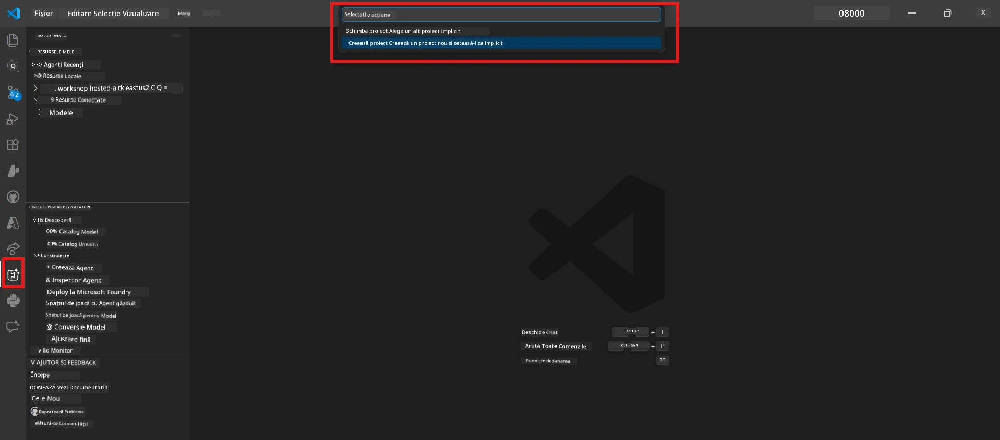

# Modulul 0 - Cerințe prealabile

Înainte de a începe Lab 02, confirmă că ai finalizat următoarele. Acest laborator se bazează direct pe Lab 01 - nu sări peste acesta.

---

## 1. Finalizează Lab 01

Lab 02 presupune că deja ai:

- [x] Finalizat toate cele 8 module din [Lab 01 - Agentul Unic](../../lab01-single-agent/README.md)
- [x] Implementat cu succes un agent unic în Foundry Agent Service
- [x] Verificat că agentul funcționează atât în Agent Inspector local, cât și în Foundry Playground

Dacă nu ai finalizat Lab 01, întoarce-te și termină-l acum: [Documentația Lab 01](../../lab01-single-agent/docs/00-prerequisites.md)

---

## 2. Verifică configurația existentă

Toate uneltele din Lab 01 ar trebui să fie încă instalate și funcționale. Rulează aceste verificări rapide:

### 2.1 Azure CLI

```powershell
az account show --query "{name:name, id:id}" --output table
```

Așteptat: Afișează numele și ID-ul abonamentului tău. Dacă eșuează, rulează [`az login`](https://learn.microsoft.com/cli/azure/authenticate-azure-cli-interactively).

### 2.2 Extensii VS Code

1. Apasă `Ctrl+Shift+P` → tastează **"Microsoft Foundry"** → confirmă că vezi comenzi (de exemplu, `Microsoft Foundry: Create a New Hosted Agent`).
2. Apasă `Ctrl+Shift+P` → tastează **"Foundry Toolkit"** → confirmă că vezi comenzi (de exemplu, `Foundry Toolkit: Open Agent Inspector`).

### 2.3 Proiect și model Foundry

1. Dă click pe iconița **Microsoft Foundry** din bara de activități VS Code.
2. Confirmă că proiectul tău este listat (exemplu: `workshop-agents`).
3. Extinde proiectul → verifică dacă există un model implementat (exemplu: `gpt-4.1-mini`) cu status **Succeeded**.

> **Dacă implementarea modelului tău a expirat:** Unele implementări gratuite se încheie automat. Reimplementează din [Model Catalog](https://learn.microsoft.com/azure/foundry/foundry-models/concepts/models-sold-directly-by-azure) (`Ctrl+Shift+P` → **Microsoft Foundry: Open Model Catalog**).



### 2.4 Roluri RBAC

Verifică că ai rolul **Azure AI User** pe proiectul tău Foundry:

1. [Azure Portal](https://portal.azure.com) → resursa proiectului tău Foundry → **Access control (IAM)** → fila **[Role assignments](https://learn.microsoft.com/azure/foundry/concepts/rbac-foundry)**.
2. Caută numele tău → confirmă că este listat **[Azure AI User](https://aka.ms/foundry-ext-project-role)**.

---

## 3. Înțelege conceptele multi-agent (noi pentru Lab 02)

Lab 02 introduce concepte care nu au fost acoperite în Lab 01. Parcurge-le înainte de a continua:

### 3.1 Ce este un flux multi-agent?

În loc ca un singur agent să se ocupe de tot, un **flux multi-agent** împarte munca între mai mulți agenți specializați. Fiecare agent are:

- Propriile **instrucțiuni** (prompt sistem)
- Propria **rolă** (ce responsabilitate are)
- Opționale **unelte** (funcții pe care le poate apela)

Agenții comunică printr-un **grafic de orchestrare** care definește cum circulă datele între ei.

### 3.2 WorkflowBuilder

Clasa [`WorkflowBuilder`](https://learn.microsoft.com/agent-framework/workflows/agents-in-workflows) din `agent_framework` este componenta SDK care conectează agenții împreună:

```python
from agent_framework import WorkflowBuilder

workflow = (
    WorkflowBuilder(
        name="MyWorkflow",
        start_executor=agent_a,
        output_executors=[agent_d],
    )
    .add_edge(agent_a, agent_b)
    .add_edge(agent_a, agent_c)
    .add_edge(agent_b, agent_d)
    .add_edge(agent_c, agent_d)
    .build()
)
```

- **`start_executor`** - Primul agent care primește intrarea de la utilizator
- **`output_executors`** - Agentul/agenții a căror ieșire devine răspunsul final
- **`add_edge(source, target)`** - Definește că `target` primește ieșirea lui `source`

### 3.3 Unelte MCP (Model Context Protocol)

Lab 02 folosește o unealtă **MCP** care apelează API-ul Microsoft Learn pentru a prelua resurse de învățare. [MCP (Model Context Protocol)](https://modelcontextprotocol.io/introduction) este un protocol standardizat pentru conectarea modelelor AI la surse externe de date și unelte.

| Termen | Definiție |
|------|-----------|
| **server MCP** | Un serviciu care expune unelte/resurse prin [protocolul MCP](https://learn.microsoft.com/azure/foundry/agents/how-to/tools/model-context-protocol) |
| **client MCP** | Codul agentului tău care se conectează la un server MCP și apelează uneltele acestuia |
| **[Streamable HTTP](https://learn.microsoft.com/agent-framework/agents/tools/hosted-mcp-tools)** | Metoda de transport folosită pentru comunicarea cu serverul MCP |

### 3.4 Cum diferă Lab 02 de Lab 01

| Aspect | Lab 01 (Agent Unic) | Lab 02 (Multi-Agent) |
|--------|---------------------|----------------------|
| Agenți | 1 | 4 (roluri specializate) |
| Orchestrare | Niciuna | WorkflowBuilder (paralel + secvențial) |
| Unelte | Funcție opțională `@tool` | Unealtă MCP (apel API extern) |
| Complexitate | Prompt simplu → răspuns | CV + JD → scor potrivire → plan de parcurs |
| Flux context | Direct | Transfer agent-la-agent |

---

## 4. Structura depozitului de workshop pentru Lab 02

Asigură-te că știi unde sunt fișierele pentru Lab 02:

```
workshop/
└── lab02-multi-agent/
    ├── README.md                       ← Lab overview
    ├── docs/                           ← You are here
    │   ├── README.md                   ← Learning path index
    │   ├── 00-prerequisites.md         ← This file
    │   ├── 01-understand-multi-agent.md
    │   ├── ...
    │   └── 08-troubleshooting.md
    └── PersonalCareerCopilot/          ← The agent project
        ├── agent.yaml                  ← Agent definition
        ├── main.py                     ← 4-agent workflow code
        ├── Dockerfile                  ← Container configuration
        └── requirements.txt            ← Python dependencies
```

---

### Punct de verificare

- [ ] Lab 01 este complet finalizat (toate cele 8 module, agent implementat și verificat)
- [ ] `az account show` afișează abonamentul tău
- [ ] Extensiile Microsoft Foundry și Foundry Toolkit sunt instalate și funcționează
- [ ] Proiectul Foundry are un model implementat (exemplu: `gpt-4.1-mini`)
- [ ] Ai rolul **Azure AI User** pe proiect
- [ ] Ai citit secțiunea despre conceptele multi-agent de mai sus și înțelegi WorkflowBuilder, MCP și orchestrarea agenților

---

**Următorul:** [01 - Înțelege arhitectura Multi-Agent →](01-understand-multi-agent.md)

---

<!-- CO-OP TRANSLATOR DISCLAIMER START -->
**Declinare a responsabilității**:  
Acest document a fost tradus folosind serviciul de traducere AI [Co-op Translator](https://github.com/Azure/co-op-translator). Deși ne străduim pentru acuratețe, vă rugăm să rețineți că traducerile automate pot conține erori sau inexactități. Documentul original în limba sa nativă trebuie considerat sursa autorizată. Pentru informații critice, se recomandă traducerea profesională realizată de un traducător uman. Nu ne asumăm responsabilitatea pentru eventualele neînțelegeri sau interpretări greșite rezultate din utilizarea acestei traduceri.
<!-- CO-OP TRANSLATOR DISCLAIMER END -->