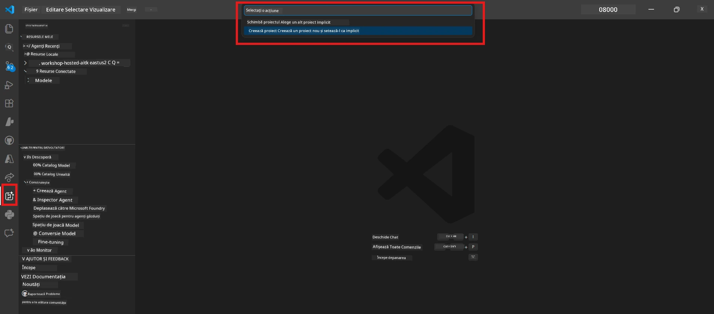

# Modul 0 - Introducere

⏱️ ~10 min

> [!WARNING]
> **Previzualizare și limitări:** [Agenții găzduiți](https://learn.microsoft.com/azure/foundry/agents/concepts/hosted-agents) sunt în prezent în **previzualizare publică** - nu sunt recomandați pentru sarcini de producție. Unele funcționalități prezentate în acest atelier se pot modifica pe măsură ce serviciul evoluează spre GA.

## Ce vei construi

În acest laborator, extinzi abilitățile unui singur agent din Lab 01 pentru a construi un **flux de lucru multi-agent** - Evaluator CV → Compatibilitate job.

Inserezi un **CV** și o **descriere de job**. Patru agenți specializați procesează intrarea secvențial, apoi returnează:
- Un scor de potrivire (0–100 cu o defalcare a scorului)
- O listă de lipsuri de competențe și certificări
- Un plan personalizat de învățare cu link-uri reale Microsoft Learn pentru fiecare lipsă

**Fluxul de lucru utilizează:**
- **Microsoft Agent Framework** - `WorkflowBuilder` pentru orchestrarea secvențială a pipeline-ului
- **Foundry Toolkit pentru VS Code** - pentru schelet, test local, implementare
- **Un model AI** (de ex., `gpt-4.1-mini`) - folosit de toți cei patru agenți
- **Serverul Microsoft Learn MCP** - oferă link-uri reale către resurse de învățare pentru fiecare lipsă de competență

---

## Alege-ți calea

> ⚠️ **Continuă cu aceeași cale pe care ai folosit-o în Lab 01.**

<details open>
<summary><strong>🅰️ Calea A - Cloud Azure (necesită abonament Azure)</strong></summary>

| | Detalii |
|---|---|
| **Pentru cine este?** | Ai terminat Lab 01 folosind un abonament Azure |
| **Model** | Azure OpenAI prin Foundry (de ex., `gpt-4.1-mini`) |
| **Module acoperite** | Toate modulele (00–09) |
| **Se implementează în cloud?** | ✅ Da - implementare completă end-to-end |

</details>

<details open>
<summary><strong>🅱️ Calea B - Foundry Local (nu este nevoie de abonament Azure)</strong></summary>

| | Detalii |
|---|---|
| **Pentru cine este?** | Ai terminat Lab 01 folosind Foundry Local |
| **Model** | Foundry Local (gratuit, rulează pe calculatorul tău) |
| **Module acoperite** | Modulele 00–05 (se sar 06–07 - implementare & verificare cloud) |
| **Se implementează în cloud?** | ❌ Nu - doar testare locală prin Agent Inspector |

</details>

---

## Verificare Lab 01

Lab 02 se construiește direct pe Lab 01. Finalizează Lab 01 înainte de a începe aici.

Nu ai făcut încă Lab 01? Începe aici: [Lab 01 - Introducere](../../lab01-single-agent/docs/00-prerequisites.md)

<details open>
<summary><strong>🅰️ Calea A - Cloud Azure</strong></summary>

```powershell
az account show --query "{name:name, id:id}" --output table
```

Dacă aceasta eșuează, rulează `az login`. Apoi verifică în VS Code:

1. `Ctrl+Shift+P` → tastează **Foundry Toolkit** → confirmă că apar comenzile.
2. Apasă pe iconița **Foundry Toolkit** → proiectul și modelul implementat arată **Succeeded**.



> **RBAC:** Ai atribuit rolul **Foundry User** în Lab 01. Dacă trebuie să-l reasignezi, vezi [Lab 01, Modul 1](../../lab01-single-agent/docs/01-setup.md#deploy-a-model--assign-rbac). Rolul s-a numit anterior **Azure AI User** - aceleași permisiuni.

</details>

<details open>
<summary><strong>🅱️ Calea B - Foundry Local</strong></summary>

```powershell
Invoke-WebRequest -Uri "http://localhost:5273/v1/health" -UseBasicParsing | Select-Object StatusCode
```

Așteptat: `StatusCode: 200`. Dacă nu, repornește Foundry Local din bara laterală Foundry Toolkit.

> Toată inferența rulează pe calculatorul tău. Singura apelare externă este instrumentul MCP la `https://learn.microsoft.com/api/mcp`.

</details>

---

## Noutăți în Lab 02

| | Lab 01 | Lab 02 |
|--|--------|--------|
| Agenți | 1 | 4 (legat cu WorkflowBuilder) |
| Template schelet | De bază - Agent Framework | Fluxuri de lucru - Agent Framework |
| Pachet nou | - | `mcp` |
| Orchestrare | Agent conversațional unic | Pipeline secvențial (WorkflowBuilder) |
| Instrument nou | - | `search_microsoft_learn_for_plan` (MCP) |

---

**Următorul:** [01 - Înțelegerea arhitecturii →](01-understand-multi-agent.md)

---

<!-- CO-OP TRANSLATOR DISCLAIMER START -->
**Declinare a responsabilității**:
Acest document a fost tradus folosind serviciul de traducere AI [Co-op Translator](https://github.com/Azure/co-op-translator). În timp ce ne străduim pentru acuratețe, vă rugăm să rețineți că traducerile automate pot conține erori sau inexactități. Documentul original în limba sa nativă trebuie considerat sursa autorizată. Pentru informații critice, se recomandă traducerea profesională realizată de un om. Nu ne asumăm responsabilitatea pentru eventualele neînțelegeri sau interpretări greșite care decurg din utilizarea acestei traduceri.
<!-- CO-OP TRANSLATOR DISCLAIMER END -->