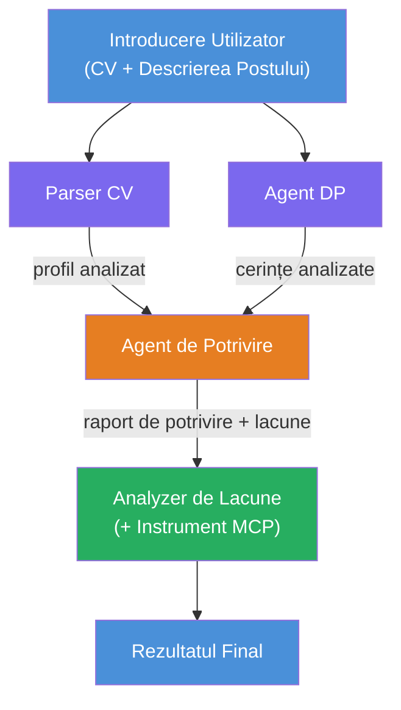
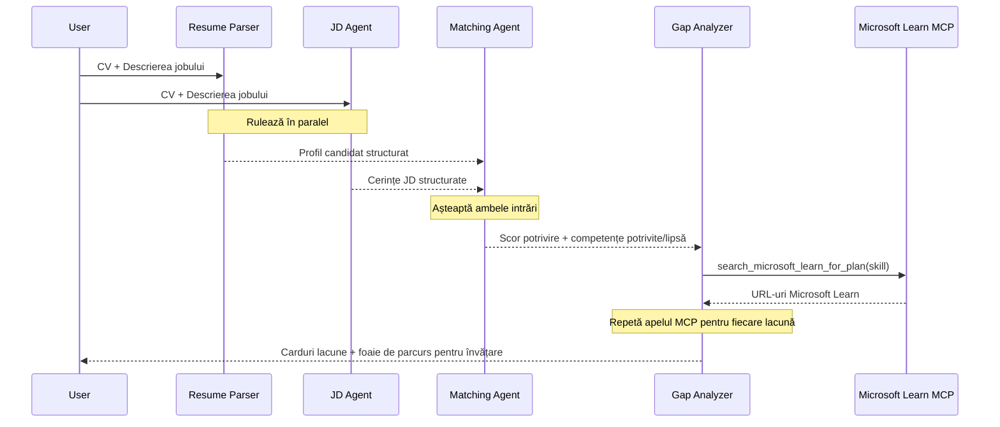
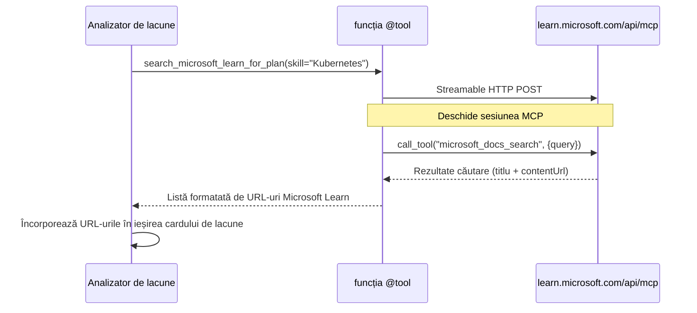

# Modulul 1 - Înțelegerea arhitecturii multi-agent

În acest modul, vei învăța arhitectura Evaluatorului de Potrivire CV → Job înainte de a scrie orice cod. Înțelegerea graficului de orchestrare, rolurilor agenților și fluxului de date este esențială pentru depanarea și extinderea [fluxurilor de lucru multi-agent](https://learn.microsoft.com/azure/architecture/ai-ml/idea/multiple-agent-workflow-automation).

---

## Problema pe care o rezolvă

Potrivirea unui CV cu o descriere de post implică mai multe abilități distincte:

1. **Parsare** - Extrage date structurate din text neformatat (CV)
2. **Analiză** - Extrage cerințele dintr-o descriere de post
3. **Comparație** - Evaluează alinierea dintre cele două
4. **Planificare** - Construiește o foaie de parcurs pentru învățare care să acopere lacunele

Un singur agent care face toate cele patru sarcini într-un singur prompt produce adesea:
- Extracție incompletă (trece rapid peste parsare pentru a ajunge la scor)
- Scorare superficială (fără o detaliere bazată pe dovezi)
- Foi de parcurs generice (nu sunt personalizate pentru lacunele specifice)

Împărțind în **patru agenți specializați**, fiecare se concentrează pe sarcina sa cu instrucțiuni dedicate, producând un rezultat de înaltă calitate pentru fiecare etapă.

---

## Cei patru agenți

Fiecare agent este un agent complet [Microsoft Foundry](https://learn.microsoft.com/azure/foundry/agents/concepts/hosted-agents) creat prin `AzureAIAgentClient.as_agent()`. Ei folosesc aceeași implementare a modelului, dar au instrucțiuni diferite și (opțional) unelte diferite.

| # | Nume Agent | Rol | Input | Output |
|---|-----------|------|-------|--------|
| 1 | **ResumeParser** | Extrage profilul structurat din textul CV-ului | Text raw al CV-ului (de la utilizator) | Profil Candidat, Abilități Tehnice, Abilități Soft, Certificări, Experiență Domeniu, Realizări |
| 2 | **JobDescriptionAgent** | Extrage cerințele structurate dintr-o descriere de post | Text raw al descrierii de post (de la utilizator, transmis prin ResumeParser) | Prezentare Rol, Abilități Cerute, Abilități Preferate, Experiență, Certificări, Educație, Responsabilități |
| 3 | **MatchingAgent** | Calculează scorul de potrivire bazat pe dovezi | Output-uri de la ResumeParser + JobDescriptionAgent | Scor Potrivire (0-100 cu detaliere), Abilități Potrivite, Abilități Lipsă, Lacune |
| 4 | **GapAnalyzer** | Construiește foaia de parcurs personalizată de învățare | Output de la MatchingAgent | Carduri lacune (per abilitate), Ordine Învățare, Calendar, Resurse Microsoft Learn |

---

## Graficul de orchestrare

Fluxul de lucru folosește **divizare paralelă** urmată de **agregare secvențială**:


> **Legendă:** Mov = agenți paraleli, Portocaliu = punct de agregare, Verde = agent final cu unelte

### Cum curg datele


1. **Utilizatorul trimite** un mesaj conținând un CV și o descriere de post.
2. **ResumeParser** primește întreg inputul utilizatorului și extrage un profil structurat de candidat.
3. **JobDescriptionAgent** primește inputul utilizatorului în paralel și extrage cerințe structurate.
4. **MatchingAgent** primește outputurile de la **ResumeParser și JobDescriptionAgent** (framework-ul așteaptă ambele să se termine înainte să ruleze MatchingAgent).
5. **GapAnalyzer** primește outputul de la MatchingAgent și apelează **unealta Microsoft Learn MCP** pentru a obține resurse reale de învățare pentru fiecare lacună.
6. **Outputul final** este răspunsul GapAnalyzer, care include scorul de potrivire, cardurile de lacune și foaia completă de parcurs de învățare.

### De ce contează divizarea paralelă

ResumeParser și JobDescriptionAgent rulează **în paralel** deoarece niciunul nu depinde de celălalt. Aceasta:
- Reduce latența totală (amândoi rulează simultan în loc de secvențial)
- Este o divizare naturală (parsarea CV-ului vs parsarea descrierii sunt sarcini independente)
- Demonstrează un pattern comun multi-agent: **divizare → agregare → acționare**

---

## WorkflowBuilder în cod

Iată cum graficul de mai sus se mapează în apeluri API [`WorkflowBuilder`](https://learn.microsoft.com/agent-framework/workflows/agents-in-workflows) din `main.py`:

```python
from agent_framework import WorkflowBuilder

workflow = (
    WorkflowBuilder(
        name="ResumeJobFitEvaluator",
        start_executor=resume_parser,       # Primul agent care primește input-ul utilizatorului
        output_executors=[gap_analyzer],     # Agentul final al cărui output este returnat
    )
    .add_edge(resume_parser, jd_agent)      # ResumeParser → JobDescriptionAgent
    .add_edge(resume_parser, matching_agent) # ResumeParser → MatchingAgent
    .add_edge(jd_agent, matching_agent)      # JobDescriptionAgent → MatchingAgent
    .add_edge(matching_agent, gap_analyzer)  # MatchingAgent → GapAnalyzer
    .build()
)
```

**Înțelegerea muchiilor:**

| Muchie | Ce înseamnă |
|------|--------------|
| `resume_parser → jd_agent` | Agentul JD primește outputul de la ResumeParser |
| `resume_parser → matching_agent` | MatchingAgent primește outputul de la ResumeParser |
| `jd_agent → matching_agent` | MatchingAgent primește și outputul de la Agentul JD (asteaptă ambele) |
| `matching_agent → gap_analyzer` | GapAnalyzer primește outputul de la MatchingAgent |

Pentru că `matching_agent` are **două muchii de intrare** (`resume_parser` și `jd_agent`), framework-ul așteaptă automat ambele să se termine înainte de a rula MatchingAgent.

---

## Unealta MCP

Agentul GapAnalyzer are o unealtă: `search_microsoft_learn_for_plan`. Aceasta este o **[unealtă MCP](https://learn.microsoft.com/agent-framework/agents/tools/hosted-mcp-tools)** care apelează API-ul Microsoft Learn pentru a obține resurse de învățare atent selectate.

### Cum funcționează

```python
@tool
async def search_microsoft_learn_for_plan(
    skill: str, role: str = "", max_results: int = 5
) -> str:
    """Search Microsoft Learn MCP and return curated official links."""
    # Se conectează la https://learn.microsoft.com/api/mcp prin HTTP Streamable
    # Apelează instrumentul 'microsoft_docs_search' pe serverul MCP
    # Returnează o listă formatată de URL-uri Microsoft Learn
```

### Flux apel MCP


1. GapAnalyzer decide că are nevoie de resurse de învățare pentru o abilitate (ex.: „Kubernetes”)
2. Framework-ul apelează `search_microsoft_learn_for_plan(skill="Kubernetes")`
3. Funcția deschide o conexiune [Streamable HTTP](https://learn.microsoft.com/agent-framework/agents/tools/hosted-mcp-tools) către `https://learn.microsoft.com/api/mcp`
4. Apelează unealta `microsoft_docs_search` pe serverul [MCP](https://learn.microsoft.com/azure/foundry/agents/how-to/tools/model-context-protocol)
5. Serverul MCP returnează rezultatele căutării (titlu + URL)
6. Funcția formatează rezultatele și le returnează ca un șir de caractere
7. GapAnalyzer folosește URL-urile returnate în output-ul cardurilor de lacune

### Logurile MCP așteptate

Când unealta rulează, vei vedea intrări în log de genul:

```
GET https://learn.microsoft.com/api/mcp → 405 (Method Not Allowed)
POST https://learn.microsoft.com/api/mcp → 200
DELETE https://learn.microsoft.com/api/mcp → 405 (Method Not Allowed)
```

**Acestea sunt normale.** Clientul MCP face probe cu GET și DELETE la inițializare - răspunsurile 405 sunt comportament așteptat. Apelul propriu-zis al uneltei folosește POST și returnează 200. Să te îngrijorezi doar dacă apelurile POST eșuează.

---

## Patternul de creare agenți

Fiecare agent este creat folosind **managerul de context asincron [`AzureAIAgentClient.as_agent()`](https://learn.microsoft.com/python/api/overview/azure/ai-agents-readme)**. Acesta este patternul SDK Foundry pentru crearea agenților care sunt curățați automat:

```python
async with (
    get_credential() as credential,
    AzureAIAgentClient(
        project_endpoint=PROJECT_ENDPOINT,
        model_deployment_name=MODEL_DEPLOYMENT_NAME,
        credential=credential,
    ).as_agent(
        name="ResumeParser",
        instructions=RESUME_PARSER_INSTRUCTIONS,
    ) as resume_parser,
    # ... repetă pentru fiecare agent ...
):
    # Aici există toți cei 4 agenți
    workflow = create_workflow(resume_parser, jd_agent, matching_agent, gap_analyzer)
```

**Puncte cheie:**
- Fiecare agent primește o instanță proprie `AzureAIAgentClient` (SDK-ul cere ca numele agentului să fie definit în contextul clientului)
- Toți agenții împart aceleași `credential`, `PROJECT_ENDPOINT` și `MODEL_DEPLOYMENT_NAME`
- Blocul `async with` asigură că toți agenții sunt curățați când serverul se oprește
- GapAnalyzer primește suplimentar `tools=[search_microsoft_learn_for_plan]`

---

## Pornirea serverului

După ce agenții sunt creați și fluxul construit, serverul pornește:

```python
from azure.ai.agentserver.agentframework import from_agent_framework

agent = create_workflow(resume_parser, jd_agent, matching_agent, gap_analyzer)
await from_agent_framework(agent).run_async()
```

`from_agent_framework()` înfășoară fluxul ca un server HTTP care expune endpoint-ul `/responses` pe portul 8088. Este același pattern ca în Laboratorul 01, dar „agentul” este acum întregul [grafic de workflow](https://learn.microsoft.com/agent-framework/workflows/as-agents).

---

### Punct de control

- [ ] Înțelegi arhitectura cu 4 agenți și rolul fiecărui agent
- [ ] Poți urmări fluxul de date: Utilizator → ResumeParser → (paralel) Agent JD + MatchingAgent → GapAnalyzer → Output
- [ ] Înțelegi de ce MatchingAgent așteaptă atât ResumeParser, cât și Agentul JD (două muchii de intrare)
- [ ] Înțelegi unealta MCP: ce face, cum este apelată și că logurile GET 405 sunt normale
- [ ] Înțelegi patternul `AzureAIAgentClient.as_agent()` și de ce fiecare agent are propria instanță client
- [ ] Poți citi codul `WorkflowBuilder` și să-l mapezi la graficul vizual

---

**Anterior:** [00 - Prerequisites](00-prerequisites.md) · **Următor:** [02 - Scaffold the Multi-Agent Project →](02-scaffold-multi-agent.md)

---

<!-- CO-OP TRANSLATOR DISCLAIMER START -->
**Declinare a responsabilității**:  
Acest document a fost tradus folosind serviciul de traducere AI [Co-op Translator](https://github.com/Azure/co-op-translator). Deși ne străduim pentru acuratețe, vă rugăm să rețineți că traducerile automate pot conține erori sau inexactități. Documentul original în limba sa nativă trebuie considerat sursa autorizată. Pentru informații critice, se recomandă traducerea profesională realizată de un specialist uman. Nu ne asumăm responsabilitatea pentru eventualele neînțelegeri sau interpretări greșite care pot rezulta din utilizarea acestei traduceri.
<!-- CO-OP TRANSLATOR DISCLAIMER END -->