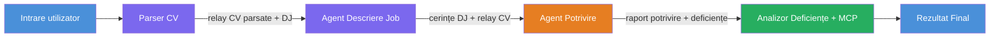

# Modulul 1 - Înțelege arhitectura

⏱️ ~5 min

Înainte de a scrie cod, iată o prezentare rapidă a ceea ce construiești și cum funcționează.

---

## Ce construiești

Lipești un **CV** și o **descriere a postului**. Fluxul de lucru returnează:

- Un scor de potrivire (0–100 cu o defalcare)
- O listă de lacune în competențe și certificări
- O foaie de parcurs personalizată de învățare cu linkuri Microsoft Learn pentru fiecare lacună

---

## Cei patru agenți

Un singur agent care încearcă să analizeze, să evalueze și să planifice totul odată tinde să grăbească și să producă rezultate superficiale. Împărțirea muncii în patru agenți specializați oferă rezultate mai bune:

| Agent | Ce face |
|-------|---------|
| **ResumeParser** | Analizează CV-ul; copiază descrierea postului exact în `[JOB DESCRIPTION PASS-THROUGH]` pentru agenții următori |
| **JobDescriptionAgent** | Extrage cerințele din descrierea postului transmisă; transmite `[PARSED RESUME]` mai departe ca `[PARSED RESUME PASS-THROUGH]` |
| **MatchingAgent** | Compară cele două secțiuni etichetate; produce un scor de potrivire între 0 și 100 și lista lacunelor |
| **GapAnalyzer** | Construiește o foaie de parcurs de învățare; caută pe Microsoft Learn pentru fiecare lacună |

---

## Graficul de orchestrare

Fluxul de lucru este o **conductă secvențială** - fiecare agent transmite rezultatul său următorului:


```mermaid
flowchart LR
    A["Intrare utilizator"] --> B["Parser CV"]
    B -- "relay CV parsate + DJ" --> C["Agent Descriere Job"]
    C -- "cerințe DJ + relay CV" --> D["Agent Potrivire"]
    D -- "raport potrivire + deficiențe" --> E["Analizor Deficiențe + MCP"]
    E --> F["Rezultat Final"]

    style A fill:#4A90D9,color:#fff
    style B fill:#7B68EE,color:#fff
    style C fill:#7B68EE,color:#fff
    style D fill:#E67E22,color:#fff
    style E fill:#27AE60,color:#fff
    style F fill:#4A90D9,color:#fff
```

1. **ResumeParser** primește inputul utilizatorului, analizează CV-ul și copiază descrierea postului în `[JOB DESCRIPTION PASS-THROUGH]`.
2. **JD Agent** extrage cerințele structurate și transmite mai departe `[PARSED RESUME PASS-THROUGH]`.
3. **MatchingAgent** compară cele două secțiuni și produce un scor de potrivire și o listă de lacune.
4. **GapAnalyzer** construiește foaia de parcurs și apelează instrumentul Microsoft Learn MCP pentru fiecare lacună.

---

## Cum se transpune asta în cod

În `main.py`, descrii acest grafic cu `WorkflowBuilder`:

```python
workflow_agent = (
    WorkflowBuilder(
        start_executor=resume_executor,       # primul agent care primește input de la utilizator
        output_executors=[gap_executor],      # ultimul agent - ieșirea sa este răspunsul
    )
    .add_edge(resume_executor, jd_executor)       # ResumeParser → Agent JD
    .add_edge(jd_executor, matching_executor)     # Agent JD → Agent de potrivire
    .add_edge(matching_executor, gap_executor)    # Agent de potrivire → Analizator de lacune
    .build()
    .as_agent()
)
```

Fiecare `Agent` este încapsulat într-un `AgentExecutor`. Apelurile `add_edge()` definesc o conductă strict secvențială - fiecare agent primește doar rezultatul direct al predecesorului său.

> `context_mode="last_agent"` înseamnă că fiecare executor vede doar rezultatul direct al predecesorului său. ResumeParser și JD Agent transmit datele mai departe în secțiuni etichetate, astfel încât fiecare agent următor are exact ce îi trebuie.

---

## Instrumentul MCP

GapAnalyzer are un singur instrument: `search_microsoft_learn_for_plan`. Se conectează la `https://learn.microsoft.com/api/mcp` și returnează linkuri reale Microsoft Learn pentru fiecare lacună de competență.

Când instrumentul rulează vei vedea aceste loguri - toate așteptate:

```
GET  https://learn.microsoft.com/api/mcp → 405   ← connection probe, normal
POST https://learn.microsoft.com/api/mcp → 200   ← actual tool call
DELETE https://learn.microsoft.com/api/mcp → 405 ← cleanup probe, normal
```

Nu-ți face griji decât dacă `POST` returnează o eroare.

---

**Anterior:** [00 - Cerințe preliminare](00-prerequisites.md) · **Următor:** [02 - Scaffold the Project →](02-scaffold-multi-agent.md)

---

<!-- CO-OP TRANSLATOR DISCLAIMER START -->
**Declinare a responsabilității**:
Acest document a fost tradus folosind serviciul de traducere AI [Co-op Translator](https://github.com/Azure/co-op-translator). În timp ce ne străduim pentru acuratețe, vă rugăm să rețineți că traducerile automate pot conține erori sau inexactități. Documentul original în limba sa nativă trebuie considerat sursa autorizată. Pentru informații critice, se recomandă traducerea profesională realizată de un om. Nu ne asumăm responsabilitatea pentru eventualele neînțelegeri sau interpretări greșite care decurg din utilizarea acestei traduceri.
<!-- CO-OP TRANSLATOR DISCLAIMER END -->