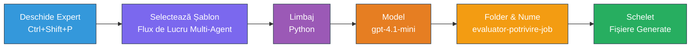
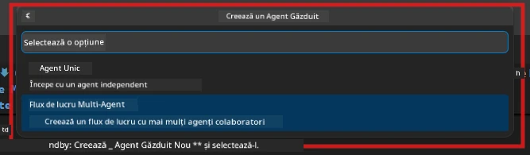

# Module 2 - Crearea scheletului proiectului Multi-Agent

În acest modul, folosești extensia [Microsoft Foundry](https://marketplace.visualstudio.com/items?itemName=TeamsDevApp.vscode-ai-foundry) pentru a **crea scheletul unui proiect de flux de lucru multi-agent**. Extensia generează întreaga structură a proiectului - `agent.yaml`, `main.py`, `Dockerfile`, `requirements.txt`, `.env` și configurația pentru depanare. Apoi personalizezi aceste fișiere în Modulele 3 și 4.

> **Notă:** Folderul `PersonalCareerCopilot/` din acest laborator este un exemplu complet, funcțional, al unui proiect multi-agent personalizat. Poți fie să creezi un proiect nou (recomandat pentru învățare), fie să studiezi codul existent direct.

---

## Pasul 1: Deschide expertul Create Hosted Agent


1. Apasă `Ctrl+Shift+P` pentru a deschide **Command Palette**.
2. Tastează: **Microsoft Foundry: Create a New Hosted Agent** și selectează-l.
3. Se deschide expertul de creare a agentului găzduit.

> **Alternative:** Click pe pictograma **Microsoft Foundry** din Activity Bar → click pe pictograma **+** de lângă **Agents** → **Create New Hosted Agent**.

---

## Pasul 2: Alege șablonul Multi-Agent Workflow

Expertul te va ruga să selectezi un șablon:

| Șablon | Descriere | Când să folosești |
|----------|-------------|-------------|
| Single Agent | Un agent cu instrucțiuni și unelte opționale | Laborator 01 |
| **Multi-Agent Workflow** | Mai mulți agenți care colaborează prin WorkflowBuilder | **Acest laborator (Laborator 02)** |

1. Selectează **Multi-Agent Workflow**.
2. Apasă **Următor**.



---

## Pasul 3: Alege limbajul de programare

1. Selectează **Python**.
2. Apasă **Următor**.

---

## Pasul 4: Selectează modelul

1. Expertul afișează modelele implementate în proiectul tău Foundry.
2. Selectează același model folosit în Laboratorul 01 (de ex., **gpt-4.1-mini**).
3. Apasă **Următor**.

> **Sfat:** [`gpt-4.1-mini`](https://learn.microsoft.com/azure/foundry/foundry-models/concepts/models-sold-directly-by-azure#gpt-41-series) este recomandat pentru dezvoltare - este rapid, ieftin și gestionează bine fluxurile multi-agent. Treci la `gpt-4.1` pentru implementarea finală de producție dacă dorești un output de calitate superioară.

---

## Pasul 5: Alege locația folderului și numele agentului

1. Se deschide un dialog pentru alegerea fișierului. Alege un folder țintă:
   - Dacă urmezi împreună cu repo-ul workshop: navighează la `workshop/lab02-multi-agent/` și creează un subfolder nou
   - Dacă începi de la zero: alege orice folder dorești
2. Introdu un **nume** pentru agentul găzduit (ex., `resume-job-fit-evaluator`).
3. Apasă **Creare**.

---

## Pasul 6: Așteaptă finalizarea generării scheletului

1. VS Code deschide o fereastră nouă (sau actualizează fereastra curentă) cu proiectul generat.
2. Ar trebui să vezi această structură de fișiere:

```
resume-job-fit-evaluator/
├── .env                ← Environment variables (placeholders)
├── .vscode/
│   └── launch.json     ← Debug configuration
├── agent.yaml          ← Agent definition (kind: hosted)
├── Dockerfile          ← Container configuration
├── main.py             ← Multi-agent workflow code (scaffold)
└── requirements.txt    ← Python dependencies
```

> **Notă workshop:** În repository-ul workshop, folderul `.vscode/` este la **rădăcina spațiului de lucru** cu `launch.json` și `tasks.json` partajate. Configurațiile de depanare pentru Laborator 01 și Laborator 02 sunt ambele incluse. Când apeși F5, selectează **"Lab02 - Multi-Agent"** din lista derulantă.

---

## Pasul 7: Înțelege fișierele generate (specific multi-agent)

Scheletul multi-agent diferă față de cel single-agent în câteva moduri cheie:

### 7.1 `agent.yaml` - Definirea agentului

```yaml
kind: hosted
name: resume-job-fit-evaluator
description: >
  A multi-agent workflow that evaluates resume-to-job fit.
metadata:
  authors:
    - Microsoft
  tags:
    - Multi-Agent Workflow
    - Resume Evaluator
protocols:
  - protocol: responses
    version: v1
environment_variables:
  - name: PROJECT_ENDPOINT
    value: ${PROJECT_ENDPOINT}
  - name: MODEL_DEPLOYMENT_NAME
    value: ${MODEL_DEPLOYMENT_NAME}
```

**Diferență cheie față de Laborator 01:** Secțiunea `environment_variables` poate include variabile suplimentare pentru endpoint-urile MCP sau alte configurări de unelte. `name` și `description` reflectă cazul de utilizare multi-agent.

### 7.2 `main.py` - Codul fluxului multi-agent

Scheletul include:
- **Mai multe șiruri de instrucțiuni pentru agenți** (câte un const per agent)
- **Mai mulți manageri de context [`AzureAIAgentClient.as_agent()`](https://learn.microsoft.com/python/api/overview/azure/ai-agents-readme)** (câte unul per agent)
- **[`WorkflowBuilder`](https://learn.microsoft.com/agent-framework/workflows/agents-in-workflows)** pentru a conecta agenții
- **`from_agent_framework()`** pentru a servi fluxul ca endpoint HTTP

```python
from agent_framework import WorkflowBuilder, tool
from agent_framework.azure import AzureAIAgentClient
from azure.ai.agentserver.agentframework import from_agent_framework
```

Importul suplimentar [`WorkflowBuilder`](https://learn.microsoft.com/agent-framework/workflows/agents-in-workflows) este nou comparativ cu Laboratorul 01.

### 7.3 `requirements.txt` - Dependențe suplimentare

Proiectul multi-agent folosește aceleași pachete de bază ca în Laborator 01, plus orice pachete legate de MCP:

```
agent-framework-azure-ai==1.0.0rc3
agent-framework-core==1.0.0rc3
azure-ai-agentserver-agentframework==1.0.0b16
azure-ai-agentserver-core==1.0.0b16
debugpy
agent-dev-cli --pre
```

> **Notă importantă despre versiuni:** Pachetul `agent-dev-cli` necesită flag-ul `--pre` în `requirements.txt` pentru a instala cea mai recentă versiune preview. Acest lucru este necesar pentru compatibilitatea Agent Inspector cu `agent-framework-core==1.0.0rc3`. Vezi [Module 8 - Depanare](08-troubleshooting.md) pentru detalii despre versiuni.

| Pachet | Versiune | Scop |
|---------|---------|---------|
| [`agent-framework-azure-ai`](https://learn.microsoft.com/agent-framework/overview/) | `1.0.0rc3` | Integrare Azure AI pentru [Microsoft Agent Framework](https://github.com/microsoft/agent-framework) |
| [`agent-framework-core`](https://learn.microsoft.com/agent-framework/overview/) | `1.0.0rc3` | Runtime de bază (include WorkflowBuilder) |
| `azure-ai-agentserver-agentframework` | `1.0.0b16` | Runtime server agent găzduit |
| `azure-ai-agentserver-core` | `1.0.0b16` | Abstracții de bază pentru server agent |
| `debugpy` | latest | Depanare Python (F5 în VS Code) |
| `agent-dev-cli` | `--pre` | CLI local de dezvoltare + backend Agent Inspector |

### 7.4 `Dockerfile` - La fel ca în Laborator 01

Dockerfile este identic cu cel din Laboratorul 01 - copiază fișierele, instalează dependențele din `requirements.txt`, expune portul 8088 și rulează `python main.py`.

```dockerfile
FROM python:3.14-slim
WORKDIR /app
COPY ./ .
RUN pip install --upgrade pip && \
    if [ -f requirements.txt ]; then \
        pip install -r requirements.txt; \
    else \
      echo "No requirements.txt found" >&2; exit 1; \
    fi
EXPOSE 8088
CMD ["python", "main.py"]
```

---

### Punct de verificare

- [ ] Expertul de generare schelet a fost finalizat → structura noului proiect este vizibilă
- [ ] Poți vedea toate fișierele: `agent.yaml`, `main.py`, `Dockerfile`, `requirements.txt`, `.env`
- [ ] `main.py` include importul `WorkflowBuilder` (confirmă că a fost selectat șablonul multi-agent)
- [ ] `requirements.txt` include atât `agent-framework-core`, cât și `agent-framework-azure-ai`
- [ ] Ai înțeles cum diferă scheletul multi-agent față de cel single-agent (mai mulți agenți, WorkflowBuilder, unelte MCP)

---

**Anterior:** [01 - Înțelege arhitectura multi-agent](01-understand-multi-agent.md) · **Următor:** [03 - Configurează agenții și mediul →](03-configure-agents.md)

---

<!-- CO-OP TRANSLATOR DISCLAIMER START -->
**Declinare a responsabilității**:  
Acest document a fost tradus folosind serviciul de traducere AI [Co-op Translator](https://github.com/Azure/co-op-translator). Deși ne străduim să asigurăm acuratețea, vă rugăm să rețineți că traducerile automate pot conține erori sau inexactități. Documentul original în limba sa nativă trebuie considerat sursa autorizată. Pentru informații critice, se recomandă utilizarea unei traduceri profesionale realizate de un traducător uman. Nu ne asumăm responsabilitatea pentru eventualele neînțelegeri sau interpretări greșite care decurg din utilizarea acestei traduceri.
<!-- CO-OP TRANSLATOR DISCLAIMER END -->