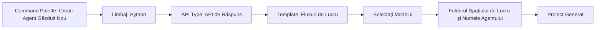
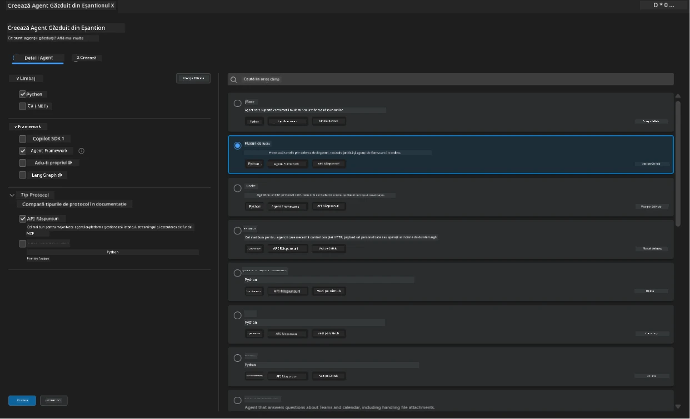
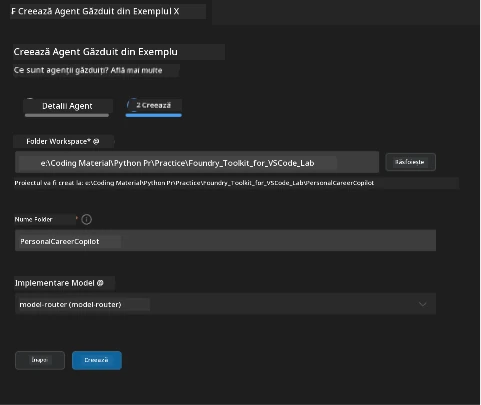

# Modului 2 - Configurarea proiectului Multi-Agent

⏱️ ~5 minute

În acest modul, folosești [Foundry Toolkit for VS Code](https://aka.ms/foundrytk) pentru a **configura un proiect multi-agent**. Asistentul generează `agent.yaml`, `main.py`, `Dockerfile`, `requirements.txt`, `.env` și configurația de depanare VS Code - astfel încât să te poți concentra pe configurarea fluxului de lucru cu 4 agenți în Modulul 3.

> **Concept cheie:** Scheletul este un stub funcțional cu un singur agent. Înlocuiești logica de rezervă cu graficul `WorkflowBuilder` din Modulul 3. Nu scrii codul standard de la zero.

> **Implementare de referință:** [`PersonalCareerCopilot/`](../../../../../workshop/lab02-multi-agent/PersonalCareerCopilot) este un exemplu complet funcțional. Folosește-l pentru a compara munca ta pe parcurs.

### Fluxul asistentului de configurare


```mermaid
flowchart LR
    A[Command Palette: Creați Agent Găzduit Nou] --> B[Limbaj: Python]
    B --> C[API Type: API de Răspuns]
    C --> D[Template: Fluxuri de Lucru]
    D --> E[Selectați Modelul]
    E --> F[Folderul Spațiului de Lucru și Numele Agentului]
    F --> G[Proiect Generat]
```

---

## Pasul 1: Deschide asistentul Create Hosted Agent

1. Apasă `Ctrl+Shift+P` pentru a deschide **Command Palette**.
2. Tastează: **Foundry Toolkit: Create a New Hosted Agent** și selectează-l.
3. Asistentul se deschide pe fila **Agent Details**.

> **Alternativ:** Apasă pe pictograma **Foundry Toolkit** din bara de activități → apasă pe pictograma **+** lângă **Hosted Agents** → **Create New Hosted Agent**.

---

## Pasul 2: Alege setările



1. În secțiunea de navigație/opțiuni din stânga selectează următoarele:

| Meniu | Selectare | Note |
|--------|-----------|-------|
| **Limba** | Python | C# (.NET) este de asemenea suportat |
| **Cadru** | Agent Framework | Oferă `Agent`, `AgentExecutor`, `WorkflowBuilder` |
| **Tip API** | Response API | `POST /responses` - istoric gestionat de platformă, suport streaming |
| **Șablon** | **Workflows** | Procesează cererile prin mai mulți agenți în secvență |

2. Odată selectat, apasă **Next**



3. În fereastra următoare, selectează următoarele:

| Meniu | Selectare | Note |
|--------|-----------|-------|
| **Folderul de lucru** | Răsfoiește până la folderul țintă | ex. `workshop/lab02-multi-agent/` în acest repo |
| **Numele agentului** | `PersonalCareerCopilot` | Devine numele directorului proiectului |
| **Implementarea modelului** | Selectează modelul tău implementat | ex. `gpt-4.1-mini` din Laboratorul 01 |

4. Apasă **Create** pentru a configura proiectul. VS Code generează fișierele și deschide folderul.

> **Sfat:** [`gpt-4.1-mini`](https://learn.microsoft.com/azure/foundry/foundry-models/concepts/models-sold-directly-by-azure#gpt-41-series) echilibrează bine viteza și calitatea pentru dezvoltarea multi-agent.

---

## Pasul 3: Inspectează proiectul generat

După finalizarea configurării, verifică dacă vezi aceste fișiere în Explorer (`Ctrl+Shift+E`):

```
📂 <your-agent-name>/
├── .azdignore          ← Files excluded from Azure Developer CLI deployments
├── .dockerignore       ← Files excluded from Docker builds
├── .env                ← Environment variables (placeholders - fill in Module 3)
├── .vscode/
│   ├── launch.json     ← Debug config (F5 → run + Agent Inspector)
│   └── tasks.json      ← VS Code task definitions
├── agent.yaml          ← Agent definition (kind: hosted, protocol: responses)
├── Dockerfile          ← Container config for deployment
├── main.py             ← Stub agent entry point (replace with WorkflowBuilder in Module 3)
└── requirements.txt    ← Python dependencies
```

> **Important:** Deschide acest folder configurat direct în VS Code astfel încât `.vscode/launch.json` și `tasks.json` să se aplice corect pentru depanarea cu F5.

### Fișiere cheie explicate

| Fișier | Scop |
|------|---------|
| `agent.yaml` | Declară `kind: hosted`, mapează variabilele de mediu, definește protocolul `/responses` |
| `main.py` | Stub: un singur `FoundryChatClient` → `Agent` → `ResponsesHostServer`. Înlocuiești cu 4 agenți + `WorkflowBuilder` în Modulul 3 |
| `Dockerfile` | `python:3.12-slim`, instalează `requirements.txt`, expune portul 8088, rulează `python main.py` |
| `requirements.txt` | `agent-framework-foundry`, `agent-framework-foundry-hosting`, `mcp<2,>=1.24.0`, `debugpy` |

> **Referință:** Vezi [`PersonalCareerCopilot/agent.yaml`](../../../../../workshop/lab02-multi-agent/PersonalCareerCopilot/agent.yaml) și [`PersonalCareerCopilot/requirements.txt`](../../../../../workshop/lab02-multi-agent/PersonalCareerCopilot/requirements.txt) pentru conținutul complet generat.

---

### ✅ Punct de verificare

- [ ] Asistentul de configurare a fost completat - noul folder proiect este vizibil în Explorer
- [ ] Toate fișierele așteptate sunt prezente: `agent.yaml`, `main.py`, `Dockerfile`, `requirements.txt`, `.env`
- [ ] `agent.yaml` arată `kind: hosted` și `protocol: responses`
- [ ] `main.py` importă `Agent`, `FoundryChatClient`, `ResponsesHostServer`
- [ ] Folderul configurat este deschis ca rădăcină a spațiului de lucru VS Code
- [ ] Înțelegi că `main.py` este un stub - `WorkflowBuilder` este adăugat în Modulul 3

---

**Anterior:** [01 - Înțelegerea arhitecturii multi-agent](01-understand-multi-agent.md) · **Următor:** [03 - Configurarea agenților și mediului →](03-configure-agents.md)

---

<!-- CO-OP TRANSLATOR DISCLAIMER START -->
**Declinare a responsabilității**:
Acest document a fost tradus folosind serviciul de traducere AI [Co-op Translator](https://github.com/Azure/co-op-translator). În timp ce ne străduim pentru acuratețe, vă rugăm să rețineți că traducerile automate pot conține erori sau inexactități. Documentul original în limba sa nativă trebuie considerat sursa autorizată. Pentru informații critice, se recomandă traducerea profesională realizată de un om. Nu ne asumăm responsabilitatea pentru eventualele neînțelegeri sau interpretări greșite care decurg din utilizarea acestei traduceri.
<!-- CO-OP TRANSLATOR DISCLAIMER END -->