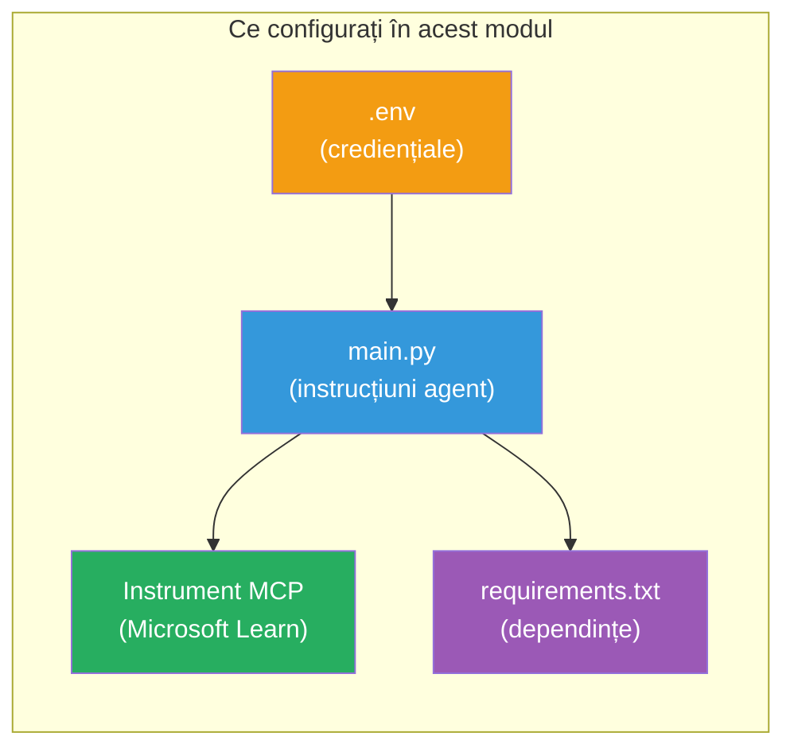

# Modulul 3 - Configurarea agenților, uneltelor MCP și mediului

În acest modul, vei personaliza proiectul multi-agent scheletizat. Vei scrie instrucțiuni pentru toți cei patru agenți, vei configura unealta MCP pentru Microsoft Learn, vei configura variabile de mediu și vei instala dependențele.


> **Referință:** Codul complet funcțional se găsește în [`PersonalCareerCopilot/main.py`](../../../../../workshop/lab02-multi-agent/PersonalCareerCopilot/main.py). Folosește-l ca referință în timp ce îți construiești propriul proiect.

---

## Pasul 1: Configurează variabilele de mediu

1. Deschide fișierul **`.env`** din directorul rădăcină al proiectului tău.
2. Completează detaliile proiectului tău Foundry:

   ```env
   PROJECT_ENDPOINT=https://<your-account>.services.ai.azure.com/api/projects/<your-project>
   MODEL_DEPLOYMENT_NAME=gpt-4.1-mini
   ```

3. Salvează fișierul.

### Unde găsești aceste valori

| Valoare | Cum să o găsești |
|---------|------------------|
| **Punctul final al proiectului** | Bara laterală Microsoft Foundry → click pe proiectul tău → URL-ul punctului final în vizualizarea detaliilor |
| **Numele implementării modelului** | Bara laterală Foundry → extinde proiectul → **Models + endpoints** → numele de lângă modelul implementat |

> **Securitate:** Nu comite niciodată `.env` în controlul versiunilor. Adaugă-l în `.gitignore` dacă nu este deja acolo.

### Maparea variabilelor de mediu

Fișierul `main.py` multi-agent citește atât nume standard, cât și specifice workshop-ului pentru variabilele de mediu:

```python
PROJECT_ENDPOINT = os.getenv("AZURE_AI_PROJECT_ENDPOINT") or os.getenv("PROJECT_ENDPOINT")
MODEL_DEPLOYMENT_NAME = os.getenv(
    "AZURE_AI_MODEL_DEPLOYMENT_NAME",
    os.getenv("MODEL_DEPLOYMENT_NAME", "gpt-4.1-mini"),
)
MICROSOFT_LEARN_MCP_ENDPOINT = os.getenv(
    "MICROSOFT_LEARN_MCP_ENDPOINT", "https://learn.microsoft.com/api/mcp"
)
```

Punctul final MCP are o valoare implicită potrivită - nu trebuie să îl setezi în `.env` decât dacă vrei să îl suprascrii.

---

## Pasul 2: Scrie instrucțiunile pentru agenți

Acesta este pasul cel mai critic. Fiecărui agent îi trebuie instrucțiuni atent alcătuite care definesc rolul, formatul output-ului și regulile. Deschide `main.py` și creează (sau modifică) constantele de instrucțiuni.

### 2.1 Agentul de parsare CV

```python
RESUME_PARSER_INSTRUCTIONS = """\
You are the Resume Parser.
Extract resume text into a compact, structured profile for downstream matching.

Output exactly these sections:
1) Candidate Profile
2) Technical Skills (grouped categories)
3) Soft Skills
4) Certifications & Awards
5) Domain Experience
6) Notable Achievements

Rules:
- Use only explicit or strongly implied evidence.
- Do not invent skills, titles, or experience.
- Keep concise bullets; no long paragraphs.
- If input is not a resume, return a short warning and request resume text.
"""
```

**De ce aceste secțiuni?** MatchingAgent are nevoie de date structurate pentru a face scorarea. Secțiunile consistente fac transferul între agenți fiabil.

### 2.2 Agentul de descriere a jobului

```python
JOB_DESCRIPTION_INSTRUCTIONS = """\
You are the Job Description Analyst.
Extract a structured requirement profile from a JD.

Output exactly these sections:
1) Role Overview
2) Required Skills
3) Preferred Skills
4) Experience Required
5) Certifications Required
6) Education
7) Domain / Industry
8) Key Responsibilities

Rules:
- Keep required vs preferred clearly separated.
- Only use what the JD states; do not invent hidden requirements.
- Flag vague requirements briefly.
- If input is not a JD, return a short warning and request JD text.
"""
```

**De ce se separă cerințele obligatorii de cele preferate?** MatchingAgent folosește ponderi diferite pentru fiecare (Abilități obligatorii = 40 puncte, Abilități preferate = 10 puncte).

### 2.3 Agentul de potrivire

```python
MATCHING_AGENT_INSTRUCTIONS = """\
You are the Matching Agent.
Compare parsed resume output vs JD output and produce an evidence-based fit report.

Scoring (100 total):
- Required Skills 40
- Experience 25
- Certifications 15
- Preferred Skills 10
- Domain Alignment 10

Output exactly these sections:
1) Fit Score (with breakdown math)
2) Matched Skills
3) Missing Skills
4) Partially Matched
5) Experience Alignment
6) Certification Gaps
7) Overall Assessment

Rules:
- Be objective and evidence-only.
- Keep partial vs missing separate.
- Keep Missing Skills precise; it feeds roadmap planning.
"""
```

**De ce scorare explicită?** Scorarea reproductibilă face posibilă compararea rularilor și depanarea problemelor. Scara de 100 de puncte este ușor de interpretat pentru utilizatori.

### 2.4 Agentul analizator de decalaje

```python
GAP_ANALYZER_INSTRUCTIONS = """\
You are the Gap Analyzer and Roadmap Planner.
Create a practical upskilling plan from the matching report.

Microsoft Learn MCP usage (required):
- For EVERY High and Medium priority gap, call tool `search_microsoft_learn_for_plan`.
- Use returned Learn links in Suggested Resources.
- Prefer Microsoft Learn for free resources.

CRITICAL: You MUST produce a SEPARATE detailed gap card for EVERY skill listed in
the Missing Skills and Certification Gaps sections of the matching report. Do NOT
skip or combine gaps. Do NOT summarize multiple gaps into one card.

Output format:
1) Personalized Learning Roadmap for [Role Title]
2) One DETAILED card per gap (produce ALL cards, not just the first):
   - Skill
   - Priority (High/Medium/Low)
   - Current Level
   - Target Level
   - Suggested Resources (include Learn URL from tool results)
   - Estimated Time
   - Quick Win Project
3) Recommended Learning Order (numbered list)
4) Timeline Summary (week-by-week)
5) Motivational Note

Rules:
- Produce every gap card before writing the summary sections.
- Keep it specific, realistic, and actionable.
- Tailor to candidate's existing stack.
- If fit >= 80, focus on polish/interview readiness.
- If fit < 40, be honest and provide a staged path.
"""
```

**De ce accent pe "CRITIC"?** Fără instrucțiuni explicite de a produce TOATE cartonașele decalajelor, modelul tinde să genereze doar 1-2 cartonașe și să rezume restul. Blocul "CRITIC" previne această trunchiere.

---

## Pasul 3: Definirea uneltei MCP

GapAnalyzer folosește o unealtă care apelează serverul [Microsoft Learn MCP](https://learn.microsoft.com/azure/foundry/agents/how-to/tools/model-context-protocol). Adaugă aceasta în `main.py`:

```python
import json
from agent_framework import tool
from mcp.client.session import ClientSession
from mcp.client.streamable_http import streamable_http_client

@tool
async def search_microsoft_learn_for_plan(
    skill: str, role: str = "", max_results: int = 5
) -> str:
    """Search Microsoft Learn MCP and return curated official links for roadmap planning."""
    query = " ".join(part for part in [skill, role, "learning path module"] if part).strip()
    query = query or "job skills learning path"

    try:
        async with streamable_http_client(MICROSOFT_LEARN_MCP_ENDPOINT) as (
            read_stream, write_stream, _,
        ):
            async with ClientSession(read_stream, write_stream) as session:
                await session.initialize()
                result = await session.call_tool(
                    "microsoft_docs_search", {"query": query}
                )

        if not result.content:
            return (
                "No results returned from Microsoft Learn MCP. "
                "Fallback: https://learn.microsoft.com/training/support/catalog-api"
            )

        payload_text = getattr(result.content[0], "text", "")
        data = json.loads(payload_text) if payload_text else {}
        items = data.get("results", [])[:max(1, min(max_results, 10))]

        if not items:
            return f"No direct Microsoft Learn results found for '{skill}'."

        lines = [f"Microsoft Learn resources for '{skill}':"]
        for i, item in enumerate(items, start=1):
            title = item.get("title") or item.get("url") or "Microsoft Learn Resource"
            url = item.get("url") or item.get("link") or ""
            lines.append(f"{i}. {title} - {url}".rstrip(" -"))
        return "\n".join(lines)
    except Exception as ex:
        return (
            f"Microsoft Learn MCP lookup unavailable. Reason: {ex}. "
            "Fallbacks: https://learn.microsoft.com/api/mcp"
        )
```

### Cum funcționează unealta

| Pas | Ce se întâmplă |
|-----|----------------|
| 1 | GapAnalyzer decide că are nevoie de resurse pentru o abilitate (exemplu, "Kubernetes") |
| 2 | Framework-ul apelează `search_microsoft_learn_for_plan(skill="Kubernetes")` |
| 3 | Funcția deschide o conexiune [Streamable HTTP](https://learn.microsoft.com/agent-framework/agents/tools/hosted-mcp-tools) către `https://learn.microsoft.com/api/mcp` |
| 4 | Apelează `microsoft_docs_search` pe serverul [MCP](https://learn.microsoft.com/azure/foundry/agents/how-to/tools/model-context-protocol) |
| 5 | Serverul MCP returnează rezultatele căutării (titlu + URL) |
| 6 | Funcția formatează rezultatele ca listă numerotată |
| 7 | GapAnalyzer încorporează URL-urile în cartonașul decalajelor |

### Dependențe MCP

Bibliotecile client MCP sunt incluse transitiv prin [`agent-framework-core`](https://learn.microsoft.com/agent-framework/overview/). Nu trebuie să le adaugi separat în `requirements.txt`. Dacă primești erori la import, verifică:

```powershell
pip list | Select-String "mcp"
```

Se așteaptă ca pachetul `mcp` să fie instalat (versiunea 1.x sau mai nouă).

---

## Pasul 4: Leagă agenții și fluxul de lucru

### 4.1 Creează agenți cu manageri de context

```python
from contextlib import asynccontextmanager

@asynccontextmanager
async def create_agents():
    async with (
        get_credential() as credential,
        AzureAIAgentClient(
            project_endpoint=PROJECT_ENDPOINT,
            model_deployment_name=MODEL_DEPLOYMENT_NAME,
            credential=credential,
        ).as_agent(
            name="ResumeParser",
            instructions=RESUME_PARSER_INSTRUCTIONS,
        ) as resume_parser,
        AzureAIAgentClient(
            project_endpoint=PROJECT_ENDPOINT,
            model_deployment_name=MODEL_DEPLOYMENT_NAME,
            credential=credential,
        ).as_agent(
            name="JobDescriptionAgent",
            instructions=JOB_DESCRIPTION_INSTRUCTIONS,
        ) as jd_agent,
        AzureAIAgentClient(
            project_endpoint=PROJECT_ENDPOINT,
            model_deployment_name=MODEL_DEPLOYMENT_NAME,
            credential=credential,
        ).as_agent(
            name="MatchingAgent",
            instructions=MATCHING_AGENT_INSTRUCTIONS,
        ) as matching_agent,
        AzureAIAgentClient(
            project_endpoint=PROJECT_ENDPOINT,
            model_deployment_name=MODEL_DEPLOYMENT_NAME,
            credential=credential,
        ).as_agent(
            name="GapAnalyzer",
            instructions=GAP_ANALYZER_INSTRUCTIONS,
            tools=[search_microsoft_learn_for_plan],
        ) as gap_analyzer,
    ):
        yield resume_parser, jd_agent, matching_agent, gap_analyzer
```

**Puncte cheie:**
- Fiecare agent are propria instanță `AzureAIAgentClient`
- Doar GapAnalyzer primește `tools=[search_microsoft_learn_for_plan]`
- `get_credential()` returnează [`ManagedIdentityCredential`](https://learn.microsoft.com/python/api/overview/azure/identity-readme#managed-identity-support) în Azure, [`DefaultAzureCredential`](https://learn.microsoft.com/azure/developer/python/sdk/authentication/credential-chains#defaultazurecredential-overview) local

### 4.2 Construiește graful fluxului de lucru

```python
def create_workflow(resume_parser, jd_agent, matching_agent, gap_analyzer):
    workflow = (
        WorkflowBuilder(
            name="ResumeJobFitEvaluator",
            start_executor=resume_parser,
            output_executors=[gap_analyzer],
        )
        .add_edge(resume_parser, jd_agent)
        .add_edge(resume_parser, matching_agent)
        .add_edge(jd_agent, matching_agent)
        .add_edge(matching_agent, gap_analyzer)
        .build()
    )
    return workflow.as_agent()
```

> Vezi [Fluxurile de lucru ca agenți](https://learn.microsoft.com/agent-framework/workflows/as-agents) pentru a înțelege modelul `.as_agent()`.

### 4.3 Pornește serverul

```python
async def main() -> None:
    validate_configuration()
    async with create_agents() as (resume_parser, jd_agent, matching_agent, gap_analyzer):
        agent = create_workflow(resume_parser, jd_agent, matching_agent, gap_analyzer)
        from azure.ai.agentserver.agentframework import from_agent_framework
        await from_agent_framework(agent).run_async()

if __name__ == "__main__":
    asyncio.run(main())
```

---

## Pasul 5: Creează și activează mediul virtual

### 5.1 Creează mediul

```powershell
cd workshop\lab02-multi-agent\PersonalCareerCopilot
python -m venv .venv
```

### 5.2 Activează-l

**PowerShell (Windows):**
```powershell
.\.venv\Scripts\Activate.ps1
```

**macOS/Linux:**
```bash
source .venv/bin/activate
```

### 5.3 Instalează dependențele

```powershell
pip install -r requirements.txt
```

> **Notă:** Linia `agent-dev-cli --pre` din `requirements.txt` garantează instalarea celei mai recente versiuni preview. Este necesară pentru compatibilitatea cu `agent-framework-core==1.0.0rc3`.

### 5.4 Verifică instalarea

```powershell
pip list | Select-String "agent-framework|agentserver|agent-dev"
```

Output așteptat:
```
agent-dev-cli                  0.0.1b260316
agent-framework-azure-ai       1.0.0rc3
agent-framework-core            1.0.0rc3
azure-ai-agentserver-agentframework 1.0.0b16
azure-ai-agentserver-core      1.0.0b16
```

> **Dacă `agent-dev-cli` afișează o versiune mai veche** (exemplu, `0.0.1b260119`), Agent Inspector va eșua cu erori 403/404. Actualizează cu: `pip install agent-dev-cli --pre --upgrade`

---

## Pasul 6: Verifică autentificarea

Rulează aceeași verificare de autentificare din Lab 01:

```powershell
az account show --query "{name:name, id:id}" --output table
```

Dacă aceasta eșuează, rulează [`az login`](https://learn.microsoft.com/cli/azure/authenticate-azure-cli-interactively).

Pentru fluxuri multi-agent, toți cei patru agenți folosesc aceeași acreditare. Dacă autentificarea funcționează pentru unul, funcționează pentru toți.

---

### Punct de verificare

- [ ] `.env` conține valori valide pentru `PROJECT_ENDPOINT` și `MODEL_DEPLOYMENT_NAME`
- [ ] Toate cele 4 constante de instrucțiuni pentru agenți sunt definite în `main.py` (ResumeParser, Agent JD, MatchingAgent, GapAnalyzer)
- [ ] Unealta MCP `search_microsoft_learn_for_plan` este definită și înregistrată la GapAnalyzer
- [ ] `create_agents()` creează toți cei 4 agenți cu instanțe individuale `AzureAIAgentClient`
- [ ] `create_workflow()` construiește graful corect cu `WorkflowBuilder`
- [ ] Mediul virtual este creat și activat (`(.venv)` vizibil)
- [ ] `pip install -r requirements.txt` se termină fără erori
- [ ] `pip list` arată toate pachetele așteptate la versiunile corecte (rc3 / b16)
- [ ] `az account show` returnează abonamentul tău

---

**Anterior:** [02 - Scaffold Multi-Agent Project](02-scaffold-multi-agent.md) · **Următor:** [04 - Orchestration Patterns →](04-orchestration-patterns.md)

---

<!-- CO-OP TRANSLATOR DISCLAIMER START -->
**Declinare a responsabilității**:  
Acest document a fost tradus utilizând serviciul de traducere AI [Co-op Translator](https://github.com/Azure/co-op-translator). Deși ne străduim pentru acuratețe, vă rugăm să rețineți că traducerile automate pot conține erori sau inexactități. Documentul original în limba sa nativă trebuie considerat sursa autoritară. Pentru informații critice, se recomandă traducerea profesională realizată de un specialist uman. Nu ne asumăm răspunderea pentru eventualele neînțelegeri sau interpretări greșite rezultate din utilizarea acestei traduceri.
<!-- CO-OP TRANSLATOR DISCLAIMER END -->