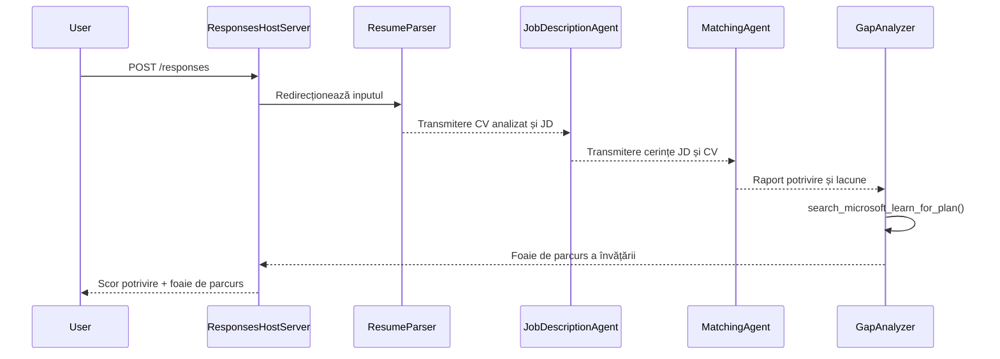

# Modulul 3 - Configurarea instrucțiunilor, mediului și instalarea dependențelor

⏱️ ~15 min

În acest modul, transformați scheletul șablon într-un flux de lucru multi-agent **al dvs.** - prin setarea variabilelor de mediu, scrierea instrucțiunilor agenților, adăugarea instrumentului MCP, conectarea graficului fluxului și instalarea dependențelor.

> **Referință:** Codul complet funcțional este în [`PersonalCareerCopilot/main.py`](../../../../../workshop/lab02-multi-agent/PersonalCareerCopilot/main.py). Folosiți-l ca referință în timp ce construiți propriul grafic de flux și blocuri de prompturi.

---

## Cum se potrivesc cei patru agenți împreună


```mermaid
sequenceDiagram
    participant User
    participant Server as ResponsesHostServer
    participant RP as ResumeParser
    participant JD as JobDescriptionAgent
    participant MA as MatchingAgent
    participant GA as GapAnalyzer

    User->>Server: POST /responses
    Server->>RP: Redirecționează inputul
    RP-->>JD: Transmitere CV analizat și JD
    JD-->>MA: Transmitere cerințe JD și CV
    MA-->>GA: Raport potrivire și lacune
    GA->>GA: search_microsoft_learn_for_plan()
    GA-->>Server: Foaie de parcurs a învățării
    Server-->>User: Scor potrivire + foaie de parcurs
```

---

## Pasul 1: Configurați variabilele de mediu

1. Deschideți fișierul **`.env`** din rădăcina proiectului (creat de expertul de schelet).
2. Înlocuiți locurile rezervate cu valorile dvs. reale din Lab 01.

<details open>
<summary><strong>🅰️ Calea A - Abonament Foundry</strong></summary>

```env
FOUNDRY_PROJECT_ENDPOINT=https://<your-account>.services.ai.azure.com/api/projects/<your-project>
AZURE_AI_MODEL_DEPLOYMENT_NAME=gpt-4.1-mini
```

> **Unde găsiți valorile:** Consultați [Lab 01, Modulul 1](../../lab01-single-agent/docs/01-setup.md#deploy-a-model--assign-rbac).

</details>

<details open>
<summary><strong>🅱️ Calea B - Foundry Local</strong></summary>

```env
FOUNDRY_PROJECT_ENDPOINT=http://localhost:5273/v1
AZURE_AI_MODEL_DEPLOYMENT_NAME=phi-4-mini
```

> Toate inferențele rulează pe mașina dvs. - niciun date nu părăsește dispozitivul. Rulați `foundry model list` pentru a confirma aliasul exact al modelului. Singura cerere externă este apelul instrumentului MCP către `https://learn.microsoft.com/api/mcp`.

> **Unde găsiți valorile:** Consultați [Lab 01, Modulul 1 - calea locală](../../lab01-single-agent/docs/01-setup.md#step-2-set-up-based-on-your-access).

</details>

> **Securitate:** Nu urcați niciodată `.env` în controlul versiunilor. Ar trebui să fie deja în `.gitignore`.

---

## Pasul 2: Scrieți instrucțiunile agenților

Instrucțiunile definesc rolul fiecărui agent, formatul output-ului și regulile. Deschideți `main.py` și definiți (sau înlocuiți) cele patru constante de instrucțiuni - șirurile complete sunt în [`PersonalCareerCopilot/main.py`](../../../../../workshop/lab02-multi-agent/PersonalCareerCopilot/main.py).

### 2.1 `RESUME_PARSER_INSTRUCTIONS`
Parsează CV-ul într-un profil structurat al candidatului **și** copiază descrierea postului literal în `[JOB DESCRIPTION PASS-THROUGH]`. Ambele secțiuni etichetate trebuie să apară în output.

> **De ce pass-through?** Cu `context_mode="last_agent"`, ResumeParser este **singurul** agent care vede mesajul original al utilizatorului. Dacă nu copie JD înainte, agenții următori nu îl văd niciodată.

### 2.2 `JOB_DESCRIPTION_INSTRUCTIONS`
Citește `[PARSED RESUME]` și `[JOB DESCRIPTION PASS-THROUGH]` din output-ul ResumeParser. Produce `[JD REQUIREMENTS]` (cerințe structurate) și `[PARSED RESUME PASS-THROUGH]` (copie literală a CV-ului pentru MatchingAgent).

### 2.3 `MATCHING_AGENT_INSTRUCTIONS`
Citește `[JD REQUIREMENTS]` și `[PARSED RESUME PASS-THROUGH]`. Produce un raport de potrivire scoratat (0–100) cu detalierea calculelor, competențe potrivite, competențe lipsă și alinierea experienței.

### 2.4 `GAP_ANALYZER_INSTRUCTIONS`
Citește raportul de potrivire. Pentru **fiecare** competență lipsă, apelează `search_microsoft_learn_for_plan` pentru a obține resurse Microsoft Learn. Produce o fișă detaliată de lacune pe fiecare competență plus o foaie de parcurs săptămânală de învățare.

---

## Pasul 3: Adăugați instrumentul MCP

GapAnalyzer apelează [serverul Microsoft Learn MCP](https://learn.microsoft.com/azure/foundry/agents/how-to/tools/model-context-protocol) pentru a obține resurse reale de învățare pentru fiecare lacună de competență. Funcția completă `search_microsoft_learn_for_plan` este în [`PersonalCareerCopilot/main.py`](../../../../../workshop/lab02-multi-agent/PersonalCareerCopilot/main.py).

Înregistrați instrumentul pe GapAnalyzer la crearea agentului:

```python
gap_analyzer = Agent(
    client=client,
    instructions=GAP_ANALYZER_INSTRUCTIONS,
    name="GapAnalyzer",
    tools=[search_microsoft_learn_for_plan],
)
```

> Consultați [`PersonalCareerCopilot/main.py`](../../../../../workshop/lab02-multi-agent/PersonalCareerCopilot/main.py) pentru graficul complet `WorkflowBuilder` cu `FoundryChatClient`, `AgentExecutor` și toate apelurile `add_edge()`.

---

## Pasul 4: Creați mediul virtual și instalați dependențele

> ⚠️ **Nu săriți peste acest pas.** Fără dependențe instalate, depanarea cu F5 va eșua.

### 4.1 Creați mediul virtual

```powershell
python -m venv .venv
```

### 4.2 Activați-l

| SO | Comandă |
|----|---------|
| **Windows (PowerShell)** | `.\.venv\Scripts\Activate.ps1` |
| **Windows (CMD)** | `.venv\Scripts\activate.bat` |
| **macOS / Linux** | `source .venv/bin/activate` |

Ar trebui să vedeți `(.venv)` în promptul terminalului.

### 4.3 Instalați dependențele

```powershell
pip install -r requirements.txt
```

### 4.4 Verificați

```powershell
pip list | Select-String "agent-framework|mcp|debugpy"
```

Așteptat: `agent-framework-foundry`, `agent-framework-foundry-hosting`, `mcp` și `debugpy` sunt listate.

---

## Pasul 5: Verificați autentificarea

<details open>
<summary><strong>🅰️ Calea A - Credențial Azure</strong></summary>

```powershell
az account show --query "{name:name, id:id}" --output table
```

Dacă aceasta eșuează, rulați [`az login`](https://learn.microsoft.com/cli/azure/authenticate-azure-cli-interactively).

Toți cei patru agenți împart un singur `FoundryChatClient` și un `DefaultAzureCredential`. Dacă autentificarea funcționează pentru unul, funcționează pentru toți.

</details>

<details open>
<summary><strong>🅱️ Calea B - Foundry Local</strong></summary>

Nu este necesară autentificarea pentru testarea locală.

</details>

---

### ✅ Punct de verificare

> Nu continuați la Modulul 04 până când: **(1)** `(.venv)` este vizibil în promptul dvs. ȘI **(2)** `pip install -r requirements.txt` s-a finalizat cu succes.

- [ ] `.env` are puncte finale valide și nume de implementare a modelului (nu locuri rezervate)
- [ ] Toate cele 4 constante de instrucțiuni ale agentului definite în `main.py` (ResumeParser, Agent JD, MatchingAgent, GapAnalyzer)
- [ ] Instrumentul MCP `search_microsoft_learn_for_plan` definit și înregistrat pe GapAnalyzer
- [ ] Obiecte `FoundryChatClient` + 4 `Agent` + 4 `AgentExecutor` create în `main()`
- [ ] `WorkflowBuilder` construiește graficul secvențial corect cu toate cele 3 apeluri `add_edge()`
- [ ] Mediu virtual creat și activat (`(.venv)` vizibil în prompt)
- [ ] `pip install -r requirements.txt` s-a finalizat fără erori
- [ ] **Calea A:** `az account show` reușește SAU pictograma Conturi VS Code arată contul conectat

---

**Anterior:** [02 - Scaffold Multi-Agent Project](02-scaffold-multi-agent.md) · **Următor:** [04 - Modele de orchestrare →](04-orchestration-patterns.md)

---

<!-- CO-OP TRANSLATOR DISCLAIMER START -->
**Declinare a responsabilității**:
Acest document a fost tradus folosind serviciul de traducere AI [Co-op Translator](https://github.com/Azure/co-op-translator). În timp ce ne străduim pentru acuratețe, vă rugăm să rețineți că traducerile automate pot conține erori sau inexactități. Documentul original în limba sa nativă trebuie considerat sursa autorizată. Pentru informații critice, se recomandă traducerea profesională realizată de un om. Nu ne asumăm responsabilitatea pentru eventualele neînțelegeri sau interpretări greșite care decurg din utilizarea acestei traduceri.
<!-- CO-OP TRANSLATOR DISCLAIMER END -->