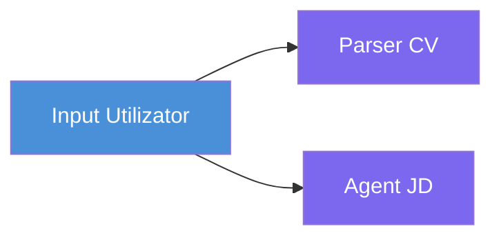
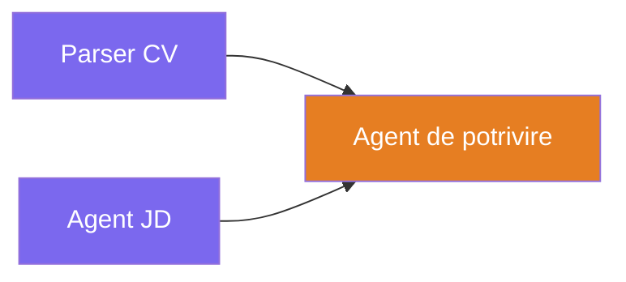
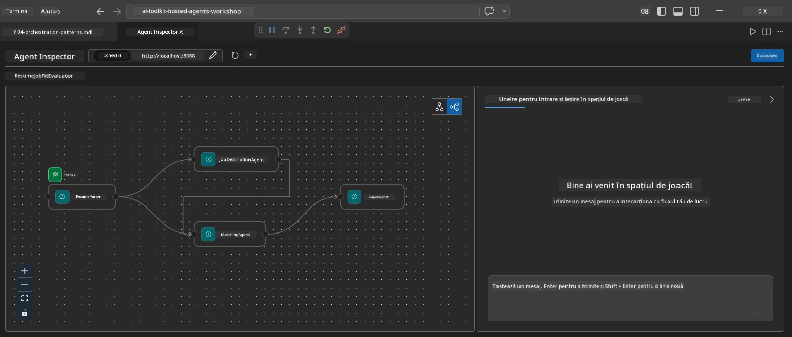
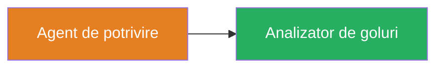
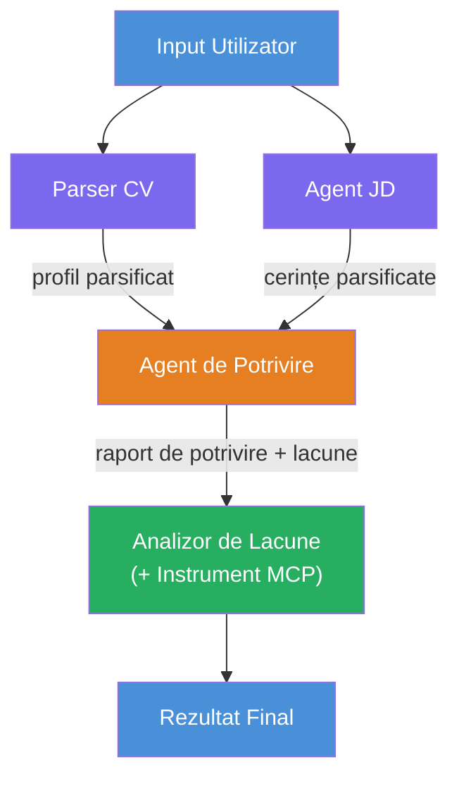
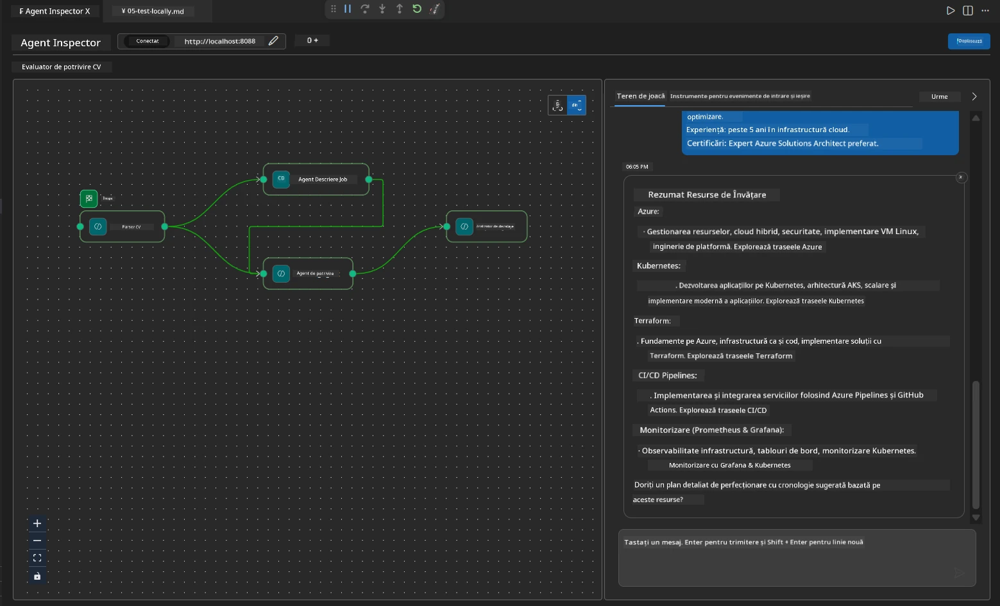

# Modulul 4 - Modele de Orchestrare

În acest modul, explorați modelele de orchestrare utilizate în Evaluatorul de Potrivire a Jobului din CV și învățați cum să citiți, modificați și extindeți graficul fluxului de lucru. Înțelegerea acestor modele este esențială pentru depanarea problemelor de flux de date și construirea propriilor dvs. [fluxuri multi-agent](https://learn.microsoft.com/agent-framework/workflows/).

---

## Modelul 1: Fan-out (divizare paralelă)

Primul model din fluxul de lucru este **fan-out** - o singură intrare este trimisă simultan către mai mulți agenți.


În cod, acest lucru se întâmplă deoarece `resume_parser` este `start_executor` - primește mai întâi mesajul utilizatorului. Apoi, deoarece atât `jd_agent`, cât și `matching_agent` au muchii de la `resume_parser`, cadrul direcționează ieșirea lui `resume_parser` către ambii agenți:

```python
.add_edge(resume_parser, jd_agent)         # Rezultatul ResumeParser → Agent JD
.add_edge(resume_parser, matching_agent)   # Rezultatul ResumeParser → Agent de potrivire
```

**De ce funcționează:** ResumeParser și JD Agent procesează aspecte diferite ale aceleiași intrări. Rularea lor în paralel reduce latența totală comparativ cu rularea lor secvențială.

### Când să folosiți fan-out

| Caz de utilizare | Exemplu |
|------------------|---------|
| Sub-sarcini independente | Parsarea CV-ului față de parsarea JD |
| Redundanță / votare | Doi agenți analizează aceleași date, un al treilea alege cel mai bun răspuns |
| Ieșire multi-format | Un agent generează text, altul generează JSON structurat |

---

## Modelul 2: Fan-in (agregare)

Al doilea model este **fan-in** - mai multe ieșiri de la agenți sunt colectate și trimise către un singur agent downstream.


În cod:

```python
.add_edge(resume_parser, matching_agent)   # Ieșire ResumeParser → MatchingAgent
.add_edge(jd_agent, matching_agent)        # Ieșire JD Agent → MatchingAgent
```

**Comportament cheie:** Când un agent are **două sau mai multe muchii de intrare**, cadrul așteaptă automat ca **toți** agenții upstream să termine înainte de a rula agentul downstream. MatchingAgent nu pornește până când atât ResumeParser, cât și JD Agent au terminat.

### Ce primește MatchingAgent

Cadrul concatenează ieșirile tuturor agenților upstream. Intrarea MatchingAgent arată astfel:

```
[ResumeParser output]
---
Candidate Profile:
  Name: Jane Doe
  Technical Skills: Python, Azure, Kubernetes, ...
  ...

[JobDescriptionAgent output]
---
Role Overview: Senior Cloud Engineer
Required Skills: Python, Azure, Terraform, ...
...
```

> **Notă:** Formatul exact de concatenare depinde de versiunea cadrul. Instrucțiunile agentului ar trebui să fie scrise pentru a gestiona atât ieșirea structurată, cât și cea neformatată de la agenții upstream.



---

## Modelul 3: Lanț secvențial

Al treilea model este **lanțul secvențial** - ieșirea unui agent alimentează direct pe următorul.


În cod:

```python
.add_edge(matching_agent, gap_analyzer)    # Ieșirea MatchingAgent → GapAnalyzer
```

Acesta este cel mai simplu model. GapAnalyzer primește scorul de potrivire, competențele potrivite / lipsă și golurile de la MatchingAgent. Apoi apelează [instrumentul MCP](https://learn.microsoft.com/azure/foundry/agents/how-to/tools/model-context-protocol) pentru fiecare gol pentru a obține resurse Microsoft Learn.

---

## Graficul complet

Combinarea tuturor celor trei modele produce fluxul complet de lucru:


### Cronologia execuției

```mermaid
gantt
    title Cronologia Executării Agentului
    dateFormat X
    axisFormat %s

    section Paralel
    Resume Parser       :rp, 0, 3
    JD Agent            :jd, 0, 2

    section Secvențial
    Matching Agent      :ma, 3, 5
    Gap Analyzer        :ga, 5, 9
```


> Timpul total de execuție este aproximativ `max(ResumeParser, JD Agent) + MatchingAgent + GapAnalyzer`. GapAnalyzer este de obicei cel mai lent deoarece efectuează mai multe apeluri către instrumentul MCP (câte unul pentru fiecare gol).

---

## Citirea codului WorkflowBuilder

Iată funcția completă `create_workflow()` din `main.py`, adnotată:

```python
def create_workflow(resume_parser, jd_agent, matching_agent, gap_analyzer):
    workflow = (
        WorkflowBuilder(
            name="ResumeJobFitEvaluator",

            # Primul agent care primește input de la utilizator
            start_executor=resume_parser,

            # Agentul/agentii al cărui output devine răspunsul final
            output_executors=[gap_analyzer],
        )
        # Fan-out: Output-ul ResumeParser merge atât către JD Agent cât și către MatchingAgent
        .add_edge(resume_parser, jd_agent)
        .add_edge(resume_parser, matching_agent)

        # Fan-in: MatchingAgent așteaptă atât ResumeParser cât și JD Agent
        .add_edge(jd_agent, matching_agent)

        # Secvențial: Output-ul MatchingAgent alimentează GapAnalyzer
        .add_edge(matching_agent, gap_analyzer)

        .build()
    )
    return workflow.as_agent()
```

### Tabel rezumat muchii

| # | Muchie | Model | Efect |
|---|--------|-------|-------|
| 1 | `resume_parser → jd_agent` | Fan-out | JD Agent primește ieșirea de la ResumeParser (plus intrarea originală a utilizatorului) |
| 2 | `resume_parser → matching_agent` | Fan-out | MatchingAgent primește ieșirea de la ResumeParser |
| 3 | `jd_agent → matching_agent` | Fan-in | MatchingAgent primește și ieșirea de la JD Agent (așteaptă ambele) |
| 4 | `matching_agent → gap_analyzer` | Secvențial | GapAnalyzer primește raportul de potrivire + lista de goluri |

---

## Modificarea graficului

### Adăugarea unui agent nou

Pentru a adăuga un al cincilea agent (de ex., un **InterviewPrepAgent** care generează întrebări de interviu bazate pe analiza golurilor):

```python
# 1. Definirea instrucțiunilor
INTERVIEW_PREP_INSTRUCTIONS = """\
You are the Interview Prep Agent.
Given a gap analysis and fit report, generate 10 targeted interview questions
the candidate should prepare for.
"""

# 2. Crearea agentului (în interiorul blocului async with)
AzureAIAgentClient(
    project_endpoint=PROJECT_ENDPOINT,
    model_deployment_name=MODEL_DEPLOYMENT_NAME,
    credential=credential,
).as_agent(
    name="InterviewPrepAgent",
    instructions=INTERVIEW_PREP_INSTRUCTIONS,
) as interview_prep,

# 3. Adăugarea muchiilor în create_workflow()
.add_edge(matching_agent, interview_prep)   # primește raportul de potrivire
.add_edge(gap_analyzer, interview_prep)     # primește de asemenea cărți gap

# 4. Actualizarea output_executors
output_executors=[interview_prep],  # acum agentul final
```

### Schimbarea ordinii de execuție

Pentru a face ca JD Agent să ruleze **după** ResumeParser (secvențial în loc de paralel):

```python
# Elimină: .add_edge(resume_parser, jd_agent)  ← există deja, păstrează-l
# Elimină paralelismul implicit prin faptul că jd_agent NU primește input direct de la utilizator
# start_executor trimite mai întâi la resume_parser, iar jd_agent primește doar
# output-ul resume_parser prin muchie. Acest lucru le face secvențiale.
```

> **Important:** `start_executor` este singurul agent care primește intrarea brută a utilizatorului. Toți ceilalți agenți primesc ieșirea de la muchiile lor upstream. Dacă doriți ca un agent să primească și intrarea brută a utilizatorului, acesta trebuie să aibă o muchie de la `start_executor`.

---

## Greșeli comune în grafic

| Greșeală | Simptom | Rezolvare |
|----------|---------|-----------|
| Muchie lipsă către `output_executors` | Agentul rulează, dar ieșirea este goală | Asigurați-vă că există un drum de la `start_executor` la fiecare agent din `output_executors` |
| Dependență circulară | Buclă infinită sau timeout | Verificați să nu existe niciun agent care să trimită înapoi către un agent upstream |
| Agent în `output_executors` fără muchie de intrare | Ieșire goală | Adăugați cel puțin o `add_edge(source, that_agent)` |
| Mai mulți `output_executors` fără fan-in | Ieșirea conține doar răspunsul unui singur agent | Folosiți un singur agent de ieșire care agregă sau acceptați mai multe ieșiri |
| Lipsa `start_executor` | `ValueError` la compilare | Specificați întotdeauna `start_executor` în `WorkflowBuilder()` |

---

## Depanarea graficului

### Folosind Agent Inspector

1. Porniți agentul local (F5 sau terminal - vezi [Modulul 5](05-test-locally.md)).
2. Deschideți Agent Inspector (`Ctrl+Shift+P` → **Foundry Toolkit: Open Agent Inspector**).
3. Trimiteți un mesaj de test.
4. În panoul de răspuns al Inspectorului, căutați ieșirea în streaming - care arată contribuția fiecărui agent în secvență.



### Folosind logging

Adăugați logare în `main.py` pentru a urmări fluxul de date:

```python
import logging
logger = logging.getLogger("resume-job-fit")

# În create_workflow(), după construirea:
logger.info("Workflow graph built with edges: RP→JD, RP→MA, JD→MA, MA→GA")
```

Jurnalele serverului arată ordinea execuției agenților și apelurile către instrumentul MCP:

```
INFO:resume-job-fit:Starting Resume -> Job Fit Evaluator HTTP server...
INFO:resume-job-fit:Server running on http://localhost:8088
INFO:agent_framework:Executing agent: ResumeParser
INFO:agent_framework:Executing agent: JobDescriptionAgent
INFO:agent_framework:Waiting for upstream agents: ResumeParser, JobDescriptionAgent
INFO:agent_framework:Executing agent: MatchingAgent
INFO:agent_framework:Executing agent: GapAnalyzer
INFO:agent_framework:Tool call: search_microsoft_learn_for_plan(skill="Kubernetes")
POST https://learn.microsoft.com/api/mcp → 200
INFO:agent_framework:Tool call: search_microsoft_learn_for_plan(skill="Terraform")
POST https://learn.microsoft.com/api/mcp → 200
```

---

### Checklist

- [ ] Puteți identifica cele trei modele de orchestrare în fluxul de lucru: fan-out, fan-in și lanț secvențial
- [ ] Înțelegeți că agenții cu multiple muchii de intrare așteaptă ca toți agenții upstream să termine
- [ ] Puteți citi codul `WorkflowBuilder` și maparea fiecărei apelări `add_edge()` la graficul vizual
- [ ] Înțelegeți cronologia execuției: agenții în paralel rulează primul, apoi agregarea, apoi secvențialul
- [ ] Știți cum să adăugați un agent nou în grafic (definește instrucțiuni, creează agent, adaugă muchii, actualizează ieșirea)
- [ ] Puteți identifica greșelile comune în grafic și simptomele acestora

---

**Anterior:** [03 - Configurare Agenți & Mediu](03-configure-agents.md) · **Următor:** [05 - Testare Locală →](05-test-locally.md)

---

<!-- CO-OP TRANSLATOR DISCLAIMER START -->
**Declinare a responsabilității**:  
Acest document a fost tradus folosind serviciul de traducere AI [Co-op Translator](https://github.com/Azure/co-op-translator). Deși ne străduim pentru acuratețe, vă rugăm să rețineți că traducerile automate pot conține erori sau inexactități. Documentul original în limba sa nativă trebuie considerat sursa autorizată. Pentru informații critice, se recomandă traducerea profesională realizată de un specialist uman. Nu ne asumăm răspunderea pentru orice neînțelegeri sau interpretări eronate care pot rezulta din utilizarea acestei traduceri.
<!-- CO-OP TRANSLATOR DISCLAIMER END -->