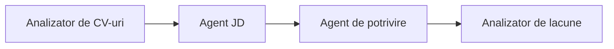
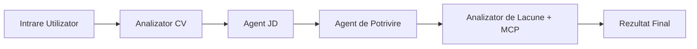

# Modulul 4 - Modele de Orchestrare

⏱️ ~10 minute

În acest modul, explorați modelele de orchestrare utilizate în Evaluatorul de Potrivire a Jobului din CV și învățați cum să citiți, modificați și extindeți graficul fluxului de lucru. Înțelegerea acestor modele este esențială pentru depanarea problemelor de flux de date și construirea propriilor [fluxuri de lucru multi-agent](https://learn.microsoft.com/agent-framework/workflows/).

---

## Modelul 1: Lanț secvențial

Modelul fundamental în fluxul de lucru este un **lanț secvențial** - outputul fiecărui agent alimentează direct următorul.


```mermaid
flowchart LR
    RP[Analizator de CV-uri] --> JD[Agent JD]
    JD --> MA[Agent de potrivire]
    MA --> GA[Analizator de lacune]
```

În cod, fiecare apel `add_edge()` creează un pas în lanț:

```python
.add_edge(resume_executor, jd_executor)       # Ieșirea ResumeParser → Agent JD
.add_edge(jd_executor, matching_executor)     # Ieșirea Agent JD → MatchingAgent
.add_edge(matching_executor, gap_executor)    # Ieșirea MatchingAgent → GapAnalyzer
```

> **De ce secvențial, nu răspândire/aglomerare?** `WorkflowBuilder` folosește **semantica OR** pentru muchiile de intrare: un executor posterior pornește imediat ce **orice** predecesor finalizează. Dacă `matching_executor` ar avea două muchii de intrare (de la `resume_executor` și `jd_executor`), s-ar declanșa de două ori – odată când ResumeParser se termină și încă o dată când JD Agent se termină – cauzând ca GapAnalyzer să ruleze de asemenea de două ori și outputul să apară duplicat. Pipeline-ul secvențial evită complet acest lucru.

## Modelul 2: Transmitere de conținut

Deoarece `context_mode="last_agent"` înseamnă că fiecare executor vede doar outputul **direct al predecesorului său**, agenții dintr-un lanț secvențial trebuie să transmită explicit orice date de care au nevoie agenții de mai jos.

În acest flux de lucru:
- **ResumeParser** copiază JD literal în `[JOB DESCRIPTION PASS-THROUGH]` (pentru ca JD Agent să îl poată găsi).
- **JD Agent** copiază `[PARSED RESUME]` literal în `[PARSED RESUME PASS-THROUGH]` (pentru ca MatchingAgent să poată compara ambele profiluri).

```
ResumeParser output
└─ [PARSED RESUME]               ← extracted by JD Agent
└─ [JOB DESCRIPTION PASS-THROUGH] ← extracted by JD Agent

JD Agent output
└─ [JD REQUIREMENTS]             ← extracted by MatchingAgent
└─ [PARSED RESUME PASS-THROUGH]  ← extracted by MatchingAgent
```

Fiecare secțiune de retransmitere trebuie copiată **literal** - rezumarea sau parafrazarea o strică pe agentul de jos, care depinde de ea.

---

## Graficul complet

Combinând modelele de lanț secvențial și transmitere de conținut se obține întregul flux de lucru:


```mermaid
flowchart LR
    U[Intrare Utilizator] --> RP[Analizator CV]
    RP --> JD[Agent JD]
    JD --> MA[Agent de Potrivire]
    MA --> GA[Analizator de Lacune + MCP]
    GA --> O[Rezultat Final]
```

Inspectorul de Agenți afișează aceeași structură grafică când agentul rulează local. Consultați [Modulul 5 - Testare Locală](05-test-locally.md) pentru capturi de ecran.

---

## Citirea codului WorkflowBuilder

Funcția completă `create_workflow()` se găsește în [`PersonalCareerCopilot/main.py`](../../../../../workshop/lab02-multi-agent/PersonalCareerCopilot/main.py). Cele trei apeluri `add_edge()` construiesc pipeline-ul secvențial:

| # | Muchie | Efect |
|---|------|--------|
| 1 | `resume_executor → jd_executor` | JD Agent primește `[PARSED RESUME]` + `[JOB DESCRIPTION PASS-THROUGH]` |
| 2 | `jd_executor → matching_executor` | MatchingAgent primește `[JD REQUIREMENTS]` + `[PARSED RESUME PASS-THROUGH]` |
| 3 | `matching_executor → gap_executor` | GapAnalyzer primește raportul de potrivire + lista lacunelor |

---

## Modificarea graficului

### Adăugarea unui nou agent

Pentru a adăuga un al cincilea agent (de exemplu, un **InterviewPrepAgent** după GapAnalyzer):

1. Definiți o constantă `INTERVIEW_PREP_INSTRUCTIONS`.
2. Creați obiectele `Agent` + `AgentExecutor` (același model ca și cei patru existenți).
3. Adăugați `.add_edge(gap_executor, interview_exec)` în `WorkflowBuilder`.
4. Actualizați `output_executors=[interview_exec]`.

> **Important:** `start_executor` este singurul agent care primește input brut de la utilizator. Toți ceilalți agenți primesc output de la muchia lor din amonte.

---

## Greșeli comune ale graficului

| Greșeală | Simptom | Remediere |
|---------|---------|-----|
| Muchie lipsă către `output_executors` | Agentul rulează, dar outputul este gol | Asigurați-vă că există un traseu de la `start_executor` la fiecare agent din `output_executors` |
| Dependență circulară | Buclă infinită sau timeout | Verificați să nu existe agent care să alimenteze înapoi un agent upstream |
| Agent în `output_executors` fără muchie de intrare | Output gol | Adăugați cel puțin o muchie `add_edge(sursa, acel_agent)` |
| Mai mulți `output_executors` fără fan-in | Output conține răspunsul unui singur agent | Folosiți un singur agent output care agregă sau acceptați multiple output-uri |
| Lipsă `start_executor` | `ValueError` la build | Specificați întotdeauna `start_executor` în `WorkflowBuilder()` |

---

## Depanarea graficului

### Folosind Agent Inspector

1. Porniți agentul local cu F5.
2. Deschideți Agent Inspector (`Ctrl+Shift+P` → **Foundry Toolkit: Open Agent Inspector**).
3. Trimiteți un mesaj de test.
4. În panoul de răspuns al Inspectorului, căutați **outputul în streaming** - acesta arată contribuția fiecărui agent în secvență.


### Folosind logarea

Adăugați logare în `main.py` pentru a urmări fluxul de date:

```python
import logging
logger = logging.getLogger("resume-job-fit")

# În main(), după construirea fluxului de lucru:
logger.info("Workflow graph built with edges: RP→JD, JD→MA, MA→GA")
```

Logurile serverului afișează ordinea execuției agenților și apelurile spre MCP tool:

```
INFO:agent_framework:Executing agent: ResumeParser
INFO:agent_framework:Executing agent: JobDescriptionAgent
INFO:agent_framework:Executing agent: MatchingAgent
INFO:agent_framework:Executing agent: GapAnalyzer
INFO:agent_framework:Tool call: search_microsoft_learn_for_plan(skill="Kubernetes")
POST https://learn.microsoft.com/api/mcp → 200
INFO:agent_framework:Tool call: search_microsoft_learn_for_plan(skill="Terraform")
POST https://learn.microsoft.com/api/mcp → 200
```

---

### Punct de control

- [ ] Puteți identifica cele două modele de orchestrare în fluxul de lucru: lanț secvențial și transmitere de conținut
- [ ] Înțelegeți de ce `context_mode="last_agent"` cere transmiterea explicită a datelor între agenți
- [ ] Puteți citi codul `WorkflowBuilder` și mapa fiecare apel `add_edge()` cu graficul vizual
- [ ] Știți cum să adăugați un agent nou la sfârșitul pipeline-ului
- [ ] Puteți identifica greșelile comune ale graficului și simptomele lor

---

**Anterior:** [03 - Configurare Agenți & Mediu](03-configure-agents.md) · **Următor:** [05 - Testare Locală →](05-test-locally.md)

---

<!-- CO-OP TRANSLATOR DISCLAIMER START -->
**Declinare a responsabilității**:
Acest document a fost tradus folosind serviciul de traducere AI [Co-op Translator](https://github.com/Azure/co-op-translator). În timp ce ne străduim pentru acuratețe, vă rugăm să rețineți că traducerile automate pot conține erori sau inexactități. Documentul original în limba sa nativă trebuie considerat sursa autorizată. Pentru informații critice, se recomandă traducerea profesională realizată de un om. Nu ne asumăm responsabilitatea pentru eventualele neînțelegeri sau interpretări greșite care decurg din utilizarea acestei traduceri.
<!-- CO-OP TRANSLATOR DISCLAIMER END -->