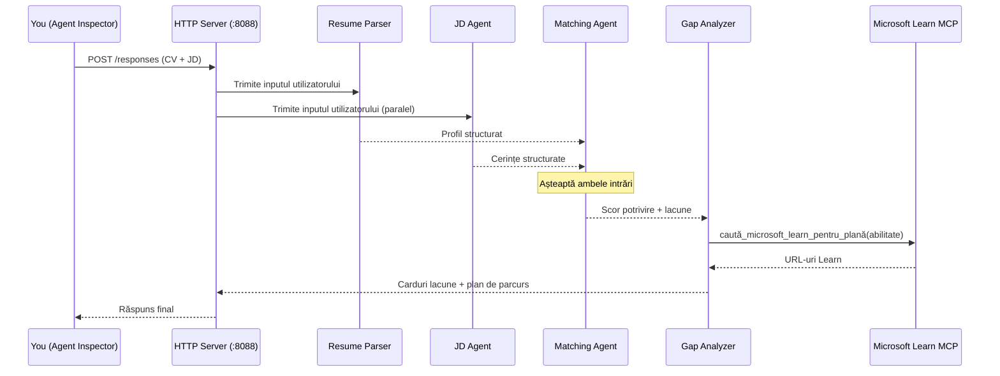
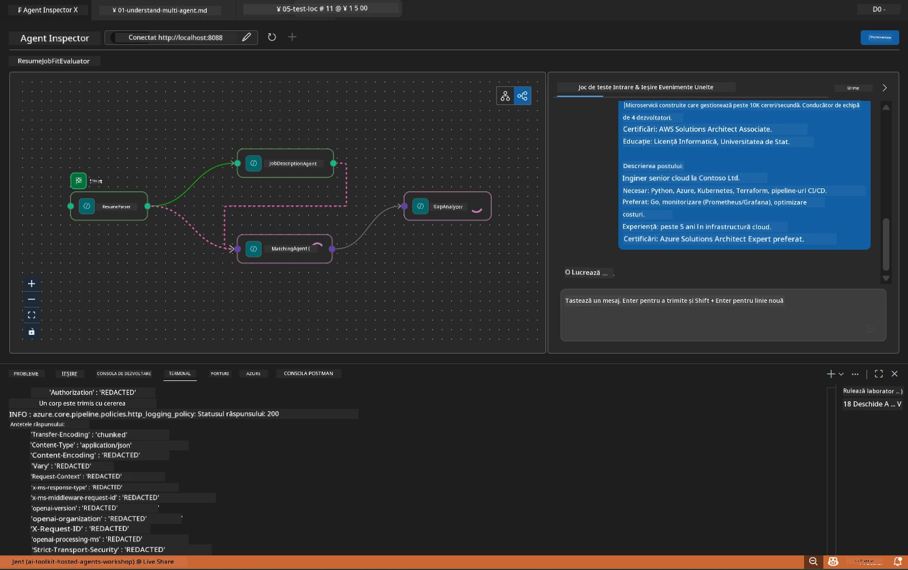

# Modului 5 - Testare Locală (Multi-Agent)

În acest modul, vei rula fluxul de lucru multi-agent local, îl vei testa cu Agent Inspector și vei verifica că toți cei patru agenți și instrumentul MCP funcționează corect înainte de a-l implementa în Foundry.

### Ce se întâmplă în timpul unei rulări de test local


---

## Pasul 1: Pornește serverul agentului

### Opțiunea A: Folosind task-ul VS Code (recomandat)

1. Apasă `Ctrl+Shift+P` → tastează **Tasks: Run Task** → selectează **Run Lab02 HTTP Server**.
2. Task-ul pornește serverul cu debugpy atașat pe portul `5679` și agentul pe portul `8088`.
3. Așteaptă să apară în output:

```
INFO:resume-job-fit:Starting Resume -> Job Fit Evaluator HTTP server...
INFO:resume-job-fit:Server running on http://localhost:8088
```

### Opțiunea B: Folosind terminalul manual

```powershell
cd workshop\lab02-multi-agent\PersonalCareerCopilot
```

Activează mediul virtual:

**PowerShell (Windows):**
```powershell
.\.venv\Scripts\Activate.ps1
```

**macOS/Linux:**
```bash
source .venv/bin/activate
```

Pornește serverul:

```powershell
python -m debugpy --listen 127.0.0.1:5679 -m agentdev run main.py --verbose --port 8088
```

### Opțiunea C: Folosind F5 (mod debug)

1. Apasă `F5` sau mergi la **Run and Debug** (`Ctrl+Shift+D`).
2. Selectează configurația de lansare **Lab02 - Multi-Agent** din lista dropdown.
3. Serverul pornește cu suport complet pentru breakpoint-uri.

> **Sfat:** Modul debug îți permite să setezi breakpoint-uri în interiorul funcției `search_microsoft_learn_for_plan()` pentru a inspecta răspunsurile MCP, sau în instrucțiunile agenților pentru a vedea ce primește fiecare agent.

---

## Pasul 2: Deschide Agent Inspector

1. Apasă `Ctrl+Shift+P` → tastează **Foundry Toolkit: Open Agent Inspector**.
2. Agent Inspector se deschide într-un tab al browserului la `http://localhost:5679`.
3. Ar trebui să vezi interfața agentului pregătită să accepte mesaje.

> **Dacă Agent Inspector nu se deschide:** Asigură-te că serverul este pornit complet (vezi logul "Server running"). Dacă portul 5679 este ocupat, vezi [Modul 8 - Depanare](08-troubleshooting.md).

---

## Pasul 3: Rulează testele de fum

Rulează aceste trei teste în ordine. Fiecare testează progresiv mai mult din fluxul de lucru.

### Testul 1: CV de bază + descriere job

Lipește următorul în Agent Inspector:

```
Resume:
Jane Doe
Senior Software Engineer with 5 years of experience in Python, Django, and AWS.
Built microservices handling 10K+ requests/second. Led a team of 4 developers.
Certifications: AWS Solutions Architect Associate.
Education: B.S. Computer Science, State University.

Job Description:
Senior Cloud Engineer at Contoso Ltd.
Required: Python, Azure, Kubernetes, Terraform, CI/CD pipelines.
Preferred: Go, monitoring (Prometheus/Grafana), cost optimization.
Experience: 5+ years in cloud infrastructure.
Certifications: Azure Solutions Architect Expert preferred.
```

**Structura așteptată a răspunsului:**

Răspunsul ar trebui să conțină ieșire de la toți cei patru agenți în secvență:

1. **Ieșirea Resume Parser** - Profil structurat al candidatului cu abilități grupate pe categorii
2. **Ieșirea JD Agent** - Cerințe structurate cu abilități obligatorii vs. preferate separate
3. **Ieșirea Matching Agent** - Scor de potrivire (0-100) cu detalii, abilități potrivite, abilități lipsă, decalaje
4. **Ieșirea Gap Analyzer** - Carduri individuale pentru fiecare abilitate lipsă, fiecare cu URL-uri Microsoft Learn



### Ce să verifici în Testul 1

| Verificare | Așteptat | Validare |
|------------|----------|----------|
| Răspunsul conține un scor de potrivire | Număr între 0-100 cu detalii | |
| Abilitățile potrivite sunt listate | Python, CI/CD (parțial), etc. | |
| Abilitățile lipsă sunt listate | Azure, Kubernetes, Terraform, etc. | |
| Există carduri gap pentru fiecare abilitate lipsă | Un card per abilitate | |
| Sunt prezente URL-uri Microsoft Learn | Linkuri reale `learn.microsoft.com` | |
| Nu există mesaje de eroare în răspuns | Ieșire curată și structurată | |

### Testul 2: Verifică executarea instrumentului MCP

În timp ce rulează Testul 1, verifică **terminalul serverului** pentru înregistrări de log MCP:

```
GET https://learn.microsoft.com/api/mcp → 405 (Method Not Allowed)
POST https://learn.microsoft.com/api/mcp → 200
DELETE https://learn.microsoft.com/api/mcp → 405 (Method Not Allowed)
```

| Înregistrare de log | Semnificație | Așteptat? |
|--------------------|-------------|-----------|
| `GET ... → 405` | Client MCP probează cu GET în timpul inițializării | Da - normal |
| `POST ... → 200` | Apel efectiv la serverul MCP Microsoft Learn | Da - acesta este apelul real |
| `DELETE ... → 405` | Client MCP probează cu DELETE la curățare | Da - normal |
| `POST ... → 4xx/5xx` | Apelul instrumentului a eșuat | Nu - vezi [Depanare](08-troubleshooting.md) |

> **Punct cheie:** Liniile `GET 405` și `DELETE 405` sunt **comportamente așteptate**. Îngrijorătoare sunt doar apelurile `POST` cu coduri de stare non-200.

### Testul 3: Caz limită - candidat cu potrivire înaltă

Lipește un CV care corespunde strâns cu descrierea jobului pentru a verifica dacă GapAnalyzer gestionează cazurile de potrivire înaltă:

```
Resume:
Alex Chen
Senior Cloud Engineer with 7 years of experience.
Skills: Python, Azure (AKS, Functions, DevOps), Kubernetes, Terraform, CI/CD (GitHub Actions, Azure Pipelines), Go, Prometheus, Grafana, cost optimization.
Certifications: Azure Solutions Architect Expert, Azure DevOps Engineer Expert.
Led infrastructure migration to Azure for 3 enterprise clients.
Education: M.S. Computer Science, Tech University.

Job Description:
Senior Cloud Engineer at Contoso Ltd.
Required: Python, Azure, Kubernetes, Terraform, CI/CD pipelines.
Preferred: Go, monitoring (Prometheus/Grafana), cost optimization.
Experience: 5+ years in cloud infrastructure.
Certifications: Azure Solutions Architect Expert preferred.
```

**Comportament așteptat:**
- Scorul de potrivire să fie **80+** (cele mai multe abilități coincid)
- Cardurile gap să se concentreze pe rafinare/pregătire interviu, nu pe învățare de bază
- Instrucțiunile GapAnalyzer spun: "Dacă fit >= 80, concentrează-te pe rafinare/pregătire interviu"

---

## Pasul 4: Verifică completitudinea ieșirii

După ce rulezi testele, verifică dacă ieșirea îndeplinește următoarele criterii:

### Lista de verificare a structurii ieșirii

| Secțiune | Agent | Prezent? |
|----------|-------|----------|
| Profil candidat | Resume Parser | |
| Abilități tehnice (grupate) | Resume Parser | |
| Prezentare generală rol | JD Agent | |
| Abilități obligatorii vs. preferate | JD Agent | |
| Scor de potrivire cu detalii | Matching Agent | |
| Abilități potrivite / lipsă / parțiale | Matching Agent | |
| Card gap per abilitate lipsă | Gap Analyzer | |
| URL-uri Microsoft Learn în cardurile gap | Gap Analyzer (MCP) | |
| Ordinea învățării (numerotată) | Gap Analyzer | |
| Rezumat cronologie | Gap Analyzer | |

### Probleme comune în această etapă

| Problema | Cauză | Soluție |
|----------|--------|---------|
| Doar 1 card gap (restul trunchiat) | Instrucțiuni GapAnalyzer lipsesc blocul CRITICAL | Adaugă paragraful `CRITICAL:` în `GAP_ANALYZER_INSTRUCTIONS` - vezi [Modul 3](03-configure-agents.md) |
| Lipsesc URL-urile Microsoft Learn | Endpoint MCP inaccesibil | Verifică conexiunea la internet. Verifică că `MICROSOFT_LEARN_MCP_ENDPOINT` în `.env` este `https://learn.microsoft.com/api/mcp` |
| Răspuns gol | `PROJECT_ENDPOINT` sau `MODEL_DEPLOYMENT_NAME` nu sunt setate | Verifică valorile în fișierul `.env`. Rulează `echo $env:PROJECT_ENDPOINT` în terminal |
| Scor de potrivire 0 sau lipsă | MatchingAgent nu a primit date din upstream | Verifică că există `add_edge(resume_parser, matching_agent)` și `add_edge(jd_agent, matching_agent)` în `create_workflow()` |
| Agentul pornește dar iese imediat | Eroare de import sau dependență lipsă | Rulează din nou `pip install -r requirements.txt`. Verifică eventualele stack trace-uri în terminal |
| Eroare `validate_configuration` | Variabile de mediu lipsă | Creează `.env` cu `PROJECT_ENDPOINT=<your-endpoint>` și `MODEL_DEPLOYMENT_NAME=<your-model>` |

---

## Pasul 5: Testează cu propriile date (opțional)

Încearcă să lipești CV-ul tău și o descriere reală de job. Acest lucru ajută să verifici:

- Dacă agenții gestionează diferite formate de CV (cronologic, funcțional, hibrid)
- Dacă JD Agent gestionează stiluri diferite de descriere de job (liste cu puncte, paragrafe, structurat)
- Dacă instrumentul MCP returnează resurse relevante pentru abilitățile reale
- Dacă cardurile gap sunt personalizate pe baza background-ului tău specific

> **Notă de confidențialitate:** Când testezi local, datele tale rămân pe calculatorul tău și sunt trimise doar către implementarea ta Azure OpenAI. Nu sunt înregistrate sau stocate de infrastructura workshop-ului. Poți folosi nume de substituție dacă preferi (ex: „Jane Doe” în loc de numele real).

---

### Lista de control

- [ ] Server pornit cu succes pe portul `8088` (log arată "Server running")
- [ ] Agent Inspector deschis și conectat la agent
- [ ] Test 1: Răspuns complet cu scor de potrivire, abilități potrivite/lipsă, carduri gap și URL-uri Microsoft Learn
- [ ] Test 2: Logurile MCP arată `POST ... → 200` (apeluri la instrument reușite)
- [ ] Test 3: Candidat cu potrivire înaltă primește scor 80+ cu recomandări axate pe rafinare
- [ ] Toate cardurile gap prezente (unul per abilitate lipsă, fără trunchiere)
- [ ] Nicio eroare sau stack trace în terminalul serverului

---

**Anterior:** [04 - Orchestrarea Pattern-urilor](04-orchestration-patterns.md) · **Următor:** [06 - Implementare în Foundry →](06-deploy-to-foundry.md)

---

<!-- CO-OP TRANSLATOR DISCLAIMER START -->
**Declinare a responsabilității**:
Acest document a fost tradus folosind serviciul de traducere AI [Co-op Translator](https://github.com/Azure/co-op-translator). Deși ne străduim pentru acuratețe, vă rugăm să rețineți că traducerile automate pot conține erori sau inexactități. Documentul original în limba sa nativă trebuie considerat sursa autorizată. Pentru informații critice, se recomandă traducerea profesională realizată de un traducător uman. Nu ne asumăm răspunderea pentru eventualele neînțelegeri sau interpretări greșite rezultate din utilizarea acestei traduceri.
<!-- CO-OP TRANSLATOR DISCLAIMER END -->