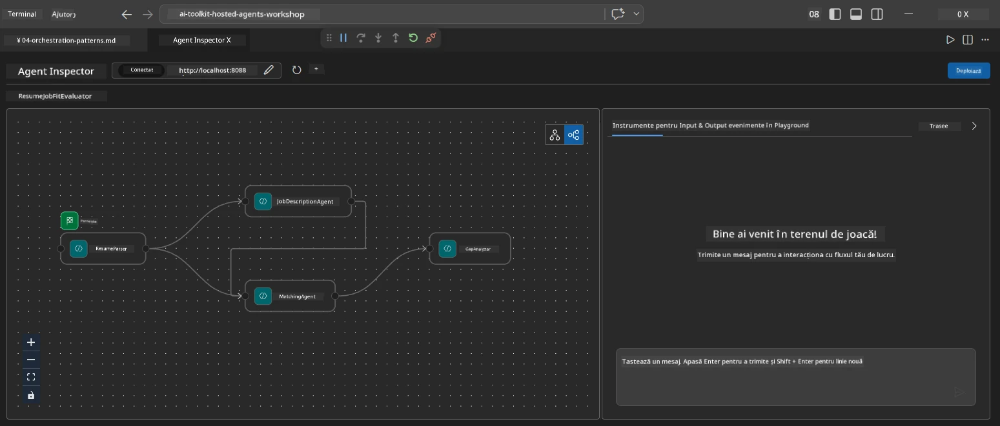
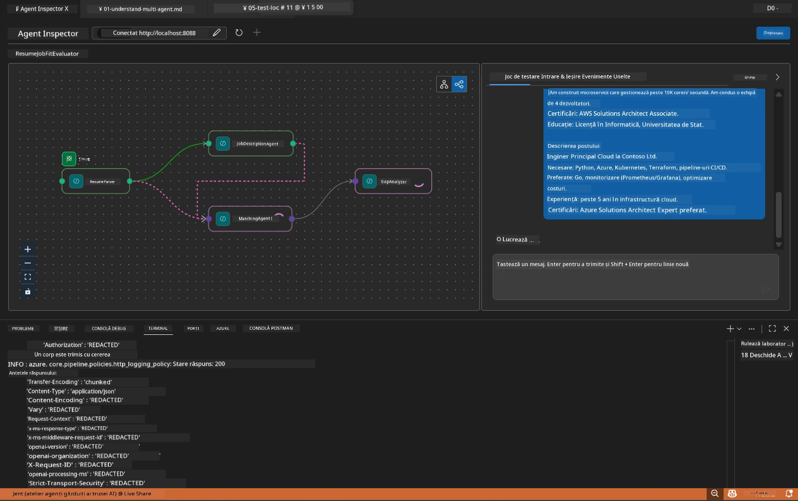
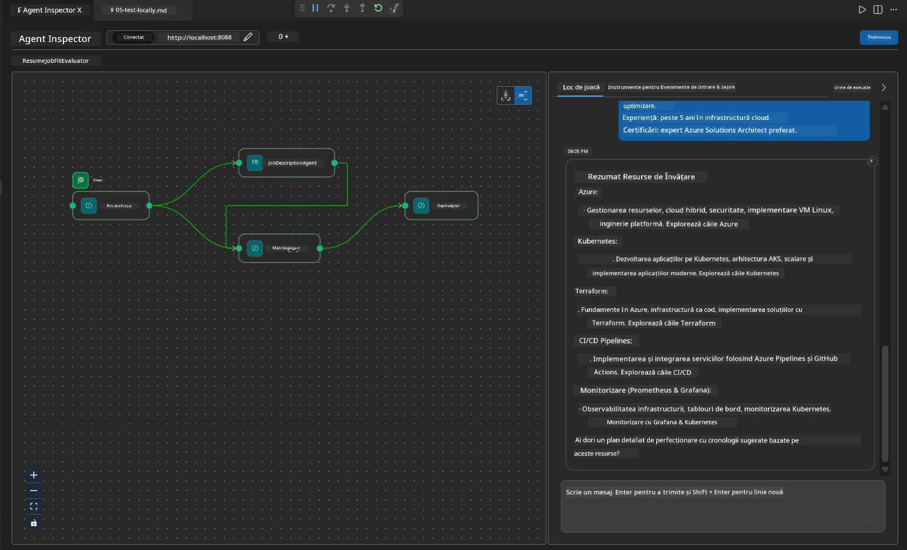

# Modulul 5 - Testare Locală

⏱️ ~15 min

În acest modul, vei rula fluxul de lucru multi-agent local, îl vei testa cu Agent Inspector și vei verifica că toți cei patru agenți și instrumentul MCP funcționează corect înainte de implementare.

---

## Pasul 1: Pornește serverul agentului

### Opțiunea A: Folosind task-ul VS Code (recomandat)

1. Deschide `workshop/lab02-multi-agent/PersonalCareerCopilot/` ca folder în VS Code.
2. Apasă `Ctrl+Shift+P` → tastează **Tasks: Run Task** → selectează **Run Agent HTTP Server**.
3. Task-ul pornește serverul cu debugpy atașat pe portul `5679` și agentul pe portul `8088`.
4. Așteaptă ca în output să apară:

```
INFO:resume-job-fit:Starting Resume -> Job Fit Evaluator HTTP server...
INFO:resume-job-fit:Server running on http://localhost:8088
```

### Opțiunea B: Folosind F5 (mod debug)

1. Apasă `F5` → selectează **Debug Local Agent HTTP Server**.
2. Serverul pornește cu suport complet pentru breakpoint-uri - util pentru inspectarea răspunsurilor MCP sau a output-ului agenților.

---

## Pasul 2: Deschide Agent Inspector

1. Apasă `Ctrl+Shift+P` → tastează **Foundry Toolkit: Open Agent Inspector**.
2. Agent Inspector se deschide ca un panou în VS Code conectat la `http://localhost:8088`.
3. Ar trebui să vezi interfața agentului gata să primească mesaje.



> **Dacă Agent Inspector nu se deschide:** Asigură-te că serverul este complet pornit (vei vedea în log mesajul "Server running"). Dacă portul 5679 este ocupat, vezi [Modulul 8 - Depanare](08-troubleshooting.md).

---

## Pasul 2b: (Opțional) Deschide Workflow Visualizer

Foundry Toolkit include un **Workflow Visualizer** în timp real care arată cum interacționează agenții pe măsură ce graful se execută. Este deosebit de util pentru depanarea multi-agent.

1. Apasă `Ctrl+Shift+P` → tastează **Foundry Toolkit: Open Visualizer for Hosted Agents**.
2. Se deschide o filă nouă în VS Code care afișează graficul de execuție live.
3. Pe măsură ce trimiți mesaje în Agent Inspector, visualizer-ul se actualizează automat - nodurile verzi indică agenți finalizați, iar marginile animate arată fluxul de date între ei.

> **Conflict de port:** Dacă portul visualizer-ului este deja folosit, îl poți schimba în VS Code Settings → **Extensions** → **Microsoft Foundry Configuration** → **Hosted Agents: Visualizer Port**.

---

## Pasul 3: Rulează teste rapide

Rulează aceste trei teste în ordine. Fiecare testează progresiv mai mult din fluxul de lucru.

### Test 1: CV de bază + descriere job

Li-pește următorul în Agent Inspector:

```
Resume:
Jane Doe
Senior Software Engineer with 5 years of experience in Python, Django, and AWS.
Built microservices handling 10K+ requests/second. Led a team of 4 developers.
Certifications: AWS Solutions Architect Associate.
Education: B.S. Computer Science, State University.

Job Description:
Senior Cloud Engineer at Contoso Ltd.
Required: Python, Azure, Kubernetes, Terraform, CI/CD pipelines.
Preferred: Go, monitoring (Prometheus/Grafana), cost optimization.
Experience: 5+ years in cloud infrastructure.
Certifications: Azure Solutions Architect Expert preferred.
```

**Structura așteptată a răspunsului:**

Răspunsul ar trebui să conțină output-ul tuturor celor patru agenți în ordine:

1. **Output Parser CV** - Două secțiuni etichetate: `[PARSED RESUME]` (profil candidat cu competențe grupate) și `[JOB DESCRIPTION PASS-THROUGH]` (text JD exact care alimentează Agentul JD)
2. **Output Agent JD** - Cerințe structurate cu abilitățile obligatorii și preferate separate
3. **Output Agent Matching** - Scor de potrivire (0-100) cu detaliere, competențe potrivite, competențe lipsă, lacune
4. **Output Gap Analyzer** - Carduri individuale pentru fiecare competență lipsă, fiecare cu URL-uri Microsoft Learn





### Ce să verifici în Test 1

| Verificare | Așteptat | Trecut? |
|-------|----------|-------|
| Răspunsul conține scor de potrivire | Număr între 0-100 cu detaliere | |
| Sunt listate competențele potrivite | Python, CI/CD (parțial), etc. | |
| Sunt listate competențele lipsă | Azure, Kubernetes, Terraform, etc. | |
| Există carduri pentru fiecare competență lipsă | Un card per competență | |
| Sunt prezente URL-uri Microsoft Learn | Link-uri reale `learn.microsoft.com` | |
| Fără mesaje de eroare în răspuns | Output curat și structurat | |

### Test 2: Caz limită - candidat cu potrivire mare

Li-pește un CV care se potrivește foarte bine cu JD pentru a verifica cum gestionează GapAnalyzer scenariile cu potrivire mare:

```
Resume:
Alex Chen
Senior Cloud Engineer with 7 years of experience.
Skills: Python, Azure (AKS, Functions, DevOps), Kubernetes, Terraform, CI/CD (GitHub Actions, Azure Pipelines), Go, Prometheus, Grafana, cost optimization.
Certifications: Azure Solutions Architect Expert, Azure DevOps Engineer Expert.
Led infrastructure migration to Azure for 3 enterprise clients.
Education: M.S. Computer Science, Tech University.

Job Description:
Senior Cloud Engineer at Contoso Ltd.
Required: Python, Azure, Kubernetes, Terraform, CI/CD pipelines.
Preferred: Go, monitoring (Prometheus/Grafana), cost optimization.
Experience: 5+ years in cloud infrastructure.
Certifications: Azure Solutions Architect Expert preferred.
```

**Comportament așteptat:**
- Scorul de potrivire ar trebui să fie **80+** (cele mai multe competențe se potrivesc)
- Cardurile lacunelor ar trebui să fie axate pe rafinare/pregătire pentru interviu, nu pe învățare de bază
- Instrucțiunile GapAnalyzer spun: "Dacă fit >= 80, se concentrează pe rafinare/pregătire pentru interviu"

---

## Pasul 4: Testează cu propriile date (opțional)

Încearcă să li-pești propriul CV și o descriere reală de job. Acest lucru ajută la verificare:

- Agenții gestionează diferite formate de CV (cronologic, funcțional, hibrid)
- Agentul JD gestionează diferite stiluri de JD (puncte, paragrafe, structurat)
- Instrumentul MCP returnează resurse relevante pentru competențele reale
- Cardurile lacunelor sunt personalizate pentru background-ul tău specific

> **Confidențialitate - Calea A (Foundry cloud):** Textul CV și JD este trimis către implementarea ta Azure OpenAI pentru inferență. Nu este înregistrat sau stocat de infrastructura workshop-ului. Folosește nume fictive (ex: "Jane Doe") dacă preferi.
>
> **Confidențialitate - Calea B (Foundry Local):** Toate cele patru inferențe de agent rulează complet pe dispozitivul tău. Textul CV și descrierea de job **nu părăsesc niciodată mașina ta**. Singura apelare externă este instrumentul MCP care aduce resurse de la `https://learn.microsoft.com/api/mcp`; acea interogare conține doar numele competenței, nu datele tale personale.

---

### Punct de control

- [ ] Server pornit cu succes pe portul `8088` (log-ul afișează "Server running")
- [ ] Agent Inspector deschis și conectat la agent
- [ ] Test 1: Răspuns complet cu scor de potrivire, competențe potrivite/lipsite, carduri lacune și URL-uri Microsoft Learn
- [ ] Test 2: Candidat cu potrivire mare obține scor 80+ cu recomandări axate pe rafinare
- [ ] Toate cardurile lacunelor prezente (unul per competență lipsă, fără trunchiere)
- [ ] Fără erori sau stack trace în terminalul serverului

---

**Anterior:** [04 - Orchestration Patterns](04-orchestration-patterns.md) · **Următor:** [06 - Deploy to Foundry →](06-deploy-to-foundry.md)

---

<!-- CO-OP TRANSLATOR DISCLAIMER START -->
**Declinare a responsabilității**:
Acest document a fost tradus folosind serviciul de traducere AI [Co-op Translator](https://github.com/Azure/co-op-translator). În timp ce ne străduim pentru acuratețe, vă rugăm să rețineți că traducerile automate pot conține erori sau inexactități. Documentul original în limba sa nativă trebuie considerat sursa autorizată. Pentru informații critice, se recomandă traducerea profesională realizată de un om. Nu ne asumăm responsabilitatea pentru eventualele neînțelegeri sau interpretări greșite care decurg din utilizarea acestei traduceri.
<!-- CO-OP TRANSLATOR DISCLAIMER END -->