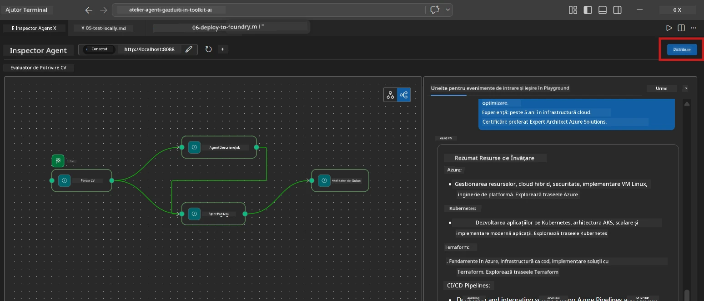
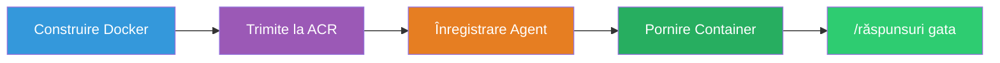
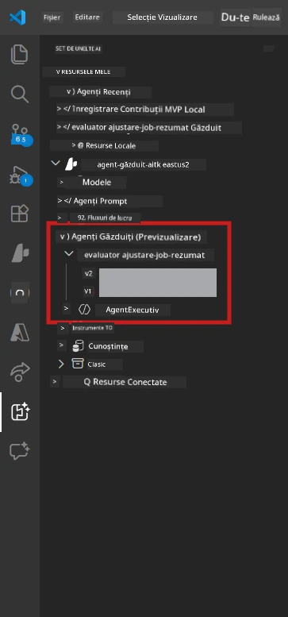

# Modulul 6 - Deploy către Foundry Agent Service

În acest modul, veți implementa fluxul de lucru multi-agent testat local pe [Microsoft Foundry](https://learn.microsoft.com/azure/foundry/agents/concepts/hosted-agents) ca un **Agent găzduit**. Procesul de implementare construiește o imagine Docker a containerului, o împinge către [Azure Container Registry (ACR)](https://learn.microsoft.com/azure/container-registry/container-registry-intro) și creează o versiune de agent găzduit în [Foundry Agent Service](https://learn.microsoft.com/azure/foundry/agents/how-to/publish-agent).

> **Diferența cheie față de Laboratorul 01:** Procesul de implementare este identic. Foundry tratează fluxul dumneavoastră multi-agent ca un singur agent găzduit - complexitatea este în interiorul containerului, dar suprafața de implementare este același endpoint `/responses`.

---

## Verificarea prerechizitelor

Înainte de implementare, verificați fiecare element de mai jos:

1. **Agentul trece testele locale de bază:**
   - Ați finalizat toate cele 3 teste din [Modulul 5](05-test-locally.md) și fluxul de lucru a produs un output complet cu carduri gap și URL-uri Microsoft Learn.

2. **Aveți rolul [Azure AI User](https://learn.microsoft.com/azure/foundry/concepts/rbac-foundry):**
   - Atribuit în [Laboratorul 01, Modulul 2](../../lab01-single-agent/docs/02-create-foundry-project.md). Verificați:
   - [Azure Portal](https://portal.azure.com) → resursa **proiect** Foundry → **Control acces (IAM)** → **Atribuiri roluri** → confirmați că **[Azure AI User](https://aka.ms/foundry-ext-project-role)** figurează pentru contul dumneavoastră.

3. **Sunteți conectat(ă) la Azure în VS Code:**
   - Verificați pictograma Conturi în colțul din stânga jos al VS Code. Numele contului trebuie să fie vizibil.

4. **`agent.yaml` are valorile corecte:**
   - Deschideți `PersonalCareerCopilot/agent.yaml` și verificați:
     ```yaml
     environment_variables:
       - name: PROJECT_ENDPOINT
         value: ${PROJECT_ENDPOINT}
       - name: MODEL_DEPLOYMENT_NAME
         value: ${MODEL_DEPLOYMENT_NAME}
     ```
   - Aceste valori trebuie să corespundă variabilelor de mediu citite de `main.py`.

5. **`requirements.txt` are versiunile corecte:**
   ```
   agent-framework-azure-ai==1.0.0rc3
   agent-framework-core==1.0.0rc3
   azure-ai-agentserver-agentframework==1.0.0b16
   azure-ai-agentserver-core==1.0.0b16
   debugpy
   agent-dev-cli --pre
   ```

---

## Pasul 1: Începeți implementarea

### Opțiunea A: Implementare din Agent Inspector (recomandat)

Dacă agentul rulează prin F5 și Agent Inspector este deschis:

1. Priviți în **colțul din dreapta sus** al panoului Agent Inspector.
2. Click pe butonul **Deploy** (pictograma nor cu săgeată în sus ↑).
3. Se deschide expertul de implementare.



### Opțiunea B: Implementare din Command Palette

1. Apăsați `Ctrl+Shift+P` pentru a deschide **Command Palette**.
2. Tastați: **Microsoft Foundry: Deploy Hosted Agent** și selectați-l.
3. Se deschide expertul de implementare.

---

## Pasul 2: Configurați implementarea

### 2.1 Selectați proiectul țintă

1. Un dropdown afișează proiectele dumneavoastră Foundry.
2. Selectați proiectul folosit pe parcursul atelierului (exemplu: `workshop-agents`).

### 2.2 Selectați fișierul agentului container

1. Vi se va cere să selectați punctul de intrare al agentului.
2. Navigați la `workshop/lab02-multi-agent/PersonalCareerCopilot/` și alegeți **`main.py`**.

### 2.3 Configurați resursele

| Setare | Valoare recomandată | Note |
|---------|------------------|-------|
| **CPU** | `0.25` | Implicit. Fluxurile multi-agent nu au nevoie de mai multă CPU deoarece apelurile modelului sunt legate de I/O |
| **Memorie** | `0.5Gi` | Implicit. Măriți la `1Gi` dacă adăugați unelte de prelucrare de date mari |

---

## Pasul 3: Confirmați și implementați

1. Expertul afișează un rezumat al implementării.
2. Revizuiți și apăsați **Confirm and Deploy**.
3. Urmăriți progresul în VS Code.

### Ce se întâmplă în timpul implementării

Urmăriți panoul **Output** din VS Code (selectați dropdown-ul "Microsoft Foundry"):


1. **Construirea Docker** - Construiește containerul din `Dockerfile`:
   ```
   Step 1/6 : FROM python:3.14-slim
   Step 2/6 : WORKDIR /app
   ...
   Successfully built abc123def456
   ```

2. **Push Docker** - Împinge imaginea către ACR (1-3 minute la prima implementare).

3. **Înregistrarea agentului** - Foundry creează un agent găzduit folosind metadatele din `agent.yaml`. Numele agentului este `resume-job-fit-evaluator`.

4. **Pornirea containerului** - Containerul pornește în infrastructura gestionată de Foundry cu o identitate administrată de sistem.

> **Prima implementare este mai lentă** (Docker împinge toate straturile). Implementările ulterioare reutilizează straturi cache și sunt mai rapide.

### Note specifice pentru multi-agent

- **Toți cei patru agenți sunt în interiorul unui singur container.** Foundry vede un singur agent găzduit. Graficul WorkflowBuilder rulează intern.
- **Apelurile MCP ies în exterior.** Containerul are nevoie de acces la internet pentru a ajunge la `https://learn.microsoft.com/api/mcp`. Infrastructura gestionată de Foundry oferă aceasta implicit.
- **[Identitate gestionată](https://learn.microsoft.com/python/api/overview/azure/identity-readme#managed-identity-support).** În mediul găzduit, `get_credential()` din `main.py` întoarce `ManagedIdentityCredential()` (deoarece `MSI_ENDPOINT` este setat). Acest lucru este automat.

---

## Pasul 4: Verificați starea implementării

1. Deschideți bara laterală **Microsoft Foundry** (faceți click pe pictograma Foundry din Activity Bar).
2. Extindeți **Hosted Agents (Preview)** sub proiectul dumneavoastră.
3. Găsiți **resume-job-fit-evaluator** (sau numele agentului dumneavoastră).
4. Faceți click pe numele agentului → extindeți versiunile (exemplu: `v1`).
5. Faceți click pe versiune → verificați **Container Details** → **Status**:



| Stare | Înțeles |
|--------|---------|
| **Started** / **Running** | Containerul rulează, agentul este gata |
| **Pending** | Containerul pornește (așteptați 30-60 secunde) |
| **Failed** | Containerul nu a pornit (verificați jurnalele - vezi mai jos) |

> **Pornirea multi-agent durează mai mult** decât un singur agent deoarece containerul creează 4 instanțe agent la pornire. "Pending" până la 2 minute este normal.

---

## Erori comune de implementare și remedieri

### Eroare 1: Permisiune refuzată - `agents/write`

```
Error: lacks the required data action 
Microsoft.CognitiveServices/accounts/AIServices/agents/write
```

**Remediere:** Atribuiți rolul **[Azure AI User](https://learn.microsoft.com/azure/foundry/concepts/rbac-foundry)** la nivelul **proiectului**. Consultați [Modulul 8 - Depanare](08-troubleshooting.md) pentru instrucțiuni detaliate.

### Eroare 2: Docker nu rulează

```
Error: Docker build failed / Cannot connect to Docker daemon
```

**Remediere:**
1. Porniți Docker Desktop.
2. Așteptați mesajul "Docker Desktop is running".
3. Verificați cu `docker info`.
4. **Windows:** Asigurați-vă că backend-ul WSL 2 este activat în setările Docker Desktop.
5. Reîncercați.

### Eroare 3: pip install eșuează în timpul construirii Docker

```
Error: Could not find a version that satisfies the requirement agent-dev-cli
```

**Remediere:** Flag-ul `--pre` din `requirements.txt` este tratat diferit în Docker. Asigurați-vă că `requirements.txt` conține:
```
agent-dev-cli --pre
```

Dacă Docker încă eșuează, creați un `pip.conf` sau transmiteți `--pre` printr-un argument de construire (build argument). Vedeți [Modulul 8](08-troubleshooting.md).

### Eroare 4: Uneltele MCP eșuează în agentul găzduit

Dacă Gap Analyzer încetează să producă URL-uri Microsoft Learn după implementare:

**Cauză:** Politica de rețea poate bloca traficul HTTPS outbound din container.

**Remediere:**
1. De obicei, această problemă nu apare în configurația implicită Foundry.
2. Dacă apare, verificați dacă rețeaua virtuală a proiectului Foundry are un NSG care blochează traficul HTTPS outbound.
3. Uneltele MCP au URL-uri fallback încorporate, deci agentul va produce în continuare output (fără URL-uri live).

---

### Checkpoint

- [ ] Comanda de implementare s-a finalizat fără erori în VS Code
- [ ] Agentul apare sub **Hosted Agents (Preview)** în bara laterală Foundry
- [ ] Numele agentului este `resume-job-fit-evaluator` (sau numele ales de dumneavoastră)
- [ ] Starea containerului afișează **Started** sau **Running**
- [ ] (Dacă sunt erori) Ați identificat eroarea, ați aplicat remedierea și ați reimplementat cu succes

---

**Anterior:** [05 - Testați local](05-test-locally.md) · **Următor:** [07 - Verificați în Playground →](07-verify-in-playground.md)

---

<!-- CO-OP TRANSLATOR DISCLAIMER START -->
**Disclaimer**:
Acest document a fost tradus folosind serviciul de traducere AI [Co-op Translator](https://github.com/Azure/co-op-translator). Deși ne străduim pentru acuratețe, vă rugăm să țineți cont că traducerile automate pot conține erori sau inexactități. Documentul original în limba sa nativă trebuie considerat sursa autoritară. Pentru informații critice, se recomandă traducerea profesională realizată de un om. Nu suntem responsabili pentru eventualele neînțelegeri sau interpretări greșite rezultate din utilizarea acestei traduceri.
<!-- CO-OP TRANSLATOR DISCLAIMER END -->