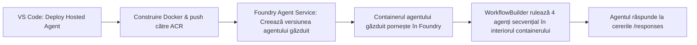
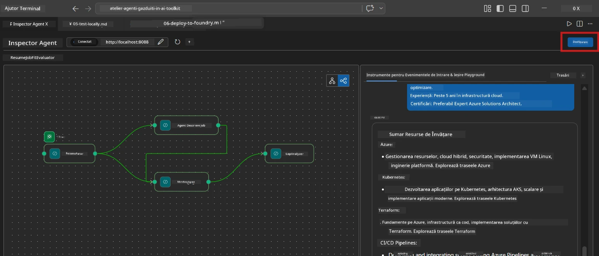

# Modulul 6 - Implementare în Foundry Agent Service

⏱️ ~10 min

În acest modul, implementați fluxul de lucru multi-agent testat local pe [Microsoft Foundry](https://learn.microsoft.com/azure/foundry/agents/concepts/hosted-agents) ca un **Agent Găzduit**. Procesul de implementare construiește o imagine de container Docker, o împinge în [Azure Container Registry (ACR)](https://learn.microsoft.com/azure/container-registry/container-registry-intro) și creează o versiune de agent găzduit în [Foundry Agent Service](https://learn.microsoft.com/azure/foundry/agents/how-to/publish-agent).

> **Principala diferență față de Laboratorul 01:** Procesul de implementare este identic. Foundry tratează fluxul dvs. de lucru multi-agent ca pe un singur agent găzduit - complexitatea este în interiorul containerului, dar suprafața de implementare este aceeași cu punctul final `/responses`.

### Pipeline de implementare


```mermaid
flowchart LR
    A[VS Code: Deploy Hosted Agent] --> B[Construire Docker & push către ACR]
    B --> C[Foundry Agent Service: Creează versiunea agentului găzduit]
    C --> D[Containerul agentului găzduit pornește în Foundry]
    D --> E[WorkflowBuilder rulează 4 agenți secvențial în interiorul containerului]
    E --> F[Agentul răspunde la cererile /responses]
```

---

## Verificarea prealabilă a cerințelor

Înainte de a implementa, verificați fiecare element de mai jos:

1. **Agentul trece testele locale rapide:**
   - Ați finalizat toate cele 3 teste din [Modulul 5](05-test-locally.md) și fluxul de lucru a produs ieșire completă cu carduri de goluri și URL-uri Microsoft Learn.

2. **Dețineți rolul [Foundry User](https://learn.microsoft.com/azure/foundry/concepts/rbac-foundry)** (pentru a implementa, aveți nevoie cel puțin de **Foundry Project Manager** la nivel de proiect):

   > **Notă:** Rolurile RBAC Foundry au fost recent redenumite - **Foundry User**, **Foundry Owner** și **Foundry Project Manager** erau anterior denumite Azure AI User, Azure AI Owner și Azure AI Project Manager. ID-urile rolurilor și permisiunile rămân neschimbate.

   - Verificați în [Portalul Azure](https://portal.azure.com) → resursa proiectului Foundry → **Control acces (IAM)** → **Atribuiri de rol** → confirmați că **Foundry User** (sau superior) este listat pentru contul dvs.

3. **Sunteți autentificat în Azure în VS Code:**
   - Verificați pictograma de Conturi în colțul din stânga jos al VS Code. Numele contului dvs. ar trebui să fie vizibil.

4. **`agent.yaml` are valorile corecte:**
   - Deschideți `PersonalCareerCopilot/agent.yaml` și verificați:
     ```yaml
     environment_variables:
       - name: AZURE_AI_MODEL_DEPLOYMENT_NAME
         value: ${AZURE_AI_MODEL_DEPLOYMENT_NAME}
     ```
   - `FOUNDRY_PROJECT_ENDPOINT` **nu** este listat aici - Foundry îl injectează la rulare. Doar `AZURE_AI_MODEL_DEPLOYMENT_NAME` trebuie declarat.

5. **`requirements.txt` are versiunile corecte:**
   ```
   agent-framework-foundry
   agent-framework-foundry-hosting
   mcp<2,>=1.24.0
   debugpy
   ```

---

## Pasul 1: Începeți implementarea

### Opțiunea A: Implementați din Agent Inspector (recomandat)

Dacă agentul rulează prin F5 cu Agent Inspector deschis:

1. Uitați-vă în **colțul din dreapta sus** al panoului Agent Inspector.
2. Faceți clic pe butonul **Deploy** (pictogramă de nor cu o săgeată în sus ↑).
3. Se deschide expertul de implementare.



### Opțiunea B: Implementați din Command Palette

1. Apăsați `Ctrl+Shift+P` pentru a deschide **Command Palette**.
2. Tastați: **Foundry Toolkit: Deploy Hosted Agent** și selectați-l.
3. Se deschide expertul de implementare.

---

## Pasul 2: Configurați implementarea

### 2.1 Selectați proiectul țintă

1. Se afișează o listă derulantă cu proiectele Foundry.
2. Selectați proiectul folosit pe parcursul atelierului (de ex., `workshop-agents`).

### 2.2 Selectați fișierul containerului agent

1. Vi se va cere să selectați punctul de intrare al agentului.
2. Navigați la `workshop/lab02-multi-agent/PersonalCareerCopilot/` și alegeți **`main.py`**.

### 2.3 Configurați resursele

| Setare | Valoare recomandată | Note |
|---------|------------------|-------|
| **Metoda de implementare** | **Container** (recomandat) sau **Cod** | Container construiește o imagine Docker; Cod încarcă sursa ca ZIP (previzualizare) |
| **Registrul Container** | **ACR implicit** | Foundry creează și gestionează unul pentru dvs. |
| **CPU** | `0.25` | Implicit. Fluxurile multi-agent nu necesită mai mult CPU deoarece apelurile către model sunt dependente de I/O |
| **Memorie** | `0.5Gi` | Implicit. Crește la `1Gi` dacă adăugați unelte mari pentru prelucrarea datelor |

---

## Pasul 3: Confirmați și implementați

1. Expertul afișează un rezumat al implementării.
2. Revizuiți și faceți clic pe **Confirm and Deploy**.
3. Urmăriți progresul în VS Code.

### Ce se întâmplă în timpul implementării

Urmăriți panoul **Output** din VS Code (selectați din lista derulantă "Microsoft Foundry"):

1. **Construirea Docker** - Construiește containerul din `Dockerfile`-ul dvs.
   ```
   Step 1/6 : FROM python:3.12-slim
   Step 2/6 : WORKDIR /app
   ...
   Successfully built abc123def456
   ```

2. **Împingerea Docker** - Împinge imaginea în ACR (1-3 minute la prima implementare).

3. **Înregistrarea agentului** - Foundry creează un agent găzduit folosind metadatele din `agent.yaml`. Numele agentului este `resume-job-fit-evaluator`.

4. **Pornirea containerului** - Containerul pornește în infrastructura administrată de Foundry cu o identitate gestionată de sistem.

> **Prima implementare este mai lentă** (Docker împinge toate straturile). Implementările ulterioare refolosesc straturile în cache și sunt mai rapide.

### Note specifice pentru multi-agent

- **Toți cei patru agenți sunt într-un singur container.** Foundry vede un singur agent găzduit. Graficul WorkflowBuilder rulează intern.
- **Apelurile MCP ies în exterior.** Containerul necesită acces la internet pentru a ajunge la `https://learn.microsoft.com/api/mcp`. Infrastructura gestionată de Foundry oferă acest acces implicit.
- **[Identitate Gestionată](https://learn.microsoft.com/azure/foundry/agents/concepts/agent-identity).** Foundry creează automat o **identitate Entra dedicată per agent** pentru fiecare agent găzduit la momentul implementării. În mediul găzduit, `DefaultAzureCredential` rezolvă automat această identitate a agentului - nu este nevoie de configurare manuală a identității gestionate.

---

## Pasul 4: Verificați starea implementării

1. Deschideți bara laterală **Microsoft Foundry** (faceți clic pe pictograma Foundry în bara de activitate).
2. Extindeți **Hosted Agents (Preview)** sub proiectul dvs.
3. Găsiți **resume-job-fit-evaluator** (sau numele agentului dvs.).
4. Faceți clic pe numele agentului → extindeți versiunile (ex., `v1`).
5. Faceți clic pe versiune → verificați **Detalii Container** → **Status**:


| Status | Semnificație |
|--------|-------------|
| **active** | Agentul rulează și este gata să accepte cereri |
| **creating** | Containerul pornește (așteptați 30–60 secunde) |
| **failed** | Containerul nu a reușit să pornească (verificați jurnalele - vedeți mai jos) |

> **Notă:** Bara laterală VS Code poate afișa etichete ca „Running” sau „Started” în timp ce statusul API de bază folosește `active`/`creating`. Oricare dintre afișări indică aceeași stare.

> **Pornirea multi-agent durează mai mult** decât a unui singur agent deoarece containerul creează 4 instanțe de agenți la pornire. `creating` timp de până la 2 minute este normal.

---

## Erori comune de implementare și remedieri

### Eroare 1: Permisiune refuzată - `agents/write`

```
Error: lacks the required data action 
Microsoft.CognitiveServices/accounts/AIServices/agents/write
```

**Remediere:** Atribuiți rolul **[Foundry User](https://learn.microsoft.com/azure/foundry/concepts/rbac-foundry)** (anterior **Azure AI User**) la nivel **proiect**. Consultați [Modulul 8 - Depanare](08-troubleshooting.md) pentru instrucțiuni pas cu pas.

### Eroare 2: Docker nu rulează

```
Error: Docker build failed / Cannot connect to Docker daemon
```

**Remediere:**
1. Porniți Docker Desktop.
2. Așteptați mesajul „Docker Desktop is running”.
3. Verificați: `docker info`
4. **Windows:** Asigurați-vă că backendul WSL 2 este activat în setările Docker Desktop.
5. Încercați din nou.

### Eroare 3: pip install eșuează în timpul construcției Docker

```
Error: Could not find a version that satisfies the requirement agent-framework-foundry
```

**Remediere:** Verificați dacă `requirements.txt` corespunde:
```
agent-framework-foundry
agent-framework-foundry-hosting
mcp<2,>=1.24.0
debugpy
```

Dacă construcția tot eșuează, rețeaua Docker ar putea bloca PyPI. Verificați setările proxy cu `docker info`.

### Eroare 4: Uneltele MCP eșuează în agentul găzduit

Dacă Analyzer-ul Gap încetează să producă URL-uri Microsoft Learn după implementare:

**Cauza principală:** Politica de rețea poate bloca ieșirea HTTPS din container.

**Remediere:**
1. De obicei, nu este o problemă cu configurația implicită Foundry.
2. Dacă apare, verificați dacă rețeaua virtuală a proiectului Foundry are un NSG care blochează ieșirea HTTPS.
3. Uneltele MCP au URL-uri de rezervă integrate, astfel agentul va produce în continuare ieșire (fără URL-uri live).

---

### Punct de control

- [ ] Comanda de implementare s-a finalizat fără erori în VS Code
- [ ] Agentul apare sub **Hosted Agents (Preview)** în bara laterală Foundry
- [ ] Numele agentului este `resume-job-fit-evaluator` (sau numele ales de dvs.)
- [ ] Statusul containerului arată **Started** sau **Running**
- [ ] (Dacă există erori) Ați identificat eroarea, ați aplicat remedierea și ați implementat din nou cu succes

---

**Anterior:** [05 - Testați Local](05-test-locally.md) · **Următor:** [07 - Verificați în Playground →](07-verify-in-playground.md)

---

<!-- CO-OP TRANSLATOR DISCLAIMER START -->
**Declinare a responsabilității**:
Acest document a fost tradus folosind serviciul de traducere AI [Co-op Translator](https://github.com/Azure/co-op-translator). În timp ce ne străduim pentru acuratețe, vă rugăm să rețineți că traducerile automate pot conține erori sau inexactități. Documentul original în limba sa nativă trebuie considerat sursa autorizată. Pentru informații critice, se recomandă traducerea profesională realizată de un om. Nu ne asumăm responsabilitatea pentru eventualele neînțelegeri sau interpretări greșite care decurg din utilizarea acestei traduceri.
<!-- CO-OP TRANSLATOR DISCLAIMER END -->