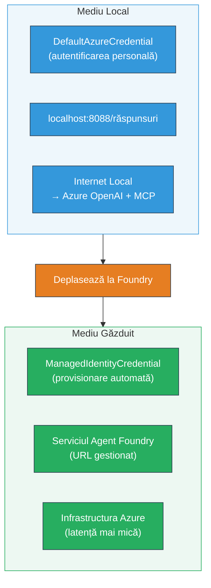

# Modului 7 - Verificare în Playground

În acest modul, testați fluxul de lucru multi-agent implementat atât în **VS Code**, cât și în **[Foundry Portal](https://ai.azure.com)**, confirmând că agentul se comportă identic cu testarea locală.

---

## De ce să verificați după implementare?

Fluxul dvs. de lucru multi-agent a rulat perfect local, deci de ce să testați din nou? Mediul găzduit diferă în mai multe feluri:


| Diferență | Local | Găzduit |
|-----------|-------|--------|
| **Identitate** | [`DefaultAzureCredential`](https://learn.microsoft.com/azure/developer/python/sdk/authentication/credential-chains#defaultazurecredential-overview) (autentificarea personală) | [`ManagedIdentityCredential`](https://learn.microsoft.com/python/api/overview/azure/identity-readme#managed-identity-support) (autoprovisionată) |
| **Endpoint** | `http://localhost:8088/responses` | endpoint-ul [Foundry Agent Service](https://learn.microsoft.com/azure/foundry/agents/concepts/hosted-agents) (URL gestionat) |
| **Rețea** | Mașina locală → Azure OpenAI + MCP ies | Rețeaua backbone Azure (latență mai mică între servicii) |
| **Conectivitate MCP** | Internet local → `learn.microsoft.com/api/mcp` | Container iesire → `learn.microsoft.com/api/mcp` |

Dacă vreo variabilă de mediu este configurată greșit, RBAC este diferit sau ieșirea MCP este blocată, veți descoperi aici.

---

## Opțiunea A: Testați în VS Code Playground (recomandat prima dată)

[Extensia Foundry](https://marketplace.visualstudio.com/items?itemName=TeamsDevApp.vscode-ai-foundry) include un Playground integrat care vă permite să discutați cu agentul implementat fără a părăsi VS Code.

### Pasul 1: Navigați la agentul găzduit

1. Faceți clic pe pictograma **Microsoft Foundry** din **Activity Bar** în VS Code (bara laterală din stânga) pentru a deschide panoul Foundry.
2. Extindeți proiectul conectat (de exemplu, `workshop-agents`).
3. Extindeți **Hosted Agents (Preview)**.
4. Ar trebui să vedeți numele agentului dvs. (de exemplu, `resume-job-fit-evaluator`).

### Pasul 2: Selectați o versiune

1. Faceți clic pe numele agentului pentru a extinde versiunile.
2. Faceți clic pe versiunea pe care ați implementat-o (de exemplu, `v1`).
3. Se va deschide un **panou detaliat** care arată Detalii Container.
4. Verificați dacă starea este **Started** sau **Running**.

### Pasul 3: Deschideți Playground-ul

1. În panoul detaliat, faceți clic pe butonul **Playground** (sau clic dreapta pe versiune → **Open in Playground**).
2. Se va deschide o interfață de chat într-un tab VS Code.

### Pasul 4: Rulați testele rapide

Utilizați aceleași 3 teste din [Modulul 5](05-test-locally.md). Tastați fiecare mesaj în căsuța de intrare a Playground-ului și apăsați **Send** (sau **Enter**).

#### Test 1 – CV complet + JD (fluxul standard)

Lipiți promptul complet cu CV-ul + JD din Modulul 5, Testul 1 (Jane Doe + Senior Cloud Engineer la Contoso Ltd).

**Așteptat:**
- Scor de potrivire cu desfășurare matematică (scală de 100 de puncte)
- Secțiunea Competențe potrivite
- Secțiunea Competențe lipsă
- **Un card de lacune pentru fiecare competență lipsă** cu URL-uri Microsoft Learn
- Plan de învățare cu cronologie

#### Test 2 - Test rapid scurt (intrare minimă)

```
RESUME: 3 years Python developer, knows Django and PostgreSQL, no cloud experience.

JOB: Cloud DevOps Engineer requiring AWS, Kubernetes, Terraform, CI/CD. 5 years needed.
```

**Așteptat:**
- Scor de potrivire mai mic (< 40)
- Evaluare onestă cu parcurs de învățare etapizat
- Mai multe carduri de lacune (AWS, Kubernetes, Terraform, CI/CD, lacună de experiență)

#### Test 3 - Candidat cu potrivire înaltă

```
RESUME:
10 years Azure Cloud Architect. AZ-305 certified. Expert in AKS, Terraform, Azure DevOps, 
Azure Functions, Helm, Prometheus, Grafana, Python, Go. Led platform team of 8.

JOB:
Senior Cloud Engineer. Required: AKS, Terraform, Azure DevOps, Python. Preferred: Helm, Go.
5+ years experience. AZ-305 preferred.
```

**Așteptat:**
- Scor înalt de potrivire (≥ 80)
- Accent pe pregătirea pentru interviu și perfecționare
- Puține sau niciun card de lacune
- Cronologie scurtă axată pe pregătire

### Pasul 5: Comparați cu rezultatele locale

Deschideți notițele sau tab-ul browser din Modulul 5 unde ați salvat răspunsurile locale. Pentru fiecare test:

- Răspunsul are **aceeași structură** (scor de potrivire, carduri de lacune, plan)?
- Urmează aceeași **matrice de scor** (desfășurare pe 100 de puncte)?
- Sunt încă prezente **URL-urile Microsoft Learn** în cardurile de lacune?
- Există **un card de lacune per competență lipsă** (nu este trunchiat)?

> **Diferențele minore de formulare sunt normale** – modelul este nedeterminist. Concentrați-vă pe structură, consistența scorului și utilizarea instrumentelor MCP.

---

## Opțiunea B: Testați în Foundry Portal

[Foundry Portal](https://ai.azure.com) oferă un playground bazat pe web, util pentru partajare cu colegii sau părțile interesate.

### Pasul 1: Deschideți Foundry Portal

1. Deschideți browserul și accesați [https://ai.azure.com](https://ai.azure.com).
2. Autentificați-vă cu același cont Azure folosit pe parcursul atelierului.

### Pasul 2: Navigați la proiectul dvs.

1. Pe pagina de start, căutați **Recent projects** în bara laterală din stânga.
2. Faceți clic pe numele proiectului dvs. (de exemplu, `workshop-agents`).
3. Dacă nu îl vedeți, faceți clic pe **All projects** și căutați-l.

### Pasul 3: Găsiți agentul implementat

1. În navigarea din stânga a proiectului, faceți clic pe **Build** → **Agents** (sau căutați secțiunea **Agents**).
2. Ar trebui să vedeți o listă de agenți. Găsiți agentul implementat (de exemplu, `resume-job-fit-evaluator`).
3. Faceți clic pe numele agentului pentru a deschide pagina sa de detalii.

### Pasul 4: Deschideți Playground

1. Pe pagina de detalii a agentului, priviți bara de unelte de sus.
2. Faceți clic pe **Open in playground** (sau **Try in playground**).
3. Se va deschide o interfață de chat.

### Pasul 5: Rulați aceleași teste rapide

Repetați toate cele 3 teste din secțiunea VS Code Playground de mai sus. Comparați fiecare răspuns atât cu rezultatele locale (Modul 5), cât și cu cele din VS Code Playground (Opțiunea A).

---

## Verificare specifică multi-agent

Dincolo de corectitudinea de bază, verificați aceste comportamente specifice multi-agent:

### Executarea instrumentului MCP

| Verificare | Cum se verifică | Condiție de trecere |
|------------|-----------------|---------------------|
| Apelurile MCP reușesc | Cardurile de lacune conțin URL-uri `learn.microsoft.com` | URL-uri reale, nu mesaje de rezervă |
| Apeluri multiple MCP | Fiecare lacună cu prioritate Ridicată/Medie are resurse | Nu doar primul card de lacune |
| Rezerve MCP funcționează | Dacă lipsesc URL-uri, verificați pentru text de rezervă | Agentul produce totuși carduri de lacune (cu sau fără URL-uri) |

### Coordonarea agentului

| Verificare | Cum se verifică | Condiție de trecere |
|------------|-----------------|---------------------|
| Toți cei 4 agenți au rulat | Output conține scor de potrivire ȘI carduri de lacune | Scorul vine de la MatchingAgent, cardurile de la GapAnalyzer |
| Distribuție paralelă | Timpul de răspuns este rezonabil (< 2 min) | Dacă > 3 min, execuția paralelă poate să nu funcționeze |
| Integritatea fluxului de date | Cardurile de lacune referențiază competențe din raportul de potrivire | Nu există competențe inventate care să nu fie în JD |

---

## Rubrica de validare

Utilizați această rubrică pentru a evalua comportamentul găzduit al fluxului de lucru multi-agent:

| # | Criteriu | Condiție de trecere | Trecut? |
|---|----------|---------------------|---------|
| 1 | **Corectitudine funcțională** | Agentul răspunde la CV + JD cu scor de potrivire și analiză a lacunelor |         |
| 2 | **Consistența scorării** | Scorul folosește scară de 100 de puncte cu detalierea matematică |         |
| 3 | **Completitudinea cardurilor de lacune** | Un card per competență lipsă (nu trunchiat sau combinat) |         |
| 4 | **Integrare instrument MCP** | Cardurile de lacune includ URL-uri reale Microsoft Learn |         |
| 5 | **Consistența structurală** | Structura output-ului este aceeași între rulările locale și găzduite |         |
| 6 | **Timp de răspuns** | Agentul găzduit răspunde în maxim 2 minute pentru evaluarea completă |         |
| 7 | **Fără erori** | Nici o eroare HTTP 500, time-out sau răspuns gol |         |

> Un „trecut” înseamnă că toate cele 7 criterii sunt îndeplinite pentru toate cele 3 teste rapide în cel puțin un playground (VS Code sau Portal).

---

## Depanarea problemelor din playground

| Simptom | Cauză probabilă | Remediu |
|---------|----------------|---------|
| Playground nu se încarcă | Starea containerului nu este „Started” | Revenți la [Modulul 6](06-deploy-to-foundry.md), verificați starea implementării. Așteptați dacă este „Pending” |
| Agentul returnează răspuns gol | Numele implementării modelului nu corespunde | Verificați în `agent.yaml` → `environment_variables` → `MODEL_DEPLOYMENT_NAME` să corespundă modelului implementat |
| Agentul returnează mesaj de eroare | Lipsă permisiune [RBAC](https://learn.microsoft.com/azure/foundry/concepts/rbac-foundry) | Atribuiți rolul **[Azure AI User](https://aka.ms/foundry-ext-project-role)** la nivel de proiect |
| Nu există URL-uri Microsoft Learn în cardurile de lacune | MCP outbound blocat sau server MCP indisponibil | Verificați dacă containerul poate accesa `learn.microsoft.com`. Consultați [Modulul 8](08-troubleshooting.md) |
| Doar 1 card de lacune (trunchiat) | Lipsesc instrucțiunile „CRITICAL” în GapAnalyzer | Revizuiți [Modulul 3, Pasul 2.4](03-configure-agents.md) |
| Scorul de potrivire diferă foarte mult față de local | Model sau instrucțiuni diferite implementate | Comparați variabilele de mediu din `agent.yaml` cu cele locale `.env`. Reimplementați dacă este necesar |
| „Agent not found” în Portal | Implementarea încă este propagată sau a eșuat | Așteptați 2 minute, reîmprospătați. Dacă încă lipsește, reimplementați din [Modulul 6](06-deploy-to-foundry.md) |

---

### Punct de control

- [ ] Agentul testat în VS Code Playground – toate cele 3 teste rapide au trecut
- [ ] Agentul testat în [Foundry Portal](https://ai.azure.com) Playground – toate cele 3 teste rapide au trecut
- [ ] Răspunsurile sunt consistente structural cu testarea locală (scor, carduri de lacune, plan)
- [ ] URL-urile Microsoft Learn sunt prezente în cardurile de lacune (instrumentul MCP funcționează în mediul găzduit)
- [ ] Un card de lacune per competență lipsă (fără trunchieri)
- [ ] Fără erori sau time-out-uri în timpul testării
- [ ] Rubrica de validare completată (toate cele 7 criterii trecute)

---

**Anterior:** [06 – Deploy to Foundry](06-deploy-to-foundry.md) · **Următor:** [08 – Troubleshooting →](08-troubleshooting.md)

---

<!-- CO-OP TRANSLATOR DISCLAIMER START -->
**Declinare a responsabilității**:  
Acest document a fost tradus folosind serviciul de traducere AI [Co-op Translator](https://github.com/Azure/co-op-translator). Deși ne străduim pentru acuratețe, vă rugăm să rețineți că traducerile automate pot conține erori sau inexactități. Documentul original în limba sa nativă trebuie considerat sursa autoritară. Pentru informații critice, se recomandă traducerea profesională realizată de un specialist uman. Nu ne asumăm răspunderea pentru eventualele neînțelegeri sau interpretări greșite rezultate din utilizarea acestei traduceri.
<!-- CO-OP TRANSLATOR DISCLAIMER END -->