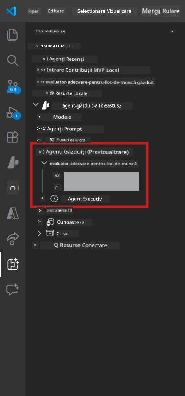

# Modulul 7 - Verificare în Playground

⏱️ ~10 minute

În acest modul, testezi fluxul de lucru multi-agent implementat în VS Code și în Foundry Portal, confirmând că agentul se comportă la fel ca în testarea locală.

---

## De ce să testezi din nou după implementare?

Mediul găzduit diferă de mediul local în câteva moduri importante:

| | Local | Găzduit |
|--|-------|--------|
| **Identitate** | Autentificarea ta personală (`DefaultAzureCredential`) | Identitate Entra dedicată fiecărui agent (auto-provizionată la momentul implementării) |
| **Endpoint** | `http://localhost:8088/responses` | URL gestionat de Foundry Agent Service |
| **Rețea** | Mașina ta → Azure OpenAI + MCP | Rețeaua de bază Azure (latență mai mică) |

O variabilă de mediu configurată greșit, o problemă RBAC sau un apel blocat către MCP ar apărea aici prima dată.

---

## Opțiunea A: Testează în VS Code Playground (recomandat primul)

### Pasul 1: Navighează la agentul tău găzduit

1. Apasă pe icoana **Foundry Toolkit** în bara de activități.
2. Extinde proiectul tău → **Hosted Agents (Preview)** → găsește agentul tău.



### Pasul 2: Selectează o versiune

1. Apasă pe agent pentru a extinde versiunile acestuia.
2. Apasă pe `v1` → verifică dacă statusul este **activ** (bara laterală poate afișa „Running” sau „Started” – ambele indică aceeași stare de pregătire).

### Pasul 3: Deschide Playground

1. Apasă **Playground** (sau click dreapta pe versiune → **Open in Playground**).
2. Se deschide o fereastră de chat într-un tab din VS Code.

### Pasul 4: Rulează testele de fum

Folosește aceleași 3 teste din [Modulul 5](05-test-locally.md). Scrie fiecare mesaj în caseta de introducere a Playground și apasă **Send** (sau **Enter**).

#### Test 1 - CV complet + JD (flux standard)

Lipește promptul complet de CV + JD din Modulul 5, Testul 1 (Jane Doe + Senior Cloud Engineer la Contoso Ltd).

**Așteptat:**
- Scor de potrivire cu detalii (scală de 100 de puncte)
- Secțiunea de abilități potrivite
- Secțiunea de abilități lipsă
- **O carte de lacune pentru fiecare abilitate lipsă** cu URL-uri Microsoft Learn
- Plan de învățare cu cronologie

#### Test 2 - Test scurt rapid (input minimal)

```
RESUME: 3 years Python developer, knows Django and PostgreSQL, no cloud experience.

JOB: Cloud DevOps Engineer requiring AWS, Kubernetes, Terraform, CI/CD. 5 years needed.
```

**Așteptat:**
- Scor de potrivire mai mic (< 40)
- Evaluare corectă cu traseu de învățare etapizat
- Mai multe cărți de lacune (AWS, Kubernetes, Terraform, CI/CD, lipsă experiență)

#### Test 3 - Candidat cu potrivire ridicată

```
RESUME:
10 years Azure Cloud Architect. AZ-305 certified. Expert in AKS, Terraform, Azure DevOps, 
Azure Functions, Helm, Prometheus, Grafana, Python, Go. Led platform team of 8.

JOB:
Senior Cloud Engineer. Required: AKS, Terraform, Azure DevOps, Python. Preferred: Helm, Go.
5+ years experience. AZ-305 preferred.
```

**Așteptat:**
- Scor de potrivire ridicat (≥ 80)
- Focus pe pregătirea pentru interviu și rafinare
- Puține sau fără cărți de lacune
- Cronologie scurtă focusată pe pregătire

### Pasul 5: Compară cu rezultatele locale

Deschide notițele sau tabul browserului din Modulul 5 unde ai salvat răspunsurile locale. Pentru fiecare test:

- Are răspunsul **aceeași structură** (scor de potrivire, cărți de lacune, plan)?
- Urmează aceeași **rubrica de punctaj** (detaliu pe 100 de puncte)?
- Sunt **URL-urile Microsoft Learn** încă prezente în cărțile de lacune?
- Există **o carte de lacune pentru fiecare abilitate lipsă** (fără trunchiere)?

> **Diferențele minore de formulare sunt normale** – modelul este non-determinist. Concentrează-te pe structură, consistența punctajului și utilizarea instrumentelor MCP.

---

## Opțiunea B: Testează în Foundry Portal

[Foundry Portal](https://ai.azure.com) oferă un playground web util pentru partajare cu colegii sau părțile interesate.

### Pasul 1: Deschide Foundry Portal

1. Deschide browserul și navighează la [https://ai.azure.com](https://ai.azure.com).
2. Autentifică-te cu același cont Azure pe care l-ai folosit pe parcursul atelierului.

### Pasul 2: Navighează la proiectul tău

1. Pe pagina principală, caută **Recent projects** în bara laterală din stânga.
2. Apasă pe numele proiectului tău (de exemplu, `workshop-agents`).
3. Dacă nu îl vezi, apasă pe **All projects** și caută-l.

### Pasul 3: Găsește agentul implementat

1. În navigarea din stânga a proiectului, apasă pe **Build** → **Agents** (sau caută secțiunea **Agents**).
2. Ar trebui să vezi o listă de agenți. Găsește agentul tău implementat (de exemplu, `resume-job-fit-evaluator`).
3. Apasă pe numele agentului pentru a deschide pagina cu detalii.

### Pasul 4: Deschide Playground

1. Pe pagina de detalii a agentului, uită-te în bara de instrumente de sus.
2. Apasă pe **Open in playground** (sau **Try in playground**).
3. Se deschide o interfață de chat.

### Pasul 5: Rulează aceleași teste de fum

Repetă toate cele 3 teste din secțiunea VS Code Playground de mai sus. Compară fiecare răspuns atât cu rezultatele locale (Modulul 5), cât și cu cele din VS Code Playground (Opțiunea A de mai sus).

---

## Verificarea specifică multi-agent

Dincolo de corectitudinea de bază, verifică aceste comportamente specifice multi-agent:

### Executarea instrumentelor MCP

| Verificare | Cum se verifică | Condiție de trecere |
|-------|---------------|----------------|
| Apelurile MCP reușite | Cărțile de lacune conțin URL-uri `learn.microsoft.com` | URL-uri reale, nu mesaje de rezervă |
| Apeluri multiple MCP | Fiecare lacună cu prioritate mare/medie are resurse | Nu doar prima carte de lacune |
| Funcționarea fallback MCP | Dacă lipsesc URL-uri, verifică pentru text de rezervă | Agentul generează totuși cărți de lacune (cu sau fără URL-uri) |

### Coordonarea agenților

| Verificare | Cum se verifică | Condiție de trecere |
|-------|---------------|----------------|
| Toți cei 4 agenți au rulat | Output-ul conține scor de potrivire ȘI cărți de lacune | Scorul vine de la MatchingAgent, cărțile de la GapAnalyzer |
| Execuție secvențială | Timpul de răspuns este rezonabil (< 2 min) | Dacă > 3 min, verifică erori în jurnalul terminalului |
| Integritatea fluxului de date | Cărțile de lacune fac referire la abilități din raportul de potrivire | Fără abilități inventate care nu sunt în JD |

---

## Rubrica de validare

Folosește această rubrică pentru a evalua comportamentul găzduit al fluxului multi-agent:

| # | Criterii | Condiție de trecere | Trecut? |
|---|----------|---------------|-------|
| 1 | **Corectitudine funcțională** | Agentul răspunde la CV + JD cu scor de potrivire și analiză a lacunelor | |
| 2 | **Consistență a scorării** | Scorul de potrivire folosește o scală de 100 de puncte cu detaliu matematic | |
| 3 | **Completitudinea cărților de lacune** | O carte pentru fiecare abilitate lipsă (fără trunchiere sau combinare) | |
| 4 | **Integrarea instrumentului MCP** | Cărțile de lacune includ URL-uri reale Microsoft Learn | |
| 5 | **Consistența structurală** | Structura output-ului este identică între rulările locale și cele găzduite | |
| 6 | **Timp de răspuns** | Agentul găzduit răspunde în 2 minute pentru evaluarea completă | |
| 7 | **Fără erori** | Fără erori HTTP 500, timeout-uri sau răspunsuri goale | |

> Un „trecut” înseamnă că toate cele 7 criterii sunt îndeplinite pentru toate cele 3 teste de fum într-un singur playground (VS Code sau Portal).

---

## Depanarea problemelor din playground

| Simptom | Cauză probabilă | Remediere |
|---------|-------------|-----|
| Playground nu se încarcă | Containerul nu este în stare `active` | Revino la [Modulul 6](06-deploy-to-foundry.md), verifică statusul implementării. Așteaptă dacă este `creating` |
| Agentul returnează răspuns gol | Numele de implementare a modelului diferă | Verifică în `agent.yaml` → `environment_variables` → `AZURE_AI_MODEL_DEPLOYMENT_NAME` dacă se potrivește cu modelul implementat |
| Agentul returnează mesaj de eroare | Permisiune [RBAC](https://learn.microsoft.com/azure/foundry/concepts/rbac-foundry) lipsă | Atribuie rolul **[Foundry User](https://aka.ms/foundry-ext-project-role)** (anterior Azure AI User) la nivel de proiect |
| Lipsesc URL-uri Microsoft Learn în cărțile de lacune | Traffic MCP outbound blocat sau server MCP indisponibil | Verifică dacă containerul poate accesa `learn.microsoft.com`. Vezi [Modulul 8](08-troubleshooting.md) |
| Doar 1 carte de lacune (trunchiată) | Instrucțiunile GapAnalyzer lipsesc blocul „CRITICAL” | Revizuiește [Modulul 3, Pasul 2.4](03-configure-agents.md) |
| Scor de potrivire foarte diferit față de local | Model diferit sau instrucțiuni diferite implementate | Compară variabilele de mediu din `agent.yaml` cu cele din `.env` local. Re-implementați dacă e nevoie |
| „Agent not found” în Portal | Implementarea încă se propagă sau a eșuat | Așteaptă 2 minute, reîncarcă pagina. Dacă lipsește în continuare, re-implementază din [Modulul 6](06-deploy-to-foundry.md) |

---

### Checkpoint

- [ ] Agent testat în VS Code Playground - toate cele 3 teste de fum trecute
- [ ] Agent testat în Playground-ul [Foundry Portal](https://ai.azure.com) - toate cele 3 teste de fum trecute
- [ ] Răspunsurile sunt consistent structurale cu testarea locală (scor, cărți de lacune, plan)
- [ ] URL-uri Microsoft Learn prezente în cărțile de lacune (instrument MCP funcționând în mediul găzduit)
- [ ] O carte de lacune pentru fiecare abilitate lipsă (fără trunchiere)
- [ ] Fără erori sau timeout-uri în timpul testării
- [ ] Rubrica de validare completată (toate cele 7 criterii trecute)

---

**Anterior:** [06 - Deploy to Foundry](06-deploy-to-foundry.md) · **Următor:** [08 - Depanare →](08-troubleshooting.md)

---

<!-- CO-OP TRANSLATOR DISCLAIMER START -->
**Declinare a responsabilității**:
Acest document a fost tradus folosind serviciul de traducere AI [Co-op Translator](https://github.com/Azure/co-op-translator). În timp ce ne străduim pentru acuratețe, vă rugăm să rețineți că traducerile automate pot conține erori sau inexactități. Documentul original în limba sa nativă trebuie considerat sursa autorizată. Pentru informații critice, se recomandă traducerea profesională realizată de un om. Nu ne asumăm responsabilitatea pentru eventualele neînțelegeri sau interpretări greșite care decurg din utilizarea acestei traduceri.
<!-- CO-OP TRANSLATOR DISCLAIMER END -->