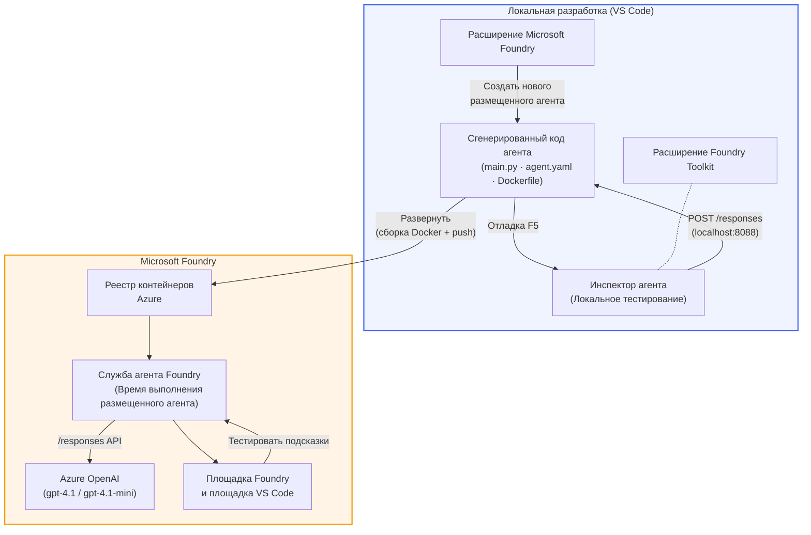

# Foundry Toolkit + Мастерская Hosted Agents в Foundry

[](https://www.python.org/)
[](https://github.com/microsoft/agents)
[](https://learn.microsoft.com/azure/ai-foundry/agents/concepts/hosted-agents/)
[](https://ai.azure.com/)
[](https://learn.microsoft.com/azure/ai-services/openai/)
[](https://learn.microsoft.com/cli/azure/install-azure-cli)
[](https://learn.microsoft.com/azure/developer/azure-developer-cli/install-azd)
[](https://www.docker.com/)
[](https://marketplace.visualstudio.com/items?itemName=ms-windows-ai-studio.windows-ai-studio)
[](LICENSE)

Создавайте, тестируйте и развёртывайте AI-агентов в **Microsoft Foundry Agent Service** как **Hosted Agents** — полностью из VS Code с использованием **Microsoft Foundry extension** и **Foundry Toolkit**.

> **Hosted Agents находятся на стадии предварительного просмотра.** Поддерживаемые регионы ограничены — смотрите [доступность регионов](https://learn.microsoft.com/azure/foundry/agents/concepts/hosted-agents#region-availability).

> Папка `agent/` внутри каждой лабораторной работы **автоматически создаётся** расширением Foundry — затем вы настраиваете код, тестируете локально и развёртываете.

### 🌐 Многоязычная поддержка

#### Поддерживается через GitHub Action (Автоматически и всегда обновлено)

<!-- CO-OP TRANSLATOR LANGUAGES TABLE START -->
[Арабский](../ar/README.md) | [Бенгальский](../bn/README.md) | [Болгарский](../bg/README.md) | [Бирманский (Мьянма)](../my/README.md) | [Китайский (упрощённый)](../zh-CN/README.md) | [Китайский (традиционный, Гонконг)](../zh-HK/README.md) | [Китайский (традиционный, Макао)](../zh-MO/README.md) | [Китайский (традиционный, Тайвань)](../zh-TW/README.md) | [Хорватский](../hr/README.md) | [Чешский](../cs/README.md) | [Датский](../da/README.md) | [Голландский](../nl/README.md) | [Эстонский](../et/README.md) | [Финский](../fi/README.md) | [Французский](../fr/README.md) | [Немецкий](../de/README.md) | [Греческий](../el/README.md) | [Иврит](../he/README.md) | [Хинди](../hi/README.md) | [Венгерский](../hu/README.md) | [Индонезийский](../id/README.md) | [Итальянский](../it/README.md) | [Японский](../ja/README.md) | [Каннада](../kn/README.md) | [Кхмерский](../km/README.md) | [Корейский](../ko/README.md) | [Литовский](../lt/README.md) | [Малайский](../ms/README.md) | [Малаялам](../ml/README.md) | [Маратхи](../mr/README.md) | [Непальский](../ne/README.md) | [Нигерийский пиджин](../pcm/README.md) | [Норвежский](../no/README.md) | [Персидский (фарси)](../fa/README.md) | [Польский](../pl/README.md) | [Португальский (Бразилия)](../pt-BR/README.md) | [Португальский (Португалия)](../pt-PT/README.md) | [Пенджабский (гурмукхи)](../pa/README.md) | [Румынский](../ro/README.md) | [Русский](./README.md) | [Сербский (кириллица)](../sr/README.md) | [Словацкий](../sk/README.md) | [Словенский](../sl/README.md) | [Испанский](../es/README.md) | [Свахили](../sw/README.md) | [Шведский](../sv/README.md) | [Тагальский (филиппинский)](../tl/README.md) | [Тамильский](../ta/README.md) | [Телугу](../te/README.md) | [Тайский](../th/README.md) | [Турецкий](../tr/README.md) | [Украинский](../uk/README.md) | [Урду](../ur/README.md) | [Вьетнамский](../vi/README.md)

> **Предпочитаете клонировать локально?**
>
> В этом репозитории есть более 50 переводов на разные языки, что значительно увеличивает размер загрузки. Чтобы клонировать без переводов, используйте sparse checkout:
>
> **Bash / macOS / Linux:**
> ```bash
> git clone --filter=blob:none --sparse https://github.com/microsoft-foundry/Foundry_Toolkit_for_VSCode_Lab.git
> cd Foundry_Toolkit_for_VSCode_Lab
> git sparse-checkout set --no-cone '/*' '!translations' '!translated_images'
> ```
>
> **CMD (Windows):**
> ```cmd
> git clone --filter=blob:none --sparse https://github.com/microsoft-foundry/Foundry_Toolkit_for_VSCode_Lab.git
> cd Foundry_Toolkit_for_VSCode_Lab
> git sparse-checkout set --no-cone "/*" "!translations" "!translated_images"
> ```
>
> Это даст вам всё необходимое для прохождения курса с гораздо более быстрой загрузкой.
<!-- CO-OP TRANSLATOR LANGUAGES TABLE END -->

---

## Архитектура


**Поток:** Расширение Foundry создаёт каркас агента → вы настраиваете код и инструкции → тестируете локально с Agent Inspector → развёртываете в Foundry (Docker-образ отправляется в ACR) → проверяете в Playground.

---

## Что вы будете создавать

| Лаборатория | Описание | Статус |
|-----|-------------|--------|
| **Лаборатория 01 - Один агент** | Создайте агента **"Объясни, как для руководителя"**, протестируйте локально и развёртывайте в Foundry | ✅ Доступно |
| **Лаборатория 02 - Мультиагентный рабочий процесс** | Создайте **"Резюме → Оценщик соответствия вакансии"** — 4 агента работают вместе для оценки резюме и создания плана обучения | ✅ Доступно |

---

## Познакомьтесь с агентом Executive

В этой мастерской вы создадите агента **"Объясни, как для руководителя"** — AI-агента, который берёт сложные технические термины и переводит их в спокойные, готовые к заседанию совета резюме. Потому что, если быть честным, никому в C-suite не хочется слышать про «исчерпание пула потоков из-за синхронных вызовов, появившихся в версии 3.2».

Я создал этого агента после слишком многих случаев, когда моё идеально составленное пост-мортем получало ответ: *«То есть... сайт упал или нет?»*

### Как это работает

Вы даёте ему техническое обновление. Он выдаёт резюме для руководства — три пункта, никаких технических терминов, никаких стеков вызовов, никакого экзистенциального ужаса. Просто **что случилось**, **деловое влияние** и **следующий шаг**.

### Посмотрите его в действии

**Вы говорите:**  
> «Задержка API увеличилась из-за исчерпания пула потоков, вызванного синхронными вызовами, введёнными в версии 3.2.»

**Агент отвечает:**  

> **Резюме для руководства:**  
> - **Что случилось:** После последнего обновления система замедлилась.  
> - **Деловое влияние:** Некоторые пользователи испытывали задержки при использовании сервиса.  
> - **Следующий шаг:** Изменение откатили, готовится исправление перед повторным развёртыванием.

### Зачем этот агент?

Это очень простой агент с одной функцией — идеально подходит для полного освоения рабочего процесса hosted agents без усложнений с большими цепочками инструментов. И честно? Каждая инженерная команда могла бы иметь такого.

---

## Структура мастерской

```
📂 Foundry_Toolkit_for_VSCode_Lab/
├── 📄 README.md                      ← You are here
├── 📂 ExecutiveAgent/                ← Standalone hosted agent project
│   ├── agent.yaml
│   ├── Dockerfile
│   ├── main.py
│   └── requirements.txt
└── 📂 workshop/
    ├── 📂 lab01-single-agent/        ← Full lab: docs + agent code
    │   ├── README.md                 ← Hands-on lab instructions
    │   ├── 📂 docs/                  ← Step-by-step tutorial modules
    │   │   ├── 00-prerequisites.md
    │   │   ├── 01-install-foundry-toolkit.md
    │   │   ├── 02-create-foundry-project.md
    │   │   ├── 03-create-hosted-agent.md
    │   │   ├── 04-configure-and-code.md
    │   │   ├── 05-test-locally.md
    │   │   ├── 06-deploy-to-foundry.md
    │   │   ├── 07-verify-in-playground.md
    │   │   └── 08-troubleshooting.md
    │   └── 📂 agent/                 ← Reference solution (auto-scaffolded by Foundry extension)
    │       ├── agent.yaml
    │       ├── Dockerfile
    │       ├── main.py
    │       └── requirements.txt
    └── 📂 lab02-multi-agent/         ← Resume → Job Fit Evaluator
        ├── README.md                 ← Hands-on lab instructions (end-to-end)
        ├── 📂 docs/                  ← Step-by-step tutorial modules
        │   ├── 00-prerequisites.md
        │   ├── 01-understand-multi-agent.md
        │   ├── 02-scaffold-multi-agent.md
        │   ├── 03-configure-agents.md
        │   ├── 04-orchestration-patterns.md
        │   ├── 05-test-locally.md
        │   ├── 06-deploy-to-foundry.md
        │   ├── 07-verify-in-playground.md
        │   └── 08-troubleshooting.md
        └── 📂 PersonalCareerCopilot/ ← Reference solution (multi-agent workflow)
            ├── agent.yaml
            ├── Dockerfile
            ├── main.py
            └── requirements.txt
```

> **Примечание:** Папка `agent/` внутри каждой лабораторной работы создаётся **расширением Microsoft Foundry**, когда вы вызываете команду `Microsoft Foundry: Create a New Hosted Agent` из палитры команд. Потом эти файлы настраиваются с вашими инструкциями, инструментами и конфигурацией агента. Лаборатория 01 показывает, как сделать это с нуля.

---

## Начало работы

### 1. Клонируйте репозиторий

```bash
git clone https://github.com/microsoft-foundry/Foundry_Toolkit_for_VSCode_Lab.git
cd Foundry_Toolkit_for_VSCode_Lab
```

### 2. Создайте виртуальное окружение Python

```bash
python -m venv venv
```

Активируйте его:

- **Windows (PowerShell):**  
  ```powershell
  .\venv\Scripts\Activate.ps1
  ```

- **macOS / Linux:**  
  ```bash
  source venv/bin/activate
  ```

### 3. Установите зависимости

```bash
pip install -r workshop/lab01-single-agent/agent/requirements.txt
```

### 4. Настройте переменные окружения

Скопируйте пример файла `.env` внутри папки агента и заполните своими значениями:

```bash
cp workshop/lab01-single-agent/agent/.env.example workshop/lab01-single-agent/agent/.env
```

Отредактируйте `workshop/lab01-single-agent/agent/.env`:

```env
AZURE_AI_PROJECT_ENDPOINT=https://<your-account>.services.ai.azure.com/api/projects/<your-project>
MODEL_DEPLOYMENT_NAME=<your-model-deployment-name>
```

### 5. Следуйте инструкциям лабораторий

Каждая лаборатория автономна и содержит собственные модули. Начинайте с **Лаборатории 01**, чтобы изучить основы, затем переходите к **Лаборатории 02** для изучения мультиагентных рабочих процессов.

#### Лаборатория 01 - Один агент ([полные инструкции](workshop/lab01-single-agent/README.md))

| # | Модуль | Ссылка |
|---|--------|------|
| 1 | Изучите предварительные требования | [00-prerequisites.md](workshop/lab01-single-agent/docs/00-prerequisites.md) |
| 2 | Установите Foundry Toolkit и расширение Foundry | [01-install-foundry-toolkit.md](workshop/lab01-single-agent/docs/01-install-foundry-toolkit.md) |
| 3 | Создайте проект Foundry | [02-create-foundry-project.md](workshop/lab01-single-agent/docs/02-create-foundry-project.md) |
| 4 | Создайте hosted агент | [03-create-hosted-agent.md](workshop/lab01-single-agent/docs/03-create-hosted-agent.md) |
| 5 | Настройте инструкции и окружение | [04-configure-and-code.md](workshop/lab01-single-agent/docs/04-configure-and-code.md) |
| 6 | Тестируйте локально | [05-test-locally.md](workshop/lab01-single-agent/docs/05-test-locally.md) |
| 7 | Развёртывание в Foundry | [06-deploy-to-foundry.md](workshop/lab01-single-agent/docs/06-deploy-to-foundry.md) |
| 8 | Проверьте в playground | [07-verify-in-playground.md](workshop/lab01-single-agent/docs/07-verify-in-playground.md) |
| 9 | Поиск и устранение неисправностей | [08-troubleshooting.md](workshop/lab01-single-agent/docs/08-troubleshooting.md) |

#### Лаборатория 02 - Мультиагентный рабочий процесс ([полные инструкции](workshop/lab02-multi-agent/README.md))

| # | Модуль | Ссылка |
|---|--------|------|
| 1 | Предварительные требования (Лаборатория 02) | [00-prerequisites.md](workshop/lab02-multi-agent/docs/00-prerequisites.md) |
| 2 | Понимание архитектуры мультиагентов | [01-understand-multi-agent.md](workshop/lab02-multi-agent/docs/01-understand-multi-agent.md) |
| 3 | Создайте каркас мультиагентного проекта | [02-scaffold-multi-agent.md](workshop/lab02-multi-agent/docs/02-scaffold-multi-agent.md) |
| 4 | Настройте агентов и окружение | [03-configure-agents.md](workshop/lab02-multi-agent/docs/03-configure-agents.md) |
| 5 | Паттерны оркестрации | [04-orchestration-patterns.md](workshop/lab02-multi-agent/docs/04-orchestration-patterns.md) |
| 6 | Тестируйте локально (мультиагенты) | [05-test-locally.md](workshop/lab02-multi-agent/docs/05-test-locally.md) |
| 7 | Развертывание в Foundry | [06-deploy-to-foundry.md](workshop/lab02-multi-agent/docs/06-deploy-to-foundry.md) |
| 8 | Проверка в песочнице | [07-verify-in-playground.md](workshop/lab02-multi-agent/docs/07-verify-in-playground.md) |
| 9 | Устранение неполадок (многоагентная система) | [08-troubleshooting.md](workshop/lab02-multi-agent/docs/08-troubleshooting.md) |

---

## Поддерживающий

<table>
<tr>
    <td align="center"><a href="https://github.com/ShivamGoyal03">
        <br />
        <sub><b>Shivam Goyal</b></sub>
    </a><br />
    </td>
</tr>
</table>

---

## Требуемые разрешения (краткое руководство)

| Сценарий | Требуемые роли |
|----------|---------------|
| Создание нового проекта Foundry | **Владелец Azure AI** для ресурса Foundry |
| Развертывание в существующем проекте (новые ресурсы) | **Владелец Azure AI** + **Участник** подписки |
| Развертывание в полностью настроенном проекте | **Читатель** аккаунта + **Пользователь Azure AI** проекта |

> **Важно:** Роли Azure `Владелец` и `Участник` включают только *управленческие* разрешения, а не разрешения *разработчика* (действия с данными). Для сборки и развертывания агентов требуются **Пользователь Azure AI** или **Владелец Azure AI**.

---

## Ресурсы

- [Быстрый старт: Развертывание вашего первого размещённого агента (VS Code)](https://learn.microsoft.com/azure/foundry/agents/quickstarts/quickstart-hosted-agent)
- [Что такое размещённые агенты?](https://learn.microsoft.com/azure/foundry/agents/concepts/hosted-agents)
- [Создание рабочих процессов размещённых агентов в VS Code](https://learn.microsoft.com/azure/foundry/agents/how-to/vs-code-agents-workflow-pro-code)
- [Развёртывание размещённого агента](https://learn.microsoft.com/azure/foundry/agents/how-to/deploy-hosted-agent)
- [Контроль доступа на основе ролей для Microsoft Foundry](https://learn.microsoft.com/azure/foundry/concepts/rbac-foundry)
- [Пример агента для обзора архитектуры](https://github.com/Azure-Samples/agent-architecture-review-sample) - Реальный размещённый агент с инструментами MCP, диаграммами Excalidraw и двойным развертыванием

---

## Лицензия

[MIT](../../LICENSE)

---

<!-- CO-OP TRANSLATOR DISCLAIMER START -->
**Отказ от ответственности**:  
Этот документ был переведен с помощью службы автоматического перевода [Co-op Translator](https://github.com/Azure/co-op-translator). Несмотря на наши усилия обеспечить точность, имейте в виду, что автоматические переводы могут содержать ошибки или неточности. Исходный документ на родном языке следует считать авторитетным источником. Для критической информации рекомендуется профессиональный перевод человеком. Мы не несем ответственности за любые недоразумения или неправильные толкования, возникшие в результате использования этого перевода.
<!-- CO-OP TRANSLATOR DISCLAIMER END -->