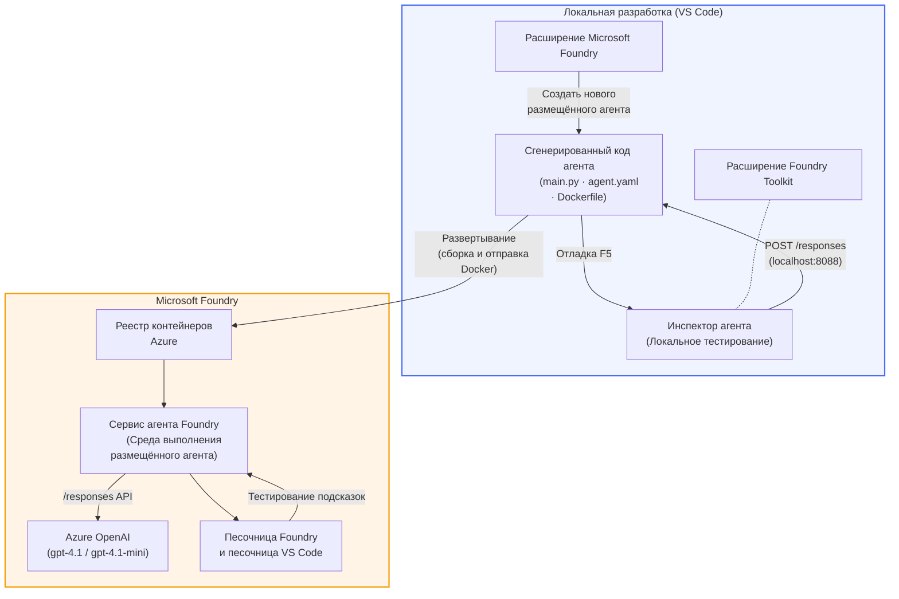

# Foundry Toolkit + Мастерская Hosted Agents Foundry

[](https://www.python.org/)
[](https://github.com/microsoft/agents)
[](https://learn.microsoft.com/azure/ai-foundry/agents/concepts/hosted-agents/)
[](https://ai.azure.com/)
[](https://learn.microsoft.com/azure/ai-services/openai/)
[](https://learn.microsoft.com/cli/azure/install-azure-cli)
[](https://learn.microsoft.com/azure/developer/azure-developer-cli/install-azd)
[](https://www.docker.com/)
[](https://marketplace.visualstudio.com/items?itemName=ms-windows-ai-studio.windows-ai-studio)
[](LICENSE)

Создавайте, тестируйте и развёртывайте AI-агентов в **Microsoft Foundry Agent Service** как **Hosted Agents** — полностью из VS Code с помощью **расширения Microsoft Foundry** и **Foundry Toolkit**.

> **Hosted Agents сейчас находятся в предварительном просмотре.** Поддерживаемые регионы ограничены — см. [доступность регионов](https://learn.microsoft.com/azure/foundry/agents/concepts/hosted-agents#region-availability).

> Папка `agent/` внутри каждой лаборатории **автоматически создаётся** расширением Foundry — вы затем настраиваете код, тестируете локально и развёртываете.

<!-- CO-OP TRANSLATOR LANGUAGES TABLE START -->
[Arabic](../ar/README.md) | [Bengali](../bn/README.md) | [Bulgarian](../bg/README.md) | [Burmese (Myanmar)](../my/README.md) | [Chinese (Simplified)](../zh-CN/README.md) | [Chinese (Traditional, Hong Kong)](../zh-HK/README.md) | [Chinese (Traditional, Macau)](../zh-MO/README.md) | [Chinese (Traditional, Taiwan)](../zh-TW/README.md) | [Croatian](../hr/README.md) | [Czech](../cs/README.md) | [Danish](../da/README.md) | [Dutch](../nl/README.md) | [Estonian](../et/README.md) | [Finnish](../fi/README.md) | [French](../fr/README.md) | [German](../de/README.md) | [Greek](../el/README.md) | [Hebrew](../he/README.md) | [Hindi](../hi/README.md) | [Hungarian](../hu/README.md) | [Indonesian](../id/README.md) | [Italian](../it/README.md) | [Japanese](../ja/README.md) | [Kannada](../kn/README.md) | [Khmer](../km/README.md) | [Korean](../ko/README.md) | [Lithuanian](../lt/README.md) | [Malay](../ms/README.md) | [Malayalam](../ml/README.md) | [Marathi](../mr/README.md) | [Nepali](../ne/README.md) | [Nigerian Pidgin](../pcm/README.md) | [Norwegian](../no/README.md) | [Persian (Farsi)](../fa/README.md) | [Polish](../pl/README.md) | [Portuguese (Brazil)](../pt-BR/README.md) | [Portuguese (Portugal)](../pt-PT/README.md) | [Punjabi (Gurmukhi)](../pa/README.md) | [Romanian](../ro/README.md) | [Russian](./README.md) | [Serbian (Cyrillic)](../sr/README.md) | [Slovak](../sk/README.md) | [Slovenian](../sl/README.md) | [Spanish](../es/README.md) | [Swahili](../sw/README.md) | [Swedish](../sv/README.md) | [Tagalog (Filipino)](../tl/README.md) | [Tamil](../ta/README.md) | [Telugu](../te/README.md) | [Thai](../th/README.md) | [Turkish](../tr/README.md) | [Ukrainian](../uk/README.md) | [Urdu](../ur/README.md) | [Vietnamese](../vi/README.md)

> **Предпочитаете клонировать локально?**
>
> Этот репозиторий включает более 50 переводов, что значительно увеличивает размер загрузки. Чтобы клонировать без переводов, используйте sparse checkout:
>
> **Bash / macOS / Linux:**
> ```bash
> git clone --filter=blob:none --sparse https://github.com/microsoft-foundry/Foundry_Toolkit_for_VSCode_Lab.git
> cd Foundry_Toolkit_for_VSCode_Lab
> git sparse-checkout set --no-cone '/*' '!translations' '!translated_images'
> ```
>
> **CMD (Windows):**
> ```cmd
> git clone --filter=blob:none --sparse https://github.com/microsoft-foundry/Foundry_Toolkit_for_VSCode_Lab.git
> cd Foundry_Toolkit_for_VSCode_Lab
> git sparse-checkout set --no-cone "/*" "!translations" "!translated_images"
> ```
>
> Это даст вам всё необходимое для прохождения курса с гораздо более быстрой загрузкой.
<!-- CO-OP TRANSLATOR LANGUAGES TABLE END -->

---

## Архитектура


**Поток:** Расширение Foundry создаёт структуру агента → вы настраиваете код и инструкции → тестируете локально с помощью Agent Inspector → развёртываете в Foundry (Docker-образ отправляется в ACR) → проверяете в Playground.

---

## Что вы создадите

| Лаборатория | Описание | Статус |
|-----|-------------|--------|
| **Лаборатория 01 - Один агент** | Создайте **агента "Объясни это, как для руководителя"**, протестируйте локально и развёртывайте в Foundry | ✅ Доступно |
| **Лаборатория 02 - Мультиагентный рабочий процесс** | Постройте **"Оценщик резюме → соответствие вакансии"** — 4 агента работают вместе, чтобы оценить соответствие резюме и создать обучающую дорожную карту | ✅ Доступно |

---

## Познакомьтесь с агентом для руководителей

В этой мастерской вы создадите **агента "Объясни это, как для руководителя"** — AI-агент, который берёт сложный технический жаргон и переводит его в спокойные, готовые для совещаний резюме. Ведь давайте честно, никто из руководства не хочет слышать о «переполнении пула потоков из-за синхронных вызовов, введённых в v3.2.»

Я создал этого агента после того, как слишком часто мои идеально составленные отчёты послесобытий встречались ответом: *«Так... сайт упал или нет?»*

### Как это работает

Вы даёте ему техническое обновление. Он выдаёт краткое резюме для руководства — три пункта, без жаргона, без стек-трейсов, без экзистенциального ужаса. Просто **что случилось**, **влияние на бизнес** и **следующий шаг**.

### Посмотрите, как это работает

**Вы говорите:**
> «Задержка API увеличилась из-за переполнения пула потоков, вызванного синхронными вызовами, введёнными в версии v3.2.»

**Агент отвечает:**

> **Резюме для руководства:**
> - **Что случилось:** После последнего релиза система замедлилась.
> - **Влияние на бизнес:** Некоторые пользователи столкнулись с задержками при использовании сервиса.
> - **Следующий шаг:** Изменения отменены, готовится исправление перед повторным развёртыванием.

### Почему именно этот агент?

Это простейший агент с одной задачей — идеально подходит для изучения рабочего процесса Hosted Agents от начала до конца, не запутываясь в сложных цепочках инструментов. И честно говоря, каждая инженерная команда могла бы воспользоваться таким.

---

## Структура мастерской

```
📂 Foundry_Toolkit_for_VSCode_Lab/
├── 📄 README.md                      ← You are here
├── 📂 ExecutiveAgent/                ← Standalone hosted agent project
│   ├── agent.yaml
│   ├── Dockerfile
│   ├── main.py
│   └── requirements.txt
└── 📂 workshop/
    ├── 📂 lab01-single-agent/        ← Full lab: docs + agent code
    │   ├── README.md                 ← Hands-on lab instructions
    │   ├── 📂 docs/                  ← Step-by-step tutorial modules
    │   │   ├── 00-prerequisites.md
    │   │   ├── 01-install-foundry-toolkit.md
    │   │   ├── 02-create-foundry-project.md
    │   │   ├── 03-create-hosted-agent.md
    │   │   ├── 04-configure-and-code.md
    │   │   ├── 05-test-locally.md
    │   │   ├── 06-deploy-to-foundry.md
    │   │   ├── 07-verify-in-playground.md
    │   │   └── 08-troubleshooting.md
    │   └── 📂 agent/                 ← Reference solution (auto-scaffolded by Foundry extension)
    │       ├── agent.yaml
    │       ├── Dockerfile
    │       ├── main.py
    │       └── requirements.txt
    └── 📂 lab02-multi-agent/         ← Resume → Job Fit Evaluator
        ├── README.md                 ← Hands-on lab instructions (end-to-end)
        ├── 📂 docs/                  ← Step-by-step tutorial modules
        │   ├── 00-prerequisites.md
        │   ├── 01-understand-multi-agent.md
        │   ├── 02-scaffold-multi-agent.md
        │   ├── 03-configure-agents.md
        │   ├── 04-orchestration-patterns.md
        │   ├── 05-test-locally.md
        │   ├── 06-deploy-to-foundry.md
        │   ├── 07-verify-in-playground.md
        │   └── 08-troubleshooting.md
        └── 📂 PersonalCareerCopilot/ ← Reference solution (multi-agent workflow)
            ├── agent.yaml
            ├── Dockerfile
            ├── main.py
            └── requirements.txt
```

> **Примечание:** Папка `agent/` внутри каждой лаборатории создаётся расширением **Microsoft Foundry** при запуске команды `Microsoft Foundry: Create a New Hosted Agent` из палитры команд. Файлы затем настраиваются под инструкции, инструменты и конфигурацию вашего агента. В лаборатории 01 показано, как создать это с нуля.

---

## Начало работы

### 1. Клонируйте репозиторий

```bash
git clone https://github.com/microsoft-foundry/Foundry_Toolkit_for_VSCode_Lab.git
cd Foundry_Toolkit_for_VSCode_Lab
```

### 2. Настройте виртуальное окружение Python

```bash
python -m venv venv
```

Активируйте его:

- **Windows (PowerShell):**
  ```powershell
  .\venv\Scripts\Activate.ps1
  ```
- **macOS / Linux:**
  ```bash
  source venv/bin/activate
  ```

### 3. Установите зависимости

```bash
pip install -r workshop/lab01-single-agent/agent/requirements.txt
```

### 4. Настройте переменные окружения

Скопируйте пример файла `.env` внутри папки агента и заполните ваши значения:

```bash
cp workshop/lab01-single-agent/agent/.env.example workshop/lab01-single-agent/agent/.env
```

Отредактируйте `workshop/lab01-single-agent/agent/.env`:

```env
AZURE_AI_PROJECT_ENDPOINT=https://<your-account>.services.ai.azure.com/api/projects/<your-project>
MODEL_DEPLOYMENT_NAME=<your-model-deployment-name>
```

### 5. Следуйте лабораториям мастерской

Каждая лаборатория автономна и содержит собственные модули. Начните с **Лаборатории 01**, чтобы освоить основы, затем переходите к **Лаборатории 02** для работы с мультиагентными рабочими процессами.

#### Лаборатория 01 - Один агент ([полные инструкции](workshop/lab01-single-agent/README.md))

| № | Модуль | Ссылка |
|---|--------|------|
| 1 | Изучите предпосылки | [00-prerequisites.md](workshop/lab01-single-agent/docs/00-prerequisites.md) |
| 2 | Установите Foundry Toolkit и расширение Foundry | [01-install-foundry-toolkit.md](workshop/lab01-single-agent/docs/01-install-foundry-toolkit.md) |
| 3 | Создайте проект Foundry | [02-create-foundry-project.md](workshop/lab01-single-agent/docs/02-create-foundry-project.md) |
| 4 | Создайте Hosted Agent | [03-create-hosted-agent.md](workshop/lab01-single-agent/docs/03-create-hosted-agent.md) |
| 5 | Настройте инструкции и окружение | [04-configure-and-code.md](workshop/lab01-single-agent/docs/04-configure-and-code.md) |
| 6 | Тестируйте локально | [05-test-locally.md](workshop/lab01-single-agent/docs/05-test-locally.md) |
| 7 | Развёртывайте в Foundry | [06-deploy-to-foundry.md](workshop/lab01-single-agent/docs/06-deploy-to-foundry.md) |
| 8 | Проверьте в Playground | [07-verify-in-playground.md](workshop/lab01-single-agent/docs/07-verify-in-playground.md) |
| 9 | Устранение неполадок | [08-troubleshooting.md](workshop/lab01-single-agent/docs/08-troubleshooting.md) |

#### Лаборатория 02 - Мультиагентный рабочий процесс ([полные инструкции](workshop/lab02-multi-agent/README.md))

| № | Модуль | Ссылка |
|---|--------|------|
| 1 | Предпосылки (Лаборатория 02) | [00-prerequisites.md](workshop/lab02-multi-agent/docs/00-prerequisites.md) |
| 2 | Понимание архитектуры мультиагентов | [01-understand-multi-agent.md](workshop/lab02-multi-agent/docs/01-understand-multi-agent.md) |
| 3 | Создайте проект мультиагентов | [02-scaffold-multi-agent.md](workshop/lab02-multi-agent/docs/02-scaffold-multi-agent.md) |
| 4 | Настройка агентов и окружения | [03-configure-agents.md](workshop/lab02-multi-agent/docs/03-configure-agents.md) |
| 5 | Паттерны оркестровки | [04-orchestration-patterns.md](workshop/lab02-multi-agent/docs/04-orchestration-patterns.md) |
| 6 | Тестируйте локально (мультиагенты) | [05-test-locally.md](workshop/lab02-multi-agent/docs/05-test-locally.md) |
| 7 | Развертывание на Foundry | [06-deploy-to-foundry.md](workshop/lab02-multi-agent/docs/06-deploy-to-foundry.md) |
| 8 | Проверка в playground | [07-verify-in-playground.md](workshop/lab02-multi-agent/docs/07-verify-in-playground.md) |
| 9 | Устранение неполадок (мультиагент) | [08-troubleshooting.md](workshop/lab02-multi-agent/docs/08-troubleshooting.md) |

---

## Поддерживающий

<table>
<tr>
    <td align="center"><a href="https://github.com/ShivamGoyal03">
        <br />
        <sub><b>Шивам Гоял</b></sub>
    </a><br />
    </td>
</tr>
</table>

---

## Необходимые разрешения (краткое руководство)

| Сценарий | Требуемые роли |
|----------|---------------|
| Создать новый проект Foundry | **Azure AI Owner** для ресурса Foundry |
| Развернуть в существующем проекте (новые ресурсы) | **Azure AI Owner** + **Contributor** для подписки |
| Развернуть в полностью настроенном проекте | **Reader** для учетной записи + **Azure AI User** для проекта |

> **Важно:** Роли Azure `Owner` и `Contributor` включают только *управленческие* разрешения, но не *разработческие* (операции с данными). Для создания и развертывания агентов требуются **Azure AI User** или **Azure AI Owner**.

---

## Ссылки

- [Быстрый старт: Развертывание вашего первого размещенного агента (VS Code)](https://learn.microsoft.com/azure/foundry/agents/quickstarts/quickstart-hosted-agent)
- [Что такое размещенные агенты?](https://learn.microsoft.com/azure/foundry/agents/concepts/hosted-agents)
- [Создание рабочих процессов размещенных агентов в VS Code](https://learn.microsoft.com/azure/foundry/agents/how-to/vs-code-agents-workflow-pro-code)
- [Развертывание размещенного агента](https://learn.microsoft.com/azure/foundry/agents/how-to/deploy-hosted-agent)
- [RBAC для Microsoft Foundry](https://learn.microsoft.com/azure/foundry/concepts/rbac-foundry)
- [Пример агента обзора архитектуры](https://github.com/Azure-Samples/agent-architecture-review-sample) - Реальный размещенный агент с инструментами MCP, диаграммами Excalidraw и двойным развертыванием

---

## Лицензия

[MIT](../../LICENSE)

---

<!-- CO-OP TRANSLATOR DISCLAIMER START -->
**Отказ от ответственности**:
Этот документ был переведен с помощью сервиса автоматического перевода [Co-op Translator](https://github.com/Azure/co-op-translator). Несмотря на наши усилия обеспечить точность, имейте в виду, что автоматические переводы могут содержать ошибки или неточности. Оригинальный документ на его родном языке следует считать авторитетным источником. Для критически важной информации рекомендуется использовать профессиональный перевод, выполненный человеком. Мы не несем ответственности за любые недоразумения или неправильные толкования, возникшие в результате использования этого перевода.
<!-- CO-OP TRANSLATOR DISCLAIMER END -->