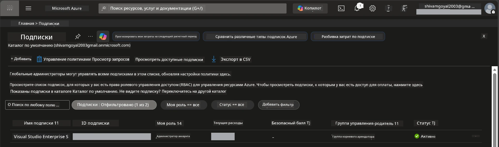

# Модуль 0 - Предварительные требования

Перед началом воркшопа убедитесь, что у вас есть необходимые инструменты, доступы и готовая среда. Следуйте каждому шагу ниже — не пропускайте.

---

## 1. Учётная запись Azure и подписка

### 1.1 Создайте или проверьте вашу подписку Azure

1. Откройте браузер и перейдите на [https://azure.microsoft.com/free/](https://azure.microsoft.com/free/).
2. Если у вас нет учётной записи Azure, нажмите **Start free** и следуйте процессу регистрации. Вам понадобится учётная запись Microsoft (или создайте новую) и кредитная карта для проверки личности.
3. Если учётная запись уже есть, войдите на [https://portal.azure.com](https://portal.azure.com).
4. В портале нажмите на панель **Subscriptions** в левой навигации (или введите «Subscriptions» в верхней строке поиска).
5. Убедитесь, что у вас есть хотя бы одна **Активная** подписка. Запишите **Subscription ID** — он понадобится позже.



### 1.2 Понимание необходимых ролей RBAC

Развертывание [Hosted Agent](https://learn.microsoft.com/azure/foundry/agents/concepts/hosted-agents) требует разрешений на **действия с данными**, которые стандартные роли Azure `Owner` и `Contributor` **не включают**. Вам нужна одна из следующих [комбинаций ролей](https://learn.microsoft.com/azure/foundry/concepts/rbac-foundry#built-in-roles):

| Сценарий | Необходимые роли | Где назначать |
|----------|------------------|---------------|
| Создание нового проекта Foundry | **Azure AI Owner** на ресурсе Foundry | Ресурс Foundry в портале Azure |
| Развертывание в существующий проект (новые ресурсы) | **Azure AI Owner** + **Contributor** на подписке | Подписка + ресурс Foundry |
| Развертывание в полностью настроенный проект | **Reader** на аккаунте + **Azure AI User** на проекте | Аккаунт + проект в портале Azure |

> **Ключевой момент:** Роли Azure `Owner` и `Contributor` покрывают только *управленческие* разрешения (ARM операции). Для *действий с данными* вроде `agents/write`, необходимых для создания и развертывания агентов, требуется роль [**Azure AI User**](https://learn.microsoft.com/azure/foundry/concepts/rbac-foundry#built-in-roles) (или выше). Вы назначите эти роли в [Модуле 2](02-create-foundry-project.md).

---

## 2. Установка локальных инструментов

Установите каждый из инструментов ниже. После установки проверьте его работу, выполнив команду проверки.

### 2.1 Visual Studio Code

1. Перейдите на [https://code.visualstudio.com/](https://code.visualstudio.com/).
2. Скачайте установщик для вашей ОС (Windows/macOS/Linux).
3. Запустите установщик с настройками по умолчанию.
4. Откройте VS Code, чтобы убедиться, что он запускается.

### 2.2 Python 3.10+

1. Перейдите на [https://www.python.org/downloads/](https://www.python.org/downloads/).
2. Скачайте Python версии 3.10 или новее (рекомендуется 3.12+).
3. **Windows:** Во время установки на первом экране отметьте **"Add Python to PATH"**.
4. Откройте терминал и проверьте:

   ```powershell
   python --version
   ```

   Ожидаемый вывод: `Python 3.10.x` или выше.

### 2.3 Azure CLI

1. Перейдите на [https://learn.microsoft.com/cli/azure/install-azure-cli](https://learn.microsoft.com/cli/azure/install-azure-cli).
2. Следуйте инструкциям установки для вашей ОС.
3. Проверьте:

   ```powershell
   az --version
   ```

   Ожидается: `azure-cli 2.80.0` или выше.

4. Войдите в систему:

   ```powershell
   az login
   ```

### 2.4 Azure Developer CLI (azd)

1. Перейдите на [https://learn.microsoft.com/azure/developer/azure-developer-cli/install-azd](https://learn.microsoft.com/azure/developer/azure-developer-cli/install-azd).
2. Следуйте инструкциям установки для вашей ОС. На Windows:

   ```powershell
   winget install microsoft.azd
   ```

3. Проверьте:

   ```powershell
   azd version
   ```

   Ожидается: версия `azd 1.x.x` или выше.

4. Войдите в систему:

   ```powershell
   azd auth login
   ```

### 2.5 Docker Desktop (необязательно)

Docker требуется только если вы хотите локально собрать и протестировать контейнерное изображение перед развертыванием. Расширение Foundry автоматически собирает контейнеры во время развертывания.

1. Перейдите на [https://docs.docker.com/get-docker/](https://docs.docker.com/get-docker/).
2. Скачайте и установите Docker Desktop для вашей ОС.
3. **Windows:** Убедитесь, что выбран бэкенд WSL 2 во время установки.
4. Запустите Docker Desktop и дождитесь, когда иконка в системном трее покажет **"Docker Desktop is running"**.
5. Откройте терминал и проверьте:

   ```powershell
   docker info
   ```

   Должна отобразиться информация о системе Docker без ошибок. Если видите `Cannot connect to the Docker daemon`, подождите ещё несколько секунд, чтобы Docker полностью запустился.

---

## 3. Установка расширений VS Code

Вам нужны три расширения. Установите их **до** начала воркшопа.

### 3.1 Microsoft Foundry для VS Code

1. Откройте VS Code.
2. Нажмите `Ctrl+Shift+X`, чтобы открыть панель расширений.
3. В строке поиска введите **"Microsoft Foundry"**.
4. Найдите **Microsoft Foundry for Visual Studio Code** (издатель: Microsoft, ID: `TeamsDevApp.vscode-ai-foundry`).
5. Нажмите **Install**.
6. После установки в панели активностей (левая боковая панель) появится иконка **Microsoft Foundry**.

### 3.2 Foundry Toolkit

1. В панели расширений (`Ctrl+Shift+X`) найдите **"Foundry Toolkit"**.
2. Найдите **Foundry Toolkit** (издатель: Microsoft, ID: `ms-windows-ai-studio.windows-ai-studio`).
3. Нажмите **Install**.
4. Иконка **Foundry Toolkit** должна появиться в панели активностей.

### 3.3 Python

1. В панели расширений найдите **"Python"**.
2. Найдите **Python** (издатель: Microsoft, ID: `ms-python.python`).
3. Нажмите **Install**.

---

## 4. Вход в Azure из VS Code

[Microsoft Agent Framework](https://learn.microsoft.com/agent-framework/overview/) использует [`DefaultAzureCredential`](https://learn.microsoft.com/azure/developer/python/sdk/authentication/credential-chains#defaultazurecredential-overview) для аутентификации. Нужно войти в Azure из VS Code.

### 4.1 Вход через VS Code

1. Посмотрите в нижний левый угол VS Code и нажмите на иконку **Accounts** (силуэт человека).
2. Нажмите **Sign in to use Microsoft Foundry** (или **Sign in with Azure**).
3. Откроется окно браузера — войдите с Azure учётной записью, у которой есть доступ к вашей подписке.
4. Вернитесь в VS Code. Внизу слева должно отобразиться имя вашего аккаунта.

### 4.2 (Опционально) Вход через Azure CLI

Если вы установили Azure CLI и предпочитаете аутентификацию через командную строку:

```powershell
az login
```

Откроется браузер для входа. После входа установите правильную подписку:

```powershell
az account set --subscription "<your-subscription-id>"
```

Проверьте:

```powershell
az account show --query "{name:name, id:id, state:state}" --output table
```

Вы должны увидеть имя подписки, ID и состояние = `Enabled`.

### 4.3 (Альтернатива) Аутентификация с помощью сервисного принципала

Для CI/CD или совместных сред задайте вместо этого переменные окружения:

```powershell
$env:AZURE_TENANT_ID = "<your-tenant-id>"
$env:AZURE_CLIENT_ID = "<your-client-id>"
$env:AZURE_CLIENT_SECRET = "<your-client-secret>"
```

---

## 5. Ограничения предварительного просмотра

Прежде чем продолжить, обратите внимание на текущие ограничения:

- [**Hosted Agents**](https://learn.microsoft.com/azure/foundry/agents/concepts/hosted-agents) находятся в состоянии **публичного предварительного просмотра** — не рекомендуется использовать в продуктивных нагрузках.
- **Поддерживаемые регионы ограничены** — проверьте [доступность регионов](https://learn.microsoft.com/azure/foundry/agents/concepts/hosted-agents#region-availability) перед созданием ресурсов. Если выберете неподдерживаемый регион, развертывание не получится.
- Пакет `azure-ai-agentserver-agentframework` находится в предварительном релизе (`1.0.0b16`) — API могут измениться.
- Лимиты масштабирования: размещённые агенты поддерживают 0-5 реплик (включая масштабирование до нуля).

---

## 6. Контрольный список

Пройдите по каждому пункту. Если что-то не работает, вернитесь и исправьте перед продолжением.

- [ ] VS Code открывается без ошибок
- [ ] Python 3.10+ в PATH (`python --version` выводит `3.10.x` или выше)
- [ ] Azure CLI установлен (`az --version` выводит `2.80.0` или выше)
- [ ] Azure Developer CLI установлен (`azd version` выводит информацию о версии)
- [ ] Расширение Microsoft Foundry установлено (иконка видна в панели активностей)
- [ ] Расширение Foundry Toolkit установлено (иконка видна в панели активностей)
- [ ] Расширение Python установлено
- [ ] Вы вошли в Azure в VS Code (проверить значок Accounts внизу слева)
- [ ] `az account show` возвращает вашу подписку
- [ ] (Опционально) Docker Desktop запущен (`docker info` возвращает информацию о системе без ошибок)

### Контрольная точка

Откройте панель активностей VS Code и убедитесь, что вы видите обе боковые панели **Foundry Toolkit** и **Microsoft Foundry**. Нажмите на каждую из них, чтобы проверить, что они загружаются без ошибок.

---

**Далее:** [01 - Установка Foundry Toolkit и расширения Foundry →](01-install-foundry-toolkit.md)

---

<!-- CO-OP TRANSLATOR DISCLAIMER START -->
**Отказ от ответственности**:
Этот документ был переведен с помощью службы автоматического перевода [Co-op Translator](https://github.com/Azure/co-op-translator). Несмотря на наши усилия по обеспечению точности, пожалуйста, имейте в виду, что автоматические переводы могут содержать ошибки или неточности. Оригинальный документ на его исходном языке следует считать авторитетным источником. Для критически важной информации рекомендуется профессиональный перевод специалистом. Мы не несем ответственности за любые недоразумения или неправильные толкования, возникшие в результате использования этого перевода.
<!-- CO-OP TRANSLATOR DISCLAIMER END -->