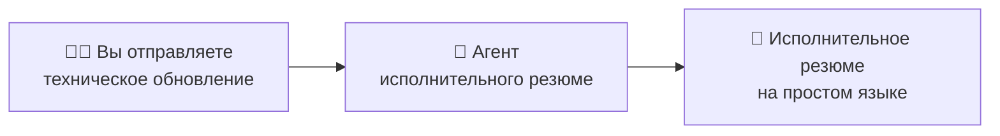

# Модуль 0 - Введение

⏱️ ~10 мин

> [!WARNING]
> **Предварительная версия и ограничения:** [Хостинговые агенты](https://learn.microsoft.com/azure/foundry/agents/concepts/hosted-agents) сейчас находятся в стадии **публичного предварительного просмотра** — не рекомендуется для производственных задач. Обратите внимание на следующее:
> - **Поддерживаемые регионы ограничены** — проверьте [доступность регионов](https://learn.microsoft.com/azure/foundry/agents/concepts/hosted-agents#region-availability) перед созданием ресурсов. Если выберете неподдерживаемый регион, развертывание завершится неудачей.
> - Пакет `azure-ai-agentserver-agentframework` является предрелизным — API могут меняться между версиями.
> - Лимиты масштабирования: хостинговые агенты поддерживают 0–5 реплик (включая масштабирование до нуля).
> - Некоторые функции, показанные в этом воркшопе, могут измениться по мере выхода сервиса из предварительного просмотра.

## Что вы создадите

В этом воркшопе вы создадите агента **«Объясни, как если бы я руководитель»** — хостингового ИИ-агента, который берет сложные технические обновления и переписывает их в виде простых для понимания резюме для руководства.

```mermaid
flowchart LR
    A["🧑‍💻 Вы отправляете\nтехническое обновление"] --> B["🤖 Агент\nисполнительного резюме"]
    B --> C["📝 Исполнительное резюме\nна простом языке"]
```

**Агент использует:**
- **Microsoft Agent Framework** — для логики и структуры агента
- **Foundry Toolkit для VS Code** — для создания каркаса, локального тестирования и развёртывания
- **ИИ-модель** (например, `gpt-4.1-mini/gpt-5-mini`) — для генерации резюме

К концу лабораторной работы у вас будет рабочий агент, который можно будет тестировать локально через Agent Inspector и при желании развернуть в облаке.

---

## Что такое хостинговые агенты?

**Хостинговый агент** — это ИИ-агент, работающий как управляемый сервис в Microsoft Foundry. Вместо управления собственной инфраструктурой вы упаковываете код агента в контейнер, а Foundry занимается масштабированием, размещением и предоставляет доступ через стандартную HTTP-точку.

| Понятие | Что это значит |
|---------|--------------|
| **Агент** | Ваш Python-код, который принимает сообщение от пользователя, вызывает ИИ-модель и возвращает структурированный ответ |
| **Хостинг** | Foundry запускает ваш контейнер — никаких ВМ, Kubernetes или управления инфраструктурой |
| **Протокол ответов** | Стандартный HTTP API (`POST /responses`), который любой клиент может использовать для взаимодействия с агентом |
| **Agent Inspector** | Локальный интерфейс для тестирования (встроенный в Foundry Toolkit), позволяющий общаться с агентом до развёртывания |

В этом воркшопе вы пройдете путь от нуля до полностью хостингового агента — либо остановитесь на локальном тестировании, если хотите.

---

## Выберите ваш путь

> ⚠️ **Выберите один путь перед продолжением.** Ваш выбор определяет, какие инструменты устанавливать и какие модули вам понадобятся. Вы можете переключиться с Пути B на Путь A позже, если получите подписку.

<strong>🅰️ Путь A — облако Azure (требуется подписка Azure)</strong>

| | Детали |
|---|---|
| **Для кого?** | У вас есть активная подписка Azure и возможность создавать ресурсы Foundry |
| **Модель** | Azure OpenAI через Foundry (например, `gpt-4.1-mini/gpt-5-mini`) |
| **Охваченные модули** | Все модули (00–07) |
| **Развертывать в облаке?** | ✅ Да — полное развертывание от начала до конца |

<strong>🅱️ Путь B — локально / бесплатный уровень (подписка Azure не нужна)</strong>

| | Детали |
|---|---|
| **Для кого?** | MVP, студенты или любой, у кого нет доступа к Azure |
| **Модель** | **Foundry Local** (бесплатно, запускается на вашем компьютере) |
| **Охваченные модули** | Модули 00–04 (без развёртывания и проверки в облаке) |
| **Развертывать в облаке?** | ❌ Нет — только локальное тестирование через Agent Inspector |

---

## Обязательные инструменты для всех путей

Установите каждый из перечисленных инструментов ниже. После установки проверьте их работоспособность, выполнив команду проверки.

| № | Инструмент | Версия | Установка | Проверка (ожидаемый вывод) |
|---|------------|---------|-----------|-----------------------------|
| 1 | **Visual Studio Code** | Последняя | [code.visualstudio.com](https://code.visualstudio.com/) | Запускается без ошибок |
| 2 | **Python** | 3.12 или новее | [python.org/downloads](https://www.python.org/downloads/) | `python --version` → `Python 3.12.x` |
| 3 | **Foundry Toolkit для VS Code** | Последняя | Extension ID: `ms-windows-ai-studio.windows-ai-studio` | Иконка Foundry в панели активности |
| 4 | **Расширение Python для VS Code** | Последняя | Extension ID: `ms-python.python` | Установлено в панели расширений |

> [!TIP]
> **Советы по установке:**
> - **Python PATH (Windows):** Всегда выбирайте **«Добавить Python в PATH»** на первом экране установщика Python. Без этого терминал не распознает команду `python`.
> - **Несколько версий Python:** Если у вас установлены Python 3.10 и 3.12, используйте `python3.12 -m venv .venv`, чтобы создать виртуальное окружение с нужной версией.
> - **Docker WSL 2 (Windows):** При установке Docker Desktop убедитесь, что выбран **бэкенд WSL 2**. Docker с Hyper-V работает медленнее и может вызывать проблемы при сборках контейнеров Foundry.
> - **Docker не запускается?** Подождите 30–60 секунд после запуска Docker Desktop. Выполните `docker info` - если увидите «Cannot connect to the Docker daemon», Docker еще инициализируется.
> - **Расширения VS Code не загружаются?** После установки расширений перезагрузите окно: `Ctrl+Shift+P` → `Developer: Reload Window`.

> **Пользователи Windows:** Обязательно выберите **«Добавить Python в PATH»** при установке Python.

**Далее:** [01 - Настройка →](01-setup.md)

---

<!-- CO-OP TRANSLATOR DISCLAIMER START -->
**Отказ от ответственности**:
Этот документ был переведен с использованием сервиса машинного перевода [Co-op Translator](https://github.com/Azure/co-op-translator). Несмотря на наши усилия по обеспечению точности, имейте в виду, что автоматический перевод может содержать ошибки или неточности. Оригинальный документ на его исходном языке следует считать авторитетным источником. Для получения критически важной информации рекомендуется обратиться к профессиональному человеческому переводу. Мы не несем ответственности за любые недоразумения или неправильные толкования, возникшие в результате использования этого перевода.
<!-- CO-OP TRANSLATOR DISCLAIMER END -->