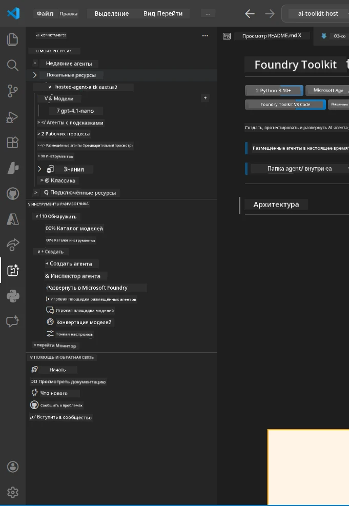
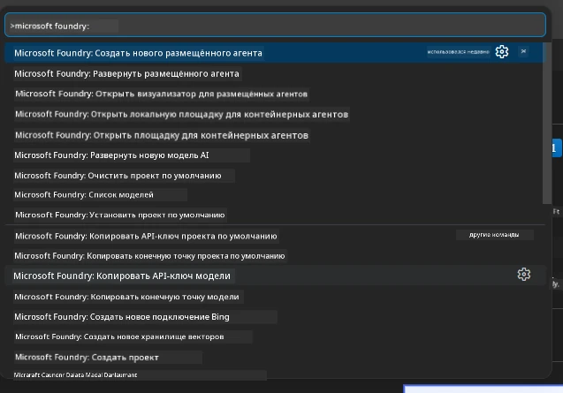

# Module 1 - Установка Foundry Toolkit и расширения Foundry

В этом модуле вы познакомитесь с процессом установки и проверки двух ключевых расширений VS Code для данного воркшопа. Если вы уже устанавливали их в ходе [Модуля 0](00-prerequisites.md), используйте этот модуль для проверки их правильной работы.

---

## Шаг 1: Установка расширения Microsoft Foundry

Расширение **Microsoft Foundry для VS Code** является вашим основным инструментом для создания проектов Foundry, развертывания моделей, создания шаблонов размещенных агентов и выполнения деплоя напрямую из VS Code.

1. Откройте VS Code.
2. Нажмите `Ctrl+Shift+X`, чтобы открыть панель **Расширения**.
3. В строке поиска сверху введите: **Microsoft Foundry**
4. Найдите результат с названием **Microsoft Foundry for Visual Studio Code**.
   - Издатель: **Microsoft**
   - Идентификатор расширения: `TeamsDevApp.vscode-ai-foundry`
5. Нажмите кнопку **Установить**.
6. Дождитесь завершения установки (посмотрите на индикатор прогресса).
7. После установки посмотрите на **Панель активностей** (вертикальная панель слева в VS Code). Вы должны увидеть новый значок **Microsoft Foundry** (выглядит как ромб/значок AI).
8. Нажмите значок **Microsoft Foundry**, чтобы открыть боковую панель. Вы должны увидеть разделы для:
   - **Ресурсы** (или Проекты)
   - **Агенты**
   - **Модели**

> **Если значок не появился:** Попробуйте перезагрузить VS Code (`Ctrl+Shift+P` → `Developer: Reload Window`).

---

## Шаг 2: Установка расширения Foundry Toolkit

Расширение **Foundry Toolkit** предоставляет [**Agent Inspector**](https://learn.microsoft.com/azure/foundry/agents/how-to/vs-code-agents-workflow-pro-code) — визуальный интерфейс для тестирования и отладки агентов локально, а также инструменты playground, управления моделями и их оценки.

1. В панели Расширений (`Ctrl+Shift+X`) очистите строку поиска и введите: **Foundry Toolkit**
2. Найдите **Foundry Toolkit** среди результатов.
   - Издатель: **Microsoft**
   - Идентификатор расширения: `ms-windows-ai-studio.windows-ai-studio`
3. Нажмите **Установить**.
4. После установки значок **Foundry Toolkit** появится на Панели активностей (выглядит как робот/значок блеска).
5. Нажмите значок **Foundry Toolkit**, чтобы открыть его боковую панель. Вы увидите стартовый экран Foundry Toolkit с опциями:
   - **Модели**
   - **Площадка (Playground)**
   - **Агенты**

---

## Шаг 3: Проверка работы обоих расширений

### 3.1 Проверка расширения Microsoft Foundry

1. Нажмите значок **Microsoft Foundry** на Панели активностей.
2. Если вы вошли в Azure (из Модуля 0), вы должны увидеть список своих проектов в разделе **Ресурсы**.
3. Если потребуется войти, нажмите **Sign in** и следуйте процедуре аутентификации.
4. Убедитесь, что боковая панель отображается без ошибок.

### 3.2 Проверка расширения Foundry Toolkit

1. Нажмите значок **Foundry Toolkit** на Панели активностей.
2. Убедитесь, что стартовое окно или основная панель загрузились без ошибок.
3. Конфигурировать что-либо пока не нужно — мы будем использовать Agent Inspector в [Модуле 5](05-test-locally.md).

### 3.3 Проверка через Палитру команд

1. Нажмите `Ctrl+Shift+P`, чтобы открыть Палитру команд.
2. Введите **"Microsoft Foundry"** — вы должны увидеть команды, например:
   - `Microsoft Foundry: Create a New Hosted Agent`
   - `Microsoft Foundry: Deploy Hosted Agent`
   - `Microsoft Foundry: Open Model Catalog`
3. Нажмите `Escape`, чтобы закрыть Палитру команд.
4. Откройте Палитру команд снова и введите **"Foundry Toolkit"** — вы должны увидеть команды, например:
   - `Foundry Toolkit: Open Agent Inspector`

> Если вы не видите этих команд, возможно, расширения установлены некорректно. Попробуйте удалить и установить их заново.

---

## Что делают эти расширения в данном воркшопе

| Расширение | Что оно делает | Когда вы его используете |
|-----------|---------------|-------------------------|
| **Microsoft Foundry для VS Code** | Создание проектов Foundry, развертывание моделей, **создание шаблонов [размещенных агентов](https://learn.microsoft.com/azure/foundry/agents/concepts/hosted-agents)** (автоматически генерирует `agent.yaml`, `main.py`, `Dockerfile`, `requirements.txt`), деплой в [Foundry Agent Service](https://learn.microsoft.com/azure/foundry/agents/overview) | Модули 2, 3, 6, 7 |
| **Foundry Toolkit** | Agent Inspector для локального тестирования и отладки, интерфейс playground, управление моделями | Модули 5, 7 |

> **Расширение Foundry — самый важный инструмент в этом воркшопе.** Оно обеспечивает полный жизненный цикл: создание шаблона → настройка → деплой → проверка. Foundry Toolkit дополняет его, предоставляя визуальный Agent Inspector для локального тестирования.

---

### Контрольный список

- [ ] Значок Microsoft Foundry отображается на Панели активностей
- [ ] При нажатии открывается боковая панель без ошибок
- [ ] Значок Foundry Toolkit отображается на Панели активностей
- [ ] При нажатии открывается боковая панель без ошибок
- [ ] При `Ctrl+Shift+P` и вводе "Microsoft Foundry" отображаются доступные команды
- [ ] При `Ctrl+Shift+P` и вводе "Foundry Toolkit" отображаются доступные команды

---

**Предыдущий:** [00 - Требования](00-prerequisites.md) · **Следующий:** [02 - Создание проекта Foundry →](02-create-foundry-project.md)

---

<!-- CO-OP TRANSLATOR DISCLAIMER START -->
**Отказ от ответственности**:
Этот документ был переведен с помощью сервиса автоматического перевода [Co-op Translator](https://github.com/Azure/co-op-translator). Несмотря на наши усилия обеспечить точность, имейте в виду, что автоматические переводы могут содержать ошибки или неточности. Оригинальный документ на исходном языке следует считать авторитетным источником. Для критически важной информации рекомендуется профессиональный перевод человеком. Мы не несем ответственности за любые недоразумения или неправильные толкования, возникшие в результате использования данного перевода.
<!-- CO-OP TRANSLATOR DISCLAIMER END -->