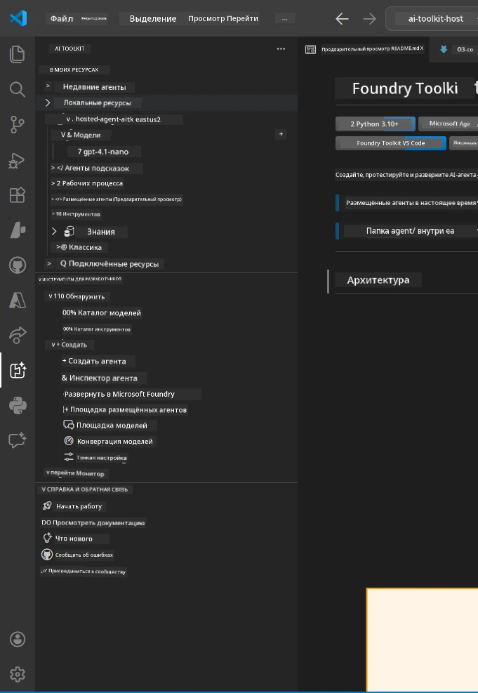
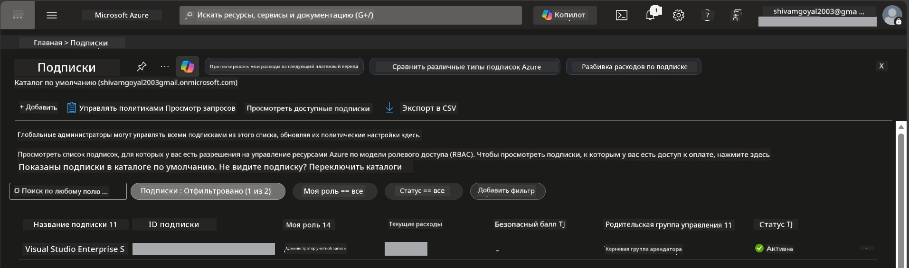
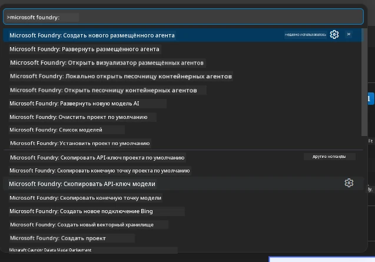
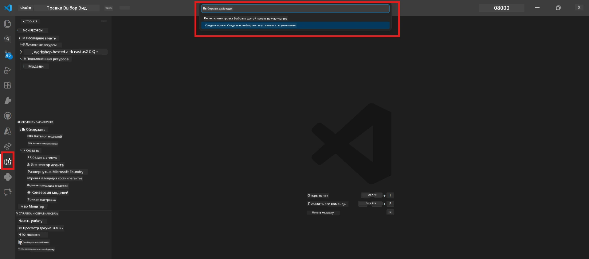
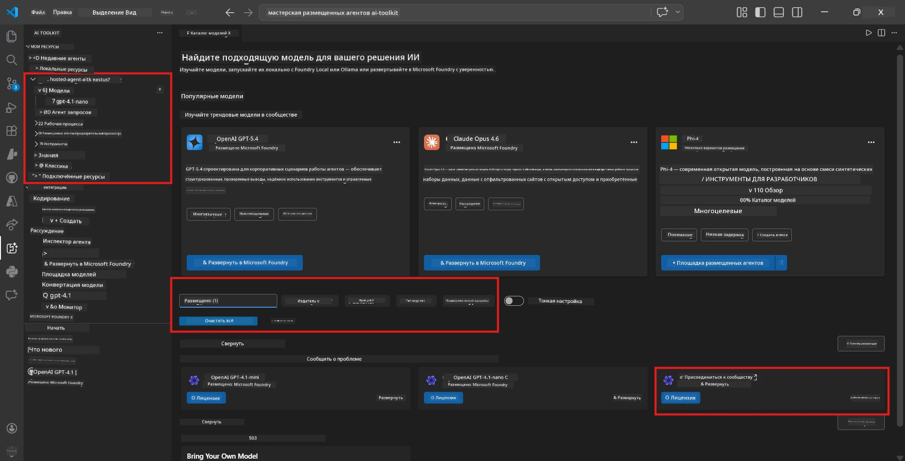
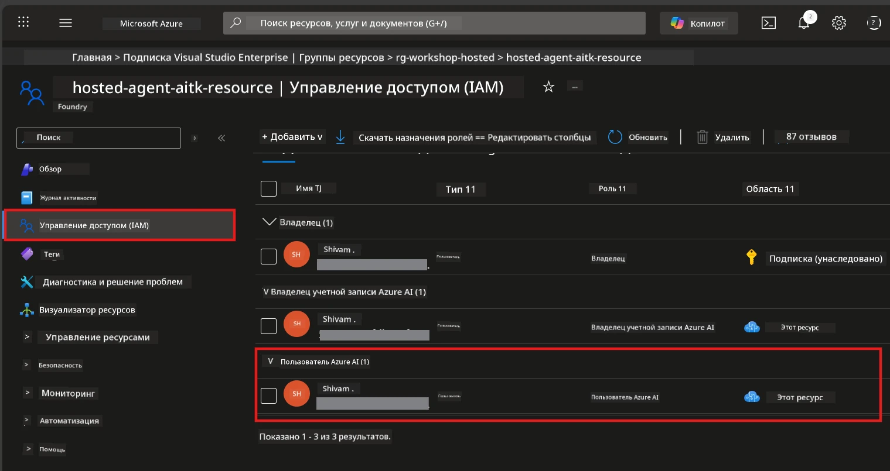

# Настройка: расширение, проект и модель

⏱️ ~15 минут

В этом модуле вы установите и проверите расширение Foundry Toolkit, создадите (или подключитесь к) проекту Foundry и развернете модель, которую будет использовать ваш агент.

## Шаг 1: Установка Foundry Toolkit

**Foundry Toolkit для VS Code** — основное расширение для этого мастер-класса. Оно обеспечивает создание проектов, развертывание моделей, создание каркасов агентов, локальное тестирование (Agent Inspector) и развертывание в облаке — всё из VS Code.

1. Откройте VS Code, затем нажмите `Ctrl+Shift+X`, чтобы открыть панель **Расширения**.
2. Найдите **Foundry Toolkit**.
3. Установите **Foundry Toolkit for VS Code** (издатель: Microsoft, ID: `ms-windows-ai-studio.windows-ai-studio`).
4. После установки иконка **Foundry Toolkit** появится на панели активности (левая боковая панель).

> *Примечание: на более старых версиях расширения на панели активности может отображаться «AI TOOLKIT». Функционал тот же самый.*



## Шаг 2: Настройка в зависимости от вашего доступа

> **Выберите ваш путь:** Раскройте раздел ниже, соответствующий вашей настройке. Вам нужно выполнить только **один** путь.

<details>
<summary><strong>🅰️ Путь А – облако Azure (требуется подписка Azure)</strong></summary>

### Azure CLI

1. Установите с [learn.microsoft.com/cli/azure/install-azure-cli](https://learn.microsoft.com/cli/azure/install-azure-cli).
2. Проверьте: `az --version` (ожидается версия 2.80.0 и выше).
3. Войдите: `az login`

### Варианты аутентификации

[Microsoft Agent Framework](https://learn.microsoft.com/agent-framework/overview/) использует [`DefaultAzureCredential`](https://learn.microsoft.com/azure/developer/python/sdk/authentication/credential-chains#defaultazurecredential-overview), которая последовательно пытается несколько методов аутентификации. Выберите подходящий для вашей среды:

#### Вариант 1: Учетные записи VS Code (рекомендуется для мастер-классов)
1. Нажмите на иконку **Accounts** (силуэт человека) в левом нижнем углу VS Code.
2. Выберите **Sign in to use Microsoft Foundry** (или **Sign in with Azure**).
3. Откроется браузер — выполните вход с помощью Azure аккаунта, имеющего доступ к вашей подписке.
4. Вернитесь в VS Code. В левом нижнем углу должно отображаться имя вашей учетной записи.

#### Вариант 2: Azure CLI
```bash
az login
az account set --subscription "<your-subscription-id>"
```

#### Вариант 3: Служебный принципал (Enterprise/CI)
Для изолированных сред или CI/CD конвейеров установите следующие переменные окружения в вашем файле `.env`:
```env
AZURE_TENANT_ID=<your-tenant-id>
AZURE_CLIENT_ID=<your-client-id>
AZURE_CLIENT_SECRET=<your-client-secret>
```

> **Как работает `DefaultAzureCredential`:** Сначала пытается переменные среды, затем управляемый идентификатор, затем вход VS Code, затем Azure CLI — и использует первый успешный метод. Смотрите [документацию по цепочке учетных данных](https://learn.microsoft.com/azure/developer/python/sdk/authentication/credential-chains#defaultazurecredential-overview).

### Azure Developer CLI (azd)

1. Установите: `winget install microsoft.azd` (Windows) или смотрите [документы по установке](https://learn.microsoft.com/azure/developer/azure-developer-cli/install-azd).
2. Проверьте: `azd version`
3. Войдите: `azd auth login`

### Docker Desktop (необязательно)

Docker требуется, только если хотите собирать контейнеры локально. Расширение Foundry автоматически обрабатывает сборки во время развертывания.

1. Установите с [docs.docker.com/get-docker](https://docs.docker.com/get-docker/).
2. Проверьте: `docker info`

### Подписка Azure и RBAC

1. Войдите на [portal.azure.com](https://portal.azure.com).
2. Перейдите в **Подписки** и убедитесь, что хотя бы одна подписка **Активна**.
3. Запомните ваш **Subscription ID** — он понадобится в Модуле 01.



#### Таблица сценариев RBAC

Развертывание [Hosted Agent](https://learn.microsoft.com/azure/foundry/agents/concepts/hosted-agents) требует разрешений на **действия с данными**, которых нет у стандартных ролей Azure `Owner` и `Contributor`. Используйте таблицу ниже, чтобы определить необходимые роли:

| Сценарий | Необходимые роли | Где назначить |
|----------|-----------------|---------------|
| Создание нового проекта Foundry | **Azure AI Owner** на ресурсе Foundry | Ресурс Foundry в Azure Portal |
| Развертывание в существующем проекте (новые ресурсы) | **Azure AI Owner** + **Contributor** на подписке | Подписка + ресурс Foundry |
| Развертывание в полностью настроенном проекте | **Reader** на учетной записи + **Azure AI User** на проекте | Учетная запись + проект в Azure Portal |
| Только локальное тестирование (без развертывания) | **Azure AI User** на проекте | Проект в Azure Portal |

> **Ключевой момент:** роли `Owner` и `Contributor` в Azure дают права только на *управление* (операции ARM). Для *действий с данными*, таких как `agents/write`, требуемых для создания и развертывания агентов, нужна роль [**Azure AI User**](https://learn.microsoft.com/azure/foundry/concepts/rbac-foundry#built-in-roles) или выше.

## Подключение к проекту Foundry или его создание



1. Нажмите `Ctrl+Shift+P` → введите **Foundry Toolkit: Create Project** → выберите эту команду.
2. Выберите вашу **подписку Azure** из выпадающего списка.
3. Выберите или создайте **группу ресурсов** (например, `rg-hosted-agents-workshop`).
4. Выберите **регион**, поддерживающий host-агентов: `East US`, `West US 2` или `Sweden Central`. Смотрите [доступность регионов](https://learn.microsoft.com/azure/foundry/agents/concepts/hosted-agents#region-availability).
5. Введите имя проекта (например, `workshop-agents`).
6. Дождитесь завершения создания — это займет 2–5 минут. В VS Code появится уведомление о прогрессе.
7. После завершения проект появится в боковой панели **Foundry Toolkit** под разделом **МОИ РЕСУРСЫ**.



## Развертывание модели и назначение ролей RBAC

Вашему host-агенту нужна модель ИИ для генерации ответов.

#### Матрица выбора модели
В зависимости от ваших потребностей можно выбрать разные уровни моделей:

| Модель | Лучше всего подходит для | Стоимость | Примечания |
|--------|------------------------|-----------|------------|
| `gpt-4.1` | Качественные, нюансированные ответы | Выше | Лучший результат, рекомендуется для финального тестирования |
| `gpt-4.1-mini/gpt-5-mini` | Быстрая итерация, низкая стоимость | Ниже | Хорошо для разработки на мастер-классе и быстрого тестирования |
| `gpt-4.1-nano` | Легкие задачи | Самая низкая | Самая экономичная, но ответы проще |

1. Нажмите `Ctrl+Shift+P` → **Foundry Toolkit: Open Model Catalog** (или щелкните **Model Catalog** в боковой панели в разделе ИНСТРУМЕНТЫ РАЗРАБОТЧИКА → Discover).
2. Найдите **gpt-4.1** в каталоге.
3. Найдите **OpenAI GPT-4.1-mini** (или `gpt-5-mini` для лучшего качества) и нажмите **Deploy**.



4. В настройках развертывания:
   - **Имя развертывания:** оставьте по умолчанию или введите свое. **Запомните это имя.**
   - **Цель:** выберите **Deploy to Foundry Toolkit** → выберите ваш проект.
5. Нажмите **Deploy** и дождитесь 1–3 минуты.

> **Рекомендация:** используйте `gpt-4.1-mini/gpt-5-mini` для мастер-класса — быстро, доступно и обеспечивает хорошие результаты.

### Зафиксируйте свои значения

После развертывания запишите эти два значения (они понадобятся в Модуле 03):

| Значение | Где найти |
|---------|----------|
| **Точка доступа проекта** | Нажмите на проект в боковой панели → в деталях будет URL (например, `https://<account>.services.ai.azure.com/api/projects/<project>`) |
| **Имя развертывания модели** | Раскройте проект → **Models** → имя рядом с вашей развернутой моделью (например, `gpt-4.1-mini/gpt-5-mini`) |

### Назначение роли RBAC

> ⚠️ **Это самый часто пропускаемый шаг.** Без правильной роли развертывание в Модуле 05 завершится ошибкой.

#### Какая роль нужна?
В зависимости от вашего сценария требуются следующие комбинации ролей:

| Сценарий | Необходимые роли | Где назначить |
|----------|-----------------|---------------|
| Создание нового проекта Foundry | **Azure AI Owner** на ресурсе Foundry | Ресурс Foundry в Azure Portal |
| Развертывание в существующем проекте (новые ресурсы) | **Azure AI Owner** + **Contributor** на подписке | Подписка + ресурс Foundry |
| Развертывание в полностью настроенном проекте | **Reader** на учетной записи + **Azure AI User** на проекте | Учетная запись + проект в Azure Portal |

**Ключевой момент:** роли `Owner` и `Contributor` в Azure дают права только на *управление*. Для *действий с данными*, как `agents/write` для создания и развертывания агентов, нужна роль **Azure AI User** (или выше).

1. Откройте [portal.azure.com](https://portal.azure.com).
2. Найдите имя вашего **проекта Foundry** → щелкните по результату типа **«Foundry Toolkit project»** (НЕ по родительскому аккаунту).
3. В левой навигации выберите **Управление доступом (IAM)**.
4. Нажмите **+ Добавить** → **Добавить назначение роли**.
5. **Вкладка роль:** найдите **Azure AI User**, выберите, нажмите **Далее**.
6. **Вкладка участники:** выберите **Пользователь, группа или служебный принципал** → нажмите **+ Выбрать участников** → найдите и выберите себя → нажмите **Выбрать**.
7. Нажмите **Обзор и назначение** → снова **Обзор и назначение**.
8. **Подождите 1–2 минуты** для распространения изменений.

> **Почему именно эта роль?** Роли Azure `Owner`/`Contributor` предоставляют только права на управление. Роль **Azure AI User** даёт действие с данными `agents/write`, необходимое для создания и развертывания агентов. См. [документацию Foundry RBAC](https://learn.microsoft.com/azure/foundry/concepts/rbac-foundry#built-in-roles).



</details>

<details>
<summary><strong>🅱️ Путь B – локальный / бесплатный уровень (подписка Azure не нужна)</strong></summary>

### Foundry Local

Foundry Local позволяет запускать модели ИИ на вашем компьютере — облачный аккаунт не требуется. Доступ к моделям Foundry Local можно получить с помощью Foundry Toolkit через каталог моделей следующим образом:

1. Перейдите в расширение Foundry Toolkit.
2. В навигации Foundry Toolkit перейдите в **Инструменты разработчика** > выберите **Каталог моделей**
3. В новом окне выберите **local** на панели навигации.
4. Пролистайте до **Phi 4 Mini** и нажмите кнопку **добавить** — появится всплывающее окно, указывающее, что модель загружается.
5. После загрузки модели можно перейти к следующему шагу.

</details>

### ✅ Контрольная точка


- [ ] `Ctrl+Shift+P` → "Foundry Toolkit" показывает доступные команды
- [ ] Расширение Foundry Toolkit установлено, боковая панель загружается без ошибок
- [ ] VS Code открывается и работает корректно
- [ ] `python --version` показывает 3.10+
- [ ] Иконка Foundry Toolkit видна на панели активности VS Code
- [ ] **Путь А:** `az login` успешен, подписка активна
- [ ] **Путь B:** Foundry Local запущен (`foundry local status`)
- [ ] **Путь А:** Проект Foundry виден на боковой панели, модель развернута, роль Azure AI User назначена
- [ ] **Путь B:** Foundry Local запущен с моделью
- [ ] Вы записали свои **endpoint** и **имя развертывания модели**


**Предыдущий:** [00 - Требования](00-prerequisites.md) · **Следующий:** [02 - Создание Hosted Agent →](02-create-hosted-agent.md)

---

<!-- CO-OP TRANSLATOR DISCLAIMER START -->
**Отказ от ответственности**:
Этот документ был переведен с использованием сервиса машинного перевода [Co-op Translator](https://github.com/Azure/co-op-translator). Несмотря на наши усилия по обеспечению точности, имейте в виду, что автоматический перевод может содержать ошибки или неточности. Оригинальный документ на его исходном языке следует считать авторитетным источником. Для получения критически важной информации рекомендуется обратиться к профессиональному человеческому переводу. Мы не несем ответственности за любые недоразумения или неправильные толкования, возникшие в результате использования этого перевода.
<!-- CO-OP TRANSLATOR DISCLAIMER END -->