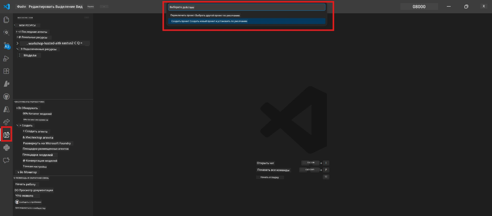
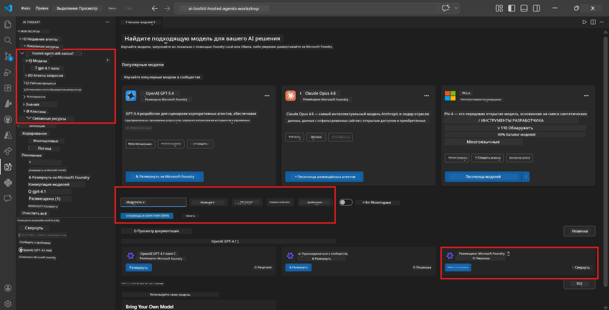
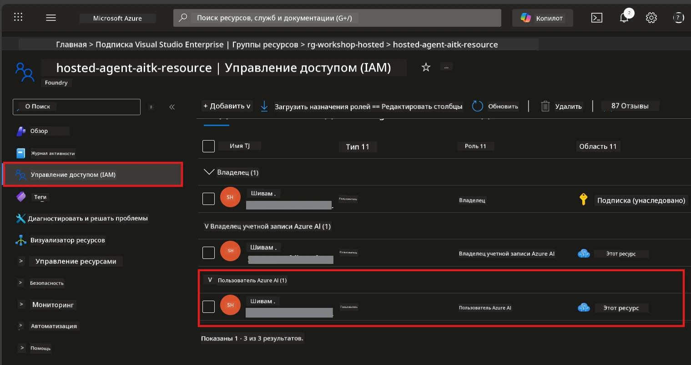

# Модуль 2 - Создание проекта Foundry и развертывание модели

В этом модуле вы создадите (или выберете) проект Microsoft Foundry и развернёте модель, которую будет использовать ваш агент. Каждый шаг расписан подробно — следуйте им по порядку.

> Если у вас уже есть проект Foundry с развернутой моделью, переходите к [Модулю 3](03-create-hosted-agent.md).

---

## Шаг 1: Создание проекта Foundry из VS Code

Вы будете использовать расширение Microsoft Foundry для создания проекта, не покидая VS Code.

1. Нажмите `Ctrl+Shift+P`, чтобы открыть **Палитру команд**.
2. Введите: **Microsoft Foundry: Create Project** и выберите эту команду.
3. Появится выпадающий список — выберите свою **подписку Azure** из списка.
4. Вас попросят выбрать или создать **группу ресурсов**:
   - Чтобы создать новую: введите имя (например, `rg-hosted-agents-workshop`) и нажмите Enter.
   - Чтобы использовать существующую: выберите её из выпадающего списка.
5. Выберите **регион**. **Важно:** Выберите регион, поддерживающий хостинговых агентов. Проверьте [доступность регионов](https://learn.microsoft.com/azure/foundry/agents/concepts/hosted-agents#region-availability) — распространённые варианты: `East US`, `West US 2` или `Sweden Central`.
6. Введите **имя** для проекта Foundry (например, `workshop-agents`).
7. Нажмите Enter и дождитесь окончания развертывания.

> **Развёртывание занимает 2-5 минут.** Вы увидите уведомление о ходе выполнения в правом нижнем углу VS Code. Не закрывайте VS Code во время развёртывания.

8. После завершения в боковой панели **Microsoft Foundry** появится ваш новый проект в разделе **Resources**.
9. Нажмите на имя проекта, чтобы развернуть его и убедиться, что отображаются разделы, такие как **Models + endpoints** и **Agents**.



### Альтернатива: создание через портал Foundry

Если предпочитаете использовать браузер:

1. Откройте [https://ai.azure.com](https://ai.azure.com) и выполните вход.
2. На главной странице нажмите **Create project**.
3. Введите имя проекта, выберите подписку, группу ресурсов и регион.
4. Нажмите **Create** и дождитесь завершения развёртывания.
5. После создания вернитесь в VS Code — проект должен появиться в боковой панели Foundry после обновления (нажмите на иконку обновления).

---

## Шаг 2: Развертывание модели

Вашему [хостинговому агенту](https://learn.microsoft.com/azure/foundry/agents/concepts/hosted-agents) нужна модель Azure OpenAI для генерации ответов. Сейчас вы [развернете её](https://learn.microsoft.com/azure/ai-foundry/openai/how-to/create-resource#deploy-a-model).

1. Нажмите `Ctrl+Shift+P`, чтобы открыть **Палитру команд**.
2. Введите: **Microsoft Foundry: Open [Model Catalog](https://learn.microsoft.com/azure/ai-foundry/openai/concepts/models)** и выберите эту команду.
3. В VS Code откроется просмотр Каталога моделей. Найдите или воспользуйтесь строкой поиска для поиска **gpt-4.1**.
4. Нажмите на карточку модели **gpt-4.1** (или `gpt-4.1-mini`, если предпочитаете более низкую стоимость).
5. Нажмите **Deploy**.


6. В конфигурации развертывания:
   - **Deployment name**: Оставьте имя по умолчанию (например, `gpt-4.1`) или введите своё имя. **Запомните это имя** — оно понадобится вам в Модуле 4.
   - **Target**: Выберите **Deploy to Microsoft Foundry** и выберите созданный проект.
7. Нажмите **Deploy** и дождитесь завершения развертывания (1-3 минуты).

### Выбор модели

| Модель | Для чего лучше всего подходит | Стоимость | Примечания |
|-------|----------|------|-------|
| `gpt-4.1` | Качественные, тонкие ответы | Выше | Лучшие результаты, рекомендуется для финального тестирования |
| `gpt-4.1-mini` | Быстрая итерация, низкая стоимость | Ниже | Хорошо для разработки на мастер-классе и быстрого тестирования |
| `gpt-4.1-nano` | Легкие задачи | Самая низкая | Самый экономный вариант, но упрощённые ответы |

> **Рекомендация для этого мастер-класса:** используйте `gpt-4.1-mini` для разработки и тестирования. Она быстрая, дешёвая и выдаёт хорошие результаты для упражнений.

### Проверка развертывания модели

1. В боковой панели **Microsoft Foundry** разверните ваш проект.
2. Посмотрите в разделе **Models + endpoints** (или аналогичном).
3. Вы должны увидеть вашу развернутую модель (например, `gpt-4.1-mini`) со статусом **Succeeded** или **Active**.
4. Нажмите на развернутую модель, чтобы увидеть её детали.
5. **Запишите** эти два значения — они понадобятся в Модуле 4:

   | Настройка | Где найти | Пример значения |
   |---------|-----------------|---------------|
   | **Project endpoint** | Нажмите на имя проекта в боковой панели Foundry. URL конечной точки показан в деталях. | `https://<account>.services.ai.azure.com/api/projects/<project>` |
   | **Model deployment name** | Имя, отображаемое рядом с развернутой моделью. | `gpt-4.1-mini` |

---

## Шаг 3: Назначение необходимых ролей RBAC

Это **самый часто пропускаемый шаг**. Без правильных ролей развёртывание в Модуле 6 завершится с ошибкой разрешений.

### 3.1 Назначение роли Azure AI User для себя

1. Откройте браузер и перейдите на [https://portal.azure.com](https://portal.azure.com).
2. В верхней строке поиска введите имя вашего **проекта Foundry** и нажмите на него в результатах.
   - **Важно:** Перейдите к ресурсу **проекта** (тип: "Microsoft Foundry project"), а НЕ к родительскому аккаунту/хабу.
3. В левом меню проекта нажмите **Access control (IAM)**.
4. Нажмите кнопку **+ Add** вверху → выберите **Add role assignment**.
5. На вкладке **Role** найдите и выберите [**Azure AI User**](https://learn.microsoft.com/azure/foundry/concepts/rbac-foundry#built-in-roles). Нажмите **Next**.
6. На вкладке **Members**:
   - Выберите **User, group, or service principal**.
   - Нажмите **+ Select members**.
   - Найдите своё имя или почту, выберите себя и нажмите **Select**.
7. Нажмите **Review + assign** → затем ещё раз **Review + assign** для подтверждения.



### 3.2 (Необязательно) Назначение роли Azure AI Developer

Если нужно создавать дополнительные ресурсы внутри проекта или управлять развёртываниями программно:

1. Повторите описанные выше шаги, но на шаге 5 выберите **Azure AI Developer**.
2. Назначьте эту роль на уровне **ресурса Foundry (аккаунта)**, а не только проекта.

### 3.3 Проверка назначенных ролей

1. На странице **Access control (IAM)** проекта выберите вкладку **Role assignments**.
2. Найдите своё имя.
3. Вы должны увидеть как минимум роль **Azure AI User** в области действия проекта.

> **Почему это важно:** Роль [`Azure AI User`](https://learn.microsoft.com/azure/foundry/concepts/rbac-foundry#built-in-roles) предоставляет действие данных `Microsoft.CognitiveServices/accounts/AIServices/agents/write`. Без неё при развертывании вы получите ошибку:
>
> ```
> Error: lacks the required data action 
> Microsoft.CognitiveServices/accounts/AIServices/agents/write 
> to perform POST /api/projects/{projectName}/assistants operation.
> ```
>
> Подробнее см. [Модуль 8 - Устранение неполадок](08-troubleshooting.md).

---

### Контрольный список

- [ ] Проект Foundry существует и виден в боковой панели Microsoft Foundry в VS Code
- [ ] Развернута как минимум одна модель (например, `gpt-4.1-mini`) со статусом **Succeeded**
- [ ] Вы записали URL **project endpoint** и имя **model deployment name**
- [ ] У вас назначена роль **Azure AI User** на уровне **проекта** (проверьте в Azure Portal → IAM → Role assignments)
- [ ] Проект находится в [поддерживаемом регионе](https://learn.microsoft.com/azure/foundry/agents/concepts/hosted-agents#region-availability) для хостинговых агентов

---

**Предыдущий:** [01 - Установка Foundry Toolkit](01-install-foundry-toolkit.md) · **Следующий:** [03 - Создание хостинга агента →](03-create-hosted-agent.md)

---

<!-- CO-OP TRANSLATOR DISCLAIMER START -->
**Отказ от ответственности**:  
Этот документ был переведен с помощью сервиса автоматического перевода [Co-op Translator](https://github.com/Azure/co-op-translator). Несмотря на наши усилия по обеспечению точности, имейте в виду, что автоматический перевод может содержать ошибки или неточности. Оригинальный документ на его исходном языке следует считать авторитетным источником. Для получения важной информации рекомендуется обращаться к профессиональному человеческому переводу. Мы не несем ответственности за любые недоразумения или неправильные толкования, возникшие в результате использования этого перевода.
<!-- CO-OP TRANSLATOR DISCLAIMER END -->