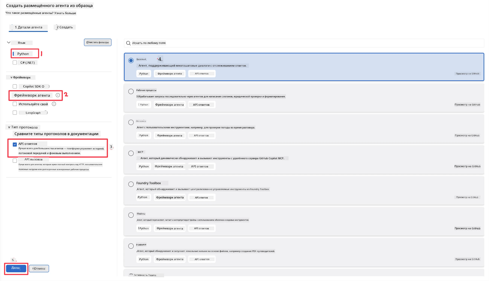
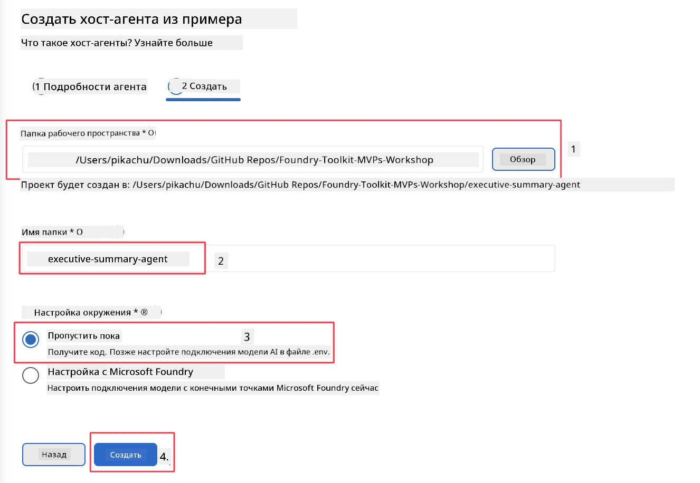

# Модуль 2 - Создание нового размещённого агента

⏱️ ~5 мин

В этом модуле вы используете Foundry Toolkit, чтобы **создать каркас проекта размещённого агента**. Каркас генерирует полную структуру проекта - `agent.yaml`, `main.py`, `Dockerfile`, `requirements.txt` и конфигурацию отладки VS Code - чтобы вы могли сосредоточиться на настройке поведения агента.

> **Ключевая идея:** Папка `agent/` в этой лабораторной работе является примером того, что генерирует Foundry Toolkit. Вам не нужно писать эти файлы с нуля.

### Ход мастера создания каркаса

```mermaid
flowchart LR
    A["Command Palette:
    Create new Hosted Agent"] --> B["Language:
    Python"]
    B --> C["API type:
    Response API"]
    C --> D["Template:
    Basic - Agent Framework"]
    D --> E["Выберите модель"]
    E --> F["Workspace folder
    & agent name"]
    F --> G["Сгенерированный проект"]

    style A fill:#4A90D9,color:#fff
    style B fill:#7B68EE,color:#fff
    style C fill:#7B68EE,color:#fff
    style D fill:#7B68EE,color:#fff
    style E fill:#7B68EE,color:#fff
    style F fill:#7B68EE,color:#fff
    style G fill:#27AE60,color:#fff
```



---

## Шаг 1: Откройте мастер создания размещённого агента

1. Нажмите `Ctrl+Shift+P`, чтобы открыть **Палитру команд**.
2. Введите: **Foundry Toolkit: Create new Hosted Agent** и выберите эту команду.

> **Альтернатива: создание через Foundry Portal**
> Если вы предпочитаете браузер, вы можете создать проект на [https://ai.azure.com](https://ai.azure.com). После создания проекта вернитесь в VS Code и используйте боковую панель **Foundry Toolkit** для подключения к нему.

> **Альтернатива:** Нажмите на значок **+** рядом с **Hosted Agents (Preview)** на боковой панели Foundry Toolkit.

## Шаг 2: Выбор параметров



1. В левой навигационной/опционной секции выберите следующее:

| Меню | Выбор | Примечания |
|--------|-----------|-------|
| **Язык** | Python | Также поддерживается C# |
| **Фреймворк** | Agent Framework | Простой стартовый вариант с использованием Agent Framework SDK |
| **Тип API** | Response API | `POST /responses` - разговорное, с историей, управляемой платформой |
| **Шаблон** | Basic | Простой стартовый вариант с использованием Agent Framework SDK |

2. После выбора нажмите **Далее**



3. В следующем окне выберите следующее:

| Меню | Выбор | Примечания |
|--------|-----------|-------|
| **Папка рабочего пространства** | Выберите целевую папку | например, `/workspace/Foundry_Toolkit_for_VSCode_Lab/` или подпапку в этом репозитории |
| **Имя агента** | Введите имя | например, `executive-summary-agent` |
| **Настройка окружения** | пропустить настройку пока |  |

Нажмите **создать**, чтобы создать нашего агента. Будет создана новая папка с именем размещённого агента.

## Шаг 3: Просмотр сгенерированного проекта

После завершения создания каркаса убедитесь, что вы видите эти файлы в Проводнике (`Ctrl+Shift+E`):

```
📂 my-agent/
├── .env                ← Environment variables (placeholders)
├── .vscode/
│   ├── launch.json     ← Debug config (F5 → run + Agent Inspector)
│   └── tasks.json      ← VS Code task definitions
├── agent.yaml          ← Agent definition (kind: hosted)
├── Dockerfile          ← Container config for deployment
├── main.py             ← Agent entry point (your main code)
└── requirements.txt    ← Python dependencies
```

### Объяснение ключевых файлов

| Файл | Назначение |
|------|---------|
| `agent.yaml` | Объявляет агента как `kind: hosted`, сопоставляет переменные окружения, определяет протокол `/responses` |
| `main.py` | Создаёт `FoundryChatClient` → оборачивает его в `Agent` с инструкциями → обслуживает через `ResponsesHostServer` на порту 8088 |
| `Dockerfile` | Использует `python:3.12-slim`, устанавливает зависимости, открывает порт 8088, запускает `main.py` |
| `requirements.txt` | `agent-framework-foundry`, `agent-framework-foundry-hosting`, `mcp`, `debugpy` |

> **Важно:** Открывайте сгенерированную папку агента непосредственно в VS Code (саму папку `agent/`), чтобы `.vscode/launch.json` и `tasks.json` корректно работали для отладки нажатием F5.

---

### ✅ Контрольная точка

- [ ] Создан каркас проекта со всеми ожидаемыми файлами
- [ ] В `agent.yaml` указано `kind: hosted` и `protocol: responses`
- [ ] В `main.py` импортированы `Agent`, `FoundryChatClient`, `ResponsesHostServer`
- [ ] Папка агента открыта в VS Code как корень рабочего пространства

---

**Предыдущий:** [01 - Настройка](01-setup.md) · **Следующий:** [03 - Конфигурация и кодирование →](03-configure-and-code.md)

---

<!-- CO-OP TRANSLATOR DISCLAIMER START -->
**Отказ от ответственности**:
Этот документ был переведен с использованием сервиса машинного перевода [Co-op Translator](https://github.com/Azure/co-op-translator). Несмотря на наши усилия по обеспечению точности, имейте в виду, что автоматический перевод может содержать ошибки или неточности. Оригинальный документ на его исходном языке следует считать авторитетным источником. Для получения критически важной информации рекомендуется обратиться к профессиональному человеческому переводу. Мы не несем ответственности за любые недоразумения или неправильные толкования, возникшие в результате использования этого перевода.
<!-- CO-OP TRANSLATOR DISCLAIMER END -->