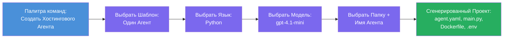

# Модуль 3 - Создание нового хостинг-агента (автоматически сгенерировано расширением Foundry)

В этом модуле вы используете расширение Microsoft Foundry для **создания нового проекта [хостинг-агента](https://learn.microsoft.com/azure/foundry/agents/concepts/hosted-agents)**. Расширение генерирует всю структуру проекта за вас — включая `agent.yaml`, `main.py`, `Dockerfile`, `requirements.txt`, файл `.env` и конфигурацию отладки для VS Code. После создания вы настраиваете эти файлы с инструкциями, инструментами и конфигурацией вашего агента.

> **Ключевая идея:** Папка `agent/` в этой лабораторной работе является примером того, что генерирует расширение Foundry при выполнении команды scaffolding. Вы не пишете эти файлы с нуля — расширение их создаёт, а вы затем редактируете.

### Процесс мастера создания проекта


---

## Шаг 1: Откройте мастер создания Hosted Agent

1. Нажмите `Ctrl+Shift+P`, чтобы открыть **Палитру команд**.
2. Введите: **Microsoft Foundry: Create a New Hosted Agent** и выберите эту команду.
3. Откроется мастер создания хостинг-агента.

> **Альтернативный путь:** Вы также можете открыть этот мастер через боковую панель Microsoft Foundry → нажать на **+** рядом с **Agents** или кликнуть правой кнопкой мыши и выбрать **Create New Hosted Agent**.

---

## Шаг 2: Выберите шаблон

Мастер попросит выбрать шаблон. Вы увидите варианты:

| Шаблон | Описание | Когда использовать |
|--------|----------|-------------------|
| **Single Agent** | Один агент с собственной моделью, инструкциями и дополнительными инструментами | Этот воркшоп (Лабораторная 01) |
| **Multi-Agent Workflow** | Несколько агентов, которые взаимодействуют последовательно | Лабораторная 02 |

1. Выберите **Single Agent**.
2. Нажмите **Next** (или выбор произойдет автоматически).

---

## Шаг 3: Выберите язык программирования

1. Выберите **Python** (рекомендуется для этого воркшопа).
2. Нажмите **Next**.

> **Поддерживается также C#**, если вы предпочитаете .NET. Структура scaffolding схожа (использует `Program.cs` вместо `main.py`).

---

## Шаг 4: Выберите модель

1. Мастер покажет модели, развернутые в вашем проекте Foundry (из Модуля 2).
2. Выберите модель, которую вы развернули, например **gpt-4.1-mini**.
3. Нажмите **Next**.

> Если вы не видите моделей, вернитесь к [Модулю 2](02-create-foundry-project.md) и сначала разверните модель.

---

## Шаг 5: Выберите папку и имя агента

1. Откроется диалог выбора файла — выберите **целевую папку**, куда будет создан проект. Для этого воркшопа:
   - Если начинаете с нуля: выберите любую папку (например, `C:\Projects\my-agent`)
   - Если работаете внутри репозитория воркшопа: создайте новую подпапку внутри `workshop/lab01-single-agent/agent/`
2. Введите **имя** хостинг-агента (например, `executive-summary-agent` или `my-first-agent`).
3. Нажмите **Create** (или Enter).

---

## Шаг 6: Подождите завершения scaffolding

1. VS Code откроет **новое окно** с новым проектом.
2. Подождите несколько секунд, пока проект полностью загрузится.
3. В панели Explorer (`Ctrl+Shift+E`) вы должны увидеть следующие файлы:

```
📂 my-first-agent/
├── .env                ← Environment variables (auto-generated with placeholders)
├── .vscode/
│   └── launch.json     ← Debug configuration (F5 to run + Agent Inspector)
├── agent.yaml          ← Agent definition (kind: hosted)
├── Dockerfile          ← Container configuration for deployment
├── main.py             ← Agent entry point (your main code file)
└── requirements.txt    ← Python dependencies
```

> **Это та же структура, что и в папке `agent/`** в этой лабораторной работе. Расширение Foundry автоматически генерирует эти файлы — вам не нужно создавать их вручную.

> **Примечание воркшопа:** В репозитории воркшопа папка `.vscode/` находится в **корне рабочего пространства** (а не внутри каждого проекта). В ней находятся общие файлы `launch.json` и `tasks.json` с двумя конфигурациями отладки — **"Lab01 - Single Agent"** и **"Lab02 - Multi-Agent"** — каждая с правильным `cwd` для соответствующей лабораторной работы. При нажатии F5 выберите конфигурацию, соответствующую вашей лабораторной работе, из выпадающего меню.

---

## Шаг 7: Изучите каждую сгенерированную файл

Потратьте время, чтобы внимательно изучить каждый созданный файл. Это важно для Модуля 4 (настройка).

### 7.1 `agent.yaml` — определение агента

Откройте `agent.yaml`. Он выглядит так:

```yaml
# yaml-language-server: $schema=https://raw.githubusercontent.com/microsoft/AgentSchema/refs/heads/main/schemas/v1.0/ContainerAgent.yaml

kind: hosted
name: my-first-agent
description: >
  A hosted agent deployed to Microsoft Foundry Agent Service.
metadata:
  authors:
    - Microsoft
  tags:
    - Azure AI AgentServer
    - Microsoft Agent Framework
    - Hosted Agent
protocols:
  - protocol: responses
    version: v1
environment_variables:
  - name: AZURE_AI_PROJECT_ENDPOINT
    value: ${PROJECT_ENDPOINT}
  - name: AZURE_AI_MODEL_DEPLOYMENT_NAME
    value: ${MODEL_DEPLOYMENT_NAME}
dockerfile_path: Dockerfile
resources:
  cpu: '0.25'
  memory: 0.5Gi
```

**Ключевые поля:**

| Поле | Назначение |
|-------|------------|
| `kind: hosted` | Указывает, что агент хостится (запускается в контейнере, развернут на [Foundry Agent Service](https://learn.microsoft.com/azure/foundry/agents/overview)) |
| `protocols: responses v1` | Агент раскрывает HTTP-эндпоинт `/responses` совместимый с OpenAI |
| `environment_variables` | Отображение значений из `.env` в переменные окружения контейнера при развертывании |
| `dockerfile_path` | Указывает путь к Dockerfile для сборки образа контейнера |
| `resources` | Выделение ресурсов CPU и памяти для контейнера (0.25 CPU, 0.5Gi памяти) |

### 7.2 `main.py` — точка входа агента

Откройте `main.py`. Это основной Python-файл, где реализована логика агента. В scaffold включены:

```python
from agent_framework.azure import AzureAIAgentClient
from azure.ai.agentserver.agentframework import from_agent_framework
from azure.identity.aio import DefaultAzureCredential
```

**Ключевые импорты:**

| Импорт | Назначение |
|---------|------------|
| `AzureAIAgentClient` | Подключается к вашему проекту Foundry и создаёт агентов через `.as_agent()` |
| [`DefaultAzureCredential`](https://learn.microsoft.com/azure/developer/python/sdk/authentication/credential-chains#defaultazurecredential-overview) | Обработка аутентификации (Azure CLI, вход в VS Code, управляемая идентификация или сервисный принципал) |
| `from_agent_framework` | Оборачивает агента в HTTP-сервер с эндпоинтом `/responses` |

Основной поток:
1. Создать credentials → создать клиент → вызвать `.as_agent()` чтобы получить агента (асинхронный контекстный менеджер) → обернуть его в сервер → запустить

### 7.3 `Dockerfile` — образ контейнера

```dockerfile
FROM python:3.14-slim

WORKDIR /app

COPY ./ .

RUN pip install --upgrade pip && \
    if [ -f requirements.txt ]; then \
        pip install -r requirements.txt; \
    else \
        echo "No requirements.txt found" >&2; exit 1; \
    fi

EXPOSE 8088

CMD ["python", "main.py"]
```

**Ключевые детали:**
- Использует образ `python:3.14-slim` в качестве базового.
- Копирует все файлы проекта в `/app`.
- Обновляет `pip`, устанавливает зависимости из `requirements.txt` и завершает работу с ошибкой, если файл отсутствует.
- **Открывает порт 8088** — этот порт обязателен для хостинг-агентов. Менять его нельзя.
- Запускает агента командой `python main.py`.

### 7.4 `requirements.txt` — зависимости

```
agent-framework-azure-ai==1.0.0rc3
agent-framework-core==1.0.0rc3
azure-ai-agentserver-agentframework==1.0.0b16
azure-ai-agentserver-core==1.0.0b16
debugpy
agent-dev-cli
```

| Пакет | Назначение |
|-------|------------|
| `agent-framework-azure-ai` | Интеграция Azure AI для Microsoft Agent Framework |
| `agent-framework-core` | Основное ядро для построения агентов (включает `python-dotenv`) |
| `azure-ai-agentserver-agentframework` | Рантайм сервера хостинг-агентов для Foundry Agent Service |
| `azure-ai-agentserver-core` | Абстракции ядра серверного агента |
| `debugpy` | Поддержка отладки Python (позволяет отлаживать F5 в VS Code) |
| `agent-dev-cli` | CLI для локальной разработки и тестирования агентов (используется настройкой отладки/запуска) |

---

## Понимание протокола агента

Хостинг-агенты общаются через протокол **OpenAI Responses API**. При запуске (локально или в облаке) агент раскрывает один HTTP-эндпоинт:

```
POST http://localhost:8088/responses
Content-Type: application/json

{
  "input": "Your prompt here",
  "stream": false
}
```

Служба Foundry Agent Service вызывает этот эндпоинт для отправки пользовательских запросов и получения ответов агента. Это тот же протокол, что и у OpenAI API, поэтому ваш агент совместим с любыми клиентами, поддерживающими формат OpenAI Responses.

---

### Контрольный список

- [ ] Мастер scaffolding успешно завершён, и открылось **новое окно VS Code**
- [ ] Видны все 5 файлов: `agent.yaml`, `main.py`, `Dockerfile`, `requirements.txt`, `.env`
- [ ] Файл `.vscode/launch.json` существует (обеспечивает отладку F5 — в этом воркшопе находится в корне рабочего пространства с конфигурациями для конкретных лабораторных)
- [ ] Вы прочитали и поняли назначение каждого файла
- [ ] Вы понимаете, что порт `8088` обязателен и `/responses` — это используемый протокол

---

**Предыдущая:** [02 - Создание проекта Foundry](02-create-foundry-project.md) · **Следующая:** [04 - Настройка и кодирование →](04-configure-and-code.md)

---

<!-- CO-OP TRANSLATOR DISCLAIMER START -->
**Отказ от ответственности**:  
Этот документ был переведен с помощью сервиса автоматического перевода [Co-op Translator](https://github.com/Azure/co-op-translator). Несмотря на наши усилия обеспечить точность, пожалуйста, имейте в виду, что автоматический перевод может содержать ошибки или неточности. Оригинальный документ на исходном языке следует рассматривать как авторитетный источник. Для критически важной информации рекомендуется профессиональный перевод человеком. Мы не несем ответственности за любые недоразумения или неправильные толкования, возникшие в результате использования этого перевода.
<!-- CO-OP TRANSLATOR DISCLAIMER END -->