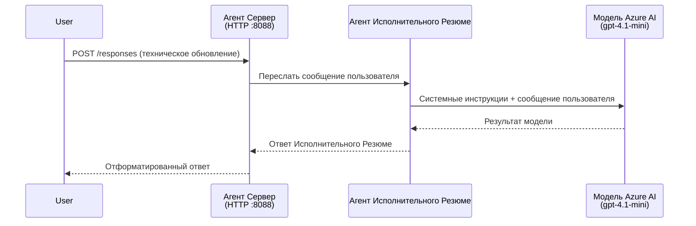
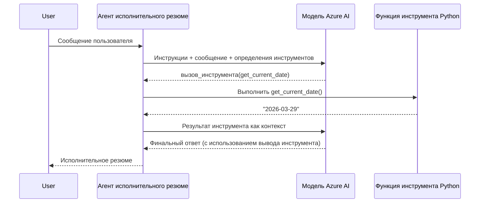

# Module 4 - Настройка инструкций, окружения и установка зависимостей

В этом модуле вы настраиваете автоматически созданные файлы агента из Модуля 3. Здесь вы превращаете общий шаблон в **своего** агента — пишете инструкции, задаете переменные окружения, по желанию добавляете инструменты и устанавливаете зависимости.

> **Напоминание:** Расширение Foundry автоматически сгенерировало файлы вашего проекта. Теперь вы их изменяете. Смотрите папку [`agent/`](../../../../../workshop/lab01-single-agent/agent) для полного рабочего примера настроенного агента.

---

## Как компоненты работают вместе

### Жизненный цикл запроса (один агент)


> **С инструментами:** Если у агента зарегистрированы инструменты, модель может вернуть вызов инструмента вместо прямого ответа. Фреймворк выполняет инструмент локально, возвращает результат модели, которая затем генерирует окончательный ответ.


---

## Шаг 1: Настройка переменных окружения

Шаблон создал файл `.env` с заполнителями значений. Вам нужно заменить их реальными значениями из Модуля 2.

1. В вашем сгенерированном проекте откройте файл **`.env`** (он в корне проекта).
2. Замените значения-заполнители вашими реальными данными проекта Foundry:

   ```env
   PROJECT_ENDPOINT=https://<your-account>.services.ai.azure.com/api/projects/<your-project>
   MODEL_DEPLOYMENT_NAME=gpt-4.1-mini
   ```

3. Сохраните файл.

### Где найти эти значения

| Значение | Где найти |
|----------|-----------|
| **Project endpoint** | Откройте боковую панель **Microsoft Foundry** в VS Code → кликните по вашему проекту → URL конечной точки отображается в детальном просмотре. Выглядит как `https://<account-name>.services.ai.azure.com/api/projects/<project-name>` |
| **Model deployment name** | В боковой панели Foundry раскройте проект → под **Models + endpoints** → имя указано рядом с развернутой моделью (например, `gpt-4.1-mini`) |

> **Безопасность:** Никогда не коммитьте файл `.env` в систему контроля версий. Он уже включён в `.gitignore` по умолчанию. Если нет, добавьте его:
> ```
> .env
> ```

### Как передаются переменные окружения

Цепочка маппинга: `.env` → `main.py` (читает через `os.getenv`) → `agent.yaml` (мапит на переменные окружения контейнера во время деплоя).

В `main.py` шаблон читает эти значения так:

```python
PROJECT_ENDPOINT = os.getenv("AZURE_AI_PROJECT_ENDPOINT") or os.getenv("PROJECT_ENDPOINT")
MODEL_DEPLOYMENT_NAME = os.getenv("AZURE_AI_MODEL_DEPLOYMENT_NAME", os.getenv("MODEL_DEPLOYMENT_NAME", "gpt-4.1-mini"))
```

Принимаются оба варианта `AZURE_AI_PROJECT_ENDPOINT` и `PROJECT_ENDPOINT` (в `agent.yaml` используется префикс `AZURE_AI_*`).

---

## Шаг 2: Написание инструкций агента

Это самый важный этап настройки. Инструкции определяют личность агента, его поведение, формат вывода и ограничения безопасности.

1. Откройте `main.py` в проекте.
2. Найдите строку с инструкциями (в шаблоне есть дефолт/общая).
3. Замените её на подробные, структурированные инструкции.

### Что содержит хорошая инструкция

| Компонент | Назначение | Пример |
|-----------|------------|--------|
| **Роль** | Кто агент и что делает | "Вы — агент для составления исполнительных резюме" |
| **Аудитория** | Для кого предназначены ответы | "Руководители с ограниченными техническими знаниями" |
| **Определение входа** | Какими запросами обрабатывает | "Технические отчёты об инцидентах, операционные обновления" |
| **Формат вывода** | Точная структура ответов | "Исполнительное резюме: - Что случилось: ... - Влияние на бизнес: ... - Следующий шаг: ..." |
| **Правила** | Ограничения и условия отказа | "Не добавляйте информацию, выходящую за рамки предоставленного" |
| **Безопасность** | Предотвращение злоупотреблений и галлюцинаций | "Если вход неясен, попросите уточнить" |
| **Примеры** | Пары вход/выход для направления поведения | Включите 2-3 примера с разными входными данными |

### Пример инструкций для агента исполнительного резюме

Вот инструкции из воркшопа в файле [`agent/main.py`](../../../../../workshop/lab01-single-agent/agent/main.py):

```python
AGENT_INSTRUCTIONS = """You are an "Explain Like I'm an Executive" agent.

Purpose:
Your job is to translate complex technical or operational information into
clear, concise, and outcome-focused summaries that can be easily understood
by non-technical executives.

Audience:
Senior leaders with limited technical background who care about impact,
risk, and what happens next.

What you must do:
- Rephrase the input so it is understandable to a non-technical audience
- Prioritize clarity, brevity, and outcomes over technical accuracy
- Remove technical jargon, logs, metrics, stack traces, and deep root-cause details
- Translate technical causes into simple cause-and-effect statements
- Explicitly call out business impact
- Always include a clear next step or action
- Maintain a neutral, factual, and calm executive tone
- Do NOT add new facts or speculate beyond the input

Standard Output Structure (always use this wording):

Executive Summary:
- What happened: <plain-language description>
- Business impact: <clear, non-technical impact>
- Next step: <clear action or mitigation>

Rules:
- Keep responses under 100 words
- Do NOT add facts beyond the input
- If input is unclear, ask for clarification
"""
```

4. Замените существующую строку инструкций в `main.py` на свои.
5. Сохраните файл.

---

## Шаг 3: (Опционально) Добавление пользовательских инструментов

Хостинг-агенты могут выполнять **локальные Python функции** как [инструменты](https://learn.microsoft.com/azure/foundry/agents/concepts/tool-catalog). Это ключевое преимущество кодовых хостинг-агентов над только шаблонными — агент может запускать произвольную серверную логику.

### 3.1 Определение функции инструмента

Добавьте функцию инструмента в `main.py`:

```python
from agent_framework import tool

@tool
def get_current_date() -> str:
    """Returns the current date in YYYY-MM-DD format."""
    from datetime import date
    return str(date.today())
```

Декоратор `@tool` превращает обычную Python-функцию в инструмент агента. Докстринг становится описанием инструмента, видимым модели.

### 3.2 Регистрация инструмента у агента

При создании агента через менеджер контекста `.as_agent()` передайте инструмент в параметре `tools`:

```python
async with AzureAIAgentClient(
    project_endpoint=PROJECT_ENDPOINT,
    model_deployment_name=MODEL_DEPLOYMENT_NAME,
    credential=credential,
).as_agent(
    name="my-agent",
    instructions=AGENT_INSTRUCTIONS,
    tools=[get_current_date],
) as agent:
    server = from_agent_framework(agent)
    await server.run_async()
```

### 3.3 Как работают вызовы инструментов

1. Пользователь отправляет запрос.
2. Модель решает, нужен ли инструмент (основано на запросе, инструкциях и описаниях инструментов).
3. Если нужен, фреймворк локально вызывает вашу Python-функцию (внутри контейнера).
4. Возвращаемое значение инструмента отправляется модели как контекст.
5. Модель генерирует итоговый ответ.

> **Инструменты выполняются на сервере** — внутри вашего контейнера, а не в браузере пользователя или модели. Это позволяет использовать базы данных, API, файловые системы или любые Python-библиотеки.

---

## Шаг 4: Создание и активация виртуального окружения

Перед установкой зависимостей создайте изолированное Python-окружение.

### 4.1 Создание виртуального окружения

Откройте терминал в VS Code (`` Ctrl+` ``) и выполните:

```powershell
python -m venv .venv
```

Это создаст папку `.venv` в каталоге проекта.

### 4.2 Активация виртуального окружения

**PowerShell (Windows):**

```powershell
.\.venv\Scripts\Activate.ps1
```

**Command Prompt (Windows):**

```cmd
.venv\Scripts\activate.bat
```

**macOS/Linux (Bash):**

```bash
source .venv/bin/activate
```

В начале строки терминала должно появиться `(.venv)`, что означает активированное виртуальное окружение.

### 4.3 Установка зависимостей

С активированным виртуальным окружением установите необходимые пакеты:

```powershell
pip install -r requirements.txt
```

Устанавливаются:

| Пакет | Назначение |
|-------|------------|
| `agent-framework-azure-ai==1.0.0rc3` | Интеграция Azure AI для [Microsoft Agent Framework](https://learn.microsoft.com/agent-framework/overview/) |
| `agent-framework-core==1.0.0rc3` | Основной рантайм для создания агентов (включает `python-dotenv`) |
| `azure-ai-agentserver-agentframework==1.0.0b16` | Рантайм хостинг-сервера агента для [Foundry Agent Service](https://learn.microsoft.com/azure/foundry/agents/overview) |
| `azure-ai-agentserver-core==1.0.0b16` | Основные абстракции сервера агента |
| `debugpy` | Отладка Python (включает F5 отладку в VS Code) |
| `agent-dev-cli` | Локальный CLI для разработки и тестирования агентов |

### 4.4 Проверка установки

```powershell
pip list | Select-String "agent-framework|agentserver"
```

Ожидаемый вывод:
```
agent-framework-azure-ai   1.0.0rc3
agent-framework-core       1.0.0rc3
azure-ai-agentserver-agentframework 1.0.0b16
azure-ai-agentserver-core  1.0.0b16
```

---

## Шаг 5: Проверка аутентификации

Агент использует [`DefaultAzureCredential`](https://learn.microsoft.com/azure/developer/python/sdk/authentication/credential-chains#defaultazurecredential-overview), который пытает несколько способов аутентификации в следующем порядке:

1. **Переменные окружения** - `AZURE_CLIENT_ID`, `AZURE_TENANT_ID`, `AZURE_CLIENT_SECRET` (сервисный аккаунт)
2. **Azure CLI** - подхватывает вашу сессию `az login`
3. **VS Code** - использует аккаунт, с которым вы вошли в VS Code
4. **Managed Identity** - используется при работе в Azure (во время деплоя)

### 5.1 Проверка для локальной разработки

Должен работать хотя бы один из способов:

**Вариант A: Azure CLI (рекомендуется)**

```powershell
az account show --query "{name:name, id:id}" --output table
```

Ожидается: показывает имя и ID вашей подписки.

**Вариант B: Вход через VS Code**

1. Посмотрите в левый нижний угол VS Code на иконку **Accounts**.
2. Если там видно ваше имя, значит вы аутентифицированы.
3. Если нет, кликните на иконку → **Sign in to use Microsoft Foundry**.

**Вариант C: Сервисный аккаунт (для CI/CD)**

```powershell
$env:AZURE_TENANT_ID = "<your-tenant-id>"
$env:AZURE_CLIENT_ID = "<your-client-id>"
$env:AZURE_CLIENT_SECRET = "<your-client-secret>"
```

### 5.2 Частая проблема с аутентификацией

Если вы вошли в несколько учетных записей Azure, убедитесь, что выбрана правильная подписка:

```powershell
az account set --subscription "<your-subscription-id>"
```

---

### Контрольный список

- [ ] Файл `.env` содержит валидные значения `PROJECT_ENDPOINT` и `MODEL_DEPLOYMENT_NAME` (не заполнители)
- [ ] Инструкции агента настроены в `main.py` — определяют роль, аудиторию, формат вывода, правила и ограничения безопасности
- [ ] (Опционально) Определены и зарегистрированы кастомные инструменты
- [ ] Виртуальное окружение создано и активировано (в терминальной строке виден `(.venv)`)
- [ ] `pip install -r requirements.txt` успешно завершён без ошибок
- [ ] `pip list | Select-String "azure-ai-agentserver"` показывает установленные пакеты
- [ ] Аутентификация корректна — команда `az account show` возвращает подписку ИЛИ вы вошли в VS Code

---

**Предыдущий:** [03 - Создание хостинг-агента](03-create-hosted-agent.md) · **Следующий:** [05 - Локальное тестирование →](05-test-locally.md)

---

<!-- CO-OP TRANSLATOR DISCLAIMER START -->
**Отказ от ответственности**:  
Этот документ был переведен с использованием сервиса автоматического перевода [Co-op Translator](https://github.com/Azure/co-op-translator). Несмотря на наши стремления к точности, просим учитывать, что автоматический перевод может содержать ошибки и неточности. Оригинальный документ на родном языке следует считать авторитетным источником. Для важной информации рекомендуется обратиться к профессиональному переводу. Мы не несем ответственности за любые недоразумения или неправильные толкования, возникшие в результате использования данного перевода.
<!-- CO-OP TRANSLATOR DISCLAIMER END -->