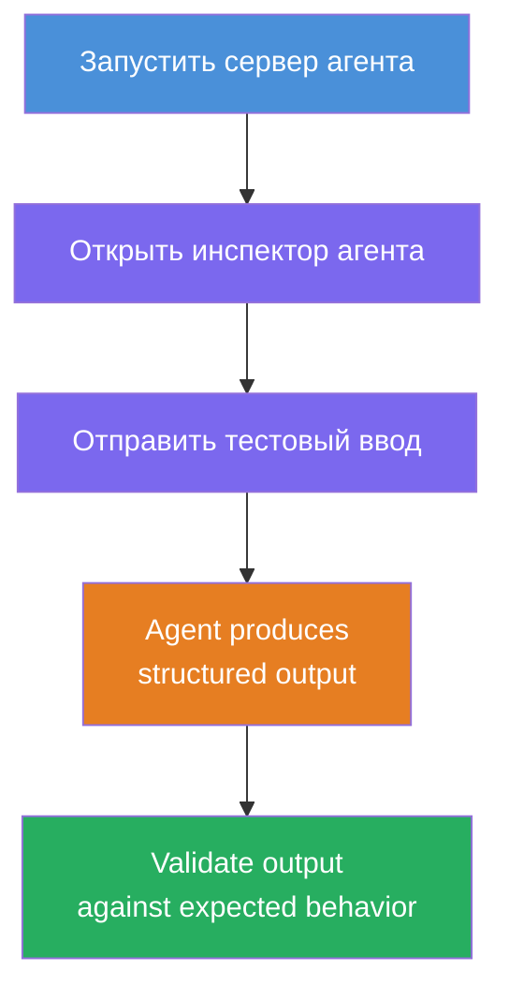
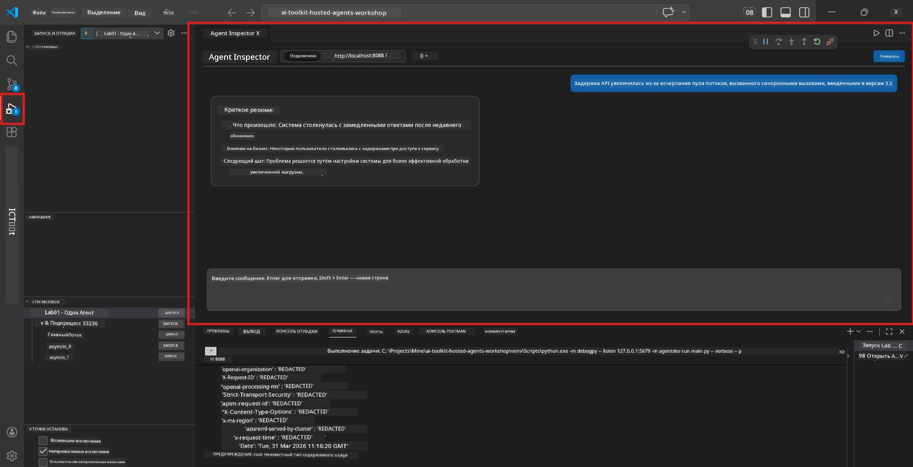
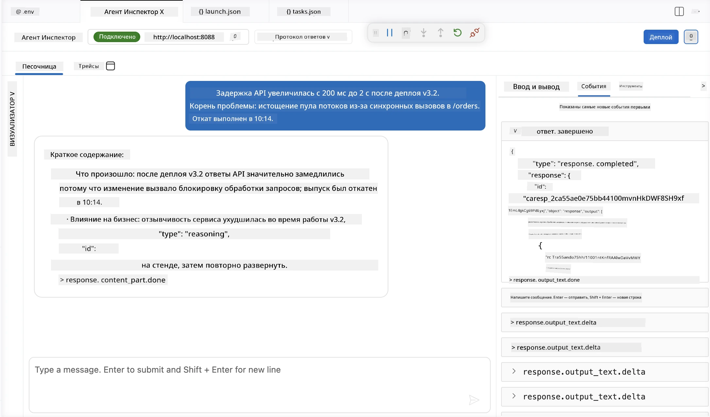

# Модуль 4 - Тестирование локально

⏱️ ~10 минут

В этом модуле вы запускаете агента локально и проверяете его корректную работу с помощью **функциональных тестов по «счастливому сценарию»**. Вы будете использовать Agent Inspector (визуальный интерфейс) или прямые HTTP-запросы, чтобы убедиться, что агент выдаёт структурированные и точные ответы.

### Процесс локального тестирования



---

## Вариант 1: Нажмите F5 - отладка с Agent Inspector (рекомендуется)

### Запуск отладчика

1. Откройте папку **executive-summary-agent/** прямо в VS Code (`File → Open Folder`).
2. Откройте панель **Run and Debug** (`Ctrl+Shift+D`).
3. Выберите из выпадающего списка **Debug Local Agent Server**.
4. Нажмите **F5** (или кликните ▶ Запустить отладку).

> ⚠️ **Критично: выберите интерпретатор Python**
> Если возникает ошибка "ModuleNotFoundError" или отладчик не запускается, необходимо указать VS Code использовать ваше виртуальное окружение:
  > 1. Нажмите `Ctrl+Shift+P`, введите **Python: Select Interpreter**.
  > 2. Выберите интерпретатор из папки `.venv` вашего проекта (например, `.\.venv\Scripts\python.exe` на Windows).
  > 3. Перезапустите сессию отладки.
> Если ошибки сохраняются, вручную обновите файл `tasks.json` следующим образом:
  > 1. Перейдите в файл `.vscode/tasks.json`
  > 2. Найдите команду с названием `Run Agent/Workflow HTTP Server`
  > 3. Обновите значение команды так: `"value": "${workspaceFolder}/.venv/bin/python",`

### Что происходит

1. Запускается HTTP-сервер на `http://localhost:8088/responses`.
2. Панель **Agent Inspector** открывается автоматически — визуальный чат для тестирования.
3. Точки останова активированы в `main.py`.

Следите за терминалом:
```
Starting executive summary hosted agent
Executive agent server running on http://localhost:8088
```

> **Если Agent Inspector не открывается:** Нажмите `Ctrl+Shift+P` → **Foundry Toolkit: Open Agent Inspector**.



> *Скриншот может показывать старый бренд 'AI TOOLKIT' из предыдущей версии расширения.*

---

## Вариант 2: Тестирование через терминал (альтернатива)

Запустите агента в одном терминале, отправляйте запросы из другого:

```bash
# Терминал 1: Запустить агент
cd executive-summary-agent/
source .venv/bin/activate
python main.py
```

```bash
# Терминал 2: Отправить тест (curl)
curl -sS -X POST http://localhost:8088/responses \
  -H "Content-Type: application/json" \
  -d '{"input": "The API latency increased due to thread pool exhaustion caused by sync calls in v3.2.", "stream": false}'
```

---

## Тесты сценариев: функциональная проверка по счастливому пути

Выполните **все три** сценария ниже. Они проверяют, что ваш агент выдаёт корректный структурированный ответ на реалистичные входные данные.



### Сценарий 1: ИТ-инцидент — всплеск латентности API

**Входные данные:**
```
The API latency increased from 200ms to 2s after deploying v3.2.
Root cause: thread pool starvation from synchronous calls in /orders.
Rolled back at 10:14.
```

**Ожидаемое поведение:**
- ✅ Следует структуре "Executive Summary" (Что случилось / Влияние на бизнес / Следующий шаг)
- ✅ Без технического жаргона (никаких "thread pool", "/orders", "v3.2")
- ✅ Ясно указывает влияние на бизнес (например, пользователи столкнулись с задержками)
- ✅ Включает следующий шаг (например, исправление развернуто, есть мониторинг)

---

### Сценарий 2: Поток данных — сбой ETL

**Входные данные:**
```
The nightly ETL job failed because the upstream schema changed. APAC dashboards show missing data.
```

**Ожидаемое поведение:**
- ✅ Объясняет сбой обновления данных простым языком
- ✅ Упоминает влияние на дашборд APAC
- ✅ Включает шаг по устранению проблемы
- ✅ НЕ содержит терминов "ETL", "schema" или других технических терминов

---

### Сценарий 3: Безопасность — раскрыты учетные данные

**Входные данные:**
```
Static analysis flagged a hardcoded secret in the repository.
The secret may have been exposed in commit history.
```

**Ожидаемое поведение:**
- ✅ Описывает проблему с учетными данными/безопасностью на понятном для руководителя языке
- ✅ Указывает на потенциальный риск (несанкционированный доступ)
- ✅ Указывает меры по устранению (смена учетных данных, аудит)
- ✅ НЕ использует таких терминов как "static analysis", "commit history", "hardcoded"

---

## Критерии проверки

Для каждого сценария проверьте:

| № | Критерий | Условие прохождения |
|---|----------|---------------------|
| 1 | **Структура** | Ответ использует формат "Executive Summary" с тремя буллетами |
| 2 | **Простой язык** | Нет технического жаргона, непонятного руководителю |
| 3 | **Точность** | Резюме соответствует входным данным — без выдуманных деталей |
| 4 | **Краткость** | Ответ короче 100 слов |
| 5 | **Следующий шаг** | Ясно указан следующий шаг или способ устранения |

---

## Советы по отладке

| Проблема | Исправление |
|---------|------------|
| Агент не запускается | Проверьте значения в `.env`, убедитесь, что venv активирован, выполните `pip install -r requirements.txt` |
| Пустой или общий ответ | Проверьте инструкции в `main.py` — убедитесь, что указан формат вывода |
| В ответе есть жаргон | Усильте правила "исключить технические термины" в инструкциях |
| Agent Inspector не открывается | Нажмите `Ctrl+Shift+P` → **Foundry Toolkit: Open Agent Inspector** |
| Ошибки модели в терминале | Проверьте, что `AZURE_AI_MODEL_DEPLOYMENT_NAME` указано точно (с учётом регистра) |

---

### ✅ Контрольная точка

- [ ] Агент запускается локально без ошибок
- [ ] Agent Inspector открывается и показывает чат-интерфейс (если используется F5)
- [ ] **Сценарий 1** (ИТ-инцидент) — структурированное Executive Summary, без жаргона
- [ ] **Сценарий 2** (поток данных) — релевантное резюме с бизнес-влиянием
- [ ] **Сценарий 3** (сигнал безопасности) — корректное информирование о рисках
- [ ] Все ответы следуют заданной структуре вывода

> **Сохраните ваши ответы** (скопируйте или сделайте скриншот) — вы сравните их с результатами в облаке в Модуле 06.

---

**Предыдущий:** [03 - Настройка и кодирование](03-configure-and-code.md) · **Следующий:** [05 - Развертывание в Foundry →](05-deploy-to-foundry.md)

---

<!-- CO-OP TRANSLATOR DISCLAIMER START -->
**Отказ от ответственности**:
Этот документ был переведен с использованием сервиса машинного перевода [Co-op Translator](https://github.com/Azure/co-op-translator). Несмотря на наши усилия по обеспечению точности, имейте в виду, что автоматический перевод может содержать ошибки или неточности. Оригинальный документ на его исходном языке следует считать авторитетным источником. Для получения критически важной информации рекомендуется обратиться к профессиональному человеческому переводу. Мы не несем ответственности за любые недоразумения или неправильные толкования, возникшие в результате использования этого перевода.
<!-- CO-OP TRANSLATOR DISCLAIMER END -->