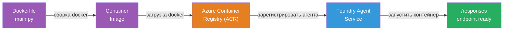
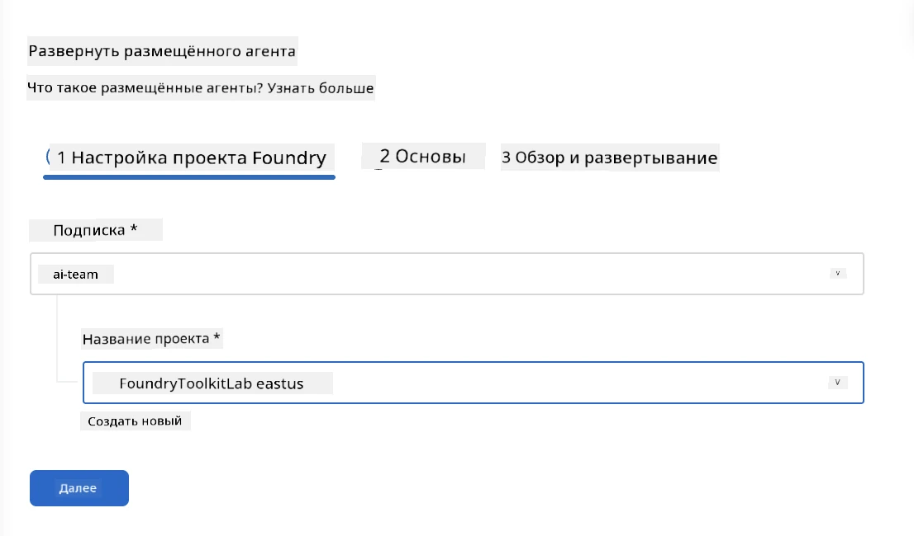
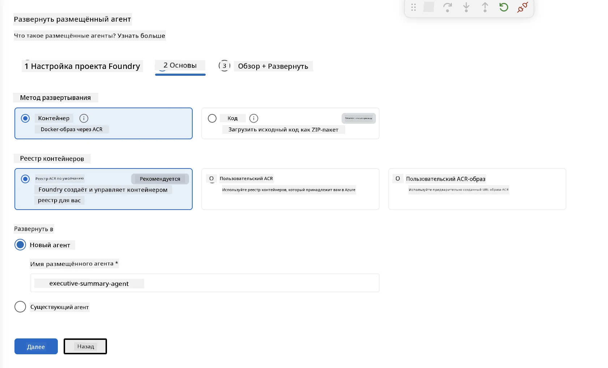
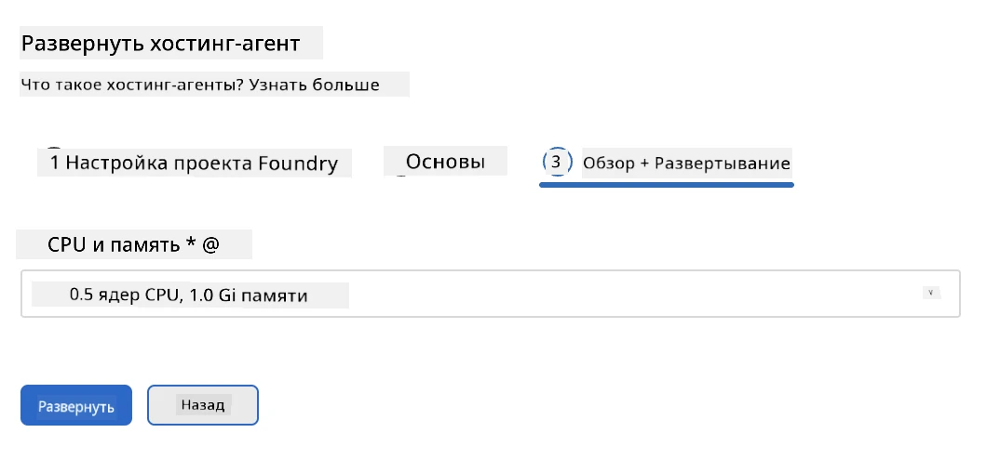
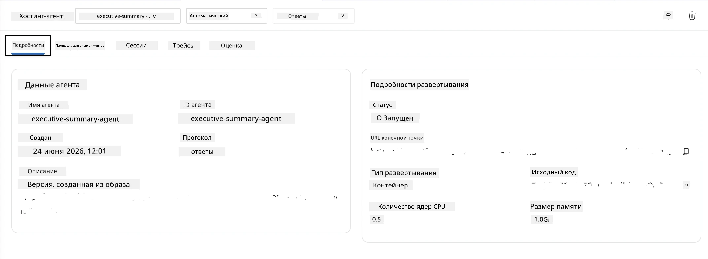

# Модуль 5 — Развертывание в Foundry Agent Service

⏱️ ~10 минут

> ⚠️ **Пользователи пути B:** Этот модуль требует подписки Foundry. Если вы используете Foundry Local, перейдите к [Модуль 07 - Итоги](07-summary.md). Вы успешно завершили локальный цикл разработки!

В этом модуле вы развертываете локально протестированного агента в Microsoft Foundry как **Hosted Agent**. Развертывание собирает образ контейнера, отправляет его в Azure Container Registry и запускает агента в управляемой инфраструктуре Foundry.

### Конвейер развертывания

---

## Проверка требований

Перед развертыванием убедитесь:

- [ ] Агент успешно проходит все 3 локальных сценария из [Модуля 04](04-test-locally.md)
- [ ] У вас есть роль **Azure AI User** на уровне проекта ([Модуль 01, Назначение RBAC](01-setup.md#deploy-a-model--assign-rbac))
- [ ] Вы вошли в Azure в VS Code (иконка аккаунтов показывает ваше имя)

---

## Шаг 1: Запуск развертывания

### Опция A: Развертывание из Agent Inspector (рекомендуется)

Если Agent Inspector открыт (после тестирования):
1. Нажмите кнопку **Deploy** в правом верхнем углу (иконка облака ↑).

### Опция B: Развертывание из командной палитры

1. Нажмите `Ctrl+Shift+P` → **Foundry Toolkit: Deploy Hosted Agent**.

---

## Шаг 2: Настройка развертывания

Мастер запросит у вас:

| Запрос | Выбор |
|--------|-----------|
| **Подписка** | Ваша подписка Azure |
| **Целевой проект** | Ваш проект Foundry (например, `workshop-agents`) |

Нажмите **далее** для настройки агента.

| Запрос | Выбор |
|--------|-----------|
| **Метод развертывания** | Контейнер |
| **Регистр контейнеров** | **Стандартный ACR** (Microsoft Foundry создаёт и управляет им за вас) |
| **Развернуть в** | Новый агент (имя, `executive-summary-agent`) |

Нажмите **далее** для просмотра и развертывания агента.

| Запрос | Выбор |
|--------|-----------|
| **CPU и память** | **0.25 ядер CPU, 0.5 Gi памяти** (достаточно для воркшопа) |

---

## Шаг 3: Развертывание и мониторинг

1. Нажмите **Deploy**.
2. Наблюдайте за панелью **Output** (выберите **Microsoft Foundry** в списке).
3. Развертывание проходит через следующие этапы:
   - **Сборка Docker** — создаёт контейнер из вашего Dockerfile
   - **Отправка Docker** — пушит образ в ACR (1–3 минуты при первом развертывании)
   - **Регистрация агента** — создаёт hosted agent в Foundry
   - **Запуск контейнера** — запускается с системой управляемой идентификации

4. После завершения появляется уведомление:
   > **my-agent успешно развернут.** `Просмотр логов` `Запустить агента`

5. Нажмите **Запустить агента**, чтобы открыть Agent Playground.

### Статусы развертывания

| Статус | Значение |
|--------|---------|
| **Running** | Контейнер готов, агент отвечает |
| **Pending** | Запуск контейнера — подождите 30–60 секунд |
| **Failed** | Проверьте логи (см. устранение неполадок ниже) |

---

## Распространённые ошибки при развертывании

| Ошибка | Причина | Исправление |
|-------|-----------|-----|
| отказано в разрешении `agents/write` | Отсутствует роль **Azure AI User** на уровне проекта | [Модуль 01, Назначение RBAC](01-setup.md#deploy-a-model--assign-rbac) |
| Docker не запущен | Docker Desktop не стартовал | Запустите Docker Desktop → проверьте `docker info` |
| Авторизация в ACR | Управляемая идентичность не может получить образ | См. [Модуль 08 - Устранение неполадок](08-troubleshooting.md) |

---

### ✅ Контрольный список

- [ ] Развертывание прошло без ошибок
- [ ] Агент отображается в разделе **Hosted Agents (Preview)** в боковой панели Foundry
- [ ] Статус контейнера — **Running**
- [ ] Вкладка Agent Playground открыта, показывая детали агента и URL конечной точки

---

**Предыдущий:** [04 — Локальное тестирование](04-test-locally.md) · **Следующий:** [06 — Проверка в Playground →](06-verify-in-playground.md)

---

<!-- CO-OP TRANSLATOR DISCLAIMER START -->
**Отказ от ответственности**:
Этот документ был переведен с использованием сервиса машинного перевода [Co-op Translator](https://github.com/Azure/co-op-translator). Несмотря на наши усилия по обеспечению точности, имейте в виду, что автоматический перевод может содержать ошибки или неточности. Оригинальный документ на его исходном языке следует считать авторитетным источником. Для получения критически важной информации рекомендуется обратиться к профессиональному человеческому переводу. Мы не несем ответственности за любые недоразумения или неправильные толкования, возникшие в результате использования этого перевода.
<!-- CO-OP TRANSLATOR DISCLAIMER END -->