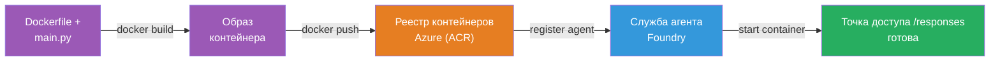
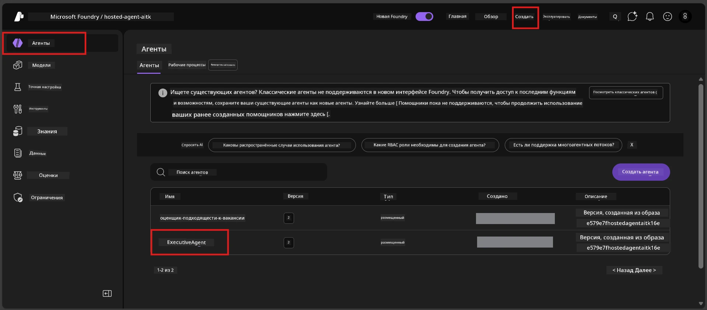

# Модуль 6 - Развертывание в Foundry Agent Service

В этом модуле вы развернете локально протестированного агента в Microsoft Foundry как [**Хостинг-агента**](https://learn.microsoft.com/azure/foundry/agents/concepts/hosted-agents). Процесс развертывания создаёт Docker-образ контейнера из вашего проекта, загружает его в [Azure Container Registry (ACR)](https://learn.microsoft.com/azure/container-registry/container-registry-intro) и создает версию хостинг-агента в [Foundry Agent Service](https://learn.microsoft.com/azure/foundry/agents/overview).

### Конвейер развертывания


---

## Проверка требований

Перед развертыванием убедитесь в выполнении каждого пункта ниже. Пропуск этих пунктов — самая частая причина ошибок при развертывании.

1. **Агент прошёл локальные базовые тесты (smoke tests):**
   - Вы завершили все 4 теста из [Модуля 5](05-test-locally.md), и агент правильно ответил.

2. **У вас есть роль [Azure AI User](https://learn.microsoft.com/azure/foundry/concepts/rbac-foundry#built-in-roles):**
   - Она была назначена в [Модуле 2, шаг 3](02-create-foundry-project.md). Если не уверены — проверьте сейчас:
   - Портал Azure → ресурс вашего Foundry **проекта** → **Управление доступом (IAM)** → вкладка **Назначения ролей** → найдите своё имя → подтвердите, что есть **Azure AI User**.

3. **Вы вошли в Azure в VS Code:**
   - Проверьте значок аккаунта в левом нижнем углу VS Code. Должно отображаться имя вашей учетной записи.

4. **(Опционально) Docker Desktop запущен:**
   - Docker нужен, только если расширение Foundry запросит локальную сборку. В большинстве случаев расширение автоматически обрабатывает сборку контейнера при развертывании.
   - Если Docker установлен, проверьте, что он запущен: `docker info`

---

## Шаг 1: Начать развертывание

Есть два способа развертывания — они ведут к одинаковому результату.

### Вариант A: Развертывание из Agent Inspector (рекомендуется)

Если агент запущен в отладчике (F5) и открыт Agent Inspector:

1. Посмотрите в **верхний правый угол** панели Agent Inspector.
2. Нажмите кнопку **Deploy** (значок облака со стрелкой вверх ↑).
3. Откроется мастер развертывания.

### Вариант B: Развертывание из командной палитры

1. Нажмите `Ctrl+Shift+P` для открытия **Командной палитры**.
2. Введите: **Microsoft Foundry: Deploy Hosted Agent** и выберите команду.
3. Откроется мастер развертывания.

---

## Шаг 2: Настройка развертывания

Мастер проведет вас по настройкам. Заполните каждое приглашение:

### 2.1 Выберите целевой проект

1. В раскрывающемся списке показаны ваши проекты Foundry.
2. Выберите проект, созданный в Модуле 2 (например, `workshop-agents`).

### 2.2 Выберите файл агента-контейнера

1. Потребуется выбрать точку входа агента.
2. Выберите **`main.py`** (Python) — файл, который мастер использует для идентификации вашего проекта агента.

### 2.3 Настройте ресурсы

| Параметр | Рекомендуемое значение | Примечания |
|---------|------------------|-------|
| **CPU** | `0.25` | По умолчанию, достаточно для мастер-класса. Увеличьте для промышленных нагрузок |
| **Память** | `0.5Gi` | По умолчанию, достаточно для мастер-класса |

Значения совпадают с параметрами в `agent.yaml`. Можно принять значения по умолчанию.

---

## Шаг 3: Подтвердить и развернуть

1. Мастер покажет сводку развертывания с:
   - Названием целевого проекта
   - Названием агента (из `agent.yaml`)
   - Файлом контейнера и ресурсами
2. Проверьте сводку и нажмите **Confirm and Deploy** (или **Deploy**).
3. Следите за ходом в VS Code.

### Что происходит во время развертывания (по шагам)

Развертывание — многоступенчатый процесс. Следите за панелью **Output** в VS Code (выберите в выпадающем списке "Microsoft Foundry"):

1. **Сборка Docker** — VS Code собирает Docker-образ контейнера из вашего `Dockerfile`. Вы увидите сообщения об слоях Docker:
   ```
   Step 1/6 : FROM python:<version>-slim
   Step 2/6 : WORKDIR /app
   ...
   Successfully built abc123def456
   ```

2. **Отправка Docker-образа** — Образ отправляется в **Azure Container Registry (ACR)**, связанный с вашим проектом Foundry. На первое развертывание может уйти 1-3 минуты (базовый образ >100МБ).

3. **Регистрация агента** — Foundry Agent Service создает нового хостинг-агента (или новую версию, если агент уже существует). Используются метаданные из `agent.yaml`.

4. **Запуск контейнера** — Контейнер запускается в управляемой инфраструктуре Foundry. Платформа назначает [системный управляемый идентификатор](https://learn.microsoft.com/azure/foundry/agents/concepts/agent-identity) и открывает эндпоинт `/responses`.

> **Первое развертывание медленнее** (Docker должен загрузить все слои). Последующие развертывания быстрее, так как Docker кеширует неизменённые слои.

---

## Шаг 4: Проверка статуса развертывания

После завершения команды развертывания:

1. Откройте боковую панель **Microsoft Foundry**, кликнув на иконку Foundry в панели активностей.
2. Разверните раздел **Hosted Agents (Preview)** в вашем проекте.
3. Вы увидите имя вашего агента (например, `ExecutiveAgent` или имя из `agent.yaml`).
4. **Кликните по имени агента**, чтобы расширить.
5. Появятся одна или несколько **версий** (например, `v1`).
6. Кликните на версию, чтобы увидеть **Детали контейнера**.
7. Проверьте поле **Status**:

   | Статус | Значение |
   |--------|---------|
   | **Started** или **Running** | Контейнер запущен, агент готов |
   | **Pending** | Контейнер запускается (подождите 30–60 секунд) |
   | **Failed** | Контейнер не запустился (проверьте логи — см. ниже раздел по устранению проблем) |



> **Если статус "Pending" длится более 2 минут:** Контейнер может загружать базовый образ. Подождите немного дольше. Если статус не меняется — проверьте логи контейнера.

---

## Типичные ошибки развертывания и их исправления

### Ошибка 1: Отказано в разрешении — `agents/write`

```
Error: lacks the required data action 
Microsoft.CognitiveServices/accounts/AIServices/agents/write 
to perform POST /api/projects/{projectName}/assistants operation.
```

**Основная причина:** У вас нет роли `Azure AI User` на уровне **проекта**.

**Пошаговое исправление:**

1. Откройте [https://portal.azure.com](https://portal.azure.com).
2. В строке поиска введите имя вашего Foundry **проекта** и выберите его.
   - **Важно:** убедитесь, что вы перешли именно в ресурс **проекта** (тип: "Microsoft Foundry project"), а не в родительский ресурс аккаунта или хаб.
3. В навигационном меню слева выберите **Управление доступом (IAM)**.
4. Нажмите **+ Добавить** → **Добавить назначение роли**.
5. Вкладка **Роль**: найдите и выберите [**Azure AI User**](https://learn.microsoft.com/azure/foundry/concepts/rbac-foundry#built-in-roles). Нажмите **Далее**.
6. Вкладка **Участники**: выберите **Пользователь, группа или сервисный принципал**.
7. Нажмите **+ Выбрать участников**, найдите своё имя/почту, выберите себя, нажмите **Выбрать**.
8. Нажмите **Проверить и назначить** → снова **Проверить и назначить**.
9. Подождите 1-2 минуты, чтобы роль распространилась.
10. **Повторите развертывание** по Шагу 1.

> Роль должна быть назначена в рамках **проекта**, а не только аккаунта. Это самая частая причина сбоев при развертывании.

### Ошибка 2: Docker не запущен

```
Error: Docker build failed / Cannot connect to Docker daemon
```

**Исправление:**
1. Запустите Docker Desktop (найдите в меню Пуск или в трее).
2. Дождитесь сообщения "Docker Desktop is running" (30-60 секунд).
3. Проверьте: в терминале выполните `docker info`.
4. **Для Windows:** убедитесь, что включён WSL 2 backend в настройках Docker Desktop → **Общее** → **Использовать движок на базе WSL 2**.
5. Повторите развертывание.

### Ошибка 3: Авторизация ACR — `AcrPullUnauthorized`

```
Error: AcrPullUnauthorized
```

**Основная причина:** Управляемый идентификатор вашего проекта Foundry не имеет прав на загрузку из реестра контейнеров.

**Исправление:**
1. В Azure Portal перейдите в ваш **[реестр контейнеров](https://learn.microsoft.com/azure/container-registry/container-registry-intro)** (он в той же группе ресурсов, что и ваш проект Foundry).
2. Откройте **Управление доступом (IAM)** → **Добавить** → **Добавить назначение роли**.
3. Выберите роль **[AcrPull](https://learn.microsoft.com/azure/container-registry/container-registry-roles)**.
4. В разделе Участники выберите **Управляемый идентификатор**, найдите управляемый идентификатор вашего проекта Foundry.
5. Нажмите **Проверить и назначить**.

> Обычно это настраивается автоматически расширением Foundry. Если возникает ошибка, возможно, автоматическая настройка не удалась.

### Ошибка 4: Несовпадение платформы контейнера (Apple Silicon)

Если развертывание происходит с Mac на базе Apple Silicon (M1/M2/M3), контейнер должен быть собран для `linux/amd64`:

```bash
docker build --platform linux/amd64 -t myagent:v1 .
```

> Расширение Foundry автоматически обрабатывает это для большинства пользователей.

---

### Контрольный список

- [ ] Команда развертывания завершилась без ошибок в VS Code
- [ ] Агент отображается в **Hosted Agents (Preview)** на боковой панели Foundry
- [ ] Вы кликнули на агента → выбрали версию → увидели **Детали контейнера**
- [ ] Статус контейнера показывает **Started** или **Running**
- [ ] (Если были ошибки) Вы выявили ошибку, применили исправление и успешно повторно развернули

---

**Предыдущий:** [05 - Локальное тестирование](05-test-locally.md) · **Следующий:** [07 - Проверка в Playground →](07-verify-in-playground.md)

---

<!-- CO-OP TRANSLATOR DISCLAIMER START -->
**Отказ от ответственности**:  
Этот документ был переведен с помощью сервиса автоматического перевода [Co-op Translator](https://github.com/Azure/co-op-translator). Несмотря на то, что мы стремимся к точности, пожалуйста, имейте в виду, что автоматические переводы могут содержать ошибки или неточности. Оригинальный документ на его родном языке следует считать авторитетным источником. Для получения критически важной информации рекомендуется использовать профессиональный перевод, выполненный человеком. Мы не несем ответственности за любые недоразумения или неправильные толкования, возникающие в результате использования данного перевода.
<!-- CO-OP TRANSLATOR DISCLAIMER END -->