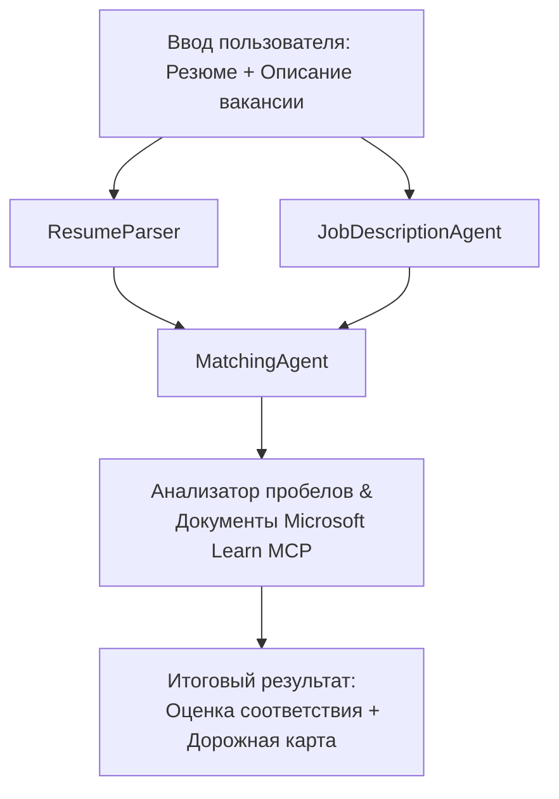

# PersonalCareerCopilot - Резюме → Оценка соответствия вакансии

Многоагентный рабочий процесс, который оценивает, насколько резюме соответствует описанию вакансии, затем генерирует персонализированную дорожную карту обучения для устранения пробелов.

---

## Агенты

| Агент | Роль | Инструменты |
|-------|------|-------------|
| **ResumeParser** | Извлекает структурированные навыки, опыт, сертификаты из текста резюме | - |
| **JobDescriptionAgent** | Извлекает необходимые/предпочтительные навыки, опыт, сертификаты из описания вакансии | - |
| **MatchingAgent** | Сравнивает профиль с требованиями → оценка соответствия (0-100) + совпадающие/отсутствующие навыки | - |
| **GapAnalyzer** | Создаёт персонализированную дорожную карту обучения с ресурсами Microsoft Learn | `search_microsoft_learn_for_plan` (MCP) |

## Рабочий процесс


---

## Быстрый старт

### 1. Настройка окружения

```powershell
cd workshop\lab02-multi-agent\PersonalCareerCopilot
python -m venv .venv
.\.venv\Scripts\Activate.ps1          # Windows PowerShell
# source .venv/bin/activate            # macOS / Linux
pip install -r requirements.txt
```

### 2. Настройка учетных данных

Скопируйте пример файла env и заполните данные вашего проекта Foundry:

```powershell
cp .env.example .env
```

Отредактируйте `.env`:

```env
PROJECT_ENDPOINT=https://<your-account>.services.ai.azure.com/api/projects/<your-project>
MODEL_DEPLOYMENT_NAME=gpt-4.1-mini
```

| Значение | Где найти |
|----------|-----------|
| `PROJECT_ENDPOINT` | Панель Microsoft Foundry в VS Code → кликните правой кнопкой по проекту → **Copy Project Endpoint** |
| `MODEL_DEPLOYMENT_NAME` | Панель Foundry → разверните проект → **Models + endpoints** → имя развертывания |

### 3. Запуск локально

```powershell
python -m debugpy --listen 127.0.0.1:5679 -m agentdev run main.py --verbose --port 8088
```

Или используйте задачу VS Code: `Ctrl+Shift+P` → **Tasks: Run Task** → **Run Lab02 HTTP Server**.

### 4. Тестирование с Agent Inspector

Откройте Agent Inspector: `Ctrl+Shift+P` → **Foundry Toolkit: Open Agent Inspector**.

Вставьте этот тестовый запрос:

```
Resume:
Jane Doe
Senior Software Engineer with 5 years of experience in Python, Django, and AWS.
Built microservices handling 10K+ requests/second. Led a team of 4 developers.
Certifications: AWS Solutions Architect Associate.
Education: B.S. Computer Science, State University.

Job Description:
Senior Cloud Engineer at Contoso Ltd.
Required: Python, Azure, Kubernetes, Terraform, CI/CD pipelines.
Preferred: Go, monitoring (Prometheus/Grafana), cost optimization.
Experience: 5+ years in cloud infrastructure.
Certifications: Azure Solutions Architect Expert preferred.
```

**Ожидается:** Оценка соответствия (0-100), совпадающие/отсутствующие навыки и персонализированная дорожная карта обучения с URL Microsoft Learn.

### 5. Развертывание в Foundry

`Ctrl+Shift+P` → **Microsoft Foundry: Deploy Hosted Agent** → выберите ваш проект → подтвердите.

---

## Структура проекта

```
PersonalCareerCopilot/
├── .env.example        ← Template for environment variables
├── .env                ← Your credentials (git-ignored)
├── agent.yaml          ← Hosted agent definition (name, resources, env vars)
├── Dockerfile          ← Container image for Foundry deployment
├── main.py             ← 4-agent workflow (instructions, MCP tool, WorkflowBuilder)
└── requirements.txt    ← Python dependencies
```

## Ключевые файлы

### `agent.yaml`

Определяет размещённого агента для Foundry Agent Service:
- `kind: hosted` - запускается как управляемый контейнер
- `protocols: [responses v1]` - открывает HTTP endpoint `/responses`
- `environment_variables` - `PROJECT_ENDPOINT` и `MODEL_DEPLOYMENT_NAME` внедряются при развертывании

### `main.py`

Содержит:
- **Инструкции агента** - четыре константы `*_INSTRUCTIONS`, по одной на агента
- **Инструмент MCP** - `search_microsoft_learn_for_plan()` вызывает `https://learn.microsoft.com/api/mcp` через Streamable HTTP
- **Создание агентов** - менеджер контекста `create_agents()` с использованием `AzureAIAgentClient.as_agent()`
- **Граф рабочего процесса** - `create_workflow()` с помощью `WorkflowBuilder` соединяет агентов с паттернами разветвления/сбора/последовательности
- **Запуск сервера** - `from_agent_framework(agent).run_async()` на порту 8088

### `requirements.txt`

| Пакет | Версия | Назначение |
|-------|---------|------------|
| `agent-framework-azure-ai` | `1.0.0rc3` | Интеграция Azure AI для Microsoft Agent Framework |
| `agent-framework-core` | `1.0.0rc3` | Основной рантайм (включает WorkflowBuilder) |
| `azure-ai-agentserver-agentframework` | `1.0.0b16` | Рантайм сервера размещённых агентов |
| `azure-ai-agentserver-core` | `1.0.0b16` | Основные абстракции сервера агентов |
| `debugpy` | последняя | Отладка Python (F5 в VS Code) |
| `agent-dev-cli` | `--pre` | Локальный CLI для разработки + бекенд Agent Inspector |

---

## Устранение неполадок

| Проблема | Решение |
|----------|---------|
| `RuntimeError: Missing required environment variable(s)` | Создайте `.env` с `PROJECT_ENDPOINT` и `MODEL_DEPLOYMENT_NAME` |
| `ModuleNotFoundError: No module named 'agent_framework'` | Активируйте виртуальное окружение и выполните `pip install -r requirements.txt` |
| Отсутствуют URL Microsoft Learn в выводе | Проверьте доступ в интернет к `https://learn.microsoft.com/api/mcp` |
| Только 1 карточка пробела (обрезана) | Проверьте, что `GAP_ANALYZER_INSTRUCTIONS` включает блок `CRITICAL:` |
| Порт 8088 занят | Остановите другие серверы: `netstat -ano \| findstr :8088` |

Для подробного устранения неполадок смотрите [Модуль 8 - Устранение неполадок](../docs/08-troubleshooting.md).

---

**Полное руководство:** [Lab 02 Docs](../docs/README.md) · **Назад к:** [Lab 02 README](../README.md) · [Главная страница воркшопа](../../../README.md)

---

<!-- CO-OP TRANSLATOR DISCLAIMER START -->
**Отказ от ответственности**:  
Этот документ был переведен с помощью сервиса машинного перевода [Co-op Translator](https://github.com/Azure/co-op-translator). Несмотря на наши усилия по обеспечению точности, имейте в виду, что автоматические переводы могут содержать ошибки или неточности. Оригинальный документ на его родном языке должен рассматриваться как авторитетный источник. Для критически важной информации рекомендуется профессиональный перевод человеком. Мы не несем ответственности за любые недоразумения или неправильные толкования, возникшие в результате использования данного перевода.
<!-- CO-OP TRANSLATOR DISCLAIMER END -->