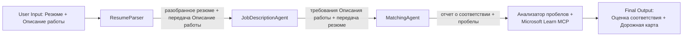

# PersonalCareerCopilot - Оценка соответствия резюме вакансии

Многоагентное приложение с упором на рабочий процесс, которое оценивает, насколько резюме соответствует описанию вакансии, и затем генерирует персонализированную дорожную карту обучения для устранения пробелов.

---

## Агенты

| Агент | Роль | Инструменты |
|-------|------|-------|
| **ResumeParser** | Извлекает структурированные навыки, опыт, сертификаты из текста резюме | - |
| **JobDescriptionAgent** | Извлекает требуемые/предпочтительные навыки, опыт, сертификаты из описания вакансии | - |
| **MatchingAgent** | Сравнивает профиль с требованиями → оценка соответствия (0-100) + найденные/отсутствующие навыки | - |
| **GapAnalyzer** | Формирует персонализированную дорожную карту обучения с ресурсами Microsoft Learn | `search_microsoft_learn_for_plan` (MCP) |

## Рабочий процесс


```mermaid
flowchart LR
    UserInput["User Input: Резюме + Описание работы"] --> ResumeParser
    ResumeParser -- "разобранное резюме + передача Описание работы" --> JobDescriptionAgent
    JobDescriptionAgent -- "требования Описания работы + передача резюме" --> MatchingAgent
    MatchingAgent -- "отчет о соответствии + пробелы" --> GapAnalyzerMCP["Анализатор пробелов +\nMicrosoft Learn MCP"]
    GapAnalyzerMCP --> FinalOutput["Final Output:\nОценка соответствия + Дорожная карта"]
```

---

## Быстрый старт

### 1. Настройка окружения

Эта папка — эталонная реализация каркаса рабочего процесса из Lab 02. В её `main.py` используются существующие блоки запросов плюс `WorkflowBuilder` для связывания четырёх агентов.

```powershell
cd workshop\lab02-multi-agent\PersonalCareerCopilot
python -m venv .venv
.\.venv\Scripts\Activate.ps1          # Windows PowerShell
# source .venv/bin/activate            # macOS / Linux
pip install -r requirements.txt
```

### 2. Настройка учётных данных

Создайте в этой папке файл `.env`:

```powershell
copy .env .env.bak 2>$null; echo $null > .env
```

Отредактируйте `.env`:

```env
FOUNDRY_PROJECT_ENDPOINT=https://<your-account>.services.ai.azure.com/api/projects/<your-project>
AZURE_AI_MODEL_DEPLOYMENT_NAME=gpt-4.1-mini
```

| Значение | Где найти |
|-------|------------------|
| `FOUNDRY_PROJECT_ENDPOINT` | Панель Foundry Toolkit → клик правой кнопкой по вашему проекту → **Copy Project Endpoint** |
| `AZURE_AI_MODEL_DEPLOYMENT_NAME` | Панель Foundry → разверните проект → **Models + endpoints** → имя развертывания |

### 3. Запуск локально

```powershell
python -m debugpy --listen 127.0.0.1:5679 main.py --port 8088
```

Или используйте задачу VS Code: `Ctrl+Shift+P` → **Tasks: Run Task** → **Run Agent HTTP Server**.

Для отладки с F5 — **Debug Local Agent HTTP Server**.

### 4. Тестирование с Agent Inspector

Откройте Agent Inspector: `Ctrl+Shift+P` → **Foundry Toolkit: Open Agent Inspector**.

Вставьте этот тестовый запрос:

```
Resume:
Jane Doe
Senior Software Engineer with 5 years of experience in Python, Django, and AWS.
Built microservices handling 10K+ requests/second. Led a team of 4 developers.
Certifications: AWS Solutions Architect Associate.
Education: B.S. Computer Science, State University.

Job Description:
Senior Cloud Engineer at Contoso Ltd.
Required: Python, Azure, Kubernetes, Terraform, CI/CD pipelines.
Preferred: Go, monitoring (Prometheus/Grafana), cost optimization.
Experience: 5+ years in cloud infrastructure.
Certifications: Azure Solutions Architect Expert preferred.
```

**Ожидается:** Оценка соответствия (0-100), найденные/отсутствующие навыки и персонализированная дорожная карта обучения с URL Microsoft Learn.

### 5. Развёртывание в Foundry

`Ctrl+Shift+P` → **Foundry Toolkit: Deploy Hosted Agent** → выберите проект → подтвердите.

---

## Структура проекта

```
PersonalCareerCopilot/
├── .env                ← Your credentials (git-ignored)
├── agent.yaml          ← Hosted agent definition (name, resources, env vars)
├── Dockerfile          ← Container image for Foundry deployment
├── main.py             ← 4-agent workflow (instructions, MCP tool, WorkflowBuilder)
└── requirements.txt    ← Python dependencies
```

## Ключевые файлы

### `agent.yaml`

Определяет размещённого агента для Foundry Agent Service:
- `kind: hosted` — запускается как управляемый контейнер
- `protocols` — протокол `responses` с `version: 1.0.0`, раскрывающий HTTP-эндпоинт `/responses`
- `environment_variables` — здесь объявлена `AZURE_AI_MODEL_DEPLOYMENT_NAME`; `FOUNDRY_PROJECT_ENDPOINT` подставляется автоматически при развёртывании

### `main.py`

Содержит:
- **Инструкции агентов** — четыре константы `*_INSTRUCTIONS`, по одной на агента
- **Инструмент MCP** — `search_microsoft_learn_for_plan()` вызывает `https://learn.microsoft.com/api/mcp` через Streamable HTTP
- **Создание агентов** — четыре экземпляра `Agent()` + `AgentExecutor()`, использующих один `FoundryChatClient`
- **Граф рабочего процесса** — `WorkflowBuilder` связывает агентов в последовательную цепочку: ResumeParser → JD Agent → MatchingAgent → GapAnalyzer
- **Запуск сервера** — `ResponsesHostServer` работает на порту 8088

### `requirements.txt`

| Пакет | Назначение |
|---------|----------|
| `agent-framework-foundry` | Основное выполнение: `Agent`, `AgentExecutor`, `WorkflowBuilder`, `@tool`, `FoundryChatClient` |
| `agent-framework-foundry-hosting` | `ResponsesHostServer` + интеграция с хостингом Foundry |
| `mcp<2,>=1.24.0` | MCP-клиент для GapAnalyzer (`streamable_http_client`) |
| `debugpy` | Отладка Python (F5 в VS Code) |

---

## Устранение неполадок

| Проблема | Решение |
|-------|-----|
| `KeyError: 'FOUNDRY_PROJECT_ENDPOINT'` или `KeyError: 'AZURE_AI_MODEL_DEPLOYMENT_NAME'` | Создайте `.env` и задайте в нём `FOUNDRY_PROJECT_ENDPOINT` и `AZURE_AI_MODEL_DEPLOYMENT_NAME` |
| `ModuleNotFoundError: No module named 'agent_framework'` | Активируйте venv и выполните `pip install -r requirements.txt` |
| Нет URL Microsoft Learn в выводе | Проверьте подключение к интернету к `https://learn.microsoft.com/api/mcp` |
| Только 1 карточка пробела (усечённая) | Убедитесь, что `GAP_ANALYZER_INSTRUCTIONS` включает блок `CRITICAL:` |
| Порт 8088 занят | Остановите другие серверы: `netstat -ano \| findstr :8088` |

Для подробного устранения неполадок смотрите [Module 8 - Troubleshooting](../docs/08-troubleshooting.md).

---

**Полное руководство:** [Lab 02 Docs](../docs/README.md) · **Вернуться к:** [Lab 02 README](../README.md) · [Домашняя страница мастерской](../../../README.md)

---

<!-- CO-OP TRANSLATOR DISCLAIMER START -->
**Отказ от ответственности**:
Этот документ был переведен с использованием сервиса машинного перевода [Co-op Translator](https://github.com/Azure/co-op-translator). Несмотря на наши усилия по обеспечению точности, имейте в виду, что автоматический перевод может содержать ошибки или неточности. Оригинальный документ на его исходном языке следует считать авторитетным источником. Для получения критически важной информации рекомендуется обратиться к профессиональному человеческому переводу. Мы не несем ответственности за любые недоразумения или неправильные толкования, возникшие в результате использования этого перевода.
<!-- CO-OP TRANSLATOR DISCLAIMER END -->