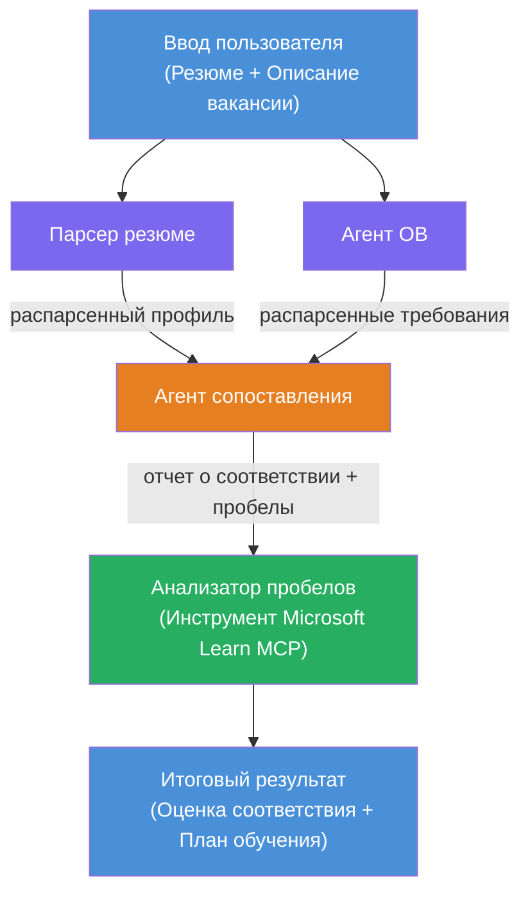

# Лабораторная работа 02 - Мультиагентный рабочий процесс: Оценка соответствия резюме вакансии

---

## Что вы создадите

**Оцениватель соответствия резюме вакансии** — мультиагентный рабочий процесс, в котором четыре специализированных агента сотрудничают для оценки того, насколько резюме кандидата соответствует описанию вакансии, а затем генерируют персональный план обучения для устранения пробелов.

### Агенты

| Агент | Роль |
|-------|------|
| **Resume Parser** | Извлекает структурированные навыки, опыт, сертификаты из текста резюме |
| **Job Description Agent** | Извлекает требуемые/предпочтительные навыки, опыт, сертификаты из описания вакансии |
| **Matching Agent** | Сравнивает профиль с требованиями → оценка соответствия (0-100) + сопоставленные/отсутствующие навыки |
| **Gap Analyzer** | Формирует персональный план обучения с ресурсами, сроками и быстрыми проектами |

### Демонстрационный сценарий

Загрузите **резюме + описание вакансии** → получите **оценку соответствия + отсутствующие навыки** → получите **персональный план обучения**.

### Архитектура рабочего процесса

> Фиолетовый = параллельные агенты | Оранжевый = точка агрегации | Зеленый = конечный агент с инструментами. См. [Модуль 1 - Понимание архитектуры](docs/01-understand-multi-agent.md) и [Модуль 4 - Шаблоны оркестрации](docs/04-orchestration-patterns.md) для подробных схем и потоков данных.

### Рассмотренные темы

- Создание мультиагентного рабочего процесса с помощью **WorkflowBuilder**
- Определение ролей агентов и поток оркестрации (параллельный + последовательный)
- Шаблоны коммуникации между агентами
- Локальное тестирование с Agent Inspector
- Развертывание мультиагентных рабочих процессов в Foundry Agent Service

---

## Требования

Сначала завершите Лабораторную работу 01:

- [Лабораторная работа 01 - Один агент](../lab01-single-agent/README.md)

---

## Начало работы

Полные инструкции по настройке, разбор кода и команды для тестирования смотрите в:

- [Документация по Лабораторной работе 2 - Требования](docs/00-prerequisites.md)
- [Документация по Лабораторной работе 2 - Полный путь обучения](docs/README.md)
- [Руководство по запуску PersonalCareerCopilot](PersonalCareerCopilot/README.md)

## Шаблоны оркестрации (альтернативы агентам)

Лабораторная работа 2 включает стандартный поток **параллельно → агрегатор → планировщик**, а также в документации описаны альтернативные шаблоны для демонстрации более выраженного агентного поведения:

- **Fan-out/Fan-in с взвешенным консенсусом**
- **Проход рецензента/критика перед финальным планом**
- **Условный маршрутизатор** (выбор пути на основе оценки соответствия и отсутствующих навыков)

Смотрите [docs/04-orchestration-patterns.md](docs/04-orchestration-patterns.md).

---

**Предыдущая:** [Лабораторная работа 01 - Один агент](../lab01-single-agent/README.md) · **Вернуться:** [Домашняя страница мастерской](../../README.md)

---

<!-- CO-OP TRANSLATOR DISCLAIMER START -->
**Отказ от ответственности**:  
Этот документ был переведен с помощью сервиса автоматического перевода [Co-op Translator](https://github.com/Azure/co-op-translator). Несмотря на наши усилия обеспечить точность, имейте в виду, что автоматический перевод может содержать ошибки или неточности. Оригинальный документ на его исходном языке считается авторитетным источником. Для критически важной информации рекомендуется использовать профессиональный перевод, выполненный человеком. Мы не несем ответственности за любые недоразумения или неправильные толкования, возникающие в результате использования данного перевода.
<!-- CO-OP TRANSLATOR DISCLAIMER END -->